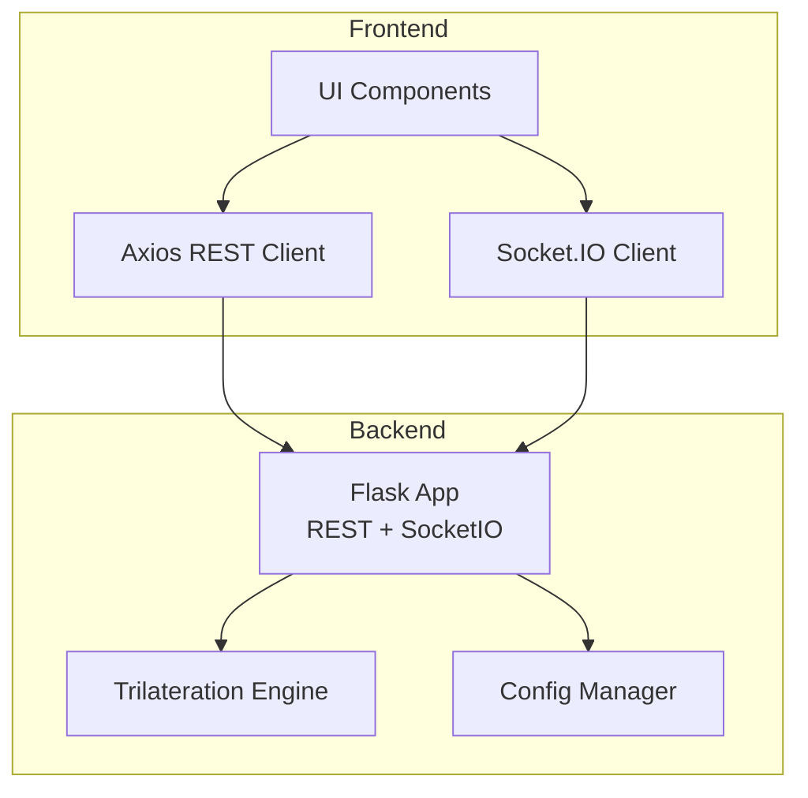
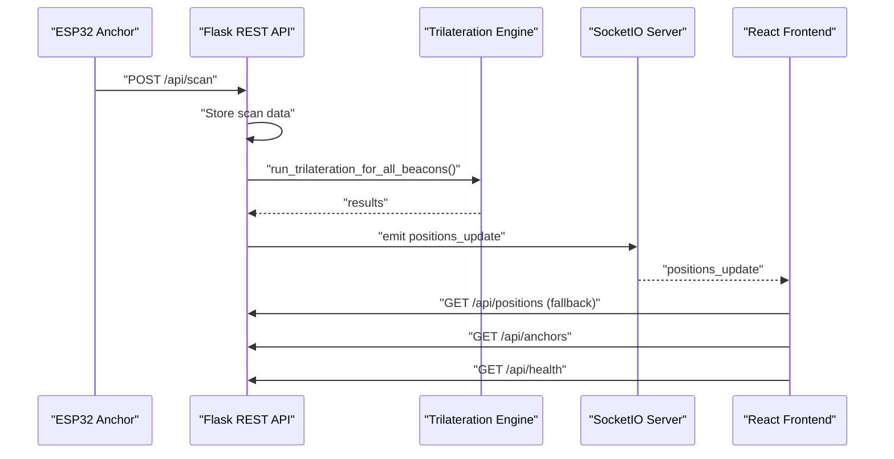
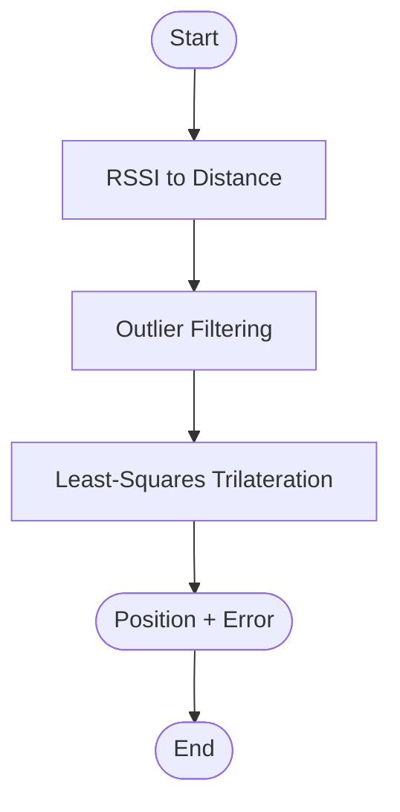
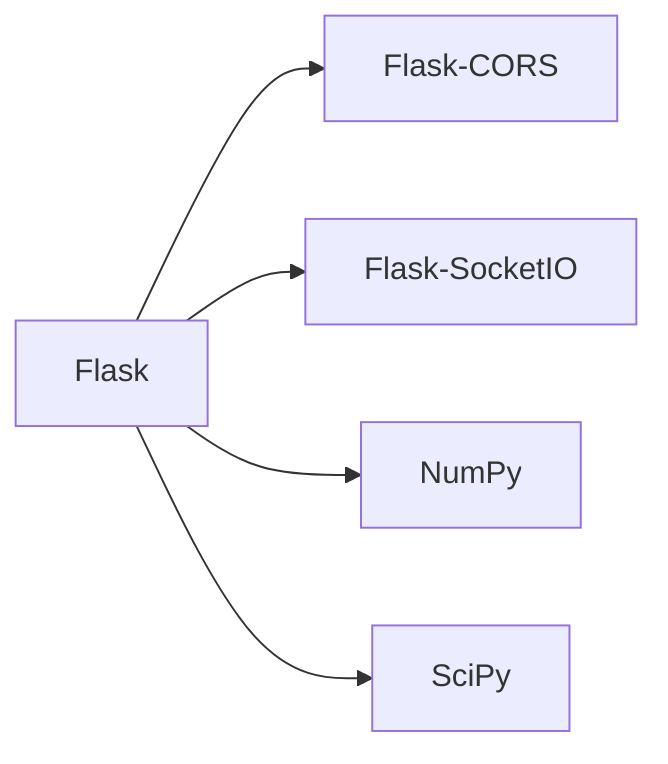

# API Reference

<cite>
**Referenced Files in This Document**
- [backend/app.py](file://backend/app.py)
- [backend/config.py](file://backend/config.py)
- [backend/trilateration.py](file://backend/trilateration.py)
- [backend/requirements.txt](file://backend/requirements.txt)
- [frontend/src/services/api.ts](file://frontend/src/services/api.ts)
- [frontend/src/App.tsx](file://frontend/src/App.tsx)
- [frontend/src/components/RoomMap.tsx](file://frontend/src/components/RoomMap.tsx)
- [frontend/src/components/AnchorPanel.tsx](file://frontend/src/components/AnchorPanel.tsx)
- [frontend/src/components/CalibrationForm.tsx](file://frontend/src/components/CalibrationForm.tsx)
</cite>

## Table of Contents
1. [Introduction](#introduction)
2. [Project Structure](#project-structure)
3. [Core Components](#core-components)
4. [Architecture Overview](#architecture-overview)
5. [Detailed Component Analysis](#detailed-component-analysis)
6. [Dependency Analysis](#dependency-analysis)
7. [Performance Considerations](#performance-considerations)
8. [Troubleshooting Guide](#troubleshooting-guide)
9. [Conclusion](#conclusion)
10. [Appendices](#appendices)

## Introduction
This document provides a comprehensive API reference for the BLE Room Positioning System’s REST and WebSocket APIs. It covers:
- REST endpoints: HTTP methods, URL patterns, request/response schemas, and authentication considerations for /api/scan, /api/positions, /api/anchors, /api/calibrate, /api/health, and /api/config.
- WebSocket communication: connection handling, event types, payload structures, and client-side event handling patterns.
- Real-time data streaming, connection management, and fallback mechanisms.
- Rate limiting considerations, security implications, and best practices for API consumption.
- Versioning, backward compatibility, and migration guidance.

## Project Structure
The system consists of:
- A Flask backend exposing REST endpoints and WebSocket events.
- A React frontend consuming REST endpoints and subscribing to WebSocket events for real-time updates.
- A trilateration engine computing 2D positions from RSSI measurements.

**Diagram sources**
- [backend/app.py:23-25](file://backend/app.py#L23-L25)
- [backend/trilateration.py:155-218](file://backend/trilateration.py#L155-L218)
- [backend/config.py:44-95](file://backend/config.py#L44-L95)
- [frontend/src/services/api.ts:1-66](file://frontend/src/services/api.ts#L1-L66)
- [frontend/src/App.tsx:140-172](file://frontend/src/App.tsx#L140-L172)

**Section sources**
- [backend/app.py:23-25](file://backend/app.py#L23-L25)
- [frontend/src/services/api.ts:1-66](file://frontend/src/services/api.ts#L1-L66)
- [frontend/src/App.tsx:140-172](file://frontend/src/App.tsx#L140-L172)

## Core Components
- REST API server: Flask app with CORS enabled and SocketIO for real-time updates.
- Trilateration engine: Converts RSSI to distance and computes positions via least-squares trilateration.
- Config manager: Loads/saves room dimensions, anchor positions, and calibration parameters.
- Frontend REST client: Axios-based service for REST endpoints.
- Frontend WebSocket client: Socket.IO client for real-time updates and fallback polling.

Key runtime behaviors:
- Freshness window for scan data (default TTL: 15 seconds).
- Real-time position updates emitted via WebSocket on successful trilateration.
- Fallback polling when WebSocket is disconnected.

**Section sources**
- [backend/app.py:39-46](file://backend/app.py#L39-L46)
- [backend/app.py:48-106](file://backend/app.py#L48-L106)
- [backend/trilateration.py:11-33](file://backend/trilateration.py#L11-L33)
- [backend/trilateration.py:69-153](file://backend/trilateration.py#L69-L153)
- [backend/config.py:44-95](file://backend/config.py#L44-L95)
- [frontend/src/services/api.ts:1-66](file://frontend/src/services/api.ts#L1-L66)
- [frontend/src/App.tsx:125-137](file://frontend/src/App.tsx#L125-L137)

## Architecture Overview
High-level API flow:
- Anchors (ESP32) POST scan data to /api/scan.
- Backend stores scan data, runs trilateration, and emits positions_update via WebSocket.
- Frontend receives real-time updates; if disconnected, polls REST endpoints periodically.

**Diagram sources**
- [backend/app.py:123-171](file://backend/app.py#L123-L171)
- [backend/app.py:48-106](file://backend/app.py#L48-L106)
- [backend/trilateration.py:155-218](file://backend/trilateration.py#L155-L218)
- [frontend/src/App.tsx:140-172](file://frontend/src/App.tsx#L140-L172)
- [frontend/src/App.tsx:125-137](file://frontend/src/App.tsx#L125-L137)

## Detailed Component Analysis

### REST Endpoints

#### GET /api/health
- Purpose: Health and metrics endpoint.
- Authentication: Not applicable.
- Response fields:
  - status: String indicating service status.
  - uptime_seconds: Server uptime in seconds.
  - anchors_reporting: Number of anchors with recent scan data.
  - beacons_tracked: Number of tracked beacons.
- Example response:
  - {"status":"ok","uptime_seconds":<number>,"anchors_reporting":3,"beacons_tracked":2}

**Section sources**
- [backend/app.py:112-121](file://backend/app.py#L112-L121)

#### POST /api/scan
- Purpose: Receive BLE scan data from anchors.
- Authentication: Not applicable.
- Request body:
  - anchor_id: String identifier of the anchor.
  - anchor_pos: Array [x, y] representing anchor coordinates in meters.
  - timestamp: Numeric timestamp of the scan.
  - calibration_mode: Boolean flag indicating calibration mode.
  - beacons: Array of beacon entries with:
    - beacon_id: MAC address string.
    - rssi: Received signal strength indicator (dBm).
    - tx_power: Reference TX power at 1 meter (dBm).
- Response body:
  - status: String "received".
  - anchor_id: Provided anchor identifier.
  - beacons_count: Count of beacons in the request.
  - positions_calculated: Count of positions computed after trilateration.
- Error codes:
  - 400: No JSON provided or missing required fields.
- Example request:
  - {"anchor_id":"scanner-02","anchor_pos":[2.5,3.0],"timestamp":1709945025000,"calibration_mode":false,"beacons":[{"beacon_id":"AA:BB:CC:DD:EE:FF","rssi":-65,"tx_power":-59}]}
- Example response:
  - {"status":"received","anchor_id":"scanner-02","beacons_count":1,"positions_calculated":1}

Notes:
- On success, the backend triggers trilateration and emits real-time updates via WebSocket.

**Section sources**
- [backend/app.py:123-171](file://backend/app.py#L123-L171)

#### GET /api/positions
- Purpose: Retrieve current trilateration results.
- Authentication: Not applicable.
- Response body:
  - positions: Array of position entries with:
    - beacon_id: MAC address string.
    - position: Array [x, y] meters or null if not calculable.
    - error: Numeric error estimate in meters or null.
    - anchors_used: Number of anchors used.
    - method: Calculation method or status.
    - anchor_details: Optional array of anchor details used in computation.
  - count: Total number of positions.
  - timestamp: Server timestamp of the response.
- Example response:
  - {"positions":[{"beacon_id":"AA:BB:CC:DD:EE:FF","position":[3.14,2.81],"error":0.123,"anchors_used":3,"method":"least_squares"}],"count":1,"timestamp":1709945025000}

**Section sources**
- [backend/app.py:173-184](file://backend/app.py#L173-L184)

#### GET /api/anchors
- Purpose: Retrieve anchor configurations and status.
- Authentication: Not applicable.
- Response body:
  - anchors: Array of anchor entries with:
    - anchor_id: Identifier string.
    - x, y: Anchor coordinates in meters.
    - label: Human-readable label.
    - online: Boolean indicating recent activity within TTL.
    - last_seen: Timestamp of last received scan or null.
    - beacons_detected: Number of beacons detected in the latest scan.
  - count: Total number of anchors.
- Example response:
  - {"anchors":[{"anchor_id":"scanner-01","x":0.0,"y":0.0,"label":"Anchor 1 (Bottom-Left)","online":true,"last_seen":1709945025000,"beacons_detected":2}],"count":3}

**Section sources**
- [backend/app.py:186-222](file://backend/app.py#L186-L222)

#### PUT /api/anchors
- Purpose: Update anchor positions (calibration).
- Authentication: Not applicable.
- Request body:
  - anchors: Array of anchor updates with:
    - anchor_id: Identifier string.
    - x, y: New coordinates in meters.
- Response body:
  - status: String "updated".
  - updated_anchors: Array of identifiers successfully updated.
- Example request:
  - {"anchors":[{"anchor_id":"scanner-01","x":0.0,"y":0.0},{"anchor_id":"scanner-02","x":10.0,"y":0.0}]}
- Example response:
  - {"status":"updated","updated_anchors":["scanner-01","scanner-02"]}

**Section sources**
- [backend/app.py:224-254](file://backend/app.py#L224-L254)

#### GET /api/scan-data
- Purpose: Retrieve latest raw scan data from all anchors within TTL.
- Authentication: Not applicable.
- Response body:
  - scan_data: Array of scan entries with:
    - anchor_id, anchor_pos, timestamp, calibration_mode, beacons, age_seconds.
  - active_anchors: Number of anchors with recent data.
- Example response:
  - {"scan_data":[{"anchor_id":"scanner-02","anchor_pos":[2.5,3.0],"timestamp":1709945025000,"calibration_mode":false,"beacons":[{"beacon_id":"AA:BB:CC:DD:EE:FF","rssi":-65,"tx_power":-59}],"age_seconds":2.3}],"active_anchors":1}

**Section sources**
- [backend/app.py:256-280](file://backend/app.py#L256-L280)

#### POST /api/calibrate
- Purpose: Update calibration parameters.
- Authentication: Not applicable.
- Request body (subset of allowed keys):
  - path_loss_exponent: Numeric exponent for path loss model.
  - tx_power_dbm: Reference TX power at 1 meter (dBm).
  - min_rssi_threshold: Minimum RSSI threshold (dBm).
  - scan_ttl_seconds: TTL for scan freshness (seconds).
- Response body:
  - status: String "calibrated".
  - params: Subset of parameters accepted.
  - positions_recalculated: Number of positions recomputed.
- Example request:
  - {"path_loss_exponent":2.5,"tx_power_dbm":-59}
- Example response:
  - {"status":"calibrated","params":{"path_loss_exponent":2.5},"positions_recalculated":2}

**Section sources**
- [backend/app.py:282-321](file://backend/app.py#L282-L321)

#### GET /api/calibrate
- Purpose: Retrieve current calibration parameters and room/beacon filters.
- Authentication: Not applicable.
- Response body:
  - calibration: Current calibration parameters.
  - room: Room dimensions (width_m, height_m).
  - beacon_filters: Optional list of beacon MACs to track.
- Example response:
  - {"calibration":{"path_loss_exponent":2.0,"tx_power_dbm":-59,"min_rssi_threshold":-90,"scan_ttl_seconds":15},"room":{"width_m":10.0,"height_m":8.0},"beacon_filters":[]}

**Section sources**
- [backend/app.py:323-332](file://backend/app.py#L323-L332)

#### GET /api/config
- Purpose: Retrieve full system configuration.
- Authentication: Not applicable.
- Response body: Full configuration object (room, anchors, calibration, beacon_filters).
- Example response:
  - {"room":{"width_m":10.0,"height_m":8.0},"anchors":{"scanner-01":{"x":0.0,"y":0.0,"label":"Anchor 1 (Bottom-Left)"}},"calibration":{"path_loss_exponent":2.0,"tx_power_dbm":-59,"min_rssi_threshold":-90,"scan_ttl_seconds":15},"beacon_filters":[]}

**Section sources**
- [backend/app.py:334-338](file://backend/app.py#L334-L338)

#### PUT /api/config
- Purpose: Update full system configuration.
- Authentication: Not applicable.
- Request body: Full configuration object.
- Response body:
  - status: String "config_updated".
- Example response:
  - {"status":"config_updated"}

**Section sources**
- [backend/app.py:340-348](file://backend/app.py#L340-L348)

### WebSocket Events

#### Connection lifecycle
- URL: ws://localhost:5000 or http://localhost:5000 with Socket.IO transport.
- Transports: websocket and polling.
- Reconnection: Enabled with exponential backoff.

Client-side behavior:
- Connect on mount and listen for events.
- On disconnect, fall back to periodic polling of REST endpoints.

**Section sources**
- [frontend/src/App.tsx:140-172](file://frontend/src/App.tsx#L140-L172)
- [backend/app.py:354-377](file://backend/app.py#L354-L377)

#### Event: positions_update
- Emitted by server: After successful trilateration.
- Payload:
  - positions: Array of position entries (same as GET /api/positions).
  - timestamp: Server timestamp.
- Client handling:
  - Update local positions state.
  - Trigger refresh of anchors, scan data, and health.

**Section sources**
- [backend/app.py:99-104](file://backend/app.py#L99-L104)
- [backend/app.py:360-363](file://backend/app.py#L360-L363)
- [frontend/src/App.tsx:157-163](file://frontend/src/App.tsx#L157-L163)

#### Event: error
- Emitted by server: On trilateration failure.
- Payload:
  - message: Error message string.
- Client handling:
  - Log error and surface to user if needed.

**Section sources**
- [backend/app.py:376](file://backend/app.py#L376)
- [frontend/src/App.tsx:165-167](file://frontend/src/App.tsx#L165-L167)

#### Client request: request_positions
- Emitted by client: Requests immediate recalculation and update.
- Server handling:
  - Recompute positions and emit positions_update.
  - On error, emit error event.

**Section sources**
- [backend/app.py:366-377](file://backend/app.py#L366-L377)

### Real-Time Data Streaming and Fallback Mechanisms
- Real-time updates: positions_update via WebSocket.
- Fallback polling: Every 3 seconds when WebSocket is disconnected, the frontend polls:
  - GET /api/positions
  - GET /api/anchors
  - GET /api/scan-data
  - GET /api/health

**Section sources**
- [frontend/src/App.tsx:125-137](file://frontend/src/App.tsx#L125-L137)
- [frontend/src/App.tsx:157-163](file://frontend/src/App.tsx#L157-L163)

### Trilateration Pipeline
- RSSI to distance conversion using log-distance path loss model.
- Outlier filtering using median absolute deviation.
- Least-squares trilateration to compute position and error estimate.

**Diagram sources**
- [backend/trilateration.py:11-33](file://backend/trilateration.py#L11-L33)
- [backend/trilateration.py:35-67](file://backend/trilateration.py#L35-L67)
- [backend/trilateration.py:69-153](file://backend/trilateration.py#L69-L153)

**Section sources**
- [backend/trilateration.py:11-33](file://backend/trilateration.py#L11-L33)
- [backend/trilateration.py:35-67](file://backend/trilateration.py#L35-L67)
- [backend/trilateration.py:69-153](file://backend/trilateration.py#L69-L153)

## Dependency Analysis
External libraries and their roles:
- Flask: Web framework for REST endpoints.
- Flask-CORS: Cross-origin support.
- Flask-SocketIO: Real-time bidirectional communication.
- NumPy: Numerical operations for trilateration.
- SciPy: Nonlinear least-squares optimization.

**Diagram sources**
- [backend/requirements.txt:1-7](file://backend/requirements.txt#L1-L7)

**Section sources**
- [backend/requirements.txt:1-7](file://backend/requirements.txt#L1-L7)

## Performance Considerations
- Trilateration cost: Computationally intensive; avoid frequent recalculations.
- Freshness window: Default TTL of 15 seconds prevents stale data from skewing results.
- Polling fallback: 3-second intervals reduce latency when WebSocket is unavailable.
- RSSI filtering: Signals below threshold are ignored to reduce noise.
- Outlier detection: Improves robustness against noisy measurements.

Best practices:
- Batch anchor updates and calibration changes to minimize repeated computations.
- Use WebSocket for live dashboards; rely on polling for background monitoring.
- Tune path_loss_exponent and tx_power_dbm to match your environment.

[No sources needed since this section provides general guidance]

## Troubleshooting Guide
Common issues and resolutions:
- WebSocket disconnections:
  - The frontend automatically reconnects and falls back to polling.
  - Monitor the connection indicator and health endpoint.
- No positions displayed:
  - Verify anchors are reporting within TTL.
  - Confirm RSSI thresholds and path loss parameters.
- Calibration drift:
  - Adjust path_loss_exponent and tx_power_dbm via /api/calibrate.
  - Save anchor positions via /api/anchors.

**Section sources**
- [frontend/src/App.tsx:125-137](file://frontend/src/App.tsx#L125-L137)
- [frontend/src/App.tsx:192-201](file://frontend/src/App.tsx#L192-L201)
- [backend/app.py:282-321](file://backend/app.py#L282-L321)
- [backend/app.py:224-254](file://backend/app.py#L224-L254)

## Conclusion
The BLE Room Positioning System exposes a clean REST API complemented by real-time WebSocket updates. The frontend integrates seamlessly with both REST and WebSocket, providing resilient real-time dashboards with graceful fallback to polling. Proper tuning of calibration parameters and adherence to freshness windows ensures reliable positioning results.

[No sources needed since this section summarizes without analyzing specific files]

## Appendices

### API Integration Examples
- REST client usage:
  - Axios-based service wraps all endpoints for easy consumption.
  - See [frontend/src/services/api.ts:1-66](file://frontend/src/services/api.ts#L1-L66).
- WebSocket client usage:
  - Socket.IO client connects to ws://localhost:5000 with automatic reconnection.
  - See [frontend/src/App.tsx:140-172](file://frontend/src/App.tsx#L140-172).

### Error Codes Summary
- 400: Bad request (missing JSON or required fields).
- 500: Internal server errors during trilateration are surfaced via WebSocket error events.

**Section sources**
- [backend/app.py:140-141](file://backend/app.py#L140-L141)
- [backend/app.py:313-314](file://backend/app.py#L313-L314)
- [backend/app.py:376](file://backend/app.py#L376)

### Security and Rate Limiting
- Authentication: None. Deploy behind reverse proxy or gateway with authentication as needed.
- CORS: Enabled for development; restrict origins in production.
- Rate limiting: Not implemented in the backend. Consider adding middleware or gateway controls.

**Section sources**
- [backend/app.py:24](file://backend/app.py#L24)
- [backend/app.py:397](file://backend/app.py#L397)

### API Versioning and Compatibility
- Current state: Single-version API exposed under /api/.
- Recommendations:
  - Introduce versioned routes (e.g., /api/v1/...).
  - Maintain backward compatibility by deprecating fields rather than removing them.
  - Provide changelog and migration guide for breaking changes.

[No sources needed since this section provides general guidance]