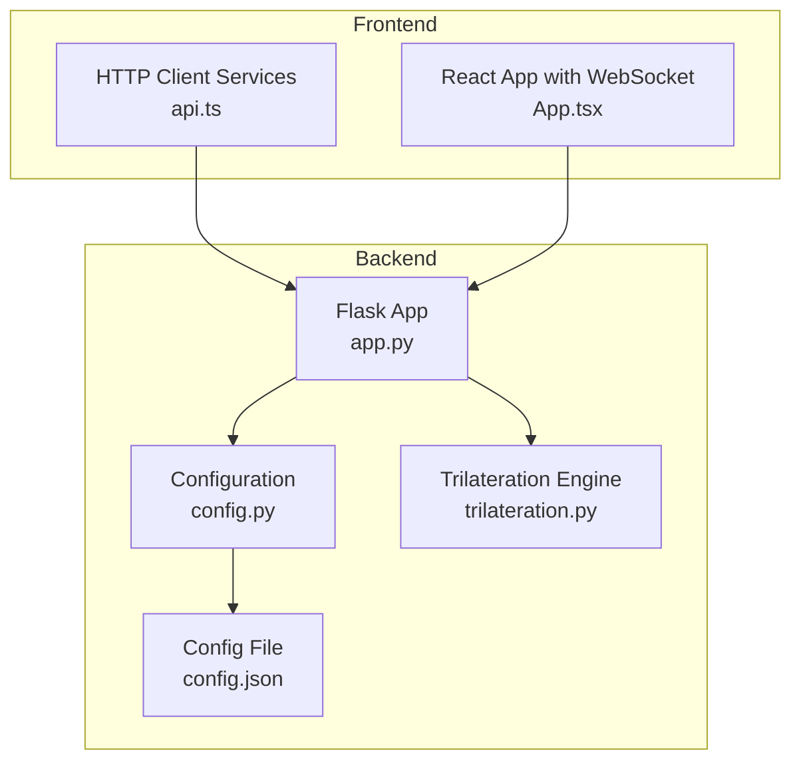
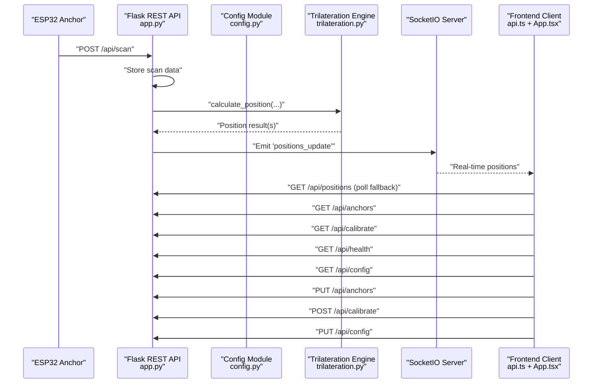
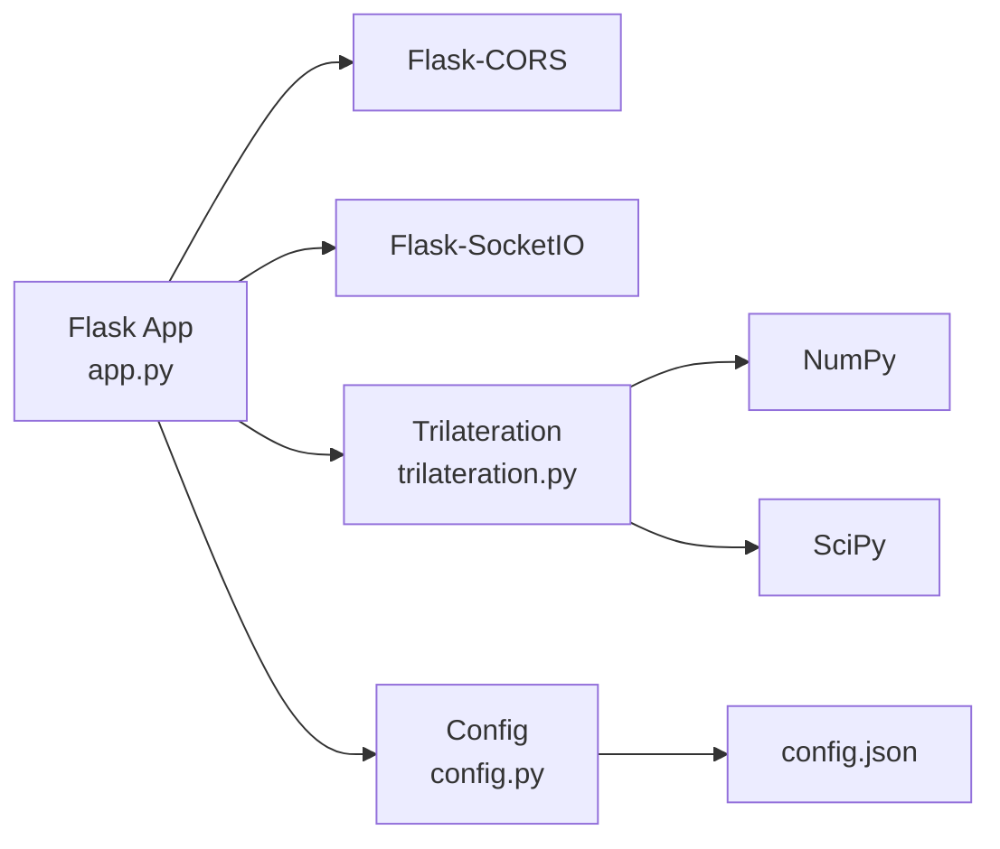

# REST API Endpoints

<cite>
**Referenced Files in This Document**
- [app.py](file://backend/app.py)
- [config.py](file://backend/config.py)
- [trilateration.py](file://backend/trilateration.py)
- [config.json](file://backend/config.json)
- [requirements.txt](file://backend/requirements.txt)
- [api.ts](file://frontend/src/services/api.ts)
- [App.tsx](file://frontend/src/App.tsx)
</cite>

## Table of Contents
1. [Introduction](#introduction)
2. [Project Structure](#project-structure)
3. [Core Components](#core-components)
4. [Architecture Overview](#architecture-overview)
5. [Detailed Component Analysis](#detailed-component-analysis)
6. [Dependency Analysis](#dependency-analysis)
7. [Performance Considerations](#performance-considerations)
8. [Troubleshooting Guide](#troubleshooting-guide)
9. [Conclusion](#conclusion)
10. [Appendices](#appendices)

## Introduction
This document provides comprehensive REST API documentation for the BLE Room Positioning System backend. It covers all HTTP endpoints exposed by the Flask server, including:
- /api/scan (POST): Receives BLE scan data from anchors
- /api/positions (GET): Retrieves beacon positions computed via trilateration
- /api/anchors (GET/PUT): Manages anchor configuration and status
- /api/calibrate (GET/POST): Updates calibration parameters
- /api/health (GET): System status monitoring
- /api/config (GET/PUT): Full system configuration
- /api/scan-data (GET): Raw scan data access

It also documents WebSocket events used for real-time updates and outlines parameter validation, data types, error handling, rate limiting considerations, security implications, and best practices for integrating with the system.

## Project Structure
The backend is a Python Flask application with:
- A central application module exposing REST endpoints and WebSocket events
- A configuration module managing persistent settings
- A trilateration module implementing RSSI-to-distance conversion and position estimation
- A JSON configuration file storing room dimensions, anchor positions, and calibration parameters
- Frontend services that consume the REST API and connect via WebSocket for live updates

**Diagram sources**
- [app.py:1-398](file://backend/app.py#L1-L398)
- [config.py:1-95](file://backend/config.py#L1-L95)
- [trilateration.py:1-218](file://backend/trilateration.py#L1-L218)
- [config.json:1-30](file://backend/config.json#L1-L30)
- [api.ts:1-66](file://frontend/src/services/api.ts#L1-L66)
- [App.tsx:1-274](file://frontend/src/App.tsx#L1-L274)

**Section sources**
- [app.py:1-398](file://backend/app.py#L1-L398)
- [config.py:1-95](file://backend/config.py#L1-L95)
- [trilateration.py:1-218](file://backend/trilateration.py#L1-L218)
- [config.json:1-30](file://backend/config.json#L1-L30)
- [api.ts:1-66](file://frontend/src/services/api.ts#L1-L66)
- [App.tsx:1-274](file://frontend/src/App.tsx#L1-L274)

## Core Components
- Flask application with CORS enabled and Socket.IO for real-time updates
- In-memory stores for raw scan data and cached positions
- Trilateration engine converting RSSI to distances and estimating 2D coordinates
- Persistent configuration stored in a JSON file with defaults

Key behaviors:
- Freshness checks for scan data using a configurable TTL
- Beacon filtering via a whitelist in configuration
- Least-squares trilateration with outlier filtering and error estimation
- Real-time updates via WebSocket “positions_update” event

**Section sources**
- [app.py:23-37](file://backend/app.py#L23-L37)
- [app.py:39-105](file://backend/app.py#L39-L105)
- [trilateration.py:11-33](file://backend/trilateration.py#L11-L33)
- [trilateration.py:69-153](file://backend/trilateration.py#L69-L153)
- [config.py:11-51](file://backend/config.py#L11-L51)

## Architecture Overview
The system architecture combines REST and WebSocket communications:
- REST endpoints serve configuration, positions, anchors, calibration, and health
- WebSocket provides real-time position updates to clients
- Trilateration runs on incoming scan data or on demand

**Diagram sources**
- [app.py:123-171](file://backend/app.py#L123-L171)
- [app.py:173-183](file://backend/app.py#L173-L183)
- [app.py:186-222](file://backend/app.py#L186-L222)
- [app.py:224-254](file://backend/app.py#L224-L254)
- [app.py:256-279](file://backend/app.py#L256-L279)
- [app.py:282-332](file://backend/app.py#L282-L332)
- [app.py:334-348](file://backend/app.py#L334-L348)
- [app.py:354-377](file://backend/app.py#L354-L377)
- [trilateration.py:155-218](file://backend/trilateration.py#L155-L218)
- [config.py:44-51](file://backend/config.py#L44-L51)
- [api.ts:1-66](file://frontend/src/services/api.ts#L1-L66)
- [App.tsx:139-172](file://frontend/src/App.tsx#L139-L172)

## Detailed Component Analysis

### Endpoint: /api/scan (POST)
- Purpose: Receive BLE scan data from anchors
- Request body schema:
  - anchor_id: string (required)
  - anchor_pos: array [x, y] (optional)
  - timestamp: number (epoch milliseconds) (optional)
  - calibration_mode: boolean (optional)
  - beacons: array of objects (required)
    - beacon_id: string (MAC address)
    - rssi: number (dBm)
    - tx_power: number (dBm) (optional; falls back to calibration default)
- Response:
  - status: string
  - anchor_id: string
  - beacons_count: number
  - positions_calculated: number
- Status codes:
  - 200 OK on success
  - 400 Bad Request on missing JSON or missing anchor_id
- Validation rules:
  - anchor_id is required
  - Stores received_at server timestamp
  - Runs trilateration in background and emits WebSocket update
- Example request (paths):
  - [Example payload structure:123-138](file://backend/app.py#L123-L138)
- Example response:
  - [Success response structure:165-170](file://backend/app.py#L165-L170)

**Section sources**
- [app.py:123-171](file://backend/app.py#L123-L171)

### Endpoint: /api/positions (GET)
- Purpose: Retrieve current beacon positions computed via trilateration
- Response:
  - positions: array of position objects
    - beacon_id: string
    - position: [x, y] or null
    - error: number or null
    - anchors_used: number
    - method: string
    - anchor_details: array (optional)
  - count: number
  - timestamp: number (epoch milliseconds)
- Status codes:
  - 200 OK
- Notes:
  - Positions reflect the latest cached results
  - Frontend can poll this endpoint if WebSocket is unavailable

**Section sources**
- [app.py:173-183](file://backend/app.py#L173-L183)

### Endpoint: /api/anchors (GET)
- Purpose: Get anchor configurations and status
- Response:
  - anchors: array of anchor objects
    - anchor_id: string
    - x: number
    - y: number
    - label: string
    - online: boolean (based on scan freshness)
    - last_seen: number or null
    - beacons_detected: number
  - count: number
- Status codes:
  - 200 OK
- Notes:
  - Online status determined by scan TTL

**Section sources**
- [app.py:186-222](file://backend/app.py#L186-L222)

### Endpoint: /api/anchors (PUT)
- Purpose: Update anchor positions (calibration)
- Request body schema:
  - anchors: array of objects (required)
    - anchor_id: string
    - x: number
    - y: number
- Response:
  - status: string
  - updated_anchors: array of strings
- Status codes:
  - 200 OK
  - 400 Bad Request if anchors array is missing or malformed
- Validation rules:
  - Requires anchor_id, x, y for each anchor
  - Persists updates to configuration

**Section sources**
- [app.py:224-254](file://backend/app.py#L224-L254)
- [config.py:77-86](file://backend/config.py#L77-L86)

### Endpoint: /api/scan-data (GET)
- Purpose: Access raw scan data from all anchors
- Response:
  - scan_data: array of scan entries
    - anchor_id: string
    - anchor_pos: [x, y] or null
    - timestamp: number or null
    - calibration_mode: boolean
    - beacons: array of beacon objects
    - age_seconds: number (computed from received_at)
  - active_anchors: number
- Status codes:
  - 200 OK
- Notes:
  - Filters out stale scans based on TTL

**Section sources**
- [app.py:256-279](file://backend/app.py#L256-L279)

### Endpoint: /api/calibrate (GET)
- Purpose: Get current calibration parameters and related configuration
- Response:
  - calibration: object with parameters
    - path_loss_exponent: number
    - tx_power_dbm: number
    - min_rssi_threshold: number
    - scan_ttl_seconds: number
  - room: object with room dimensions
  - beacon_filters: array of strings
- Status codes:
  - 200 OK

**Section sources**
- [app.py:323-332](file://backend/app.py#L323-L332)
- [config.py:70-74](file://backend/config.py#L70-L74)

### Endpoint: /api/calibrate (POST)
- Purpose: Update calibration parameters
- Request body schema (subset of calibration keys accepted):
  - path_loss_exponent: number
  - tx_power_dbm: number
  - min_rssi_threshold: number
  - scan_ttl_seconds: number
- Response:
  - status: string
  - params: object (subset of provided parameters)
  - positions_recalculated: number
- Status codes:
  - 200 OK
  - 400 Bad Request if no valid parameters provided
- Behavior:
  - Applies only allowed keys
  - Re-runs trilateration with new parameters

**Section sources**
- [app.py:282-321](file://backend/app.py#L282-L321)
- [config.py:89-95](file://backend/config.py#L89-L95)

### Endpoint: /api/health (GET)
- Purpose: System status monitoring
- Response:
  - status: string
  - uptime_seconds: number
  - anchors_reporting: number
  - beacons_tracked: number
- Status codes:
  - 200 OK

**Section sources**
- [app.py:112-120](file://backend/app.py#L112-L120)

### Endpoint: /api/config (GET)
- Purpose: Get full system configuration
- Response: Complete configuration object (room, anchors, calibration, beacon_filters)
- Status codes:
  - 200 OK

**Section sources**
- [app.py:334-337](file://backend/app.py#L334-L337)
- [config.py:44-51](file://backend/config.py#L44-L51)

### Endpoint: /api/config (PUT)
- Purpose: Update full system configuration
- Request body: Complete configuration object
- Response:
  - status: string
- Status codes:
  - 200 OK
  - 400 Bad Request if no config provided
- Notes:
  - Writes configuration to disk

**Section sources**
- [app.py:340-347](file://backend/app.py#L340-L347)
- [config.py:54-57](file://backend/config.py#L54-L57)

### WebSocket Events
- Client connects to Socket.IO server at http://localhost:5000
- Event: positions_update
  - Payload: { positions: Position[], timestamp: number }
  - Triggered when trilateration completes
- Frontend fallback:
  - Polls GET /api/positions, /api/anchors, /api/scan-data, /api/health periodically if WebSocket is disconnected

**Section sources**
- [app.py:354-377](file://backend/app.py#L354-L377)
- [App.tsx:139-172](file://frontend/src/App.tsx#L139-L172)

## Dependency Analysis
External dependencies required by the backend:
- Flask, Flask-CORS, Flask-SocketIO for HTTP and WebSocket
- NumPy and SciPy for numerical optimization in trilateration
- simple-websocket for production-grade WebSocket transport

**Diagram sources**
- [requirements.txt:1-7](file://backend/requirements.txt#L1-L7)
- [app.py:13-21](file://backend/app.py#L13-L21)
- [trilateration.py:6-8](file://backend/trilateration.py#L6-L8)
- [config.py:6-9](file://backend/config.py#L6-L9)

**Section sources**
- [requirements.txt:1-7](file://backend/requirements.txt#L1-L7)
- [app.py:13-21](file://backend/app.py#L13-L21)
- [trilateration.py:6-8](file://backend/trilateration.py#L6-L8)
- [config.py:6-9](file://backend/config.py#L6-L9)

## Performance Considerations
- Trilateration runs on each incoming scan or on demand; consider:
  - Limiting beacon_filters to reduce computation
  - Tuning scan_ttl_seconds to balance freshness vs. staleness
  - Using outlier filtering to improve accuracy and reduce unnecessary iterations
- WebSocket provides efficient real-time updates; fallback polling reduces overhead when disconnected
- RSSI-to-distance clamping prevents extreme distance estimates that could skew calculations

[No sources needed since this section provides general guidance]

## Troubleshooting Guide
Common issues and resolutions:
- No positions returned:
  - Verify anchors are reporting within TTL and beacon_filters allows the target
  - Confirm calibration parameters (path_loss_exponent, min_rssi_threshold) are appropriate
- Stale or missing data:
  - Check /api/health for anchors_reporting and beacons_tracked counts
  - Inspect /api/scan-data for recent entries and age_seconds
- WebSocket disconnections:
  - The frontend automatically reconnects and falls back to polling
  - Monitor socket connection status indicators in the UI

**Section sources**
- [app.py:112-120](file://backend/app.py#L112-L120)
- [app.py:256-279](file://backend/app.py#L256-L279)
- [App.tsx:139-172](file://frontend/src/App.tsx#L139-L172)

## Conclusion
The BLE Room Positioning System exposes a clear set of REST endpoints for configuration, calibration, and position retrieval, complemented by real-time WebSocket updates. Properly tuned calibration parameters and anchor placement are essential for robust localization. Clients should leverage WebSocket for live updates and fall back to polling when necessary.

[No sources needed since this section summarizes without analyzing specific files]

## Appendices

### Endpoint Reference Summary
- /api/scan (POST): Accepts scan data from anchors; triggers trilateration and emits updates
- /api/positions (GET): Returns cached positions
- /api/anchors (GET): Returns anchor list with status
- /api/anchors (PUT): Updates anchor positions
- /api/scan-data (GET): Returns raw scan data with freshness
- /api/calibrate (GET): Returns calibration parameters
- /api/calibrate (POST): Updates calibration parameters
- /api/health (GET): Returns system health metrics
- /api/config (GET/PUT): Full configuration management

**Section sources**
- [app.py:123-171](file://backend/app.py#L123-L171)
- [app.py:173-183](file://backend/app.py#L173-L183)
- [app.py:186-222](file://backend/app.py#L186-L222)
- [app.py:224-254](file://backend/app.py#L224-L254)
- [app.py:256-279](file://backend/app.py#L256-L279)
- [app.py:282-332](file://backend/app.py#L282-L332)
- [app.py:334-348](file://backend/app.py#L334-L348)
- [app.py:112-120](file://backend/app.py#L112-L120)

### Data Types and Validation Rules
- anchor_id: string (required for scan and anchors PUT)
- anchor_pos: [x, y] numbers
- timestamp: epoch milliseconds (optional)
- calibration_mode: boolean (optional)
- beacons[].beacon_id: MAC address string
- beacons[].rssi: number (dBm)
- beacons[].tx_power: number (dBm) (optional)
- Calibration parameters accept numeric values; only allowed keys are processed
- TTL-based freshness determines online status and inclusion in trilateration

**Section sources**
- [app.py:123-171](file://backend/app.py#L123-L171)
- [app.py:224-254](file://backend/app.py#L224-L254)
- [app.py:282-321](file://backend/app.py#L282-L321)
- [trilateration.py:11-33](file://backend/trilateration.py#L11-L33)

### Practical Usage Examples
- Client-server interactions:
  - Anchor sends scan data to /api/scan
  - Frontend receives positions via WebSocket “positions_update”
  - Frontend polls /api/positions, /api/anchors, /api/scan-data, /api/health when disconnected
  - Frontend updates anchors via /api/anchors (PUT) and recalibrates via /api/calibrate (POST)
- Typical client-side calls:
  - [GET /api/positions:12-16](file://frontend/src/services/api.ts#L12-L16)
  - [GET /api/anchors:18-22](file://frontend/src/services/api.ts#L18-L22)
  - [PUT /api/anchors:24-28](file://frontend/src/services/api.ts#L24-L28)
  - [GET /api/scan-data:30-34](file://frontend/src/services/api.ts#L30-L34)
  - [GET /api/calibrate:36-40](file://frontend/src/services/api.ts#L36-L40)
  - [POST /api/calibrate:42-51](file://frontend/src/services/api.ts#L42-L51)
  - [GET /api/health:53-57](file://frontend/src/services/api.ts#L53-L57)
  - [GET /api/config:59-63](file://frontend/src/services/api.ts#L59-L63)

**Section sources**
- [api.ts:1-66](file://frontend/src/services/api.ts#L1-L66)
- [App.tsx:139-172](file://frontend/src/App.tsx#L139-L172)

### Rate Limiting and Security Considerations
- Rate limiting:
  - No built-in rate limiting in the backend; consider deploying behind a reverse proxy with rate limiting policies
  - Trilateration runs on each scan; tune beacon_filters and TTL to control frequency
- Security:
  - CORS is enabled; ensure deployment restricts origins appropriately
  - No authentication or authorization is implemented; deploy behind a secure network boundary
  - Consider adding HTTPS and authentication for production environments

**Section sources**
- [app.py:24-25](file://backend/app.py#L24-L25)