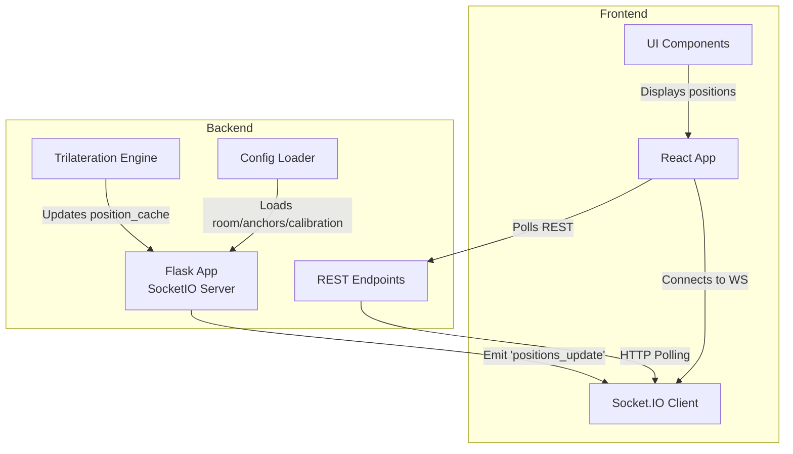
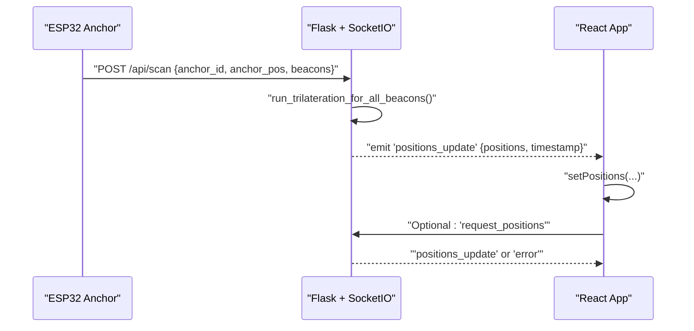
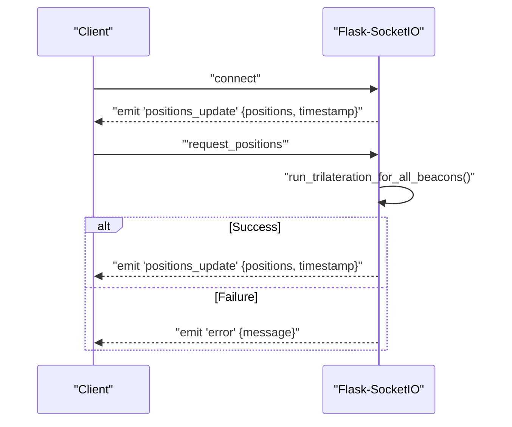
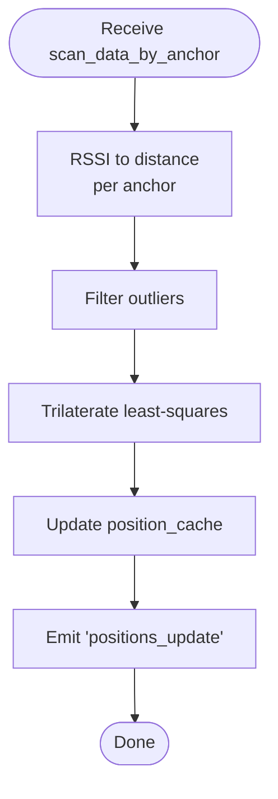
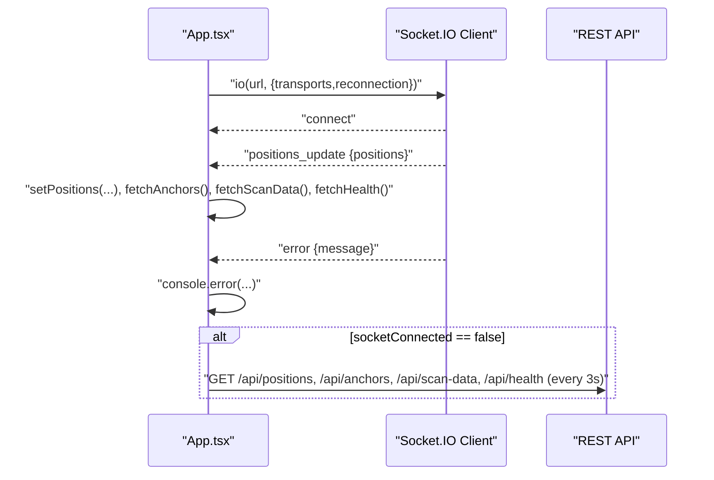
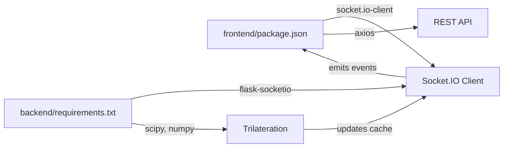

# WebSocket Events

<cite>
**Referenced Files in This Document**
- [backend/app.py](file://backend/app.py)
- [backend/trilateration.py](file://backend/trilateration.py)
- [backend/config.py](file://backend/config.py)
- [backend/config.json](file://backend/config.json)
- [frontend/src/App.tsx](file://frontend/src/App.tsx)
- [frontend/src/services/api.ts](file://frontend/src/services/api.ts)
- [frontend/src/components/RoomMap.tsx](file://frontend/src/components/RoomMap.tsx)
- [frontend/src/components/AnchorPanel.tsx](file://frontend/src/components/AnchorPanel.tsx)
- [frontend/src/components/CalibrationForm.tsx](file://frontend/src/components/CalibrationForm.tsx)
- [frontend/package.json](file://frontend/package.json)
- [backend/requirements.txt](file://backend/requirements.txt)
</cite>

## Table of Contents
1. [Introduction](#introduction)
2. [Project Structure](#project-structure)
3. [Core Components](#core-components)
4. [Architecture Overview](#architecture-overview)
5. [Detailed Component Analysis](#detailed-component-analysis)
6. [Dependency Analysis](#dependency-analysis)
7. [Performance Considerations](#performance-considerations)
8. [Troubleshooting Guide](#troubleshooting-guide)
9. [Conclusion](#conclusion)
10. [Appendices](#appendices)

## Introduction
This document provides comprehensive WebSocket API documentation for the BLE Room Positioning System. It focuses on real-time communication via Socket.IO, covering connection lifecycle, event types, payload structures, client-side handling patterns, automatic reconnection strategies, fallback mechanisms, and operational guidance for monitoring and performance.

## Project Structure
The system comprises:
- Backend: Flask + Flask-SocketIO server emitting real-time position updates and serving REST endpoints.
- Frontend: React application using Socket.IO client to subscribe to live updates and fall back to REST polling when WebSocket is unavailable.

**Diagram sources**
- [backend/app.py:23-25](file://backend/app.py#L23-L25)
- [backend/app.py:354-377](file://backend/app.py#L354-L377)
- [backend/trilateration.py:155-218](file://backend/trilateration.py#L155-L218)
- [backend/config.py:44-57](file://backend/config.py#L44-L57)
- [frontend/src/App.tsx:139-172](file://frontend/src/App.tsx#L139-L172)
- [frontend/src/services/api.ts:1-66](file://frontend/src/services/api.ts#L1-L66)

**Section sources**
- [backend/app.py:23-25](file://backend/app.py#L23-L25)
- [frontend/src/App.tsx:139-172](file://frontend/src/App.tsx#L139-L172)

## Core Components
- Backend Socket.IO server emits “positions_update” events containing live beacon positions and timestamps.
- Trilateration engine converts RSSI scans to 2D positions and updates an in-memory cache.
- Frontend connects via Socket.IO and falls back to REST polling when WebSocket is disconnected.

Key WebSocket events:
- Event: “positions_update”
  - Payload: { positions: Position[], timestamp: number }
  - Description: Real-time stream of beacon positions with millisecond timestamp.
- Event: “error”
  - Payload: { message: string }
  - Description: Fault reporting for server-side errors during processing.

REST fallback endpoints (used when WebSocket is down):
- GET /api/positions
- GET /api/anchors
- GET /api/scan-data
- GET /api/health

**Section sources**
- [backend/app.py:99-103](file://backend/app.py#L99-L103)
- [backend/app.py:366-377](file://backend/app.py#L366-L377)
- [backend/app.py:173-183](file://backend/app.py#L173-L183)
- [backend/app.py:186-221](file://backend/app.py#L186-L221)
- [backend/app.py:256-279](file://backend/app.py#L256-L279)
- [backend/app.py:112-120](file://backend/app.py#L112-L120)

## Architecture Overview
The real-time pipeline:
- Anchors (ESP32) send BLE scan data to the backend via POST /api/scan.
- Backend runs trilateration and emits “positions_update” to all WebSocket clients.
- Clients receive updates and refresh related UI panels and charts.
- If WebSocket is unavailable, the frontend polls REST endpoints periodically.

**Diagram sources**
- [backend/app.py:123-171](file://backend/app.py#L123-L171)
- [backend/app.py:48-105](file://backend/app.py#L48-L105)
- [backend/app.py:366-377](file://backend/app.py#L366-L377)
- [frontend/src/App.tsx:157-163](file://frontend/src/App.tsx#L157-L163)

## Detailed Component Analysis

### Backend WebSocket Events and Payloads
- Event: “positions_update”
  - Emitted by: handle_connect and handle_request_positions.
  - Payload fields:
    - positions: array of Position objects
    - timestamp: number (milliseconds since epoch)
  - Position object fields:
    - beacon_id: string
    - position: [number, number] | null
    - error: number | null
    - anchors_used: number
    - method: string
    - anchor_details: optional array of anchor metrics
- Event: “error”
  - Emitted by: handle_request_positions on exceptions.
  - Payload fields:
    - message: string

**Diagram sources**
- [backend/app.py:354-363](file://backend/app.py#L354-L363)
- [backend/app.py:366-377](file://backend/app.py#L366-L377)

**Section sources**
- [backend/app.py:99-103](file://backend/app.py#L99-L103)
- [backend/app.py:354-363](file://backend/app.py#L354-L363)
- [backend/app.py:366-377](file://backend/app.py#L366-L377)

### Trilateration Pipeline and Position Cache
- Input: scan_data_by_anchor grouped by anchor_id.
- Steps:
  - RSSI-to-distance conversion using calibration parameters.
  - Outlier filtering.
  - Least-squares trilateration to estimate (x, y) and RMS error.
  - Results cached and emitted via WebSocket.
- Output: Position objects with beacon_id, position, error, anchors_used, method, and optional anchor_details.

**Diagram sources**
- [backend/trilateration.py:11-33](file://backend/trilateration.py#L11-L33)
- [backend/trilateration.py:35-67](file://backend/trilateration.py#L35-L67)
- [backend/trilateration.py:69-153](file://backend/trilateration.py#L69-L153)
- [backend/app.py:99-103](file://backend/app.py#L99-L103)

**Section sources**
- [backend/trilateration.py:155-218](file://backend/trilateration.py#L155-L218)
- [backend/app.py:48-105](file://backend/app.py#L48-L105)

### Frontend WebSocket Client and Fallback Polling
- Connection:
  - Uses socket.io-client with transports websocket and polling.
  - Automatic reconnection enabled with delay.
- Event handlers:
  - connect/disconnect: toggle UI connectivity indicator.
  - positions_update: update positions and refresh anchors/scan/health.
  - error: log error messages.
- Fallback polling:
  - When socketConnected is false, periodic polling of REST endpoints every 3 seconds.

**Diagram sources**
- [frontend/src/App.tsx:139-172](file://frontend/src/App.tsx#L139-L172)
- [frontend/src/App.tsx:125-137](file://frontend/src/App.tsx#L125-L137)
- [frontend/src/services/api.ts:13-16](file://frontend/src/services/api.ts#L13-L16)
- [frontend/src/services/api.ts:19-22](file://frontend/src/services/api.ts#L19-L22)
- [frontend/src/services/api.ts:31-34](file://frontend/src/services/api.ts#L31-L34)
- [frontend/src/services/api.ts:54-57](file://frontend/src/services/api.ts#L54-L57)

**Section sources**
- [frontend/src/App.tsx:139-172](file://frontend/src/App.tsx#L139-L172)
- [frontend/src/App.tsx:125-137](file://frontend/src/App.tsx#L125-L137)

### Client-Side Event Handling Patterns
- Register event listeners for:
  - connect: set UI state to connected.
  - disconnect: set UI state to disconnected.
  - positions_update: update state and trigger secondary fetches for anchors/scan/health.
  - error: log and surface to user.
- Use a single handler per event type to avoid duplication.
- Debounce or coalesce frequent updates if needed (see Performance Considerations).

**Section sources**
- [frontend/src/App.tsx:147-167](file://frontend/src/App.tsx#L147-L167)

### Payload Schemas
- “positions_update” payload:
  - positions: array of Position
  - timestamp: number (milliseconds)
- Position object:
  - beacon_id: string
  - position: [number, number] | null
  - error: number | null
  - anchors_used: number
  - method: string
  - anchor_details: optional array of { anchor_id, rssi, tx_power, estimated_distance_m }
- “error” payload:
  - message: string

**Section sources**
- [backend/app.py:99-103](file://backend/app.py#L99-L103)
- [backend/app.py:366-377](file://backend/app.py#L366-L377)
- [backend/trilateration.py:155-218](file://backend/trilateration.py#L155-L218)

### Real-Time Streaming Patterns and Frequency
- Live updates are emitted whenever trilateration completes.
- The backend triggers emissions after processing fresh scan data from anchors.
- Clients should:
  - Render immediately upon receiving “positions_update”.
  - Avoid redundant rendering by comparing previous positions and timestamps.
  - Throttle or batch UI updates if the rate becomes excessive.

**Section sources**
- [backend/app.py:99-103](file://backend/app.py#L99-L103)
- [backend/app.py:48-105](file://backend/app.py#L48-L105)

### Connection Lifecycle Management
- Connect:
  - Initialize Socket.IO client with transports websocket and polling.
  - Enable reconnection with a base delay.
- On connect:
  - UI indicates connected state.
  - Optionally request a fresh snapshot via “request_positions”.
- On disconnect:
  - UI indicates disconnected state.
  - Switch to REST polling until reconnected.
- On positions_update:
  - Update positions and refresh related data.
- On error:
  - Log and surface to user.

**Section sources**
- [frontend/src/App.tsx:139-172](file://frontend/src/App.tsx#L139-L172)
- [backend/app.py:354-363](file://backend/app.py#L354-L363)
- [backend/app.py:366-377](file://backend/app.py#L366-L377)

### Automatic Reconnection Strategies and Fallback Mechanisms
- Reconnection:
  - transports: websocket, polling
  - reconnection: true
  - reconnectionDelay: 2000 ms
- Fallback:
  - When socketConnected is false, poll REST endpoints every 3 seconds.
  - Refresh anchors, scan data, positions, and health.

**Section sources**
- [frontend/src/App.tsx:141-145](file://frontend/src/App.tsx#L141-L145)
- [frontend/src/App.tsx:125-137](file://frontend/src/App.tsx#L125-L137)

### Security, Authentication, and Monitoring
- Security:
  - CORS is enabled with wildcard origins in the backend.
  - Consider restricting cors_allowed_origins in production deployments.
- Authentication:
  - No explicit authentication is implemented in the WebSocket layer.
  - Integrate authentication middleware or tokens if required.
- Monitoring:
  - Health endpoint exposes uptime and counts of anchors reporting and beacons tracked.
  - UI displays connection status and health metrics.

**Section sources**
- [backend/app.py:24-25](file://backend/app.py#L24-L25)
- [backend/app.py:112-120](file://backend/app.py#L112-L120)
- [frontend/src/App.tsx:192-201](file://frontend/src/App.tsx#L192-L201)

## Dependency Analysis
- Backend dependencies:
  - Flask, Flask-CORS, Flask-SocketIO, SciPy, NumPy, simple-websocket.
- Frontend dependencies:
  - socket.io-client, axios, react, react-dom.

**Diagram sources**
- [frontend/package.json:12-17](file://frontend/package.json#L12-L17)
- [backend/requirements.txt:1-7](file://backend/requirements.txt#L1-7)
- [backend/trilateration.py:1-218](file://backend/trilateration.py#L1-L218)

**Section sources**
- [frontend/package.json:12-17](file://frontend/package.json#L12-L17)
- [backend/requirements.txt:1-7](file://backend/requirements.txt#L1-L7)

## Performance Considerations
- Reduce render churn:
  - Compare previous positions and timestamp before updating state.
  - Use memoization or shallow equality checks in components.
- Throttle updates:
  - Debounce or limit the frequency of UI renders for high-frequency streams.
- Batch refreshes:
  - After receiving “positions_update”, batch secondary fetches (anchors, scan, health) to minimize network overhead.
- Backend tuning:
  - Adjust scan_ttl_seconds to balance freshness vs. emission frequency.
  - Consider limiting beacon_filters to reduce computation.

[No sources needed since this section provides general guidance]

## Troubleshooting Guide
Common issues and resolutions:
- WebSocket does not connect:
  - Verify backend is running and listening on the expected host/port.
  - Check browser console for transport errors; confirm CORS settings.
- No live updates:
  - Ensure anchors are sending scan data to /api/scan.
  - Confirm trilateration completes without errors.
- Frequent “error” events:
  - Inspect server logs for exceptions during trilateration.
  - Validate calibration parameters and anchor positions.
- UI stuck on disconnected:
  - Confirm reconnection attempts are occurring.
  - Check network connectivity and firewall rules.

**Section sources**
- [frontend/src/App.tsx:147-167](file://frontend/src/App.tsx#L147-L167)
- [backend/app.py:366-377](file://backend/app.py#L366-L377)

## Conclusion
The BLE Room Positioning System uses Socket.IO for efficient real-time updates of beacon positions. The backend emits “positions_update” events with millisecond timestamps, while the frontend handles connection lifecycle, automatic reconnection, and graceful fallback to REST polling. Proper configuration of calibration parameters and robust monitoring ensures reliable operation under varying conditions.

## Appendices

### Appendix A: Client-Side JavaScript Implementation References
- Socket.IO connection setup:
  - [frontend/src/App.tsx:141-145](file://frontend/src/App.tsx#L141-L145)
- Event listener registration:
  - [frontend/src/App.tsx:147-167](file://frontend/src/App.tsx#L147-L167)
- Data processing workflow:
  - [frontend/src/App.tsx:157-163](file://frontend/src/App.tsx#L157-L163)
- Error handling:
  - [frontend/src/App.tsx:165-167](file://frontend/src/App.tsx#L165-L167)
- Fallback polling:
  - [frontend/src/App.tsx:125-137](file://frontend/src/App.tsx#L125-L137)

### Appendix B: Backend Configuration and Calibration
- Config loading and defaults:
  - [backend/config.py:44-57](file://backend/config.py#L44-L57)
  - [backend/config.json:1-30](file://backend/config.json#L1-L30)
- Calibration parameters:
  - [backend/app.py:282-321](file://backend/app.py#L282-L321)
  - [backend/trilateration.py:11-33](file://backend/trilateration.py#L11-L33)