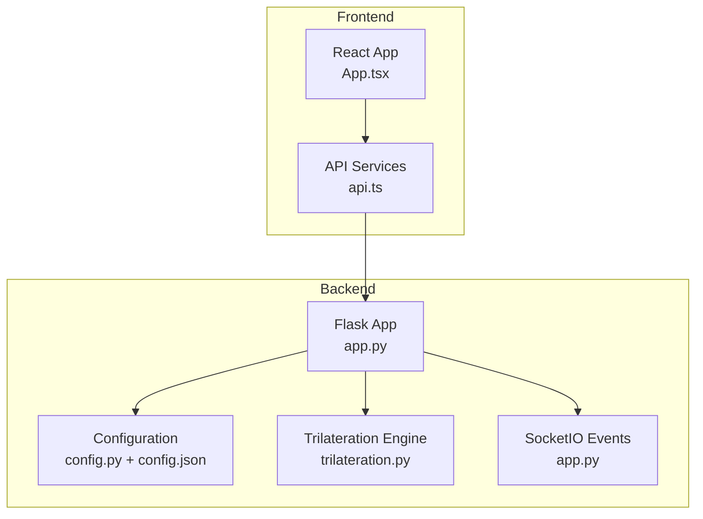
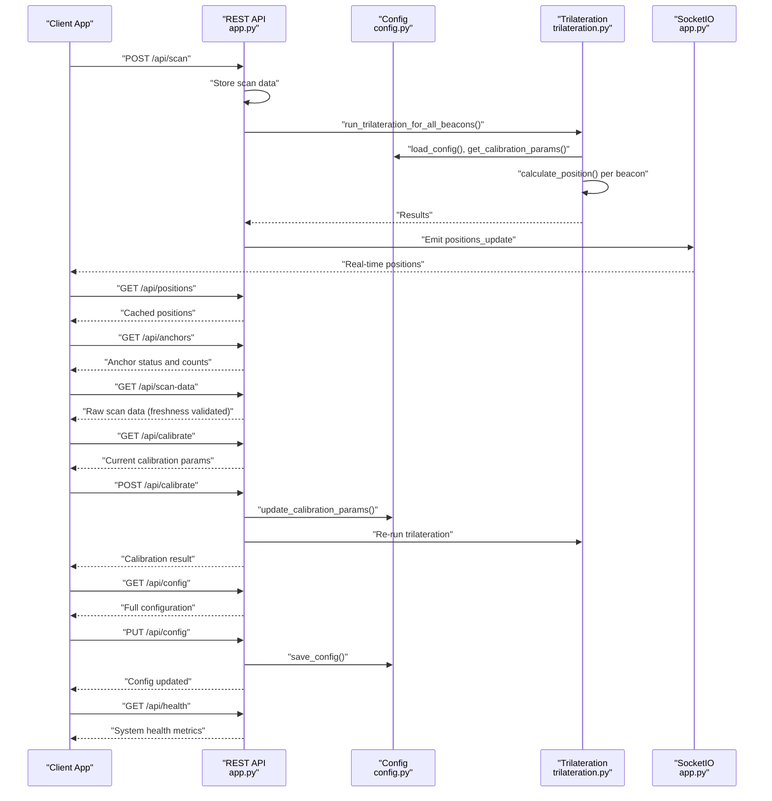
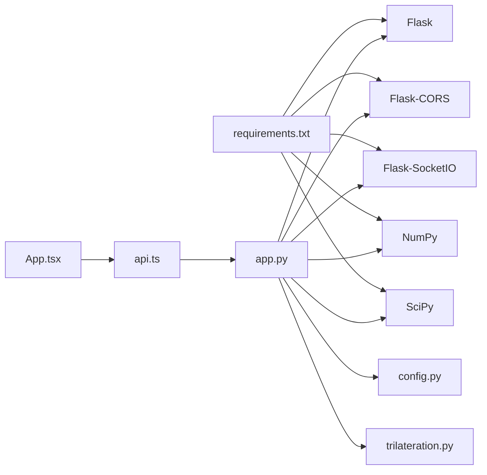

# API Endpoints

<cite>
**Referenced Files in This Document**
- [app.py](file://backend/app.py)
- [config.py](file://backend/config.py)
- [trilateration.py](file://backend/trilateration.py)
- [config.json](file://backend/config.json)
- [api.ts](file://frontend/src/services/api.ts)
- [App.tsx](file://frontend/src/App.tsx)
- [requirements.txt](file://backend/requirements.txt)
</cite>

## Table of Contents
1. [Introduction](#introduction)
2. [Project Structure](#project-structure)
3. [Core Components](#core-components)
4. [Architecture Overview](#architecture-overview)
5. [Detailed Component Analysis](#detailed-component-analysis)
6. [Dependency Analysis](#dependency-analysis)
7. [Performance Considerations](#performance-considerations)
8. [Troubleshooting Guide](#troubleshooting-guide)
9. [Conclusion](#conclusion)
10. [Appendices](#appendices)

## Introduction
This document provides comprehensive API documentation for the BLE Room Positioning System backend. It covers all REST endpoints, their HTTP methods, URL patterns, request/response schemas, authentication requirements, and error handling. It also explains beacon filtering, scan data validation, position calculation triggers, and provides practical usage examples with curl commands and client integration patterns. Rate limiting considerations, data freshness validation, and troubleshooting common API issues are addressed.

## Project Structure
The backend is a Flask application with Flask-SocketIO for real-time updates. The frontend is a React application that integrates with the backend APIs and receives live position updates via WebSocket.

**Diagram sources**
- [app.py:112-348](file://backend/app.py#L112-L348)
- [config.py:44-95](file://backend/config.py#L44-L95)
- [trilateration.py:11-218](file://backend/trilateration.py#L11-L218)
- [api.ts:1-66](file://frontend/src/services/api.ts#L1-L66)
- [App.tsx:54-172](file://frontend/src/App.tsx#L54-L172)

**Section sources**
- [app.py:23-25](file://backend/app.py#L23-L25)
- [requirements.txt:1-7](file://backend/requirements.txt#L1-L7)

## Core Components
- REST API endpoints exposed by the Flask application.
- Configuration management for room dimensions, anchor positions, and calibration parameters.
- Trilateration engine converting RSSI readings to 2D positions with outlier filtering.
- Real-time updates via SocketIO for live position visualization.

Key implementation references:
- Endpoint definitions and handlers: [app.py:112-348](file://backend/app.py#L112-L348)
- Configuration loading/saving: [config.py:44-95](file://backend/config.py#L44-L95)
- Trilateration pipeline: [trilateration.py:11-218](file://backend/trilateration.py#L11-L218)

**Section sources**
- [app.py:112-348](file://backend/app.py#L112-L348)
- [config.py:44-95](file://backend/config.py#L44-L95)
- [trilateration.py:11-218](file://backend/trilateration.py#L11-L218)

## Architecture Overview
The system architecture combines REST APIs for configuration and data retrieval with real-time WebSocket updates for live position visualization.

**Diagram sources**
- [app.py:123-171](file://backend/app.py#L123-L171)
- [app.py:173-183](file://backend/app.py#L173-L183)
- [app.py:186-221](file://backend/app.py#L186-L221)
- [app.py:256-279](file://backend/app.py#L256-L279)
- [app.py:282-331](file://backend/app.py#L282-L331)
- [app.py:334-347](file://backend/app.py#L334-L347)
- [app.py:112-120](file://backend/app.py#L112-L120)
- [app.py:48-105](file://backend/app.py#L48-L105)
- [config.py:44-95](file://backend/config.py#L44-L95)
- [trilateration.py:155-218](file://backend/trilateration.py#L155-L218)

## Detailed Component Analysis

### Endpoint: /api/scan (POST)
- Purpose: Receive BLE scan data from an ESP32 anchor.
- Authentication: Not required.
- Request body schema:
  - anchor_id: string (required)
  - anchor_pos: array [x, y] (optional)
  - timestamp: number (milliseconds since epoch)
  - calibration_mode: boolean (optional)
  - beacons: array of objects with:
    - beacon_id: string (MAC address)
    - rssi: number (dBm)
    - tx_power: number (dBm) (optional; defaults to calibration tx_power_dbm)
- Response schema:
  - status: string
  - anchor_id: string
  - beacons_count: number
  - positions_calculated: number
- Status codes:
  - 200 OK on successful receipt
  - 400 Bad Request if missing JSON or required fields
- Error handling:
  - Returns error message if JSON is malformed or missing required fields.
  - Trilateration errors are caught and logged; partial results may still be emitted.
- Example curl:
  - curl -X POST http://localhost:5000/api/scan -H "Content-Type: application/json" -d '{...}'
- Practical usage:
  - ESP32 anchors send periodic scan data; backend stores it and triggers trilateration.
  - Frontend polls positions or listens for WebSocket updates.

**Section sources**
- [app.py:123-171](file://backend/app.py#L123-L171)

### Endpoint: /api/positions (GET)
- Purpose: Retrieve current beacon positions computed by trilateration.
- Authentication: Not required.
- Response schema:
  - positions: array of objects with:
    - beacon_id: string
    - position: [x, y] or null
    - error: number or null
    - anchors_used: number
    - method: string
    - anchor_details: array of anchor readings used
  - count: number
  - timestamp: number (milliseconds)
- Status codes:
  - 200 OK
- Notes:
  - Results are cached and updated via WebSocket on new scan data.
  - Frontend also polls periodically if WebSocket is unavailable.

**Section sources**
- [app.py:173-183](file://backend/app.py#L173-L183)

### Endpoint: /api/anchors (GET)
- Purpose: Get anchor configurations and status (online/offline).
- Authentication: Not required.
- Response schema:
  - anchors: array of objects with:
    - anchor_id: string
    - x: number
    - y: number
    - label: string
    - online: boolean (based on scan freshness)
    - last_seen: number or null
    - beacons_detected: number
  - count: number
- Status codes:
  - 200 OK
- Freshness validation:
  - Online status determined by scan TTL (default 15 seconds).

**Section sources**
- [app.py:186-221](file://backend/app.py#L186-L221)

### Endpoint: /api/anchors (PUT)
- Purpose: Update anchor positions (calibration).
- Authentication: Not required.
- Request body schema:
  - anchors: array of objects with:
    - anchor_id: string
    - x: number
    - y: number
- Response schema:
  - status: string
  - updated_anchors: array of strings
- Status codes:
  - 200 OK
  - 400 Bad Request if missing anchors array or invalid fields
- Example curl:
  - curl -X PUT http://localhost:5000/api/anchors -H "Content-Type: application/json" -d '{...}'

**Section sources**
- [app.py:224-253](file://backend/app.py#L224-L253)

### Endpoint: /api/calibrate (GET)
- Purpose: Retrieve current calibration parameters and room/beacon filters.
- Authentication: Not required.
- Response schema:
  - calibration: object with:
    - path_loss_exponent: number
    - tx_power_dbm: number
    - min_rssi_threshold: number
    - scan_ttl_seconds: number
  - room: object with width_m and height_m
  - beacon_filters: array of MAC addresses (empty means track all)
- Status codes:
  - 200 OK

**Section sources**
- [app.py:323-331](file://backend/app.py#L323-L331)

### Endpoint: /api/calibrate (POST)
- Purpose: Update calibration parameters.
- Authentication: Not required.
- Request body schema:
  - Any subset of:
    - path_loss_exponent: number
    - tx_power_dbm: number
    - min_rssi_threshold: number
    - scan_ttl_seconds: number
- Response schema:
  - status: string
  - params: object containing updated keys
  - positions_recalculated: number
- Status codes:
  - 200 OK
  - 400 Bad Request if no valid parameters provided
- Behavior:
  - Updates calibration in config and re-runs trilateration.

**Section sources**
- [app.py:282-320](file://backend/app.py#L282-L320)

### Endpoint: /api/scan-data (GET)
- Purpose: Get latest raw RSSI scan data from all anchors.
- Authentication: Not required.
- Response schema:
  - scan_data: array of objects with:
    - anchor_id: string
    - anchor_pos: [x, y] or null
    - timestamp: number
    - calibration_mode: boolean
    - beacons: array of beacon objects
    - age_seconds: number (computed from received_at)
  - active_anchors: number
- Status codes:
  - 200 OK
- Freshness validation:
  - Only returns scans younger than TTL (default 15 seconds).

**Section sources**
- [app.py:256-279](file://backend/app.py#L256-L279)

### Endpoint: /api/config (GET)
- Purpose: Get full system configuration.
- Authentication: Not required.
- Response schema:
  - Entire config object loaded from config.json
- Status codes:
  - 200 OK

**Section sources**
- [app.py:334-337](file://backend/app.py#L334-L337)

### Endpoint: /api/config (PUT)
- Purpose: Update full system configuration.
- Authentication: Not required.
- Request body schema:
  - Full config object (partial updates are merged by save_config)
- Response schema:
  - status: string
- Status codes:
  - 200 OK
  - 400 Bad Request if no config data provided
- Notes:
  - Writes updated config to config.json.

**Section sources**
- [app.py:340-347](file://backend/app.py#L340-L347)

### Endpoint: /api/health (GET)
- Purpose: Health check endpoint.
- Authentication: Not required.
- Response schema:
  - status: string
  - uptime_seconds: number
  - anchors_reporting: number
  - beacons_tracked: number
- Status codes:
  - 200 OK

**Section sources**
- [app.py:112-120](file://backend/app.py#L112-L120)

## Dependency Analysis
The backend depends on Flask, CORS, SocketIO, NumPy, and SciPy. The frontend consumes the REST endpoints and listens to SocketIO events.

**Diagram sources**
- [requirements.txt:1-7](file://backend/requirements.txt#L1-L7)
- [app.py:9-21](file://backend/app.py#L9-L21)
- [config.py:6-9](file://backend/config.py#L6-L9)
- [trilateration.py:6-8](file://backend/trilateration.py#L6-L8)
- [api.ts:1-10](file://frontend/src/services/api.ts#L1-L10)
- [App.tsx:1-5](file://frontend/src/App.tsx#L1-L5)

**Section sources**
- [requirements.txt:1-7](file://backend/requirements.txt#L1-L7)
- [app.py:9-21](file://backend/app.py#L9-L21)

## Performance Considerations
- Data freshness validation:
  - Scan TTL defaults to 15 seconds; stale scans are ignored during trilateration.
  - Online anchor detection uses the same TTL.
- Trilateration pipeline:
  - RSSI-to-distance conversion with clamping to a reasonable range.
  - Outlier filtering using median absolute deviation; ensures at least 3 anchors retained when possible.
  - Least-squares optimization with Levenberg–Marquardt method.
- Concurrency:
  - In-memory stores guarded by locks to prevent race conditions.
- Real-time updates:
  - WebSocket emits positions_update on successful trilateration; clients can subscribe for live updates.
- Polling fallback:
  - Frontend polls endpoints every 3 seconds when WebSocket is disconnected.

[No sources needed since this section provides general guidance]

## Troubleshooting Guide
Common issues and resolutions:
- No positions displayed:
  - Verify anchors are reporting (online status) and within TTL.
  - Check calibration parameters (path loss exponent, tx power, RSSI threshold).
  - Confirm beacon_filters if set; ensure target beacons are included.
- Weak RSSI or frequent N/A positions:
  - Increase tx_power_dbm or reduce min_rssi_threshold cautiously.
  - Adjust path_loss_exponent for indoor environments (2.7–3.5).
- Anchors marked offline:
  - Ensure anchors send scan data regularly within TTL.
  - Check network connectivity and anchor power.
- WebSocket disconnections:
  - The frontend automatically reconnects; polling continues as fallback.
- Calibration not taking effect:
  - Use POST /api/calibrate with valid parameters; backend re-runs trilateration.
- CORS errors:
  - Flask-CORS is enabled; ensure requests originate from allowed origins.

**Section sources**
- [app.py:39-46](file://backend/app.py#L39-L46)
- [app.py:196-206](file://backend/app.py#L196-L206)
- [trilateration.py:35-66](file://backend/trilateration.py#L35-L66)
- [App.tsx:140-172](file://frontend/src/App.tsx#L140-L172)

## Conclusion
The API provides a robust foundation for BLE-based room positioning with real-time updates, configurable calibration, and flexible filtering. Clients should leverage WebSocket for live updates while using REST endpoints for configuration and diagnostics. Proper tuning of calibration parameters and adherence to TTL policies ensure reliable position estimates.

[No sources needed since this section summarizes without analyzing specific files]

## Appendices

### Beacon Filtering Mechanism
- Beacon filters are stored in configuration and applied during trilateration.
- If beacon_filters is empty, all beacons are tracked; otherwise, only listed MAC addresses are processed.

**Section sources**
- [config.py:40](file://backend/config.py#L40)
- [app.py:68-70](file://backend/app.py#L68-L70)

### Scan Data Validation
- Freshness: TTL-based checks compare received_at timestamps against current server time.
- RSSI threshold: Signals below min_rssi_threshold are ignored.
- Distance clamping: RSSI-to-distance conversion clamps distances to a safe range.

**Section sources**
- [app.py:39-46](file://backend/app.py#L39-L46)
- [trilateration.py:11-32](file://backend/trilateration.py#L11-L32)
- [trilateration.py:189-191](file://backend/trilateration.py#L189-L191)

### Position Calculation Triggers
- Triggered by:
  - POST /api/scan receiving new scan data.
  - POST /api/calibrate updating calibration parameters.
  - Manual request via SocketIO event request_positions.

**Section sources**
- [app.py:158-163](file://backend/app.py#L158-L163)
- [app.py:310-314](file://backend/app.py#L310-L314)
- [app.py:366-376](file://backend/app.py#L366-L376)

### Practical Usage Examples

- curl: Send scan data
  - curl -X POST http://localhost:5000/api/scan -H "Content-Type: application/json" -d '{"anchor_id":"scanner-01","anchor_pos":[0.0,0.0],"timestamp":1709945025000,"calibration_mode":false,"beacons":[{"beacon_id":"AA:BB:CC:DD:EE:FF","rssi":-65,"tx_power":-59}]}' 

- curl: Get positions
  - curl http://localhost:5000/api/positions

- curl: Get anchors status
  - curl http://localhost:5000/api/anchors

- curl: Update anchors
  - curl -X PUT http://localhost:5000/api/anchors -H "Content-Type: application/json" -d '{"anchors":[{"anchor_id":"scanner-01","x":0.0,"y":0.0},{"anchor_id":"scanner-02","x":10.0,"y":0.0}]}'

- curl: Get scan data
  - curl http://localhost:5000/api/scan-data

- curl: Get calibration
  - curl http://localhost:5000/api/calibrate

- curl: Update calibration
  - curl -X POST http://localhost:5000/api/calibrate -H "Content-Type: application/json" -d '{"path_loss_exponent":2.5,"tx_power_dbm":-59,"min_rssi_threshold":-90,"scan_ttl_seconds":15}'

- curl: Get config
  - curl http://localhost:5000/api/config

- curl: Update config
  - curl -X PUT http://localhost:5000/api/config -H "Content-Type: application/json" -d '{"room":{"width_m":10.0,"height_m":8.0},"anchors":{"scanner-01":{"x":0.0,"y":0.0,"label":"Anchor 1"},"scanner-02":{"x":10.0,"y":0.0,"label":"Anchor 2"},"scanner-03":{"x":5.0,"y":8.0,"label":"Anchor 3"}},"calibration":{"path_loss_exponent":2.0,"tx_power_dbm":-59,"min_rssi_threshold":-90,"scan_ttl_seconds":15},"beacon_filters":[]}'

- curl: Health check
  - curl http://localhost:5000/api/health

### Client Integration Patterns
- React integration (frontend):
  - Uses axios service wrappers for REST endpoints.
  - Subscribes to SocketIO positions_update events for real-time updates.
  - Falls back to periodic polling when WebSocket is unavailable.

**Section sources**
- [api.ts:1-66](file://frontend/src/services/api.ts#L1-L66)
- [App.tsx:56-172](file://frontend/src/App.tsx#L56-L172)

### Rate Limiting Considerations
- No explicit rate limiting is implemented in the backend.
- Recommendations:
  - Frontend should throttle polling to avoid excessive requests.
  - Use WebSocket for continuous updates instead of frequent GET requests.
  - Respect TTL and avoid flooding the system with redundant scans.

[No sources needed since this section provides general guidance]