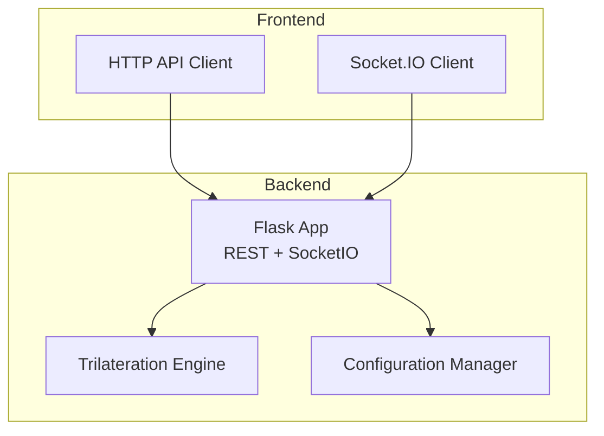
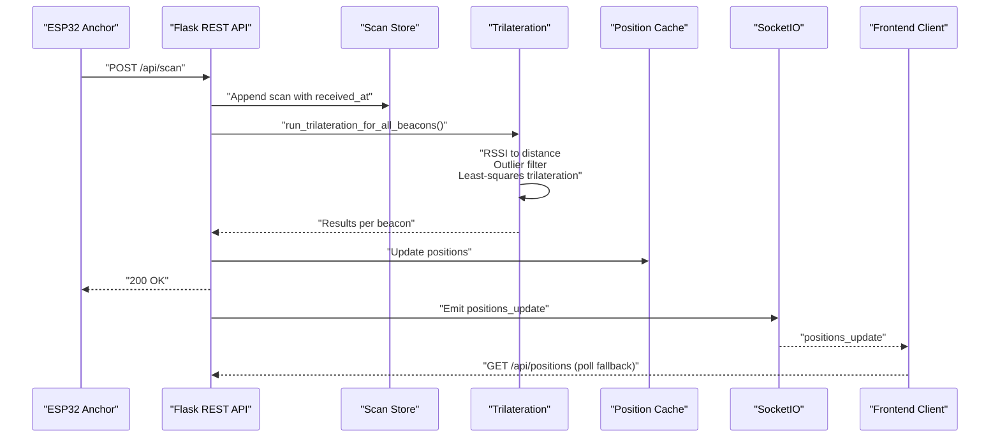
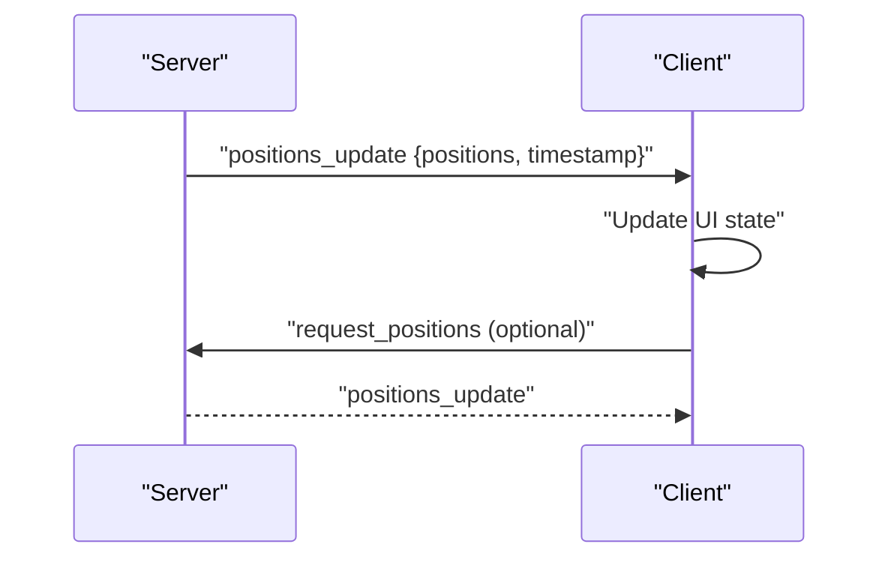
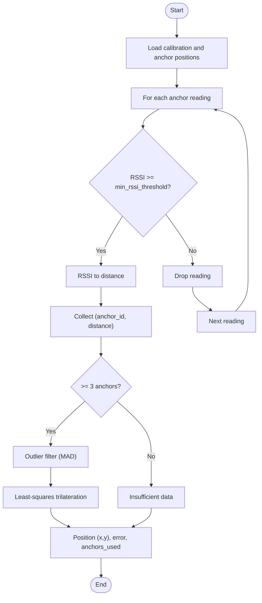
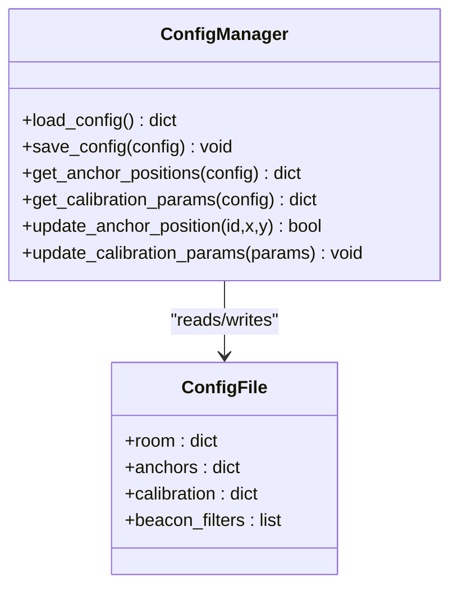
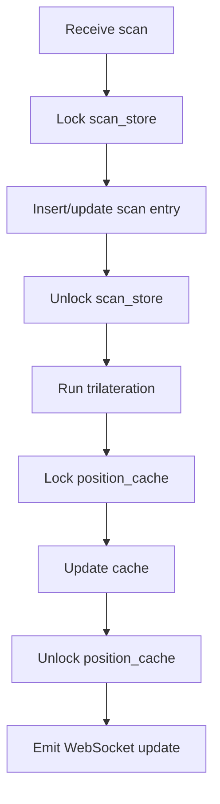
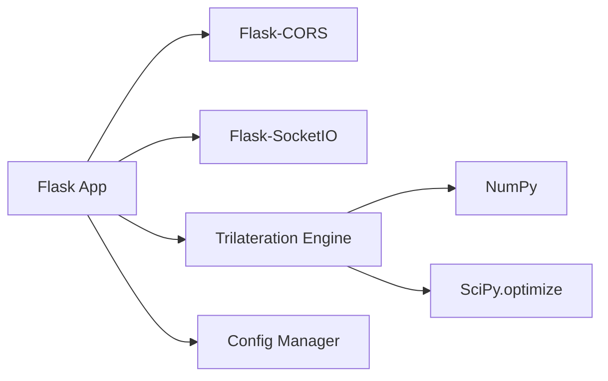

# Backend Services

<cite>
**Referenced Files in This Document**
- [app.py](file://backend/app.py)
- [trilateration.py](file://backend/trilateration.py)
- [config.py](file://backend/config.py)
- [config.json](file://backend/config.json)
- [requirements.txt](file://backend/requirements.txt)
- [api.ts](file://frontend/src/services/api.ts)
- [App.tsx](file://frontend/src/App.tsx)
- [RoomMap.tsx](file://frontend/src/components/RoomMap.tsx)
</cite>

## Table of Contents
1. [Introduction](#introduction)
2. [Project Structure](#project-structure)
3. [Core Components](#core-components)
4. [Architecture Overview](#architecture-overview)
5. [Detailed Component Analysis](#detailed-component-analysis)
6. [Dependency Analysis](#dependency-analysis)
7. [Performance Considerations](#performance-considerations)
8. [Troubleshooting Guide](#troubleshooting-guide)
9. [Conclusion](#conclusion)
10. [Appendices](#appendices)

## Introduction
This document describes the Python Flask backend services for a BLE Room Positioning System. It covers the complete REST API, WebSocket integration for real-time updates, the trilateration engine, configuration management, threading and memory models, error handling, and operational guidance for performance and production deployment.

## Project Structure
The backend is organized around a Flask application with SocketIO for real-time updates, a trilateration module for position estimation, and a configuration module managing room geometry, anchor positions, and calibration parameters. The frontend consumes the backend via HTTP and SocketIO.

**Diagram sources**
- [app.py:1-398](file://backend/app.py#L1-L398)
- [trilateration.py:1-218](file://backend/trilateration.py#L1-L218)
- [config.py:1-95](file://backend/config.py#L1-L95)

**Section sources**
- [app.py:23-25](file://backend/app.py#L23-L25)
- [requirements.txt:1-7](file://backend/requirements.txt#L1-L7)

## Core Components
- Flask application with CORS enabled and SocketIO for real-time updates
- Trilateration engine converting RSSI to distances, filtering outliers, and computing 2D positions via least-squares optimization
- Configuration manager for room dimensions, anchor positions, calibration parameters, and beacon filters
- In-memory stores for raw scan data and cached positions protected by locks for thread safety

Key responsibilities:
- Expose REST endpoints for scanning, positioning, anchors, calibration, and configuration
- Broadcast live position updates via WebSocket
- Maintain and update configuration on disk
- Run trilateration on fresh scan data and cache results

**Section sources**
- [app.py:23-37](file://backend/app.py#L23-L37)
- [trilateration.py:11-218](file://backend/trilateration.py#L11-L218)
- [config.py:44-95](file://backend/config.py#L44-L95)

## Architecture Overview
The backend receives BLE scan reports from ESP32 anchors, runs trilateration, and emits real-time updates to clients. Configuration is persisted to a JSON file and can be updated via API.

**Diagram sources**
- [app.py:123-171](file://backend/app.py#L123-L171)
- [app.py:48-105](file://backend/app.py#L48-L105)
- [trilateration.py:155-218](file://backend/trilateration.py#L155-L218)

## Detailed Component Analysis

### REST API Endpoints
- Base path: /api
- Methods: GET, POST, PUT

Endpoints:
- GET /api/health
  - Purpose: Health and metrics
  - Response: status, uptime_seconds, anchors_reporting, beacons_tracked
  - Example usage: curl -s http://localhost:5000/api/health

- POST /api/scan
  - Purpose: Receive BLE scan data from an anchor
  - Request body:
    - anchor_id: string
    - anchor_pos: [x, y]
    - timestamp: number (epoch ms)
    - calibration_mode: boolean
    - beacons: array of objects with beacon_id, rssi, tx_power
  - Response: status, anchor_id, beacons_count, positions_calculated
  - Example usage: curl -s -X POST http://localhost:5000/api/scan -H "Content-Type: application/json" -d '{...}'

- GET /api/positions
  - Purpose: Retrieve current trilateration results
  - Response: positions array, count, timestamp
  - Example usage: curl -s http://localhost:5000/api/positions

- GET /api/anchors
  - Purpose: Retrieve anchor configurations and status (online/offline based on TTL)
  - Response: anchors array with anchor_id, x, y, label, online, last_seen, beacons_detected
  - Example usage: curl -s http://localhost:5000/api/anchors

- PUT /api/anchors
  - Purpose: Update anchor positions
  - Request body: anchors array with anchor_id, x, y
  - Response: status, updated_anchors
  - Example usage: curl -s -X PUT http://localhost:5000/api/anchors -H "Content-Type: application/json" -d '{...}'

- GET /api/scan-data
  - Purpose: Retrieve latest raw scan data from all anchors (freshness controlled by TTL)
  - Response: scan_data array with anchor_id, anchor_pos, timestamp, calibration_mode, beacons, age_seconds
  - Example usage: curl -s http://localhost:5000/api/scan-data

- POST /api/calibrate
  - Purpose: Update calibration parameters
  - Request body: subset of path_loss_exponent, tx_power_dbm, min_rssi_threshold, scan_ttl_seconds
  - Response: status, params, positions_recalculated
  - Example usage: curl -s -X POST http://localhost:5000/api/calibrate -H "Content-Type: application/json" -d '{...}'

- GET /api/calibrate
  - Purpose: Retrieve current calibration parameters and room/beacon_filters
  - Response: calibration, room, beacon_filters
  - Example usage: curl -s http://localhost:5000/api/calibrate

- GET /api/config
  - Purpose: Retrieve full system configuration
  - Response: complete config JSON
  - Example usage: curl -s http://localhost:5000/api/config

- PUT /api/config
  - Purpose: Update full system configuration
  - Request body: complete config JSON
  - Response: status
  - Example usage: curl -s -X PUT http://localhost:5000/api/config -H "Content-Type: application/json" -d '{...}'

Notes:
- Freshness checks use received_at timestamps and scan_ttl_seconds
- Beacon filtering can restrict tracked beacons via beacon_filters

**Section sources**
- [app.py:112-121](file://backend/app.py#L112-L121)
- [app.py:123-171](file://backend/app.py#L123-L171)
- [app.py:173-183](file://backend/app.py#L173-L183)
- [app.py:186-222](file://backend/app.py#L186-L222)
- [app.py:224-254](file://backend/app.py#L224-L254)
- [app.py:256-280](file://backend/app.py#L256-L280)
- [app.py:282-321](file://backend/app.py#L282-L321)
- [app.py:323-332](file://backend/app.py#L323-L332)
- [app.py:334-348](file://backend/app.py#L334-L348)

### WebSocket Integration (Flask-SocketIO)
- Real-time event: positions_update
- Client-side subscription: socket.on('positions_update', ...)
- Server emits upon successful trilateration and cache update
- Fallback polling is used when WebSocket is unavailable

**Diagram sources**
- [app.py:99-103](file://backend/app.py#L99-L103)
- [app.py:354-377](file://backend/app.py#L354-L377)
- [App.tsx:140-172](file://frontend/src/App.tsx#L140-L172)

**Section sources**
- [app.py:354-377](file://backend/app.py#L354-L377)
- [App.tsx:140-172](file://frontend/src/App.tsx#L140-L172)

### Trilateration Engine
Core algorithms:
- RSSI-to-distance conversion using log-distance path loss model
- Outlier detection using median absolute deviation (MAD)
- Least-squares trilateration with Levenberg–Marquardt optimization
- Multi-anchor triangulation with error estimation

**Diagram sources**
- [trilateration.py:11-33](file://backend/trilateration.py#L11-L33)
- [trilateration.py:35-67](file://backend/trilateration.py#L35-L67)
- [trilateration.py:69-153](file://backend/trilateration.py#L69-L153)
- [trilateration.py:155-218](file://backend/trilateration.py#L155-L218)

Implementation highlights:
- Distance clamping to a safe range
- Robust handling of insufficient data and optimization failures
- Error reporting via RMS residual of residuals

**Section sources**
- [trilateration.py:11-218](file://backend/trilateration.py#L11-L218)

### Configuration Management
- Room dimensions: width_m, height_m
- Anchors: anchor_id -> {x, y, label}
- Calibration: path_loss_exponent, tx_power_dbm, min_rssi_threshold, scan_ttl_seconds
- Beacon filters: list of beacon MAC addresses to track (empty means all)

Operations:
- Load defaults if config.json does not exist
- Persist updates to disk
- Provide getters for positions and calibration parameters
- Update single anchor positions and calibration parameters atomically

**Diagram sources**
- [config.py:44-95](file://backend/config.py#L44-L95)
- [config.json:1-30](file://backend/config.json#L1-L30)

**Section sources**
- [config.py:44-95](file://backend/config.py#L44-L95)
- [config.json:1-30](file://backend/config.json#L1-L30)

### Threading Model and Memory Management
- In-memory stores:
  - scan_store: anchor_id -> {anchor_id, anchor_pos, timestamp, received_at, calibration_mode, beacons}
  - position_cache: beacon_id -> {position, error, anchors_used, method, anchor_details}
- Thread safety:
  - scan_store_lock protects scan_store during writes and reads
  - position_cache_lock protects position_cache during updates and reads
- Freshness:
  - is_scan_fresh and TTL seconds prevent stale data from affecting calculations
- Concurrency:
  - Background trilateration triggered on scan receipt
  - No explicit worker threads; trilateration runs synchronously on the request thread

**Diagram sources**
- [app.py:39-46](file://backend/app.py#L39-L46)
- [app.py:48-105](file://backend/app.py#L48-L105)
- [app.py:31-37](file://backend/app.py#L31-L37)

**Section sources**
- [app.py:31-37](file://backend/app.py#L31-L37)
- [app.py:39-46](file://backend/app.py#L39-L46)
- [app.py:48-105](file://backend/app.py#L48-L105)

### Error Handling Strategies
- Validation:
  - JSON parsing errors, missing fields, and malformed payloads return 400 with error messages
- Runtime:
  - Trilateration exceptions are caught and logged; partial results may still be emitted
  - WebSocket error events propagate error messages to clients
- Graceful degradation:
  - Polling fallback when WebSocket is disconnected
  - Stale data ignored via TTL checks

**Section sources**
- [app.py:140-146](file://backend/app.py#L140-L146)
- [app.py:159-164](file://backend/app.py#L159-L164)
- [app.py:375-377](file://backend/app.py#L375-L377)
- [App.tsx:126-137](file://frontend/src/App.tsx#L126-L137)

## Dependency Analysis
External libraries:
- Flask, Flask-CORS, Flask-SocketIO for HTTP and WebSocket
- NumPy and SciPy for numerical optimization
- simple-websocket for SocketIO transport support

**Diagram sources**
- [requirements.txt:1-7](file://backend/requirements.txt#L1-L7)
- [app.py:9-21](file://backend/app.py#L9-L21)
- [trilateration.py:6-8](file://backend/trilateration.py#L6-L8)

**Section sources**
- [requirements.txt:1-7](file://backend/requirements.txt#L1-L7)

## Performance Considerations
- RSSI-to-distance conversion is O(n) per beacon across anchors
- Outlier filtering adds O(n) pass with median computation
- Least-squares optimization is bounded by anchor count; typical 3–6 anchors
- Cache invalidation clears and replaces the entire position cache; acceptable given small beacon counts
- Recommendations:
  - Tune path_loss_exponent and tx_power_dbm per environment
  - Adjust min_rssi_threshold to reduce noise
  - Monitor anchors_reporting and beacons_tracked via /api/health
  - Consider batching anchor updates and recalculating less frequently if throughput increases

[No sources needed since this section provides general guidance]

## Troubleshooting Guide
Common issues and remedies:
- No positions displayed:
  - Verify anchors are online (last_seen within TTL) via /api/anchors
  - Confirm beacon_filters if set; use /api/config to inspect
- Weak signal or frequent drops:
  - Increase min_rssi_threshold via /api/calibrate
  - Recalibrate path_loss_exponent and tx_power_dbm
- Stale data:
  - Check scan_ttl_seconds and ensure anchors send timely timestamps
- WebSocket disconnects:
  - Inspect browser console for socket errors
  - Use fallback polling when disconnected

**Section sources**
- [app.py:186-222](file://backend/app.py#L186-L222)
- [app.py:282-321](file://backend/app.py#L282-L321)
- [App.tsx:126-137](file://frontend/src/App.tsx#L126-L137)

## Conclusion
The backend provides a robust foundation for BLE-based room positioning with real-time updates, configurable calibration, and a modular trilateration pipeline. It balances simplicity and performance while offering clear extension points for advanced filtering and optimization.

[No sources needed since this section summarizes without analyzing specific files]

## Appendices

### Practical Usage Examples
- Health check
  - curl -s http://localhost:5000/api/health
- Send scan data
  - curl -s -X POST http://localhost:5000/api/scan -H "Content-Type: application/json" -d '{"anchor_id":"scanner-01","anchor_pos":[0.0,0.0],"timestamp":1709945025000,"calibration_mode":false,"beacons":[{"beacon_id":"AA:BB:CC:DD:EE:FF","rssi":-65,"tx_power":-59}]}'  
- Get positions
  - curl -s http://localhost:5000/api/positions
- Update anchors
  - curl -s -X PUT http://localhost:5000/api/anchors -H "Content-Type: application/json" -d '{"anchors":[{"anchor_id":"scanner-01","x":0.0,"y":0.0},{"anchor_id":"scanner-02","x":10.0,"y":0.0}]}'
- Calibrate
  - curl -s -X POST http://localhost:5000/api/calibrate -H "Content-Type: application/json" -d '{"path_loss_exponent":2.5,"tx_power_dbm":-59}'
- Get calibration
  - curl -s http://localhost:5000/api/calibrate
- Get full config
  - curl -s http://localhost:5000/api/config
- Update full config
  - curl -s -X PUT http://localhost:5000/api/config -H "Content-Type: application/json" -d '{"room":{"width_m":10.0,"height_m":8.0},"anchors":{"scanner-01":{"x":0.0,"y":0.0,"label":"Anchor 1"},"scanner-02":{"x":10.0,"y":0.0,"label":"Anchor 2"},"scanner-03":{"x":5.0,"y":8.0,"label":"Anchor 3"}},"calibration":{"path_loss_exponent":2.0,"tx_power_dbm":-59,"min_rssi_threshold":-90,"scan_ttl_seconds":15},"beacon_filters":[]}'

### Frontend Integration Notes
- HTTP client base URL is /api
- Socket.IO connects to ws://localhost:5000
- Real-time updates arrive via positions_update; falls back to periodic polling when disconnected

**Section sources**
- [api.ts:3](file://frontend/src/services/api.ts#L3)
- [App.tsx:54](file://frontend/src/App.tsx#L54)
- [App.tsx:140-172](file://frontend/src/App.tsx#L140-L172)

### Production Deployment Guidance
- Environment variables:
  - FLASK_ENV=production
  - PORT=5000
  - HOST=0.0.0.0
- Logging:
  - Enable structured logs and configure level via environment
- Scaling:
  - Stateless design allows horizontal scaling behind a reverse proxy
  - Consider externalizing config storage (e.g., database or config server)
- Security:
  - Restrict CORS origins in production
  - Use HTTPS and secure WebSocket transport
- Monitoring:
  - Use /api/health for basic health checks
  - Track anchors_reporting and beacons_tracked trends

[No sources needed since this section provides general guidance]