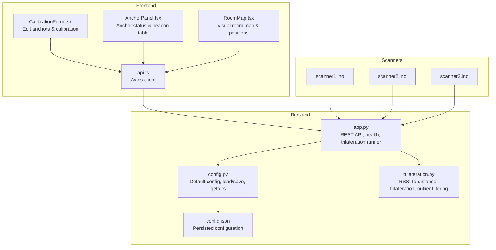
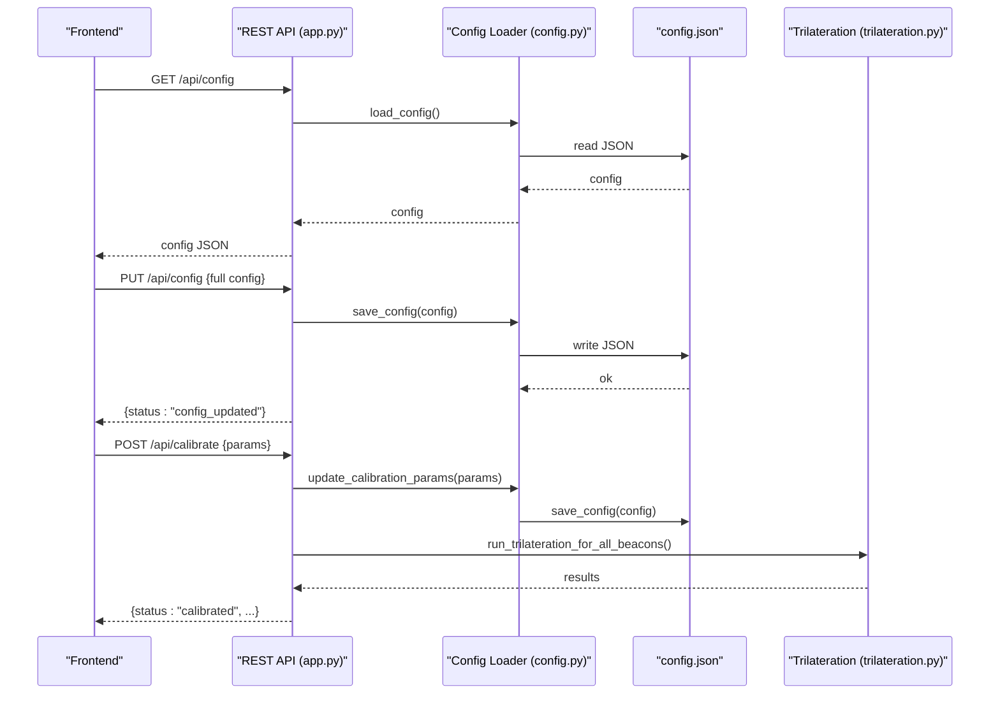
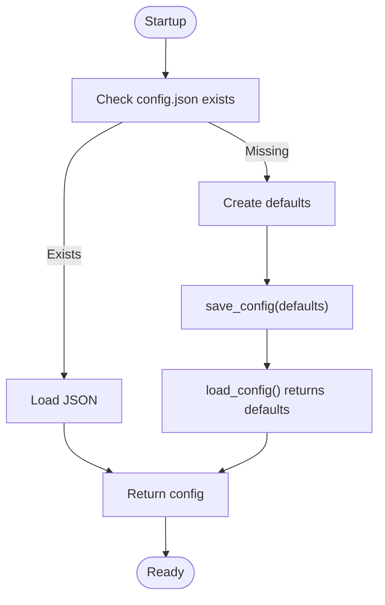
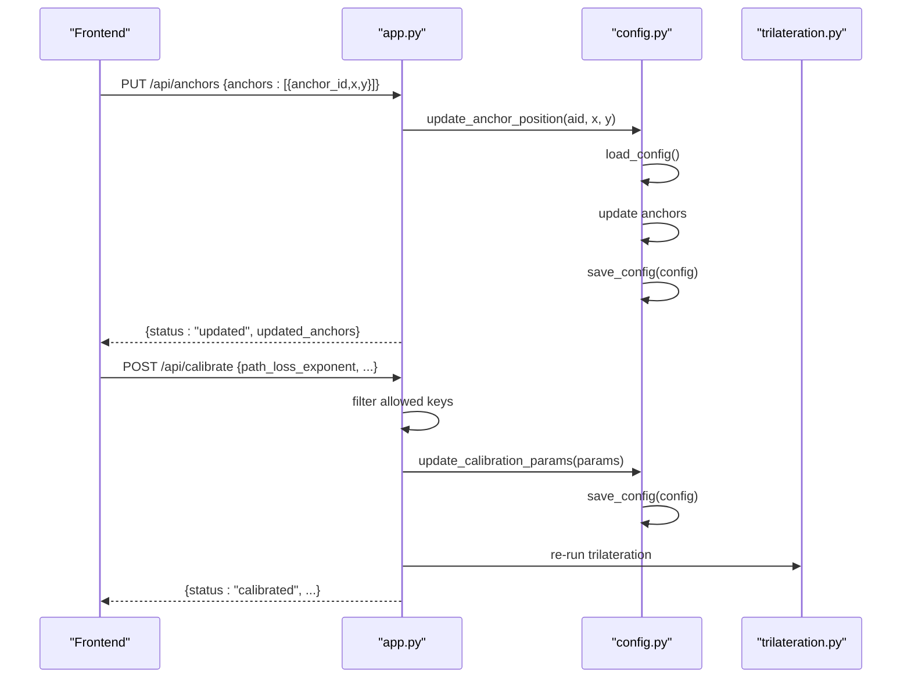
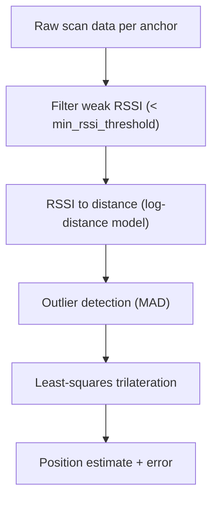
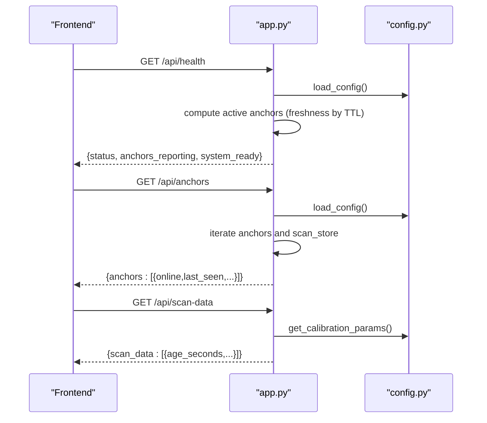
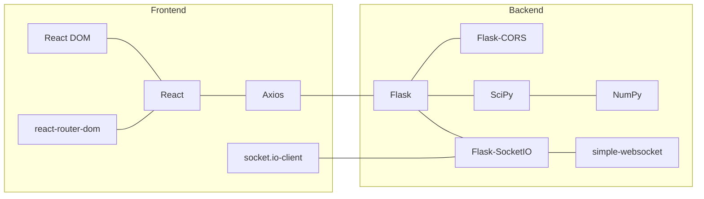

# Configuration Management

<cite>
**Referenced Files in This Document**
- [config.py](file://backend/config.py)
- [config.json](file://backend/config.json)
- [app.py](file://backend/app.py)
- [trilateration.py](file://backend/trilateration.py)
- [api.ts](file://frontend/src/services/api.ts)
- [CalibrationForm.tsx](file://frontend/src/components/CalibrationForm.tsx)
- [AnchorPanel.tsx](file://frontend/src/components/AnchorPanel.tsx)
- [RoomMap.tsx](file://frontend/src/components/RoomMap.tsx)
- [scanner1.ino](file://scanner1/scanner1.ino)
- [scanner2.ino](file://scanner2/scanner2.ino)
- [scanner3.ino](file://scanner3/scanner3.ino)
- [requirements.txt](file://backend/requirements.txt)
- [package.json](file://frontend/package.json)
</cite>

## Table of Contents
1. [Introduction](#introduction)
2. [Project Structure](#project-structure)
3. [Core Components](#core-components)
4. [Architecture Overview](#architecture-overview)
5. [Detailed Component Analysis](#detailed-component-analysis)
6. [Dependency Analysis](#dependency-analysis)
7. [Performance Considerations](#performance-considerations)
8. [Troubleshooting Guide](#troubleshooting-guide)
9. [Conclusion](#conclusion)
10. [Appendices](#appendices)

## Introduction
This document describes the configuration management system for the BLE Room Positioning System. It covers the configuration file structure, loading and persistence mechanisms, validation and defaults, runtime updates, and integration with the trilateration engine. It also documents anchor status monitoring, system health checks, and practical guidance for calibration, backup/restore, version compatibility, and troubleshooting.

## Project Structure
The configuration system spans backend Python services, frontend React components, and ESP32 scanner firmware. The backend exposes REST endpoints to manage configuration and calibration, persists configuration to a JSON file, and integrates with the trilateration engine. The frontend provides a dashboard to visualize anchors, positions, and calibration parameters.

**Diagram sources**
- [config.py:1-95](file://backend/config.py#L1-L95)
- [config.json:1-30](file://backend/config.json#L1-L30)
- [app.py:1-422](file://backend/app.py#L1-L422)
- [trilateration.py:1-218](file://backend/trilateration.py#L1-L218)
- [api.ts:1-66](file://frontend/src/services/api.ts#L1-L66)
- [CalibrationForm.tsx:1-290](file://frontend/src/components/CalibrationForm.tsx#L1-L290)
- [AnchorPanel.tsx:1-143](file://frontend/src/components/AnchorPanel.tsx#L1-L143)
- [RoomMap.tsx:1-229](file://frontend/src/components/RoomMap.tsx#L1-L229)
- [scanner1.ino:1-381](file://scanner1/scanner1.ino#L1-L381)

**Section sources**
- [config.py:1-95](file://backend/config.py#L1-L95)
- [app.py:1-422](file://backend/app.py#L1-L422)
- [trilateration.py:1-218](file://backend/trilateration.py#L1-L218)
- [api.ts:1-66](file://frontend/src/services/api.ts#L1-L66)
- [CalibrationForm.tsx:1-290](file://frontend/src/components/CalibrationForm.tsx#L1-L290)
- [AnchorPanel.tsx:1-143](file://frontend/src/components/AnchorPanel.tsx#L1-L143)
- [RoomMap.tsx:1-229](file://frontend/src/components/RoomMap.tsx#L1-L229)
- [scanner1.ino:1-381](file://scanner1/scanner1.ino#L1-L381)

## Core Components
- Configuration storage and defaults: centralized in the backend module that defines default values and provides load/save/getters.
- Runtime configuration updates: REST endpoints expose PUT/POST routes to update anchors and calibration parameters.
- Trilateration integration: calibration parameters feed RSSI-to-distance conversion and trilateration routines.
- Frontend configuration UI: forms and panels to edit anchors, calibration parameters, and monitor anchor status and positions.
- Scanner firmware: sends scan data with anchor positions and timestamps to the backend.

Key responsibilities:
- Persist configuration to a JSON file and load it at startup.
- Validate and apply runtime updates safely.
- Provide health and status endpoints for monitoring.
- Visualize anchors, positions, and beacon data in the dashboard.

**Section sources**
- [config.py:11-95](file://backend/config.py#L11-L95)
- [app.py:121-372](file://backend/app.py#L121-L372)
- [trilateration.py:11-218](file://backend/trilateration.py#L11-L218)
- [api.ts:12-65](file://frontend/src/services/api.ts#L12-L65)
- [CalibrationForm.tsx:30-100](file://frontend/src/components/CalibrationForm.tsx#L30-L100)
- [AnchorPanel.tsx:30-133](file://frontend/src/components/AnchorPanel.tsx#L30-L133)
- [RoomMap.tsx:28-229](file://frontend/src/components/RoomMap.tsx#L28-L229)
- [scanner1.ino:223-302](file://scanner1/scanner1.ino#L223-L302)

## Architecture Overview
The configuration lifecycle:
- On startup, the backend loads configuration from the JSON file or creates defaults and persists them.
- Frontend components call REST endpoints to retrieve and update configuration.
- Trilateration consumes configuration values for distance estimation and filtering.
- Anchors periodically POST scan data with anchor positions and timestamps.

**Diagram sources**
- [app.py:358-372](file://backend/app.py#L358-L372)
- [app.py:306-344](file://backend/app.py#L306-L344)
- [config.py:44-58](file://backend/config.py#L44-L58)
- [config.py:89-95](file://backend/config.py#L89-L95)
- [config.json:1-30](file://backend/config.json#L1-L30)
- [trilateration.py:155-218](file://backend/trilateration.py#L155-L218)

## Detailed Component Analysis

### Configuration File Structure
The configuration is stored as a JSON document with the following top-level sections:
- room: width_m, height_m
- anchors: map of anchor_id to x, y, label
- calibration: path_loss_exponent, tx_power_dbm, min_rssi_threshold, scan_ttl_seconds
- beacon_filters: list of MAC addresses to track (empty means track all)

Defaults and persistence:
- Defaults are defined in the backend module and written to disk if missing.
- The backend reads/writes the JSON file directly.

Practical example locations:
- Default structure and defaults: [config.py:11-41](file://backend/config.py#L11-L41)
- JSON file layout: [config.json:1-30](file://backend/config.json#L1-30)

**Section sources**
- [config.py:11-41](file://backend/config.py#L11-L41)
- [config.json:1-30](file://backend/config.json#L1-L30)

### Configuration Loading, Validation, and Persistence
Loading:
- If the JSON file exists, it is parsed and returned.
- If not, defaults are created, persisted, and returned.

Persistence:
- save_config writes the configuration back to the JSON file.

Validation and defaults:
- The backend does not enforce strict validation on the JSON structure itself.
- Trilateration and API endpoints rely on default values when keys are missing.

Runtime updates:
- Full config replacement via PUT /api/config.
- Partial calibration updates via POST /api/calibrate.
- Anchor position updates via PUT /api/anchors.

**Diagram sources**
- [config.py:44-58](file://backend/config.py#L44-L58)

**Section sources**
- [config.py:44-58](file://backend/config.py#L44-L58)
- [app.py:358-372](file://backend/app.py#L358-L372)
- [app.py:306-344](file://backend/app.py#L306-L344)
- [app.py:248-278](file://backend/app.py#L248-L278)

### Runtime Configuration Updates and Parameter Validation
Endpoints:
- PUT /api/config: Replace full configuration.
- POST /api/calibrate: Update calibration parameters (subset allowed).
- PUT /api/anchors: Update anchor positions.

Validation behavior:
- The backend validates presence of required fields in incoming requests and filters out invalid keys for calibration updates.
- No schema validation is performed on the full configuration; malformed JSON will cause errors.

Parameter defaults used by trilateration:
- path_loss_exponent: default 2.0
- tx_power_dbm: default -59
- min_rssi_threshold: default -90
- scan_ttl_seconds: default 15

**Diagram sources**
- [app.py:248-278](file://backend/app.py#L248-L278)
- [app.py:306-344](file://backend/app.py#L306-L344)
- [config.py:77-95](file://backend/config.py#L77-L95)
- [trilateration.py:155-218](file://backend/trilateration.py#L155-L218)

**Section sources**
- [app.py:248-278](file://backend/app.py#L248-L278)
- [app.py:306-344](file://backend/app.py#L306-L344)
- [config.py:77-95](file://backend/config.py#L77-L95)
- [trilateration.py:169-172](file://backend/trilateration.py#L169-L172)

### Integration with Trilateration Engine Parameters
Trilateration consumes:
- RSSI-to-distance conversion using path_loss_exponent and tx_power_dbm.
- Filtering weak signals using min_rssi_threshold.
- Freshness of scan data using scan_ttl_seconds.

Outlier filtering:
- Uses median absolute deviation to remove inconsistent distance estimates.

**Diagram sources**
- [trilateration.py:11-33](file://backend/trilateration.py#L11-L33)
- [trilateration.py:35-67](file://backend/trilateration.py#L35-L67)
- [trilateration.py:69-153](file://backend/trilateration.py#L69-L153)
- [trilateration.py:155-218](file://backend/trilateration.py#L155-L218)

**Section sources**
- [trilateration.py:11-218](file://backend/trilateration.py#L11-L218)
- [app.py:48-114](file://backend/app.py#L48-L114)

### Anchor Status Monitoring and System Health Checks
- Health endpoint (/api/health) reports uptime, anchor counts, tracked beacons, and readiness.
- Anchor status panel (/api/anchors) shows online/offline status based on freshness of scan data.
- Frontend components visualize anchor positions, last seen, and detected beacons.

**Diagram sources**
- [app.py:121-145](file://backend/app.py#L121-L145)
- [app.py:210-246](file://backend/app.py#L210-L246)
- [app.py:280-304](file://backend/app.py#L280-L304)

**Section sources**
- [app.py:121-145](file://backend/app.py#L121-L145)
- [app.py:210-246](file://backend/app.py#L210-L246)
- [app.py:280-304](file://backend/app.py#L280-L304)
- [AnchorPanel.tsx:30-133](file://frontend/src/components/AnchorPanel.tsx#L30-L133)

### Practical Examples and Procedures

- Modify anchor positions:
  - Use the anchor editing form to change x/y coordinates and save.
  - Backend updates the JSON and persists immediately.

- Tune calibration parameters:
  - Adjust path_loss_exponent, tx_power_dbm, min_rssi_threshold, and scan_ttl_seconds.
  - Backend applies changes and re-runs trilateration automatically.

- System calibration procedure:
  - Place anchors at measured positions.
  - Place a known reference beacon and compare calculated position to expected.
  - Iterate adjustments to path_loss_exponent and tx_power until convergence.

- Monitor anchors and positions:
  - Use the anchor panel to check online status and beacon counts.
  - Use the room map to visualize positions and uncertainty circles.

**Section sources**
- [CalibrationForm.tsx:75-100](file://frontend/src/components/CalibrationForm.tsx#L75-L100)
- [app.py:248-278](file://backend/app.py#L248-L278)
- [app.py:306-344](file://backend/app.py#L306-L344)
- [AnchorPanel.tsx:30-133](file://frontend/src/components/AnchorPanel.tsx#L30-L133)
- [RoomMap.tsx:28-229](file://frontend/src/components/RoomMap.tsx#L28-L229)

### Backup and Restore Strategies, Version Compatibility, Migration
Backup:
- Copy the config.json file to a safe location.
- Keep a separate copy of the last known good configuration.

Restore:
- Stop the backend service.
- Replace config.json with the backed-up file.
- Restart the backend service.

Version compatibility:
- The backend does not include explicit version fields in the configuration.
- When upgrading, review the default configuration in the backend module to ensure new keys are present.

Migration:
- If new keys are introduced in future versions, the backend’s default configuration ensures they are populated upon first load.
- After migration, manually verify and adjust any new parameters as needed.

**Section sources**
- [config.py:11-41](file://backend/config.py#L11-L41)
- [config.json:1-30](file://backend/config.json#L1-L30)

## Dependency Analysis
External libraries and their roles:
- Backend: Flask, Flask-CORS, Flask-SocketIO, NumPy, SciPy, simple-websocket.
- Frontend: Axios, React, React DOM, react-router-dom, socket.io-client.

**Diagram sources**
- [requirements.txt:1-7](file://backend/requirements.txt#L1-L7)
- [package.json:12-29](file://frontend/package.json#L12-L29)

**Section sources**
- [requirements.txt:1-7](file://backend/requirements.txt#L1-L7)
- [package.json:12-29](file://frontend/package.json#L12-L29)

## Performance Considerations
- Freshness checks: scan_ttl_seconds controls how long scan data is considered valid; lower values increase responsiveness but may drop data under noisy conditions.
- Outlier filtering: MAD-based filtering improves robustness but adds computational overhead; tune threshold_factor if needed.
- Least-squares optimization: increasing the number of anchors improves accuracy but increases computation time.
- Frontend rendering: room map scaling and drawing are O(n) in number of anchors and beacons; large datasets may benefit from throttling updates.

[No sources needed since this section provides general guidance]

## Troubleshooting Guide
Common configuration-related issues:
- Missing or malformed config.json:
  - Symptoms: startup errors or unexpected defaults.
  - Resolution: restore a known-good config.json or delete the file to regenerate defaults.

- Anchor positions not updating:
  - Verify PUT /api/anchors request body includes anchor_id, x, y.
  - Confirm backend logs for errors and that save_config succeeded.

- Calibration changes not taking effect:
  - Ensure POST /api/calibrate includes allowed keys and non-empty payload.
  - Check that trilateration runs after calibration updates.

- Anchors appear offline:
  - Check scan_ttl_seconds and network connectivity.
  - Verify scanners are sending data with timestamps and anchor positions.

- RSSI-to-distance anomalies:
  - Adjust path_loss_exponent and tx_power_dbm based on environment.
  - Increase min_rssi_threshold to filter noise.

- Frontend not receiving updates:
  - Confirm WebSocket connection and that positions are emitted on completion of trilateration.

**Section sources**
- [app.py:147-194](file://backend/app.py#L147-L194)
- [app.py:248-278](file://backend/app.py#L248-L278)
- [app.py:306-344](file://backend/app.py#L306-L344)
- [app.py:121-145](file://backend/app.py#L121-L145)
- [trilateration.py:11-33](file://backend/trilateration.py#L11-L33)

## Conclusion
The configuration management system centers on a simple JSON file with defaults, straightforward REST endpoints for runtime updates, and tight integration with the trilateration engine. By leveraging the provided APIs and frontend tools, operators can efficiently calibrate anchors, tune parameters, monitor anchor status, and maintain system health. Adhering to backup and migration practices ensures continuity across upgrades.

[No sources needed since this section summarizes without analyzing specific files]

## Appendices

### API Definitions
- GET /api/health: System health and readiness.
- POST /api/scan: Submit anchor scan data.
- GET /api/positions: Latest trilateration results.
- GET /api/anchors: Anchor configurations and status.
- PUT /api/anchors: Update anchor positions.
- GET /api/scan-data: Latest raw scan data.
- POST /api/calibrate: Update calibration parameters.
- GET /api/calibrate: Retrieve current calibration and room/beacon filters.
- GET /api/config: Retrieve full configuration.
- PUT /api/config: Replace full configuration.

**Section sources**
- [app.py:121-372](file://backend/app.py#L121-L372)

### Scanner Firmware Notes
- Scanners send anchor_id, anchor_pos, timestamp, calibration_mode, and beacons array.
- They adjust scan intervals based on calibration mode and handle backend reachability.

**Section sources**
- [scanner1.ino:223-302](file://scanner1/scanner1.ino#L223-L302)
- [scanner2.ino:1-381](file://scanner2/scanner2.ino#L1-L381)
- [scanner3.ino:1-381](file://scanner3/scanner3.ino#L1-L381)