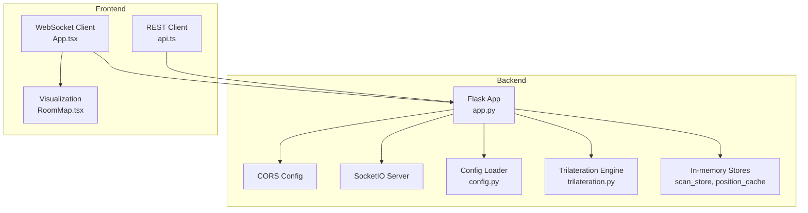
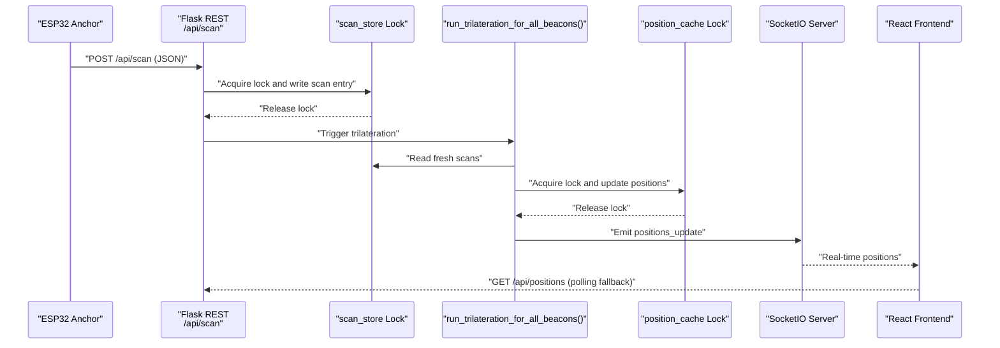
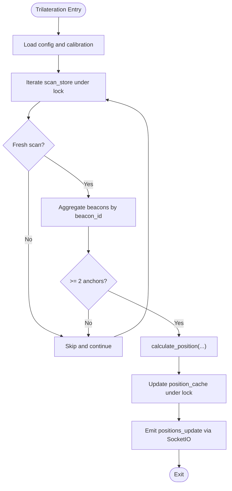
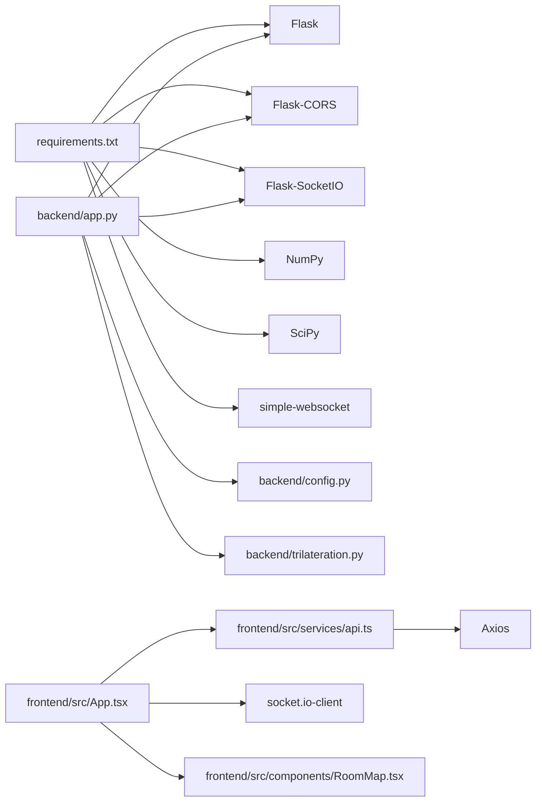

# Flask Application

<cite>
**Referenced Files in This Document**
- [app.py](file://backend/app.py)
- [config.py](file://backend/config.py)
- [config.json](file://backend/config.json)
- [trilateration.py](file://backend/trilateration.py)
- [requirements.txt](file://backend/requirements.txt)
- [api.ts](file://frontend/src/services/api.ts)
- [App.tsx](file://frontend/src/App.tsx)
- [RoomMap.tsx](file://frontend/src/components/RoomMap.tsx)
</cite>

## Table of Contents
1. [Introduction](#introduction)
2. [Project Structure](#project-structure)
3. [Core Components](#core-components)
4. [Architecture Overview](#architecture-overview)
5. [Detailed Component Analysis](#detailed-component-analysis)
6. [Dependency Analysis](#dependency-analysis)
7. [Performance Considerations](#performance-considerations)
8. [Troubleshooting Guide](#troubleshooting-guide)
9. [Conclusion](#conclusion)
10. [Appendices](#appendices)

## Introduction
This document explains the Flask application initialization and configuration for a BLE Room Positioning System. It covers application setup (CORS, SocketIO), threading models for concurrent data processing, in-memory data stores with thread safety, health checks and monitoring, startup and configuration loading, environment handling, error handling strategies, and production deployment considerations. Practical examples and diagrams illustrate how the backend integrates with the React frontend via REST and WebSocket.

## Project Structure
The system consists of:
- Backend (Python Flask):
  - Application entrypoint and routing
  - Configuration loader/saver
  - Trilateration engine
  - Real-time updates via SocketIO
- Frontend (React + TypeScript):
  - REST service wrappers
  - WebSocket client for live updates
  - Visualization of anchors and beacon positions

**Diagram sources**
- [app.py:23-25](file://backend/app.py#L23-L25)
- [app.py:30-36](file://backend/app.py#L30-L36)
- [app.py:48-105](file://backend/app.py#L48-L105)
- [config.py:44-57](file://backend/config.py#L44-L57)
- [trilateration.py:155-218](file://backend/trilateration.py#L155-L218)
- [api.ts:1-66](file://frontend/src/services/api.ts#L1-L66)
- [App.tsx:140-172](file://frontend/src/App.tsx#L140-L172)
- [RoomMap.tsx:28-229](file://frontend/src/components/RoomMap.tsx#L28-L229)

**Section sources**
- [app.py:23-25](file://backend/app.py#L23-L25)
- [config.py:44-57](file://backend/config.py#L44-L57)
- [trilateration.py:155-218](file://backend/trilateration.py#L155-L218)
- [api.ts:1-66](file://frontend/src/services/api.ts#L1-L66)
- [App.tsx:140-172](file://frontend/src/App.tsx#L140-L172)
- [RoomMap.tsx:28-229](file://frontend/src/components/RoomMap.tsx#L28-L229)

## Core Components
- Flask application instance and CORS configuration
- SocketIO server for real-time updates
- In-memory data stores:
  - scan_store: raw scan data keyed by anchor_id
  - position_cache: trilateration results keyed by beacon_id
- Thread-safe access using locks
- REST endpoints for health, scanning, positions, anchors, calibration, and configuration
- WebSocket event handlers for connections and position requests
- Configuration loader/saver for room, anchors, calibration, and filters
- Trilateration pipeline converting RSSI to distances and estimating positions

**Section sources**
- [app.py:23-25](file://backend/app.py#L23-L25)
- [app.py:30-36](file://backend/app.py#L30-L36)
- [app.py:112-183](file://backend/app.py#L112-L183)
- [app.py:354-377](file://backend/app.py#L354-L377)
- [config.py:44-95](file://backend/config.py#L44-L95)
- [trilateration.py:11-218](file://backend/trilateration.py#L11-L218)

## Architecture Overview
The backend initializes Flask, enables CORS, and creates a SocketIO server. It loads configuration from a JSON file and exposes REST endpoints. Incoming BLE scan data is stored in an in-memory dictionary protected by a lock. A periodic or triggered trilateration process computes positions, updates the position cache, and emits real-time updates via WebSocket. The frontend connects via REST and WebSocket to render live positions and anchor status.

**Diagram sources**
- [app.py:123-171](file://backend/app.py#L123-L171)
- [app.py:48-105](file://backend/app.py#L48-L105)
- [app.py:354-377](file://backend/app.py#L354-L377)
- [App.tsx:139-172](file://frontend/src/App.tsx#L139-L172)

## Detailed Component Analysis

### Flask Initialization and Configuration
- Application creation and CORS:
  - Flask app instance is created and CORS is enabled globally.
  - SocketIO is initialized with wildcard origin support.
- Environment and startup:
  - On entry, configuration is loaded and printed to console.
  - SocketIO server runs on host 0.0.0.0, port 5000, with debug enabled and unsafe Werkzeug allowed.

Practical example references:
- [app.py:23-25](file://backend/app.py#L23-L25)
- [app.py:383-397](file://backend/app.py#L383-L397)

**Section sources**
- [app.py:23-25](file://backend/app.py#L23-L25)
- [app.py:383-397](file://backend/app.py#L383-L397)

### SocketIO Integration
- Events:
  - connect: sends current positions to newly connected clients.
  - request_positions: recalculates positions and emits updates.
- Real-time emission:
  - After trilateration, positions_update is emitted with timestamped data.

Practical example references:
- [app.py:354-377](file://backend/app.py#L354-L377)
- [App.tsx:140-172](file://frontend/src/App.tsx#L140-L172)

**Section sources**
- [app.py:354-377](file://backend/app.py#L354-L377)
- [App.tsx:140-172](file://frontend/src/App.tsx#L140-L172)

### Threading Models and Concurrency
- In-memory stores:
  - scan_store: anchor_id -> scan entry
  - position_cache: beacon_id -> position result
- Thread safety:
  - scan_store_lock protects reads/writes to scan_store during scan ingestion and trilateration.
  - position_cache_lock protects reads/writes to position_cache during updates and emits.
- Freshness checks:
  - is_scan_fresh compares received_at timestamps against TTL to filter stale scans.

Practical example references:
- [app.py:30-36](file://backend/app.py#L30-L36)
- [app.py:39-46](file://backend/app.py#L39-L46)
- [app.py:59-63](file://backend/app.py#L59-L63)
- [app.py:95-97](file://backend/app.py#L95-L97)

**Diagram sources**
- [app.py:48-105](file://backend/app.py#L48-L105)
- [trilateration.py:155-218](file://backend/trilateration.py#L155-L218)

**Section sources**
- [app.py:30-36](file://backend/app.py#L30-L36)
- [app.py:39-46](file://backend/app.py#L39-L46)
- [app.py:59-63](file://backend/app.py#L59-L63)
- [app.py:95-97](file://backend/app.py#L95-L97)
- [app.py:48-105](file://backend/app.py#L48-L105)

### In-Memory Data Stores and Thread Safety
- scan_store:
  - Stores latest scan entries per anchor with anchor_pos, timestamp, received_at, calibration_mode, and beacons.
  - Protected by scan_store_lock during ingestion and filtering.
- position_cache:
  - Stores latest trilateration results per beacon.
  - Protected by position_cache_lock during updates and reads.
- TTL-based freshness:
  - is_scan_fresh uses server time to determine whether a scan is within TTL.

Practical example references:
- [app.py:147-156](file://backend/app.py#L147-L156)
- [app.py:176-177](file://backend/app.py#L176-L177)
- [app.py:201-206](file://backend/app.py#L201-L206)
- [app.py:263-274](file://backend/app.py#L263-L274)

**Section sources**
- [app.py:147-156](file://backend/app.py#L147-L156)
- [app.py:176-177](file://backend/app.py#L176-L177)
- [app.py:201-206](file://backend/app.py#L201-L206)
- [app.py:263-274](file://backend/app.py#L263-L274)

### Health Check Endpoint and Monitoring
- /api/health:
  - Returns status, uptime seconds, number of anchors reporting, and number of beacons tracked.
- Frontend monitoring:
  - Header displays connection status and health metrics.
  - Periodic polling fallback ensures visibility even if WebSocket disconnects.

Practical example references:
- [app.py:112-120](file://backend/app.py#L112-L120)
- [App.tsx:192-201](file://frontend/src/App.tsx#L192-L201)
- [App.tsx:125-137](file://frontend/src/App.tsx#L125-L137)

**Section sources**
- [app.py:112-120](file://backend/app.py#L112-L120)
- [App.tsx:192-201](file://frontend/src/App.tsx#L192-L201)
- [App.tsx:125-137](file://frontend/src/App.tsx#L125-L137)

### Application Startup and Configuration Loading
- Startup:
  - Prints room dimensions, anchor count, and calibration parameters.
  - Runs SocketIO server bound to 0.0.0.0:5000 with debug enabled.
- Configuration:
  - Loads config.json; if missing, writes defaults.
  - Provides helpers to update anchors and calibration parameters.

Practical example references:
- [app.py:388-397](file://backend/app.py#L388-L397)
- [config.py:44-57](file://backend/config.py#L44-L57)
- [config.json:1-30](file://backend/config.json#L1-L30)

**Section sources**
- [app.py:388-397](file://backend/app.py#L388-L397)
- [config.py:44-57](file://backend/config.py#L44-L57)
- [config.json:1-30](file://backend/config.json#L1-L30)

### REST Endpoints and WebSocket Events
- REST endpoints:
  - /api/scan: ingest scan data and trigger trilateration.
  - /api/positions: retrieve cached positions.
  - /api/anchors: GET current anchors and status; PUT to update positions.
  - /api/scan-data: retrieve fresh scan data.
  - /api/calibrate: GET/POST calibration parameters.
  - /api/config: GET/PUT full configuration.
  - /api/health: health status.
- WebSocket events:
  - connect: send current positions.
  - request_positions: recalculate and emit positions.

Practical example references:
- [app.py:123-171](file://backend/app.py#L123-L171)
- [app.py:173-183](file://backend/app.py#L173-L183)
- [app.py:186-222](file://backend/app.py#L186-L222)
- [app.py:256-279](file://backend/app.py#L256-L279)
- [app.py:282-332](file://backend/app.py#L282-L332)
- [app.py:334-347](file://backend/app.py#L334-L347)
- [app.py:112-120](file://backend/app.py#L112-L120)
- [app.py:354-377](file://backend/app.py#L354-L377)

**Section sources**
- [app.py:123-171](file://backend/app.py#L123-L171)
- [app.py:173-183](file://backend/app.py#L173-L183)
- [app.py:186-222](file://backend/app.py#L186-L222)
- [app.py:256-279](file://backend/app.py#L256-L279)
- [app.py:282-332](file://backend/app.py#L282-L332)
- [app.py:334-347](file://backend/app.py#L334-L347)
- [app.py:112-120](file://backend/app.py#L112-L120)
- [app.py:354-377](file://backend/app.py#L354-L377)

### Trilateration Pipeline
- RSSI-to-distance conversion using log-distance path loss model.
- Outlier filtering using median absolute deviation.
- Least-squares trilateration with robust error estimation.
- Aggregation across anchors per beacon and caching results.

Practical example references:
- [trilateration.py:11-33](file://backend/trilateration.py#L11-L33)
- [trilateration.py:35-67](file://backend/trilateration.py#L35-L67)
- [trilateration.py:69-153](file://backend/trilateration.py#L69-L153)
- [trilateration.py:155-218](file://backend/trilateration.py#L155-L218)

**Section sources**
- [trilateration.py:11-33](file://backend/trilateration.py#L11-L33)
- [trilateration.py:35-67](file://backend/trilateration.py#L35-L67)
- [trilateration.py:69-153](file://backend/trilateration.py#L69-L153)
- [trilateration.py:155-218](file://backend/trilateration.py#L155-L218)

### Frontend Integration
- REST client:
  - Axios-based service wrappers for positions, anchors, scan data, calibration, health, and config.
- WebSocket client:
  - socket.io-client connects to backend, listens for positions_update, and handles errors.
  - Falls back to periodic polling when WebSocket is disconnected.
- Visualization:
  - RoomMap renders anchors and beacon positions with uncertainty circles and labels.

Practical example references:
- [api.ts:1-66](file://frontend/src/services/api.ts#L1-L66)
- [App.tsx:140-172](file://frontend/src/App.tsx#L140-L172)
- [App.tsx:125-137](file://frontend/src/App.tsx#L125-L137)
- [RoomMap.tsx:28-229](file://frontend/src/components/RoomMap.tsx#L28-L229)

**Section sources**
- [api.ts:1-66](file://frontend/src/services/api.ts#L1-L66)
- [App.tsx:140-172](file://frontend/src/App.tsx#L140-L172)
- [App.tsx:125-137](file://frontend/src/App.tsx#L125-L137)
- [RoomMap.tsx:28-229](file://frontend/src/components/RoomMap.tsx#L28-L229)

## Dependency Analysis
External dependencies include Flask, Flask-CORS, Flask-SocketIO, NumPy, SciPy, and simple-websocket. The backend depends on the trilateration module and configuration loader. The frontend depends on socket.io-client and Axios.

**Diagram sources**
- [requirements.txt:1-7](file://backend/requirements.txt#L1-L7)
- [app.py:9-21](file://backend/app.py#L9-L21)
- [config.py:6-9](file://backend/config.py#L6-L9)
- [trilateration.py:6-8](file://backend/trilateration.py#L6-L8)
- [api.ts:1](file://frontend/src/services/api.ts#L1)
- [App.tsx:2](file://frontend/src/App.tsx#L2)

**Section sources**
- [requirements.txt:1-7](file://backend/requirements.txt#L1-L7)
- [app.py:9-21](file://backend/app.py#L9-L21)
- [config.py:6-9](file://backend/config.py#L6-L9)
- [trilateration.py:6-8](file://backend/trilateration.py#L6-L8)
- [api.ts:1](file://frontend/src/services/api.ts#L1)
- [App.tsx:2](file://frontend/src/App.tsx#L2)

## Performance Considerations
- Data structures:
  - scan_store and position_cache are dictionaries keyed by identifiers; lookups are O(1) average.
- Concurrency:
  - Locks minimize contention; keep critical sections small and avoid heavy computation inside locked regions.
- Trilateration cost:
  - Least-squares optimization scales with number of anchors and beacons; consider beacon filters to reduce workload.
- Memory management:
  - Freshness TTL prevents unbounded growth of scan_store; consider eviction policies if needed.
- Network:
  - SocketIO reduces latency compared to polling; fallback polling is handled in the frontend.
- Scalability:
  - Single-threaded Flask development server is suitable for small deployments; production requires a WSGI server and horizontal scaling considerations.

[No sources needed since this section provides general guidance]

## Troubleshooting Guide
- CORS issues:
  - Verify Flask-CORS is enabled and origins match frontend URL.
- SocketIO connectivity:
  - Check backend logs for connection/disconnection events and errors; ensure frontend URL matches backend host/port.
- Health endpoint:
  - Confirm /api/health responds with expected fields and counts.
- Configuration persistence:
  - Ensure config.json exists and is writable; defaults are written if missing.
- Trilateration failures:
  - Inspect returned error messages and anchor details; verify calibration parameters and beacon filters.

**Section sources**
- [app.py:24](file://backend/app.py#L24)
- [app.py:354-377](file://backend/app.py#L354-L377)
- [app.py:112-120](file://backend/app.py#L112-L120)
- [config.py:44-57](file://backend/config.py#L44-L57)
- [trilateration.py:145-152](file://backend/trilateration.py#L145-L152)

## Conclusion
The Flask application provides a cohesive backend for BLE positioning with real-time updates via SocketIO, robust configuration management, and thread-safe in-memory stores. The frontend integrates seamlessly through REST and WebSocket, offering live visualization and monitoring. For production, deploy behind a WSGI server, secure CORS, and monitor resource usage while tuning calibration parameters and beacon filters for optimal performance.

[No sources needed since this section summarizes without analyzing specific files]

## Appendices

### Practical Examples

- Application initialization and startup:
  - Initialize Flask, enable CORS, create SocketIO server, load configuration, and run server.
  - References: [app.py:23-25](file://backend/app.py#L23-L25), [app.py:388-397](file://backend/app.py#L388-L397)

- Ingesting scan data and triggering trilateration:
  - POST scan data to /api/scan; backend stores scan under lock, triggers trilateration, and emits updates.
  - References: [app.py:123-171](file://backend/app.py#L123-L171), [app.py:48-105](file://backend/app.py#L48-L105)

- Real-time position updates:
  - Connect via WebSocket; listen for positions_update; fallback to polling if disconnected.
  - References: [app.py:354-377](file://backend/app.py#L354-L377), [App.tsx:140-172](file://frontend/src/App.tsx#L140-L172)

- Updating calibration parameters:
  - POST to /api/calibrate with allowed keys; backend persists and recalculates positions.
  - References: [app.py:282-332](file://backend/app.py#L282-L332), [config.py:89-95](file://backend/config.py#L89-L95)

- Retrieving positions and anchors:
  - GET /api/positions and /api/anchors; frontend polls when WebSocket is unavailable.
  - References: [app.py:173-183](file://backend/app.py#L173-L183), [app.py:186-222](file://backend/app.py#L186-L222), [App.tsx:125-137](file://frontend/src/App.tsx#L125-L137)

### Production Deployment Considerations
- Server:
  - Replace Flask dev server with a production WSGI server (e.g., gunicorn/uWSGI) and reverse proxy (e.g., nginx).
- Security:
  - Restrict CORS origins, enable HTTPS, and validate incoming payloads.
- Scaling:
  - Use multiple workers/processes; consider Redis or database for shared state and horizontal scaling.
- Observability:
  - Add structured logging, metrics, and health checks; monitor CPU/memory and network throughput.

[No sources needed since this section provides general guidance]