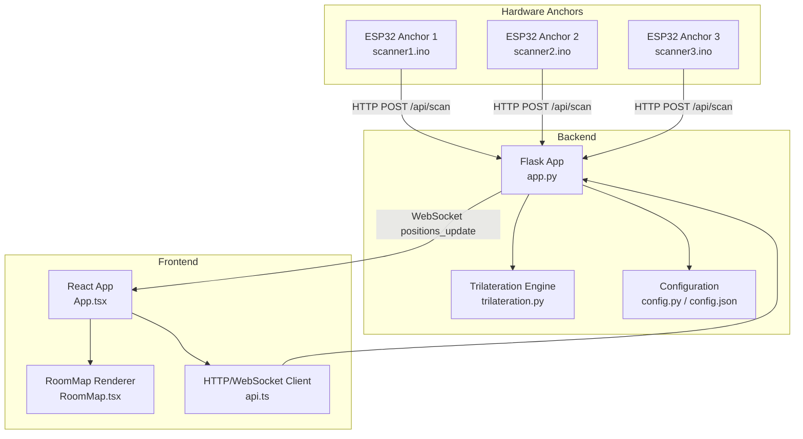
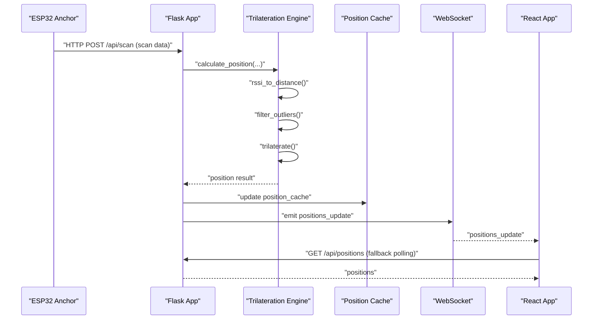
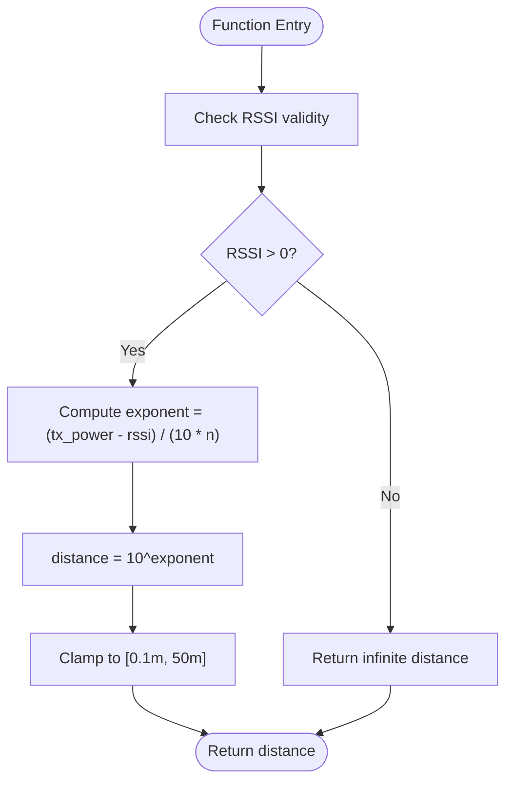
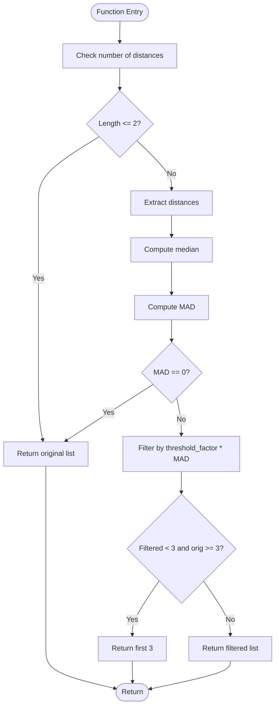
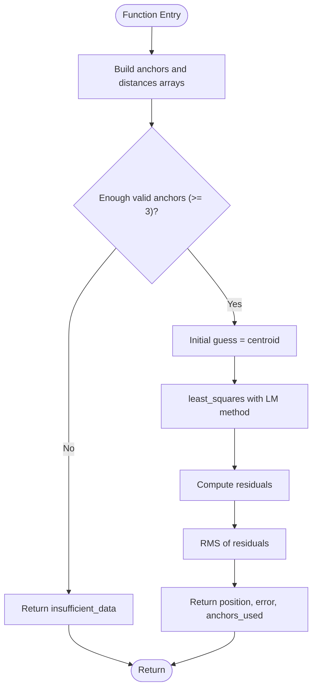
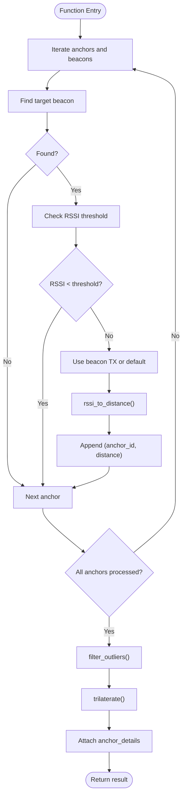
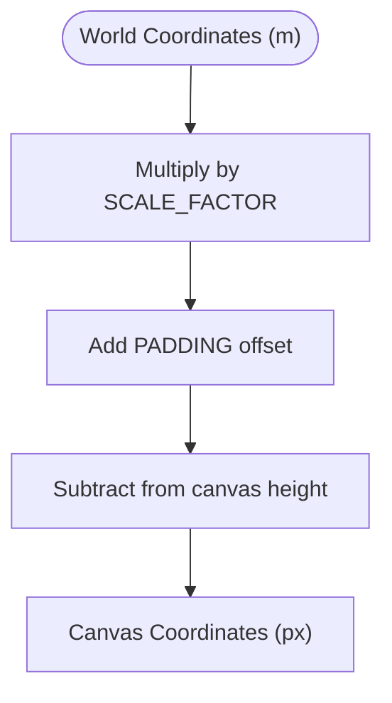
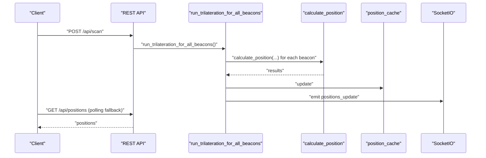
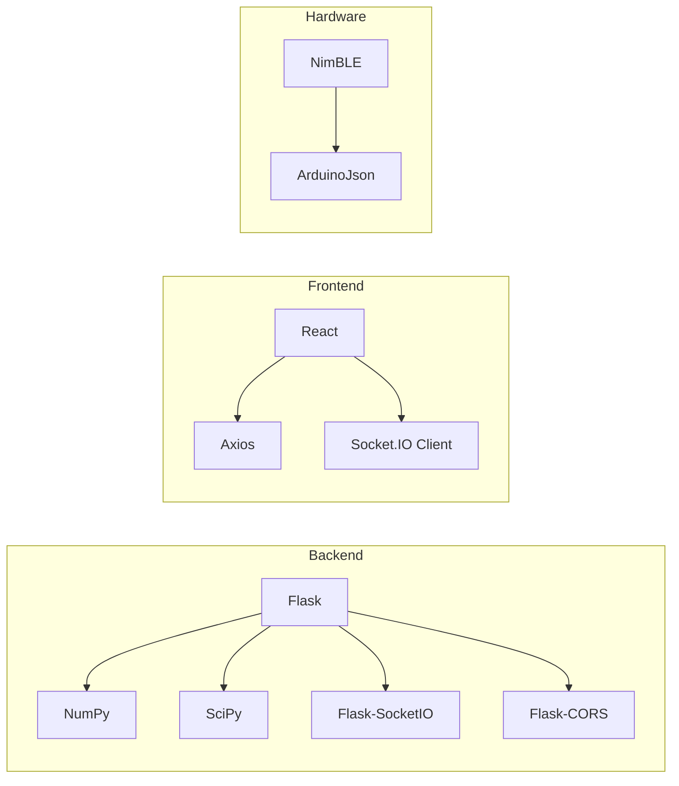

# Trilateration Engine

<cite>
**Referenced Files in This Document**
- [trilateration.py](file://backend/trilateration.py)
- [app.py](file://backend/app.py)
- [config.py](file://backend/config.py)
- [config.json](file://backend/config.json)
- [RoomMap.tsx](file://frontend/src/components/RoomMap.tsx)
- [App.tsx](file://frontend/src/App.tsx)
- [api.ts](file://frontend/src/services/api.ts)
- [scanner1.ino](file://scanner1/scanner1.ino)
- [scanner2.ino](file://scanner2/scanner2.ino)
- [scanner3.ino](file://scanner3/scanner3.ino)
- [requirements.txt](file://backend/requirements.txt)
- [package.json](file://frontend/package.json)
</cite>

## Table of Contents
1. [Introduction](#introduction)
2. [Project Structure](#project-structure)
3. [Core Components](#core-components)
4. [Architecture Overview](#architecture-overview)
5. [Detailed Component Analysis](#detailed-component-analysis)
6. [Dependency Analysis](#dependency-analysis)
7. [Performance Considerations](#performance-considerations)
8. [Troubleshooting Guide](#troubleshooting-guide)
9. [Conclusion](#conclusion)
10. [Appendices](#appendices)

## Introduction
This document explains the trilateration engine that converts BLE RSSI measurements from multiple anchors into 2D position estimates. It covers the mathematical algorithms (RSSI-to-distance conversion using the log-distance path loss model, outlier detection via median absolute deviation, and least-squares optimization), the multi-anchor triangulation process, coordinate system transformations, and error estimation. It also documents the signal processing pipeline, integration with the main application flow, and real-time position calculation triggers. Practical examples of algorithm parameters, thresholds, and performance optimization techniques are included, along with guidance for addressing common positioning challenges such as multipath interference, anchor placement, and environmental effects.

## Project Structure
The system comprises:
- Backend Python service exposing REST APIs and WebSocket events, orchestrating trilateration and publishing real-time updates.
- Frontend React application consuming REST and WebSocket feeds to render live positions and anchor status.
- ESP32-based anchors broadcasting BLE scan results to the backend.

**Diagram sources**
- [app.py:147-194](file://backend/app.py#L147-L194)
- [trilateration.py:155-217](file://backend/trilateration.py#L155-L217)
- [config.py:44-95](file://backend/config.py#L44-L95)
- [App.tsx:143-175](file://frontend/src/App.tsx#L143-L175)
- [RoomMap.tsx:28-229](file://frontend/src/components/RoomMap.tsx#L28-L229)
- [scanner1.ino:146-203](file://scanner1/scanner1.ino#L146-L203)
- [scanner2.ino:146-203](file://scanner2/scanner2.ino#L146-L203)
- [scanner3.ino:146-203](file://scanner3/scanner3.ino#L146-L203)

**Section sources**
- [app.py:147-194](file://backend/app.py#L147-L194)
- [trilateration.py:155-217](file://backend/trilateration.py#L155-L217)
- [config.py:44-95](file://backend/config.py#L44-L95)
- [App.tsx:143-175](file://frontend/src/App.tsx#L143-L175)
- [RoomMap.tsx:28-229](file://frontend/src/components/RoomMap.tsx#L28-L229)
- [scanner1.ino:146-203](file://scanner1/scanner1.ino#L146-L203)
- [scanner2.ino:146-203](file://scanner2/scanner2.ino#L146-L203)
- [scanner3.ino:146-203](file://scanner3/scanner3.ino#L146-L203)

## Core Components
- RSSI-to-distance conversion using the log-distance path loss model.
- Outlier detection using median absolute deviation (MAD) with a configurable threshold factor.
- Least-squares trilateration using scipy.optimize.least_squares with Levenberg–Marquardt.
- Multi-anchor triangulation pipeline: RSSI averaging, distance estimation, outlier filtering, and position calculation.
- Real-time orchestration: periodic or event-driven trilateration triggered by incoming scan data.
- Coordinate system transformation from world meters to canvas pixels for rendering.

**Section sources**
- [trilateration.py:11-32](file://backend/trilateration.py#L11-L32)
- [trilateration.py:35-66](file://backend/trilateration.py#L35-L66)
- [trilateration.py:69-152](file://backend/trilateration.py#L69-L152)
- [trilateration.py:155-217](file://backend/trilateration.py#L155-L217)
- [RoomMap.tsx:34-40](file://frontend/src/components/RoomMap.tsx#L34-L40)

## Architecture Overview
The backend receives BLE scan data from anchors, applies RSSI-to-distance conversion, filters outliers, runs least-squares trilateration, caches results, and emits real-time updates via WebSocket. The frontend polls or subscribes to updates and renders positions with uncertainty circles.

**Diagram sources**
- [app.py:147-194](file://backend/app.py#L147-L194)
- [app.py:48-114](file://backend/app.py#L48-L114)
- [trilateration.py:155-217](file://backend/trilateration.py#L155-L217)

## Detailed Component Analysis

### RSSI-to-Distance Conversion (Log-Distance Path Loss Model)
- Converts RSSI (dBm) to estimated distance (meters) using the formula derived from the log-distance path loss model.
- Handles invalid RSSI values (non-negative or zero) by returning infinite distance.
- Applies a clamping range to avoid extreme outliers.
- Uses configurable TX power and path loss exponent per beacon or default calibration.

**Diagram sources**
- [trilateration.py:11-32](file://backend/trilateration.py#L11-L32)

**Section sources**
- [trilateration.py:11-32](file://backend/trilateration.py#L11-L32)
- [config.py:34-41](file://backend/config.py#L34-L41)
- [config.json:23-28](file://backend/config.json#L23-L28)

### Outlier Detection and Filtering (MAD-based)
- Filters distance measurements using median absolute deviation against the median.
- Retains measurements within a threshold factor of MAD from the median.
- Ensures at least three anchors are kept when possible; otherwise falls back to keeping the first three.

**Diagram sources**
- [trilateration.py:35-66](file://backend/trilateration.py#L35-L66)

**Section sources**
- [trilateration.py:35-66](file://backend/trilateration.py#L35-L66)

### Least-Squares Trilateration (Levenberg–Marquardt)
- Builds arrays of anchor positions and measured distances.
- Defines residuals as differences between Euclidean distance from candidate point to anchor and measured distance.
- Initializes guess at centroid of anchor positions.
- Solves using scipy.optimize.least_squares with Levenberg–Marquardt method and a maximum iteration limit.
- Computes RMS residual as position error estimate.

**Diagram sources**
- [trilateration.py:69-152](file://backend/trilateration.py#L69-L152)

**Section sources**
- [trilateration.py:69-152](file://backend/trilateration.py#L69-L152)

### Multi-Anchor Triangulation Pipeline
- Aggregates scan data across anchors, filters by beacon filters and RSSI threshold, computes distances, filters outliers, and runs trilateration.
- Adds anchor details (RSSI, TX power, estimated distance) to the result for diagnostics.

**Diagram sources**
- [trilateration.py:155-217](file://backend/trilateration.py#L155-L217)

**Section sources**
- [trilateration.py:155-217](file://backend/trilateration.py#L155-L217)

### Coordinate System Transformations
- World-to-pixel conversion for rendering: meters scaled by a fixed factor plus padding, with Y-axis flipped to match canvas convention.
- Uncertainty circles rendered using the computed error multiplied by the scale factor.

**Diagram sources**
- [RoomMap.tsx:34-40](file://frontend/src/components/RoomMap.tsx#L34-L40)

**Section sources**
- [RoomMap.tsx:34-40](file://frontend/src/components/RoomMap.tsx#L34-L40)

### Integration with Application Flow and Real-Time Updates
- Backend exposes endpoints for receiving scans, retrieving positions, anchors, calibration, and configuration.
- On each scan receipt, the backend runs trilateration for all beacons visible to at least three anchors, updates the position cache, and emits a WebSocket event.
- Frontend connects via WebSocket for real-time updates and falls back to polling when WebSocket is unavailable.

**Diagram sources**
- [app.py:147-194](file://backend/app.py#L147-L194)
- [app.py:48-114](file://backend/app.py#L48-L114)
- [App.tsx:143-175](file://frontend/src/App.tsx#L143-L175)

**Section sources**
- [app.py:147-194](file://backend/app.py#L147-L194)
- [app.py:48-114](file://backend/app.py#L48-L114)
- [App.tsx:143-175](file://frontend/src/App.tsx#L143-L175)

## Dependency Analysis
- Backend depends on Flask, Flask-CORS, Flask-SocketIO, NumPy, and SciPy.
- Frontend depends on Axios, React, React DOM, React Router, and Socket.IO client.
- Hardware anchors depend on NimBLE and ArduinoJson libraries.

**Diagram sources**
- [requirements.txt:1-7](file://backend/requirements.txt#L1-L7)
- [package.json:12-29](file://frontend/package.json#L12-L29)
- [scanner1.ino:14-16](file://scanner1/scanner1.ino#L14-L16)

**Section sources**
- [requirements.txt:1-7](file://backend/requirements.txt#L1-L7)
- [package.json:12-29](file://frontend/package.json#L12-L29)
- [scanner1.ino:14-16](file://scanner1/scanner1.ino#L14-L16)

## Performance Considerations
- RSSI-to-distance clamping prevents extreme outliers from skewing calculations.
- MAD-based outlier filtering reduces sensitivity to sporadic noisy measurements.
- Minimum RSSI threshold avoids processing weak signals that degrade accuracy.
- Least-squares solver uses Levenberg–Marquardt with a bounded iteration count to balance convergence speed and stability.
- Real-time updates via WebSocket minimize latency compared to frequent polling.
- Canvas rendering scales and flips coordinates efficiently for smooth UI updates.

[No sources needed since this section provides general guidance]

## Troubleshooting Guide
- System readiness: the system requires at least three anchors reporting fresh data; otherwise positions are not emitted.
- Anchor status: frontend displays online/offline anchors and last-seen timestamps; backend health endpoint reports anchors reporting vs total.
- Calibration parameters: path loss exponent, TX power, and RSSI threshold can be adjusted; recalculations are triggered automatically after updates.
- Beacon filters: restrict tracking to specific beacons by updating the configuration.

**Section sources**
- [app.py:121-144](file://backend/app.py#L121-L144)
- [app.py:210-245](file://backend/app.py#L210-L245)
- [app.py:306-344](file://backend/app.py#L306-L344)
- [App.tsx:213-222](file://frontend/src/App.tsx#L213-L222)

## Conclusion
The trilateration engine provides a robust, modular solution for BLE-based indoor positioning. By combining RSSI-to-distance conversion, MAD-based outlier filtering, and least-squares trilateration, it achieves reliable 2D localization with uncertainty quantification. The backend’s real-time orchestration and the frontend’s responsive rendering enable an intuitive dashboard experience. Proper anchor placement, calibration, and environment-aware tuning of thresholds and exponents are essential for maintaining accuracy under varying conditions.

[No sources needed since this section summarizes without analyzing specific files]

## Appendices

### Mathematical Formulas and Parameters
- Log-distance path loss model:
  - distance = 10^((tx_power − rssi) / (10 × n))
  - Parameters:
    - tx_power: TX power at 1 meter (dBm)
    - rssi: received signal strength indicator (dBm)
    - n: path loss exponent (indoor typical range: 2.7–3.5)
- Outlier detection:
  - Use median absolute deviation (MAD) with a threshold factor (default 2.0).
  - Keep measurements within threshold_factor × MAD of the median.
- Least-squares trilateration:
  - Minimize sum of squared residuals: Σ_i (||p − a_i|| − d_i)^2
  - Method: Levenberg–Marquardt
  - Initial guess: centroid of anchor positions
  - Error metric: RMS of residuals

**Section sources**
- [trilateration.py:11-32](file://backend/trilateration.py#L11-L32)
- [trilateration.py:35-66](file://backend/trilateration.py#L35-L66)
- [trilateration.py:69-152](file://backend/trilateration.py#L69-L152)

### Practical Parameter Settings and Tuning
- Typical defaults:
  - path_loss_exponent: 2.0 (free-space-like), tune to 2.7–3.5 for indoor environments
  - tx_power_dbm: -59 dBm (reference at 1 m)
  - min_rssi_threshold: -90 dBm
  - scan_ttl_seconds: 15 seconds
- Anchor placement tips:
  - Spread anchors to maximize geometric diversity; avoid collinearity.
  - Ensure line-of-sight where possible; elevate anchors to reduce multipath.
- Environmental considerations:
  - Multipath: reduce reflective surfaces near anchors; increase anchor separation.
  - Interference: monitor channel congestion; adjust scan intervals to balance throughput and noise.
  - Temperature/humidity: periodically recalibrate to account for hardware aging and environmental drift.

**Section sources**
- [config.py:34-41](file://backend/config.py#L34-L41)
- [config.json:23-28](file://backend/config.json#L23-L28)

### Real-Time Position Calculation Triggers
- Event-driven: each POST to /api/scan triggers immediate trilateration.
- Background orchestration: run_trilateration_for_all_beacons aggregates fresh scans and recalculates positions.
- WebSocket emission: positions_update broadcast to clients upon successful computation.

**Section sources**
- [app.py:147-194](file://backend/app.py#L147-L194)
- [app.py:48-114](file://backend/app.py#L48-L114)

### Frontend Rendering Notes
- Canvas coordinate transform: meters scaled by a fixed factor and padded; Y-axis inverted for screen coordinates.
- Uncertainty visualization: circles drawn with radius proportional to error × scale factor.
- Status indicators: system readiness, anchor online/offline, and beacon counts.

**Section sources**
- [RoomMap.tsx:34-40](file://frontend/src/components/RoomMap.tsx#L34-L40)
- [RoomMap.tsx:135-167](file://frontend/src/components/RoomMap.tsx#L135-L167)
- [App.tsx:213-222](file://frontend/src/App.tsx#L213-L222)