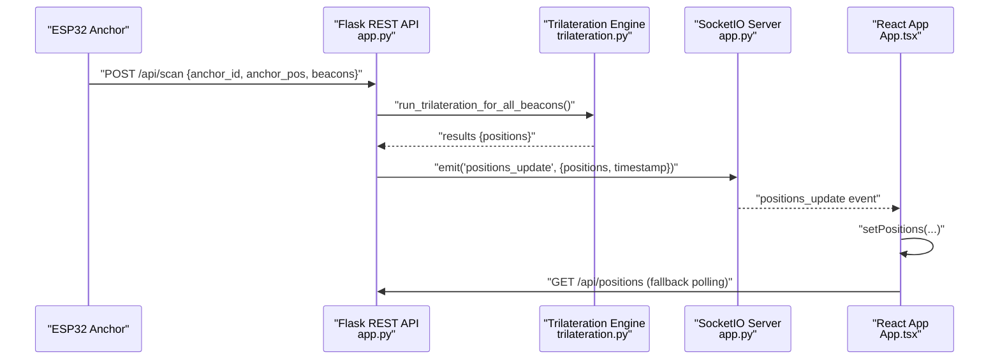
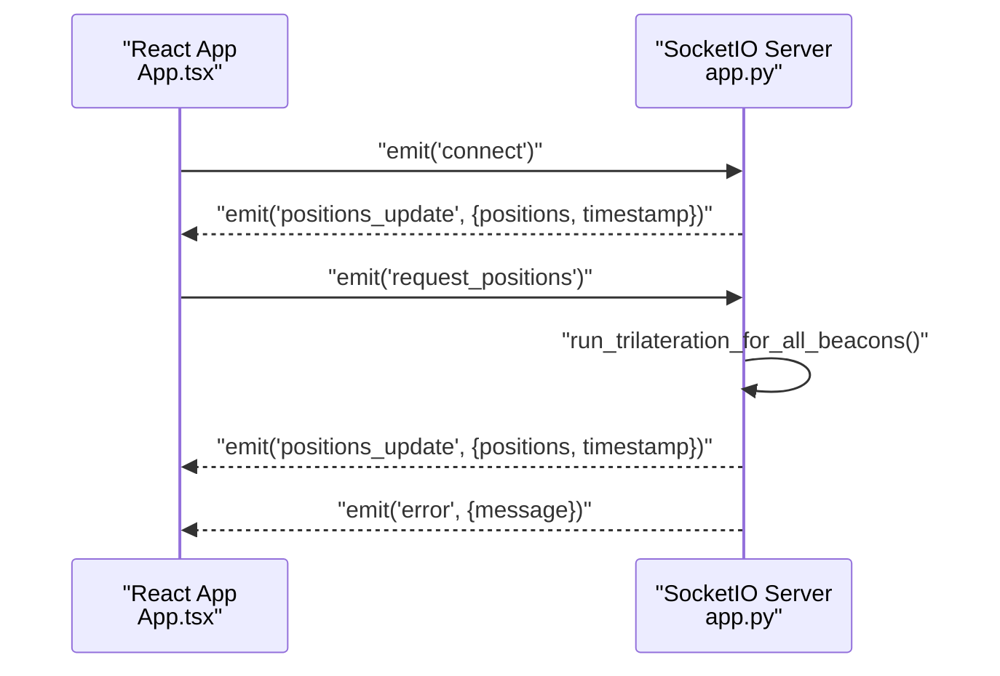
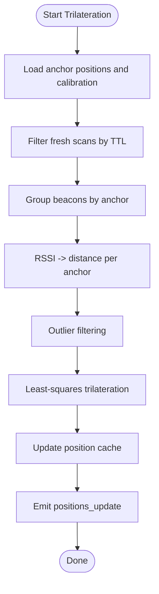
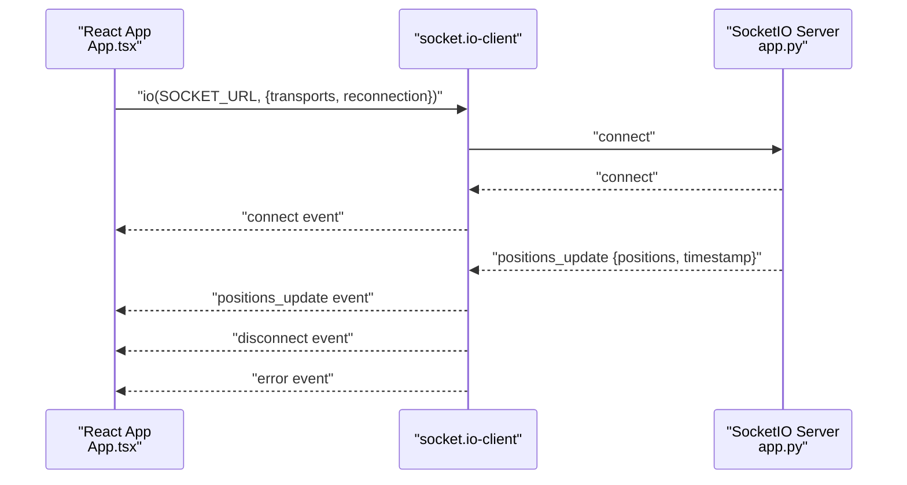
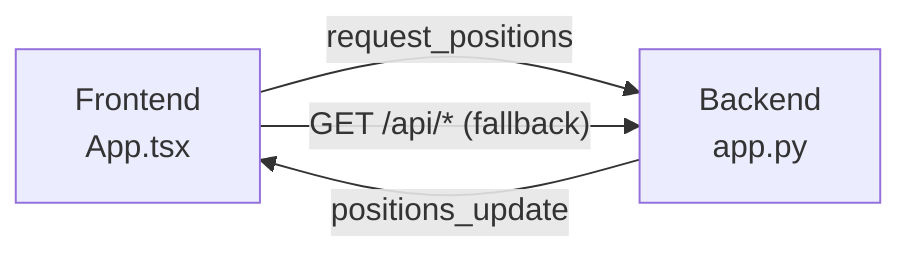
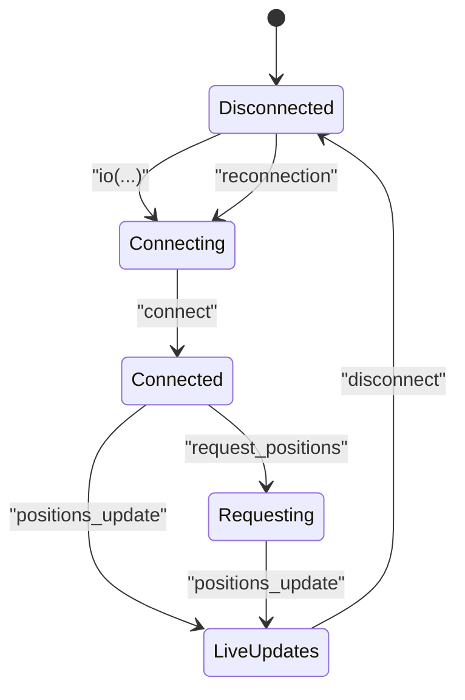
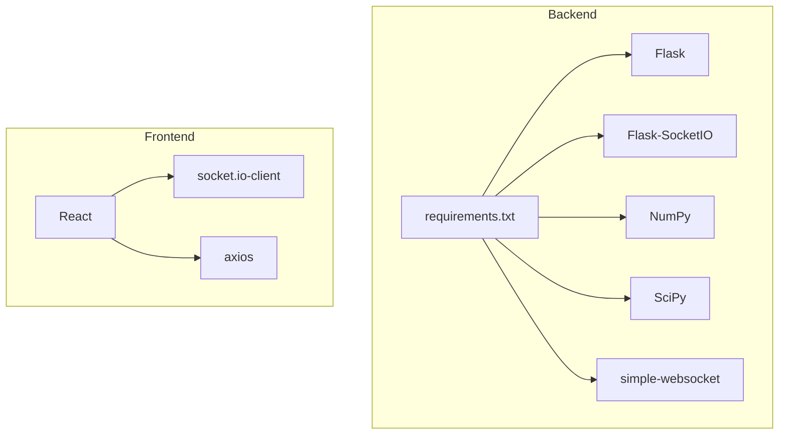

# WebSocket Integration

<cite>
**Referenced Files in This Document**
- [app.py](file://backend/app.py)
- [trilateration.py](file://backend/trilateration.py)
- [config.py](file://backend/config.py)
- [config.json](file://backend/config.json)
- [requirements.txt](file://backend/requirements.txt)
- [App.tsx](file://frontend/src/App.tsx)
- [api.ts](file://frontend/src/services/api.ts)
- [RoomMap.tsx](file://frontend/src/components/RoomMap.tsx)
- [AnchorPanel.tsx](file://frontend/src/components/AnchorPanel.tsx)
- [CalibrationForm.tsx](file://frontend/src/components/CalibrationForm.tsx)
</cite>

## Table of Contents
1. [Introduction](#introduction)
2. [Project Structure](#project-structure)
3. [Core Components](#core-components)
4. [Architecture Overview](#architecture-overview)
5. [Detailed Component Analysis](#detailed-component-analysis)
6. [Dependency Analysis](#dependency-analysis)
7. [Performance Considerations](#performance-considerations)
8. [Troubleshooting Guide](#troubleshooting-guide)
9. [Conclusion](#conclusion)
10. [Appendices](#appendices)

## Introduction
This document explains the WebSocket integration for real-time position updates in a BLE Room Positioning System built with Flask-SocketIO on the backend and React with socket.io-client on the frontend. It covers connection handling, event types, payload structures, bi-directional communication patterns, event-driven architecture for live updates, client subscription management, connection lifecycle, practical client implementation, error handling, fallback mechanisms, performance considerations, and integration with the trilateration engine.

## Project Structure
The system comprises:
- Backend: Flask application with Flask-SocketIO for real-time events, trilateration engine for position calculations, and REST endpoints for configuration and diagnostics.
- Frontend: React application using socket.io-client to subscribe to live updates and display positions on a room map.

```mermaid
graph TB
subgraph "Backend"
A["Flask App<br/>app.py"]
B["SocketIO Server<br/>app.py"]
C["Trilateration Engine<br/>trilateration.py"]
D["Config Loader<br/>config.py"]
E["REST API Endpoints<br/>app.py"]
end
subgraph "Frontend"
F["React App<br/>App.tsx"]
G["Socket.IO Client<br/>App.tsx"]
H["UI Components<br/>RoomMap.tsx, AnchorPanel.tsx"]
I["HTTP API Client<br/>api.ts"]
end
A --> B
A --> E
A --> C
A --> D
B <- --> G
F --> H
F --> I
G --> B
```

**Diagram sources**
- [app.py:23-25](file://backend/app.py#L23-L25)
- [app.py:354-377](file://backend/app.py#L354-L377)
- [trilateration.py:155-218](file://backend/trilateration.py#L155-L218)
- [config.py:44-57](file://backend/config.py#L44-L57)
- [App.tsx:139-172](file://frontend/src/App.tsx#L139-L172)
- [api.ts:1-66](file://frontend/src/services/api.ts#L1-L66)
- [RoomMap.tsx:28-229](file://frontend/src/components/RoomMap.tsx#L28-L229)
- [AnchorPanel.tsx:30-143](file://frontend/src/components/AnchorPanel.tsx#L30-L143)

**Section sources**
- [app.py:23-25](file://backend/app.py#L23-L25)
- [App.tsx:139-172](file://frontend/src/App.tsx#L139-L172)

## Core Components
- Backend Flask-SocketIO server:
  - Real-time event emission for live position updates.
  - Event handlers for client connect and manual position requests.
- Trilateration engine:
  - Converts RSSI to distance, filters outliers, and computes 2D positions.
- Frontend React app:
  - Establishes WebSocket connection, listens for events, and renders live positions.
  - Provides fallback polling to REST endpoints when WebSocket is unavailable.

Key WebSocket events:
- Client-to-server:
  - connect: handshake initiated by the client.
  - request_positions: explicit request for fresh positions.
- Server-to-client:
  - positions_update: broadcast of current positions and timestamp.
  - error: emitted on exceptions during position calculation.

Payload structures:
- positions_update:
  - positions: array of position objects with beacon_id, position, error, anchors_used, and optional anchor_details.
  - timestamp: server-side epoch milliseconds.
- error:
  - message: string describing the error encountered.

**Section sources**
- [app.py:354-377](file://backend/app.py#L354-L377)
- [app.py:99-103](file://backend/app.py#L99-L103)
- [trilateration.py:155-218](file://backend/trilateration.py#L155-L218)
- [App.tsx:157-167](file://frontend/src/App.tsx#L157-L167)

## Architecture Overview
The backend runs a Flask app with SocketIO enabled. Anchors (ESP32 devices) push BLE scan data via REST to the backend. The backend’s trilateration engine calculates positions and emits positions_update events over WebSocket. The frontend connects via socket.io-client, subscribes to positions_update, and updates the UI. Manual requests can trigger recalculation and immediate broadcast.



**Diagram sources**
- [app.py:123-171](file://backend/app.py#L123-L171)
- [app.py:48-105](file://backend/app.py#L48-L105)
- [trilateration.py:155-218](file://backend/trilateration.py#L155-L218)
- [app.py:99-103](file://backend/app.py#L99-L103)
- [App.tsx:157-167](file://frontend/src/App.tsx#L157-L167)

## Detailed Component Analysis

### Backend WebSocket Events and Handlers
- connect handler:
  - On client connect, sends positions_update with current cached positions and timestamp.
- request_positions handler:
  - Manually triggers trilateration and emits positions_update.
  - Emits error event on exceptions.



**Diagram sources**
- [app.py:354-377](file://backend/app.py#L354-L377)
- [app.py:48-105](file://backend/app.py#L48-L105)

**Section sources**
- [app.py:354-377](file://backend/app.py#L354-L377)

### Trilateration Engine Integration
- RSSI to distance conversion using log-distance path loss model.
- Outlier filtering using median absolute deviation.
- Least-squares trilateration to estimate 2D positions.
- Aggregates anchor details per beacon for diagnostics.



**Diagram sources**
- [app.py:48-105](file://backend/app.py#L48-L105)
- [trilateration.py:11-33](file://backend/trilateration.py#L11-L33)
- [trilateration.py:35-67](file://backend/trilateration.py#L35-L67)
- [trilateration.py:69-153](file://backend/trilateration.py#L69-L153)

**Section sources**
- [trilateration.py:11-33](file://backend/trilateration.py#L11-L33)
- [trilateration.py:35-67](file://backend/trilateration.py#L35-L67)
- [trilateration.py:69-153](file://backend/trilateration.py#L69-L153)

### Frontend WebSocket Client Implementation
- Establishes connection to backend with transports including WebSocket and polling, enabling reconnection.
- Subscribes to positions_update to render live positions.
- Handles connect/disconnect and error events.
- Uses fallback polling to REST endpoints when WebSocket is not connected.



**Diagram sources**
- [App.tsx:139-172](file://frontend/src/App.tsx#L139-L172)
- [app.py:354-377](file://backend/app.py#L354-L377)

**Section sources**
- [App.tsx:139-172](file://frontend/src/App.tsx#L139-L172)

### Bi-Directional Communication Patterns
- Unidirectional push: Backend emits positions_update to all subscribed clients.
- Unidirectional pull: Frontend polls REST endpoints as fallback when WebSocket is unavailable.
- Explicit request: Frontend can request fresh positions via request_positions.



**Diagram sources**
- [app.py:366-377](file://backend/app.py#L366-L377)
- [App.tsx:125-137](file://frontend/src/App.tsx#L125-L137)

**Section sources**
- [app.py:366-377](file://backend/app.py#L366-L377)
- [App.tsx:125-137](file://frontend/src/App.tsx#L125-L137)

### Connection Lifecycle and Subscription Management
- Connection lifecycle:
  - Connect: client establishes transport and receives initial positions_update.
  - Disconnect: client detects disconnection and switches to polling.
  - Reconnect: automatic reconnection attempts with delay.
- Subscription management:
  - Automatic subscription to positions_update upon connect.
  - Optional manual request via request_positions.



**Diagram sources**
- [App.tsx:139-172](file://frontend/src/App.tsx#L139-L172)
- [app.py:354-377](file://backend/app.py#L354-L377)

**Section sources**
- [App.tsx:139-172](file://frontend/src/App.tsx#L139-L172)
- [app.py:354-377](file://backend/app.py#L354-L377)

### Payload Structures
- positions_update:
  - positions: array of objects containing beacon_id, position, error, anchors_used, and optional anchor_details.
  - timestamp: server-side epoch milliseconds.
- error:
  - message: string describing the error.

**Section sources**
- [app.py:99-103](file://backend/app.py#L99-L103)
- [App.tsx:157-167](file://frontend/src/App.tsx#L157-L167)

### Practical Examples
- Backend:
  - Emitting positions_update after trilateration completes.
  - Handling connect and request_positions events.
- Frontend:
  - Creating a Socket instance with transports and reconnection options.
  - Listening for positions_update and updating state.
  - Falling back to REST polling when WebSocket is disconnected.

**Section sources**
- [app.py:99-103](file://backend/app.py#L99-L103)
- [app.py:354-377](file://backend/app.py#L354-L377)
- [App.tsx:139-172](file://frontend/src/App.tsx#L139-L172)

## Dependency Analysis
- Backend dependencies:
  - Flask, Flask-CORS, Flask-SocketIO, NumPy, SciPy, simple-websocket.
- Frontend dependencies:
  - socket.io-client, axios, React.



**Diagram sources**
- [requirements.txt:1-7](file://backend/requirements.txt#L1-L7)
- [App.tsx:1-2](file://frontend/src/App.tsx#L1-L2)

**Section sources**
- [requirements.txt:1-7](file://backend/requirements.txt#L1-L7)
- [App.tsx:1-2](file://frontend/src/App.tsx#L1-L2)

## Performance Considerations
- Real-time data streaming:
  - Emit only when trilateration produces new results to minimize traffic.
  - Use coarse TTL for scan freshness to balance responsiveness and stability.
- Connection pooling and scalability:
  - Use production-grade ASGI server (e.g., gunicorn with eventlet/gevent) behind reverse proxy for concurrency.
  - Enable sticky sessions if scaling horizontally to ensure reliable reconnection.
- Backend:
  - Keep position cache locked during updates to prevent race conditions.
  - Limit beacon_filters to reduce computation when needed.
- Frontend:
  - Debounce frequent manual requests to avoid flooding the server.
  - Use efficient rendering (e.g., memoization) for large datasets.

[No sources needed since this section provides general guidance]

## Troubleshooting Guide
- WebSocket disconnects:
  - Verify backend is reachable at the configured URL and port.
  - Check CORS configuration and allowed origins.
  - Inspect browser console for socket.io-client errors.
- No live updates:
  - Confirm anchors are sending scan data to /api/scan.
  - Ensure trilateration runs without exceptions and emits positions_update.
- Fallback polling:
  - When WebSocket is disconnected, the frontend continues polling REST endpoints.
  - Monitor network tab to confirm GET requests to /api/positions, /api/anchors, and /api/scan-data.

**Section sources**
- [App.tsx:125-137](file://frontend/src/App.tsx#L125-L137)
- [App.tsx:152-155](file://frontend/src/App.tsx#L152-L155)
- [app.py:366-377](file://backend/app.py#L366-L377)

## Conclusion
The system integrates Flask-SocketIO for real-time position updates and socket.io-client for responsive frontend consumption. The trilateration engine drives position calculations, emitting live updates to all clients. The frontend gracefully handles disconnections with fallback polling and provides a clean UI for monitoring anchors and positions. Proper deployment with production-grade servers and careful tuning of calibration parameters ensures robust, scalable operation.

[No sources needed since this section summarizes without analyzing specific files]

## Appendices

### Backend Configuration and Calibration
- Room dimensions and anchor positions are loaded from config.json and config.py.
- Calibration parameters influence RSSI-to-distance conversion and trilateration thresholds.

**Section sources**
- [config.json:1-30](file://backend/config.json#L1-L30)
- [config.py:44-95](file://backend/config.py#L44-L95)

### Frontend UI Components
- RoomMap renders anchors and beacon positions with uncertainty circles.
- AnchorPanel displays anchor status and detected beacons.
- CalibrationForm allows adjusting room dimensions, anchor positions, and signal calibration parameters.

**Section sources**
- [RoomMap.tsx:28-229](file://frontend/src/components/RoomMap.tsx#L28-L229)
- [AnchorPanel.tsx:30-143](file://frontend/src/components/AnchorPanel.tsx#L30-L143)
- [CalibrationForm.tsx:30-290](file://frontend/src/components/CalibrationForm.tsx#L30-L290)