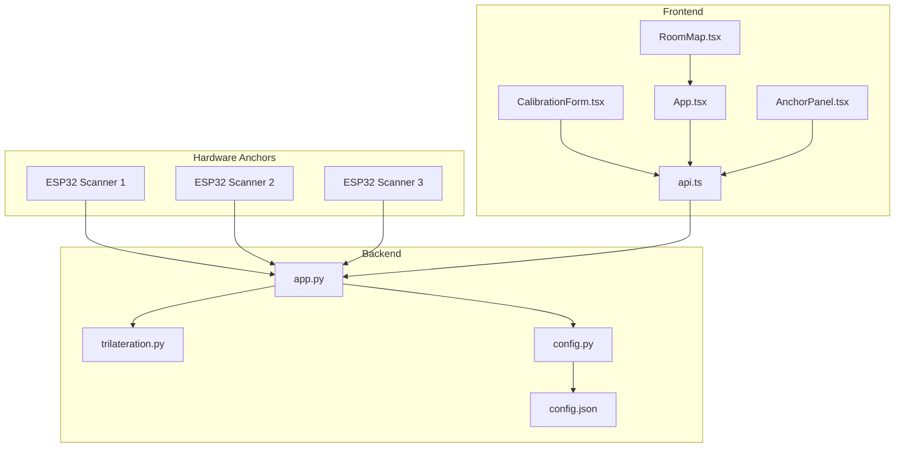
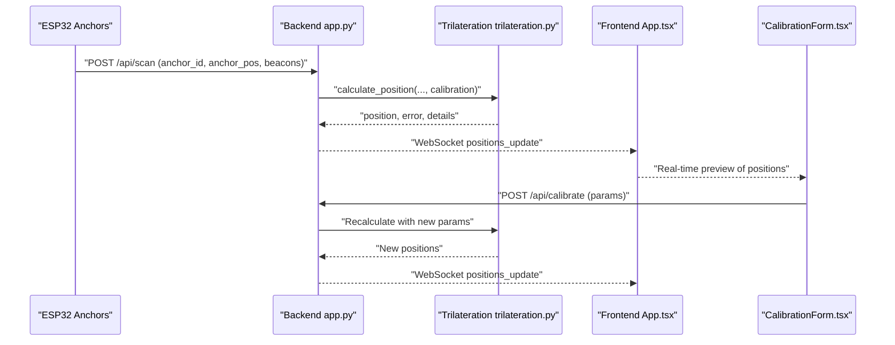
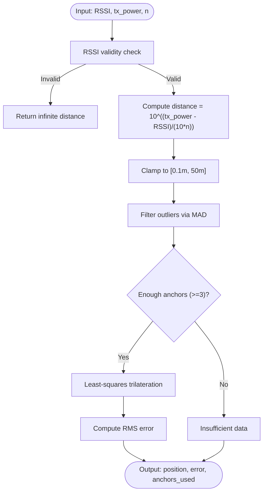
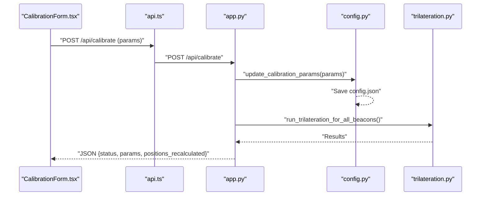
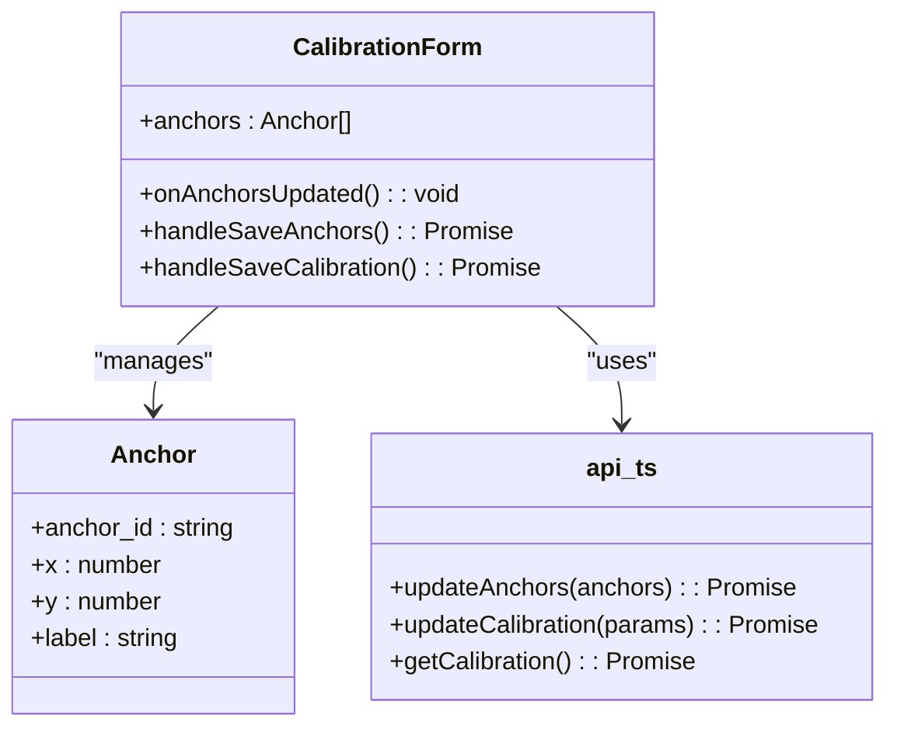
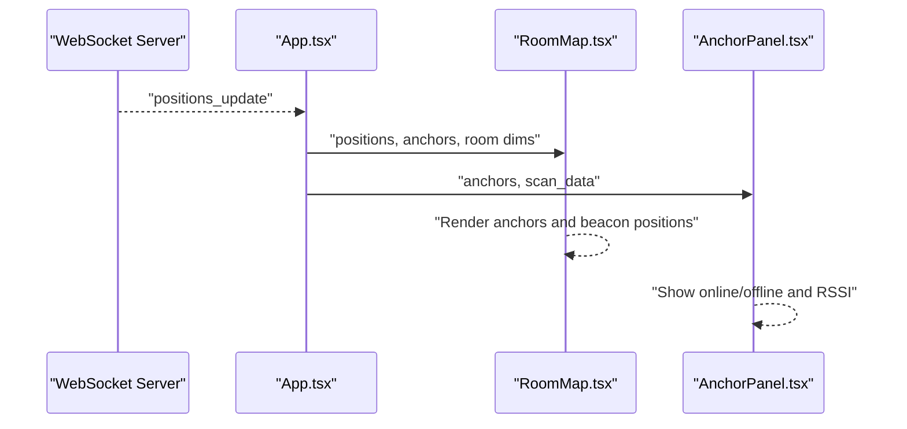
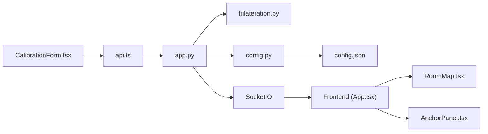

# Calibration Procedures

<cite>
**Referenced Files in This Document**
- [backend/app.py](file://backend/app.py)
- [backend/trilateration.py](file://backend/trilateration.py)
- [backend/config.py](file://backend/config.py)
- [backend/config.json](file://backend/config.json)
- [frontend/src/components/CalibrationForm.tsx](file://frontend/src/components/CalibrationForm.tsx)
- [frontend/src/services/api.ts](file://frontend/src/services/api.ts)
- [frontend/src/App.tsx](file://frontend/src/App.tsx)
- [frontend/src/components/RoomMap.tsx](file://frontend/src/components/RoomMap.tsx)
- [frontend/src/components/AnchorPanel.tsx](file://frontend/src/components/AnchorPanel.tsx)
</cite>

## Table of Contents
1. [Introduction](#introduction)
2. [Project Structure](#project-structure)
3. [Core Components](#core-components)
4. [Architecture Overview](#architecture-overview)
5. [Detailed Component Analysis](#detailed-component-analysis)
6. [Dependency Analysis](#dependency-analysis)
7. [Performance Considerations](#performance-considerations)
8. [Troubleshooting Guide](#troubleshooting-guide)
9. [Conclusion](#conclusion)
10. [Appendices](#appendices)

## Introduction
This document explains the end-to-end calibration procedures and parameter tuning for the BLE Room Positioning System. It covers:
- Mathematical foundations for RSSI-to-distance conversion and trilateration
- Calibration parameters: path loss exponent, TX power reference, RSSI threshold, and scan TTL
- Frontend calibration form, parameter validation, and real-time preview
- Step-by-step workflows, accuracy validation, and performance monitoring
- Environmental factors, optimization techniques, and troubleshooting

## Project Structure
The system comprises:
- Backend: Flask REST API and WebSocket server, trilateration engine, and persistent configuration
- Frontend: React dashboard with real-time visualization, calibration UI, and anchor status panel
- Hardware anchors: ESP32-based BLE scanners sending periodic scan reports

**Diagram sources**
- [frontend/src/components/CalibrationForm.tsx:1-290](file://frontend/src/components/CalibrationForm.tsx#L1-L290)
- [frontend/src/App.tsx:1-274](file://frontend/src/App.tsx#L1-L274)
- [frontend/src/components/RoomMap.tsx:1-229](file://frontend/src/components/RoomMap.tsx#L1-L229)
- [frontend/src/components/AnchorPanel.tsx:1-143](file://frontend/src/components/AnchorPanel.tsx#L1-L143)
- [frontend/src/services/api.ts:1-66](file://frontend/src/services/api.ts#L1-L66)
- [backend/app.py:1-398](file://backend/app.py#L1-L398)
- [backend/trilateration.py:1-218](file://backend/trilateration.py#L1-L218)
- [backend/config.py:1-95](file://backend/config.py#L1-L95)
- [backend/config.json:1-30](file://backend/config.json#L1-L30)

**Section sources**
- [backend/app.py:1-398](file://backend/app.py#L1-L398)
- [backend/trilateration.py:1-218](file://backend/trilateration.py#L1-L218)
- [backend/config.py:1-95](file://backend/config.py#L1-L95)
- [backend/config.json:1-30](file://backend/config.json#L1-L30)
- [frontend/src/components/CalibrationForm.tsx:1-290](file://frontend/src/components/CalibrationForm.tsx#L1-L290)
- [frontend/src/services/api.ts:1-66](file://frontend/src/services/api.ts#L1-L66)
- [frontend/src/App.tsx:1-274](file://frontend/src/App.tsx#L1-L274)
- [frontend/src/components/RoomMap.tsx:1-229](file://frontend/src/components/RoomMap.tsx#L1-L229)
- [frontend/src/components/AnchorPanel.tsx:1-143](file://frontend/src/components/AnchorPanel.tsx#L1-L143)

## Core Components
- Calibration parameters:
  - Path loss exponent (n): controls signal decay rate; typical indoor range 2.7–3.5, dense walls 3.5–5.0
  - TX power reference (tx_power_dbm): calibrated TX power at 1 meter; typical BLE beacon -59 to -65 dBm
  - RSSI threshold (min_rssi_threshold): minimum acceptable RSSI; default -90 dBm
  - Scan TTL (scan_ttl_seconds): freshness window for scan data; default 15 seconds
- Trilateration engine: converts RSSI to distance, filters outliers, and computes position via least-squares
- Frontend calibration form: validates inputs, persists parameters, triggers recalculation, and previews results

**Section sources**
- [backend/trilateration.py:11-33](file://backend/trilateration.py#L11-L33)
- [backend/trilateration.py:155-218](file://backend/trilateration.py#L155-L218)
- [backend/app.py:282-321](file://backend/app.py#L282-L321)
- [frontend/src/components/CalibrationForm.tsx:34-50](file://frontend/src/components/CalibrationForm.tsx#L34-L50)
- [backend/config.json:23-28](file://backend/config.json#L23-L28)

## Architecture Overview
End-to-end calibration flow:
- Hardware anchors transmit BLE scan data to the backend
- Backend stores fresh scans, runs trilateration, and emits real-time positions
- Frontend displays live positions and anchor status
- Users tune calibration parameters in the form and observe immediate recalculation

**Diagram sources**
- [backend/app.py:123-171](file://backend/app.py#L123-L171)
- [backend/app.py:282-321](file://backend/app.py#L282-L321)
- [backend/trilateration.py:155-218](file://backend/trilateration.py#L155-L218)
- [frontend/src/App.tsx:140-172](file://frontend/src/App.tsx#L140-L172)
- [frontend/src/components/CalibrationForm.tsx:89-100](file://frontend/src/components/CalibrationForm.tsx#L89-L100)

## Detailed Component Analysis

### Backend Trilateration Engine
The trilateration module converts RSSI to distance using the log-distance path loss model, filters outliers, and solves a least-squares trilateration problem to estimate position.

**Diagram sources**
- [backend/trilateration.py:11-33](file://backend/trilateration.py#L11-L33)
- [backend/trilateration.py:35-67](file://backend/trilateration.py#L35-L67)
- [backend/trilateration.py:69-153](file://backend/trilateration.py#L69-L153)
- [backend/trilateration.py:155-218](file://backend/trilateration.py#L155-L218)

**Section sources**
- [backend/trilateration.py:11-33](file://backend/trilateration.py#L11-L33)
- [backend/trilateration.py:35-67](file://backend/trilateration.py#L35-L67)
- [backend/trilateration.py:69-153](file://backend/trilateration.py#L69-L153)
- [backend/trilateration.py:155-218](file://backend/trilateration.py#L155-L218)

### Backend Calibration Endpoint and Parameter Persistence
The backend exposes endpoints to:
- Update calibration parameters
- Persist parameters to configuration
- Recalculate positions immediately upon change

Key behaviors:
- Accepts subset of parameters (path_loss_exponent, tx_power_dbm, min_rssi_threshold, scan_ttl_seconds)
- Validates presence of allowed keys
- Persists changes and triggers recalculation

**Diagram sources**
- [frontend/src/components/CalibrationForm.tsx:89-100](file://frontend/src/components/CalibrationForm.tsx#L89-L100)
- [frontend/src/services/api.ts:42-51](file://frontend/src/services/api.ts#L42-L51)
- [backend/app.py:282-321](file://backend/app.py#L282-L321)
- [backend/config.py:89-95](file://backend/config.py#L89-L95)
- [backend/app.py:48-106](file://backend/app.py#L48-L106)

**Section sources**
- [backend/app.py:282-321](file://backend/app.py#L282-L321)
- [backend/config.py:89-95](file://backend/config.py#L89-L95)
- [backend/app.py:48-106](file://backend/app.py#L48-L106)

### Frontend Calibration Form
The form provides:
- Real-time parameter editing with hints and bounds
- Immediate saving of anchor positions and calibration parameters
- Feedback messages and loading states
- Integrated calibration guide steps

Validation highlights:
- Path loss exponent: min 1.5, max 5.0
- TX power: integer step
- RSSI threshold: integer step
- Scan TTL: min 5, max 60

**Diagram sources**
- [frontend/src/components/CalibrationForm.tsx:30-100](file://frontend/src/components/CalibrationForm.tsx#L30-L100)
- [frontend/src/services/api.ts:24-51](file://frontend/src/services/api.ts#L24-L51)

**Section sources**
- [frontend/src/components/CalibrationForm.tsx:34-50](file://frontend/src/components/CalibrationForm.tsx#L34-L50)
- [frontend/src/components/CalibrationForm.tsx:180-256](file://frontend/src/components/CalibrationForm.tsx#L180-L256)
- [frontend/src/services/api.ts:24-51](file://frontend/src/services/api.ts#L24-L51)

### Real-Time Preview and Visualization
- WebSocket subscriptions deliver live positions to the frontend
- RoomMap renders anchors and beacon positions with uncertainty circles
- AnchorPanel displays anchor status, last-seen timestamps, and detected beacons

**Diagram sources**
- [frontend/src/App.tsx:140-172](file://frontend/src/App.tsx#L140-L172)
- [frontend/src/components/RoomMap.tsx:28-214](file://frontend/src/components/RoomMap.tsx#L28-L214)
- [frontend/src/components/AnchorPanel.tsx:30-134](file://frontend/src/components/AnchorPanel.tsx#L30-L134)

**Section sources**
- [frontend/src/App.tsx:140-172](file://frontend/src/App.tsx#L140-L172)
- [frontend/src/components/RoomMap.tsx:28-214](file://frontend/src/components/RoomMap.tsx#L28-L214)
- [frontend/src/components/AnchorPanel.tsx:30-134](file://frontend/src/components/AnchorPanel.tsx#L30-L134)

## Dependency Analysis
- Backend depends on:
  - Trilateration module for distance estimation and position computation
  - Configuration module for persistence and retrieval of calibration parameters
  - Flask and SocketIO for HTTP and WebSocket communication
- Frontend depends on:
  - Axios-based API client for REST calls
  - Socket.IO client for real-time updates
  - React components for rendering and interactivity

**Diagram sources**
- [frontend/src/components/CalibrationForm.tsx:1-290](file://frontend/src/components/CalibrationForm.tsx#L1-L290)
- [frontend/src/services/api.ts:1-66](file://frontend/src/services/api.ts#L1-L66)
- [backend/app.py:1-398](file://backend/app.py#L1-L398)
- [backend/trilateration.py:1-218](file://backend/trilateration.py#L1-L218)
- [backend/config.py:1-95](file://backend/config.py#L1-L95)
- [backend/config.json:1-30](file://backend/config.json#L1-L30)
- [frontend/src/App.tsx:1-274](file://frontend/src/App.tsx#L1-L274)
- [frontend/src/components/RoomMap.tsx:1-229](file://frontend/src/components/RoomMap.tsx#L1-L229)
- [frontend/src/components/AnchorPanel.tsx:1-143](file://frontend/src/components/AnchorPanel.tsx#L1-L143)

**Section sources**
- [backend/app.py:13-21](file://backend/app.py#L13-L21)
- [backend/config.py:44-57](file://backend/config.py#L44-L57)
- [frontend/src/services/api.ts:1-11](file://frontend/src/services/api.ts#L1-L11)
- [frontend/src/App.tsx:140-172](file://frontend/src/App.tsx#L140-L172)

## Performance Considerations
- Scan TTL affects responsiveness and stability:
  - Lower TTL reduces latency but increases sensitivity to network jitter
  - Higher TTL improves stability but delays detection of anchor failures
- Path loss exponent impacts distance estimation robustness:
  - Tuning n per environment improves accuracy; outdoor/free-space near 2.0; indoor 2.7–3.5; dense environments 3.5–5.0
- RSSI threshold prevents noise-induced errors:
  - Increase threshold in noisy environments; decrease cautiously to improve coverage
- TX power reference:
  - Calibrate per beacon; mismatch leads to proportional distance errors

[No sources needed since this section provides general guidance]

## Troubleshooting Guide
Common calibration issues and remedies:
- No positions computed:
  - Ensure at least 3 anchors report within TTL
  - Verify anchor positions are saved and correct
  - Confirm RSSI threshold is not too high to filter out all signals
- Drift or inconsistent positions:
  - Adjust path loss exponent to match environment
  - Recalibrate TX power reference per beacon
  - Reduce scan TTL to increase responsiveness
- Offline anchors:
  - Check network connectivity and anchor status
  - Confirm freshness window (TTL) and server clock synchronization
- Real-time preview not updating:
  - Verify WebSocket connection status
  - Refresh page and confirm backend is running

Operational checks:
- Use the calibration guide steps to validate accuracy at multiple reference points
- Monitor anchor status and beacon counts in the dashboard
- Inspect RSSI values and TX power entries in the anchor panel

**Section sources**
- [backend/app.py:39-46](file://backend/app.py#L39-L46)
- [backend/app.py:48-106](file://backend/app.py#L48-L106)
- [frontend/src/components/AnchorPanel.tsx:30-134](file://frontend/src/components/AnchorPanel.tsx#L30-L134)
- [frontend/src/App.tsx:140-172](file://frontend/src/App.tsx#L140-L172)

## Conclusion
The calibration system integrates precise mathematical modeling with an intuitive frontend interface. By tuning path loss exponent, TX power reference, RSSI threshold, and scan TTL, users can achieve robust localization across diverse environments. Real-time feedback and visualization enable rapid iteration and validation of calibration outcomes.

[No sources needed since this section summarizes without analyzing specific files]

## Appendices

### Mathematical Basis for Calibration Parameters
- RSSI-to-distance conversion:
  - Formula: distance = 10^((tx_power − RSSI)/(10·n))
  - Purpose: estimate propagation distance from received signal strength
- Trilateration:
  - Least-squares minimization of residual errors across anchor constraints
  - Robust error metric (RMS) quantifies positional uncertainty
- Outlier filtering:
  - Median Absolute Deviation (MAD) removes extreme distance estimates

**Section sources**
- [backend/trilateration.py:11-33](file://backend/trilateration.py#L11-L33)
- [backend/trilateration.py:69-153](file://backend/trilateration.py#L69-L153)
- [backend/trilateration.py:35-67](file://backend/trilateration.py#L35-L67)

### Step-by-Step Calibration Workflows
- Prepare anchors:
  - Place 3 ESP32 anchors at measured (x, y) coordinates
  - Save anchor positions via the calibration form
- Initial parameter setup:
  - Set path loss exponent to environment estimate (e.g., 2.7–3.5 for indoor)
  - Set TX power reference to beacon’s labeled 1m TX power
  - Set RSSI threshold to -90 dBm or higher if noisy
  - Set scan TTL to 15 seconds
- Validate and iterate:
  - Place a known reference beacon at a central point
  - Compare calculated position to reference; adjust n and tx_power until convergence
  - Test at 2–3 additional points to ensure uniform accuracy
- Monitor:
  - Observe real-time positions and uncertainty circles
  - Use anchor panel to confirm RSSI and TX power values

**Section sources**
- [frontend/src/components/CalibrationForm.tsx:269-284](file://frontend/src/components/CalibrationForm.tsx#L269-L284)
- [backend/app.py:282-321](file://backend/app.py#L282-L321)
- [backend/trilateration.py:155-218](file://backend/trilateration.py#L155-L218)

### Environmental Factors and Optimization Techniques
- Open spaces:
  - Use lower n (near 2.0) and moderate TTL
- Dense indoor environments:
  - Increase n (2.7–3.5) and consider higher RSSI threshold
- Mixed environments:
  - Use higher TTL to average noisy readings; refine n iteratively
- Beacon placement:
  - Ensure unobstructed line-of-sight where possible; avoid metal obstructions

**Section sources**
- [frontend/src/components/CalibrationForm.tsx:196-198](file://frontend/src/components/CalibrationForm.tsx#L196-L198)
- [backend/trilateration.py:11-33](file://backend/trilateration.py#L11-L33)

### Accuracy Validation and Performance Monitoring
- Validation:
  - Place beacons at known coordinates; compute mean error and standard deviation
  - Cross-check with multiple reference points
- Monitoring:
  - Track anchors reporting and beacons tracked via health endpoint
  - Observe real-time error metrics and uncertainty circles
  - Adjust parameters incrementally and re-validate

**Section sources**
- [backend/app.py:112-121](file://backend/app.py#L112-L121)
- [frontend/src/components/RoomMap.tsx:135-168](file://frontend/src/components/RoomMap.tsx#L135-L168)
- [frontend/src/App.tsx:196-201](file://frontend/src/App.tsx#L196-L201)