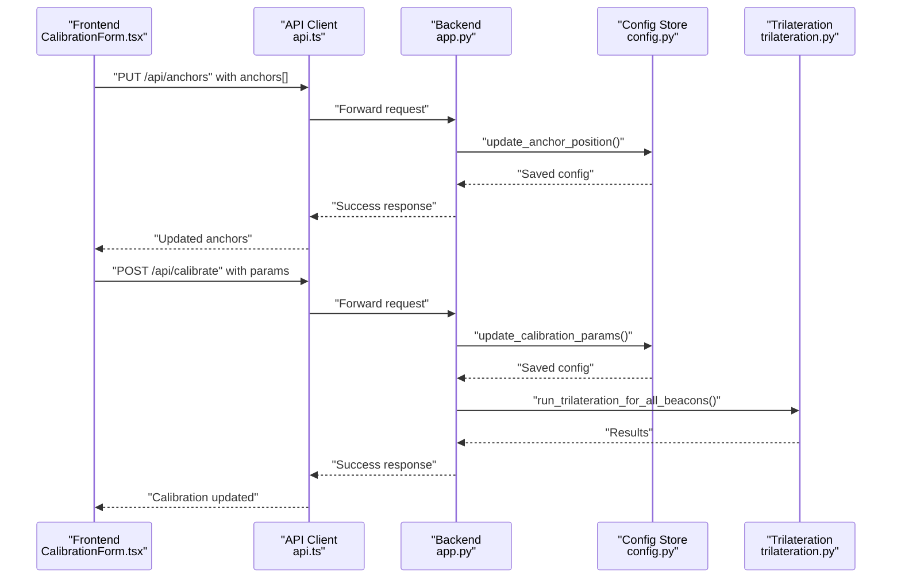
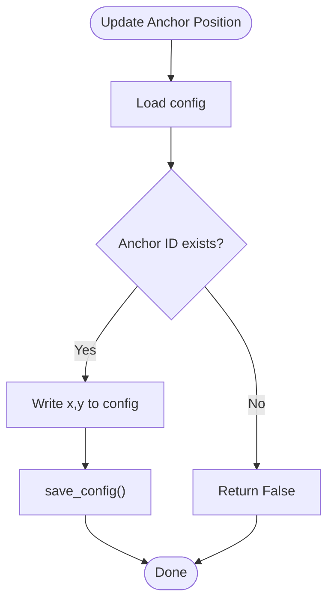
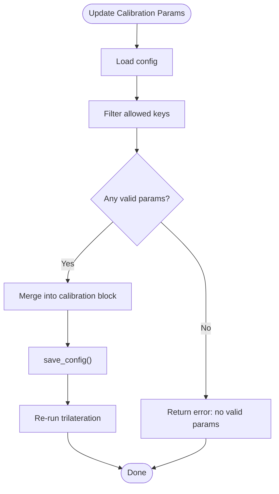
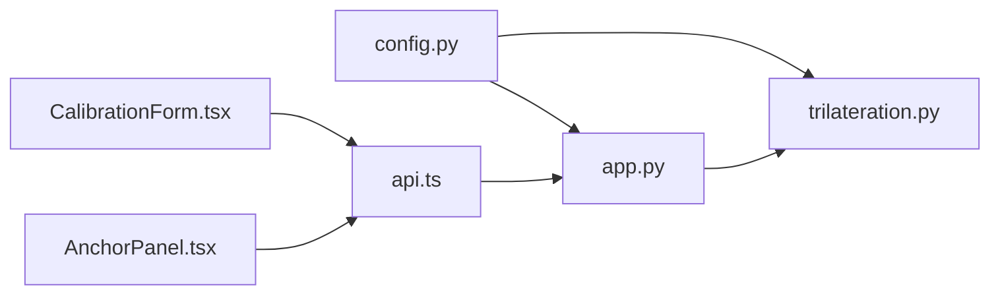

# Configuration Validation

<cite>
**Referenced Files in This Document**
- [config.py](file://backend/config.py)
- [config.json](file://backend/config.json)
- [app.py](file://backend/app.py)
- [trilateration.py](file://backend/trilateration.py)
- [CalibrationForm.tsx](file://frontend/src/components/CalibrationForm.tsx)
- [AnchorPanel.tsx](file://frontend/src/components/AnchorPanel.tsx)
- [api.ts](file://frontend/src/services/api.ts)
</cite>

## Table of Contents
1. [Introduction](#introduction)
2. [Project Structure](#project-structure)
3. [Core Components](#core-components)
4. [Architecture Overview](#architecture-overview)
5. [Detailed Component Analysis](#detailed-component-analysis)
6. [Dependency Analysis](#dependency-analysis)
7. [Performance Considerations](#performance-considerations)
8. [Troubleshooting Guide](#troubleshooting-guide)
9. [Conclusion](#conclusion)
10. [Appendices](#appendices)

## Introduction
This document explains configuration validation and parameter checking for the BLE Room Positioning System. It covers:
- Validation rules for room dimensions, anchor positions, calibration parameters, and beacon filters
- Configuration loading and validation lifecycle
- Error handling for invalid configurations and automatic fallback to defaults
- Validation functions: get_anchor_positions(), get_calibration_params(), and update operations
- Examples of valid and invalid configurations, common validation errors, and resolution strategies
- Integrity checks, bounds validation, and consistency verification
- Testing procedures, validation automation, and QA practices for configuration changes

## Project Structure
The configuration system spans backend Python modules and frontend React components:
- Backend configuration and validation logic resides in config.py and is consumed by app.py and trilateration.py
- Frontend components present forms and panels for editing and validating configuration parameters
- API service layer bridges frontend and backend endpoints

```mermaid
graph TB
subgraph "Backend"
CFG["config.py<br/>Default config, loader, getters, updaters"]
APP["app.py<br/>REST endpoints, trilateration runner"]
TRI["trilateration.py<br/>RSSI-to-distance, outlier filtering, trilateration"]
JSON["config.json<br/>Persisted configuration"]
end
subgraph "Frontend"
CF["CalibrationForm.tsx<br/>Edit anchors and calibration params"]
APIS["api.ts<br/>HTTP client to /api/*"]
ANP["AnchorPanel.tsx<br/>Display anchors and scan data"]
end
JSON <- --> CFG
CFG --> APP
APP --> TRI
CF --> APIS
APIS --> APP
ANP --> APIS
```

**Diagram sources**
- [config.py:1-95](file://backend/config.py#L1-L95)
- [app.py:1-398](file://backend/app.py#L1-L398)
- [trilateration.py:1-218](file://backend/trilateration.py#L1-L218)
- [config.json:1-30](file://backend/config.json#L1-L30)
- [CalibrationForm.tsx:1-290](file://frontend/src/components/CalibrationForm.tsx#L1-L290)
- [AnchorPanel.tsx:1-143](file://frontend/src/components/AnchorPanel.tsx#L1-L143)
- [api.ts:1-66](file://frontend/src/services/api.ts#L1-L66)

**Section sources**
- [config.py:1-95](file://backend/config.py#L1-L95)
- [app.py:1-398](file://backend/app.py#L1-L398)
- [trilateration.py:1-218](file://backend/trilateration.py#L1-L218)
- [config.json:1-30](file://backend/config.json#L1-L30)
- [CalibrationForm.tsx:1-290](file://frontend/src/components/CalibrationForm.tsx#L1-L290)
- [AnchorPanel.tsx:1-143](file://frontend/src/components/AnchorPanel.tsx#L1-L143)
- [api.ts:1-66](file://frontend/src/services/api.ts#L1-L66)

## Core Components
- Configuration loader and defaults: Loads persisted config.json or creates defaults and persists them
- Parameter getters: Extract anchor positions and calibration parameters
- Update operations: Endpoint-driven updates for anchors and calibration parameters
- Trilateration pipeline: Uses calibration parameters and anchor positions to compute positions

Key responsibilities:
- Enforce parameter bounds and sanity checks during runtime
- Provide fallbacks to default values when keys are missing
- Validate request payloads and respond with structured errors
- Persist validated updates to disk

**Section sources**
- [config.py:44-95](file://backend/config.py#L44-L95)
- [app.py:224-347](file://backend/app.py#L224-L347)
- [trilateration.py:11-33](file://backend/trilateration.py#L11-L33)

## Architecture Overview
The configuration validation architecture integrates frontend input, backend endpoints, and runtime parameter usage.



**Diagram sources**
- [CalibrationForm.tsx:75-100](file://frontend/src/components/CalibrationForm.tsx#L75-L100)
- [api.ts:24-51](file://frontend/src/services/api.ts#L24-L51)
- [app.py:224-321](file://backend/app.py#L224-L321)
- [config.py:77-95](file://backend/config.py#L77-L95)
- [trilateration.py:155-218](file://backend/trilateration.py#L155-L218)

## Detailed Component Analysis

### Configuration Loading and Defaults
- Default configuration includes room dimensions, anchor positions, calibration parameters, and beacon filters
- On startup, if config.json does not exist, defaults are written to disk and loaded
- Subsequent loads read from config.json

Validation and fallback behavior:
- Missing keys in config.json fall back to DEFAULT_CONFIG values
- get_calibration_params() returns defaults when calibration block is absent
- get_anchor_positions() returns empty dict if anchors block is absent; caller must ensure anchors exist

**Section sources**
- [config.py:11-51](file://backend/config.py#L11-L51)
- [config.py:60-74](file://backend/config.py#L60-L74)
- [config.json:1-30](file://backend/config.json#L1-L30)

### Anchor Position Validation and Updates
- get_anchor_positions(): Extracts (x, y) pairs keyed by anchor_id
- update_anchor_position(): Validates anchor_id presence and writes updated positions to config.json

Constraints and rules:
- Anchor coordinates are numeric; conversion to float occurs in the PUT handler
- No geometric constraints enforced (e.g., room bounds, uniqueness)
- Missing anchor_id results in no update and returns False

Common validation errors:
- anchor_id missing in config anchors
- Non-numeric x/y values passed to update endpoint

Resolution strategies:
- Ensure anchor_id exists in config.json
- Use numeric inputs for x and y



**Diagram sources**
- [config.py:77-86](file://backend/config.py#L77-L86)
- [app.py:242-248](file://backend/app.py#L242-L248)

**Section sources**
- [config.py:60-86](file://backend/config.py#L60-L86)
- [app.py:224-253](file://backend/app.py#L224-L253)

### Calibration Parameter Validation and Updates
- get_calibration_params(): Returns calibration block or defaults
- update_calibration_params(): Merges provided keys into calibration block and saves

Allowed keys and typical ranges:
- path_loss_exponent: free-space ~2.0; indoor typically 2.7–3.5; dense walls 3.5–5.0
- tx_power_dbm: typical BLE beacon -59 to -65 dBm
- min_rssi_threshold: default -90 dBm; signals below ignored
- scan_ttl_seconds: determines freshness window; frontend enforces 5–60 seconds

Validation performed by endpoints:
- Rejects empty payload
- Filters allowed keys only
- Requires at least one valid key

Runtime usage:
- rssi_to_distance() clamps computed distance to a safe range
- calculate_position() applies min_rssi_threshold and uses beacon-specific tx_power if present



**Diagram sources**
- [app.py:282-321](file://backend/app.py#L282-L321)
- [config.py:89-95](file://backend/config.py#L89-L95)
- [trilateration.py:11-33](file://backend/trilateration.py#L11-L33)

**Section sources**
- [app.py:282-331](file://backend/app.py#L282-L331)
- [config.py:70-74](file://backend/config.py#L70-L74)
- [trilateration.py:155-218](file://backend/trilateration.py#L155-L218)

### Beacon Filter List Validation
- beacon_filters: list of MAC addresses to track; empty list tracks all beacons
- Filtering logic: if beacon_filters is non-empty, only tracked beacons are processed

Validation:
- No enforcement of MAC format in backend; frontend can enforce format if desired
- Empty list is valid and implies no filtering

**Section sources**
- [config.json:29](file://backend/config.json#L29)
- [app.py:68-70](file://backend/app.py#L68-L70)

### Room Dimensions Validation
- Room width and height are stored under room.width_m and room.height_m
- Frontend disables editing of room dimensions; backend reads from config.json
- No explicit bounds validation in backend; downstream trilateration expects reasonable positive values

**Section sources**
- [config.json:2-5](file://backend/config.json#L2-L5)
- [CalibrationForm.tsx:107-135](file://frontend/src/components/CalibrationForm.tsx#L107-L135)

### Frontend Validation and User Experience
- CalibrationForm.tsx validates inputs with HTML5 number inputs and min/max attributes
- Provides hints and guidance for tuning parameters
- Displays success/error messages after save operations

**Section sources**
- [CalibrationForm.tsx:180-256](file://frontend/src/components/CalibrationForm.tsx#L180-L256)

## Dependency Analysis
Configuration dependencies and coupling:
- app.py depends on config.py for loading, saving, and retrieving parameters
- trilateration.py depends on calibration parameters for distance estimation
- Frontend components depend on API endpoints for configuration updates



**Diagram sources**
- [config.py:13-20](file://backend/config.py#L13-L20)
- [app.py:13-21](file://backend/app.py#L13-L21)
- [trilateration.py:155-164](file://backend/trilateration.py#L155-L164)
- [CalibrationForm.tsx:1-290](file://frontend/src/components/CalibrationForm.tsx#L1-L290)
- [AnchorPanel.tsx:1-143](file://frontend/src/components/AnchorPanel.tsx#L1-L143)
- [api.ts:1-66](file://frontend/src/services/api.ts#L1-L66)

**Section sources**
- [app.py:13-21](file://backend/app.py#L13-L21)
- [trilateration.py:155-164](file://backend/trilateration.py#L155-L164)
- [api.ts:1-66](file://frontend/src/services/api.ts#L1-L66)

## Performance Considerations
- Distance computation and outlier filtering occur per beacon per trilateration cycle
- Freshness checks prevent processing stale scan data
- Using defaults avoids repeated disk I/O for missing keys

[No sources needed since this section provides general guidance]

## Troubleshooting Guide

Common validation errors and resolutions:
- Missing anchor_id in PUT /api/anchors
  - Symptom: No update occurs; endpoint returns success but no changes saved
  - Resolution: Ensure anchor_id exists in config.json
  - Section sources
    - [app.py:242-248](file://backend/app.py#L242-L248)
    - [config.py:77-86](file://backend/config.py#L77-L86)

- Non-numeric x/y values
  - Symptom: Type conversion fails; endpoint returns error
  - Resolution: Use numeric values; frontend enforces number inputs
  - Section sources
    - [app.py:246-247](file://backend/app.py#L246-L247)
    - [CalibrationForm.tsx:69-73](file://frontend/src/components/CalibrationForm.tsx#L69-L73)

- Empty calibration payload or no valid keys
  - Symptom: Endpoint returns error indicating no valid calibration parameters
  - Resolution: Provide at least one allowed key
  - Section sources
    - [app.py:295-306](file://backend/app.py#L295-L306)

- RSSI below threshold
  - Symptom: Beacon reading ignored during position calculation
  - Resolution: Adjust min_rssi_threshold or improve signal strength
  - Section sources
    - [trilateration.py:190-191](file://backend/trilateration.py#L190-L191)

- Insufficient anchors for trilateration
  - Symptom: Position result indicates insufficient data
  - Resolution: Ensure at least 3 anchors detect the beacon
  - Section sources
    - [trilateration.py:94-101](file://backend/trilateration.py#L94-L101)

Automatic fallback behavior:
- Missing calibration keys fall back to defaults
- Missing anchors block yields empty positions; ensure anchors exist
- Section sources
  - [config.py:70-74](file://backend/config.py#L70-L74)
  - [config.py:60-67](file://backend/config.py#L60-L67)

## Conclusion
The configuration validation system combines explicit backend checks with sensible defaults and frontend input constraints. It ensures robust operation by:
- Persisting validated updates
- Providing fallbacks for missing keys
- Enforcing allowed parameter sets
- Applying runtime bounds and filtering

[No sources needed since this section summarizes without analyzing specific files]

## Appendices

### Validation Functions Reference
- get_anchor_positions(config=None)
  - Purpose: Extract anchor positions keyed by anchor_id
  - Behavior: Returns dict of (x, y) tuples; returns empty if anchors block missing
  - Section sources
    - [config.py:60-67](file://backend/config.py#L60-L67)

- get_calibration_params(config=None)
  - Purpose: Retrieve calibration parameters with fallback to defaults
  - Behavior: Returns calibration block or DEFAULT_CONFIG["calibration"]
  - Section sources
    - [config.py:70-74](file://backend/config.py#L70-L74)

- update_anchor_position(anchor_id, x, y, config=None)
  - Purpose: Persist updated anchor position
  - Behavior: Writes to config.json; returns success/failure based on anchor existence
  - Section sources
    - [config.py:77-86](file://backend/config.py#L77-L86)

- update_calibration_params(params, config=None)
  - Purpose: Persist updated calibration parameters
  - Behavior: Merges allowed keys into calibration block and saves
  - Section sources
    - [config.py:89-95](file://backend/config.py#L89-L95)

### Example Configurations

Valid configuration (subset):
- Room: width_m=10.0, height_m=8.0
- Anchors: scanner-01=(0.0,0.0), scanner-02=(10.0,0.0), scanner-03=(5.0,8.0)
- Calibration: path_loss_exponent=2.0, tx_power_dbm=-59, min_rssi_threshold=-90, scan_ttl_seconds=15
- Beacon filters: []

Invalid configuration scenarios:
- Missing anchors block: Trilateration will not produce positions for existing anchors
- Missing calibration block: Uses defaults; may require manual tuning
- Non-numeric x/y: Update endpoint rejects malformed values
- Empty calibration payload: Endpoint rejects request

[No sources needed since this section aggregates previously cited information]

### Quality Assurance and Testing Procedures
- Unit-level validation
  - Verify get_calibration_params() returns defaults when keys are missing
  - Verify update_anchor_position() writes to config.json and returns success/failure appropriately
- Integration-level validation
  - PUT /api/anchors with valid anchors updates positions and triggers re-trilateration
  - POST /api/calibrate with allowed keys updates parameters and recalculates positions
- Frontend validation
  - Use HTML5 number inputs with min/max constraints to prevent invalid values
  - Display success/error messages after save operations
- Automation ideas
  - Snapshot config.json before changes; restore after tests
  - Compare persisted config after updates to ensure correctness
  - Validate trilateration results converge to known reference points during calibration

[No sources needed since this section provides general guidance]