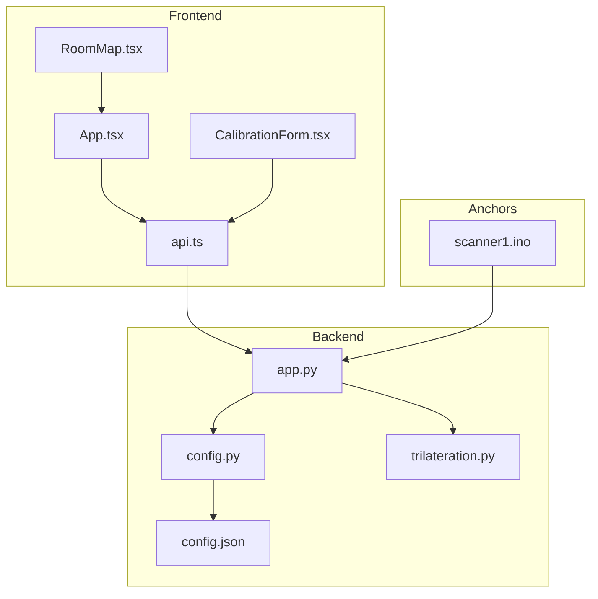
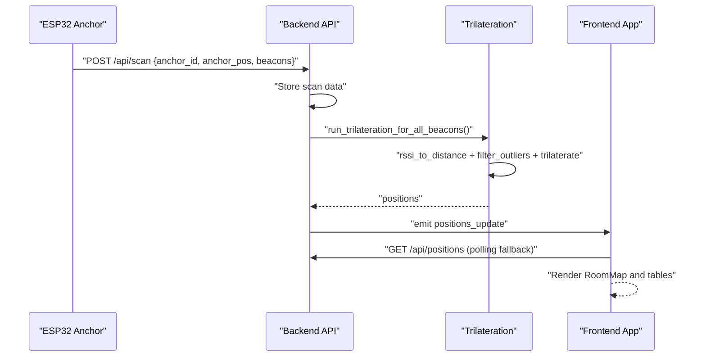
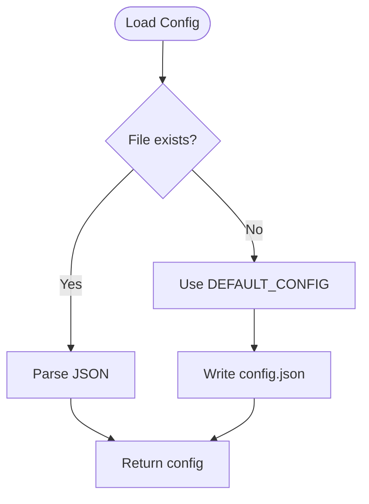
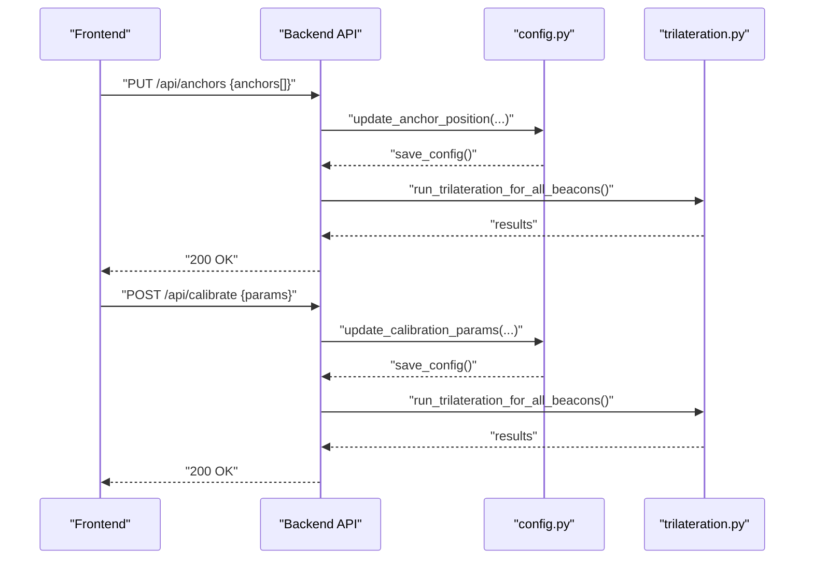
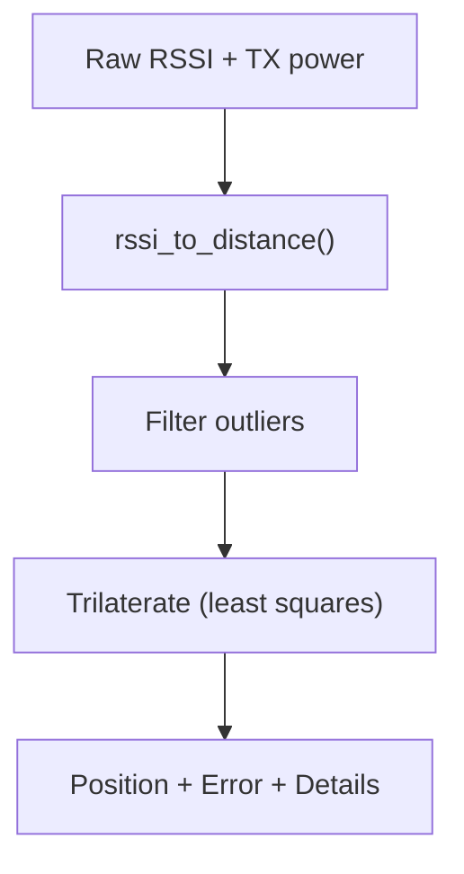
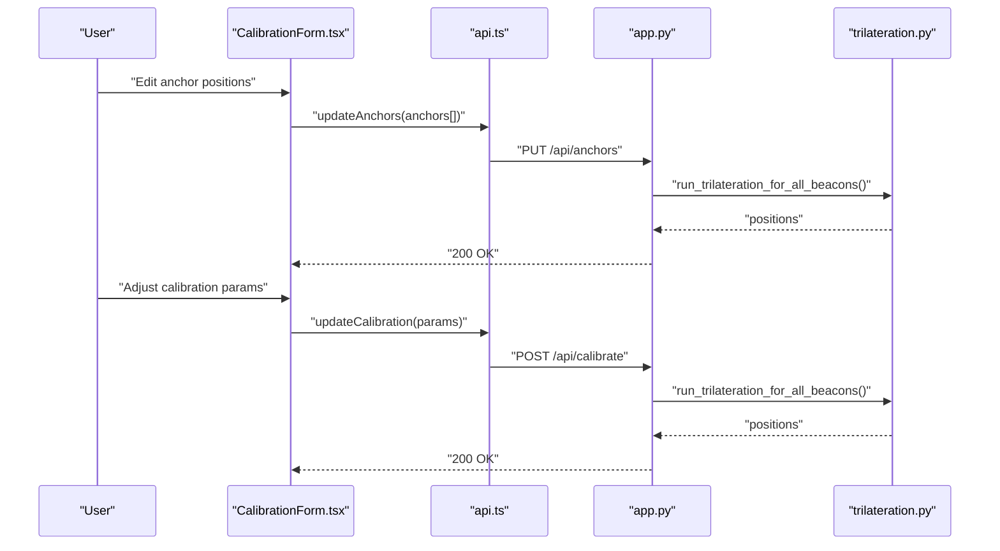
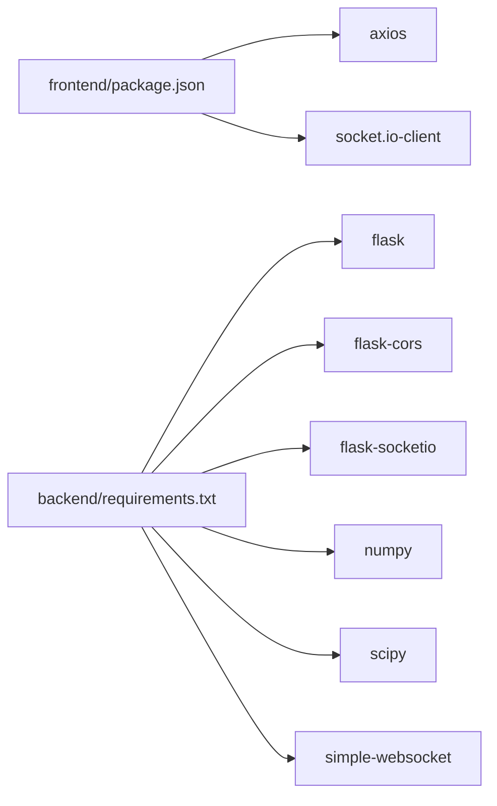

# Configuration and Calibration

<cite>
**Referenced Files in This Document**
- [config.py](file://backend/config.py)
- [config.json](file://backend/config.json)
- [app.py](file://backend/app.py)
- [trilateration.py](file://backend/trilateration.py)
- [api.ts](file://frontend/src/services/api.ts)
- [CalibrationForm.tsx](file://frontend/src/components/CalibrationForm.tsx)
- [App.tsx](file://frontend/src/App.tsx)
- [RoomMap.tsx](file://frontend/src/components/RoomMap.tsx)
- [requirements.txt](file://backend/requirements.txt)
- [package.json](file://frontend/package.json)
- [scanner1.ino](file://scanner1/scanner1.ino)
</cite>

## Table of Contents
1. [Introduction](#introduction)
2. [Project Structure](#project-structure)
3. [Core Components](#core-components)
4. [Architecture Overview](#architecture-overview)
5. [Detailed Component Analysis](#detailed-component-analysis)
6. [Dependency Analysis](#dependency-analysis)
7. [Performance Considerations](#performance-considerations)
8. [Troubleshooting Guide](#troubleshooting-guide)
9. [Conclusion](#conclusion)
10. [Appendices](#appendices)

## Introduction
This section documents the system configuration and calibration procedures for the BLE Room Positioning System. It covers the configuration file structure, validation and defaults, runtime updates, and the end-to-end calibration workflow. It also explains how the frontend presents calibration controls, validates parameters, and enables real-time preview of position updates. Practical examples and optimization techniques are included, along with guidance on persistence, backups, migrations, environmental adaptation, accuracy validation, and performance monitoring.

## Project Structure
The system comprises:
- Backend: Flask REST API with WebSocket support, configuration persistence, and trilateration engine
- Frontend: React SPA with real-time dashboard, calibration form, and room map visualization
- Anchors: ESP32-based scanners sending BLE scan data to the backend
- Configuration: JSON-based configuration stored on disk with defaults and runtime updates

**Diagram sources**
- [app.py:1-398](file://backend/app.py#L1-L398)
- [config.py:1-95](file://backend/config.py#L1-L95)
- [trilateration.py:1-218](file://backend/trilateration.py#L1-L218)
- [config.json:1-30](file://backend/config.json#L1-L30)
- [api.ts:1-66](file://frontend/src/services/api.ts#L1-L66)
- [CalibrationForm.tsx:1-290](file://frontend/src/components/CalibrationForm.tsx#L1-L290)
- [App.tsx:1-274](file://frontend/src/App.tsx#L1-L274)
- [RoomMap.tsx:1-229](file://frontend/src/components/RoomMap.tsx#L1-L229)
- [scanner1.ino:1-250](file://scanner1/scanner1.ino#L1-L250)

**Section sources**
- [app.py:1-398](file://backend/app.py#L1-L398)
- [config.py:1-95](file://backend/config.py#L1-L95)
- [trilateration.py:1-218](file://backend/trilateration.py#L1-L218)
- [config.json:1-30](file://backend/config.json#L1-L30)
- [api.ts:1-66](file://frontend/src/services/api.ts#L1-L66)
- [CalibrationForm.tsx:1-290](file://frontend/src/components/CalibrationForm.tsx#L1-L290)
- [App.tsx:1-274](file://frontend/src/App.tsx#L1-L274)
- [RoomMap.tsx:1-229](file://frontend/src/components/RoomMap.tsx#L1-L229)
- [scanner1.ino:1-250](file://scanner1/scanner1.ino#L1-L250)

## Core Components
- Configuration module: loads/saves JSON configuration, exposes getters for anchor positions and calibration parameters, and supports runtime updates
- Trilateration engine: converts RSSI to distance, filters outliers, and computes 2D positions
- Backend API: exposes endpoints for anchors, positions, scan data, calibration, and full config; runs periodic trilateration and emits real-time updates
- Frontend services: Axios-based API client for REST endpoints and Socket.IO for real-time updates
- Calibration form: collects room dimensions, anchor positions, and calibration parameters; persists changes and triggers recalculations
- Room map: renders anchors and beacon positions with uncertainty circles

Key responsibilities:
- Configuration persistence and defaults
- Real-time position computation and streaming
- Parameter validation and safe defaults
- Frontend UX for calibration and monitoring

**Section sources**
- [config.py:11-95](file://backend/config.py#L11-L95)
- [trilateration.py:11-218](file://backend/trilateration.py#L11-L218)
- [app.py:112-348](file://backend/app.py#L112-L348)
- [api.ts:12-66](file://frontend/src/services/api.ts#L12-L66)
- [CalibrationForm.tsx:30-290](file://frontend/src/components/CalibrationForm.tsx#L30-L290)
- [RoomMap.tsx:28-229](file://frontend/src/components/RoomMap.tsx#L28-L229)

## Architecture Overview
The system follows a client-server architecture:
- Anchors periodically send BLE scan data to the backend
- Backend stores scan data, applies calibration parameters, runs trilateration, and emits results via WebSocket
- Frontend polls or subscribes to real-time updates, displays positions, and allows configuration changes

**Diagram sources**
- [app.py:123-171](file://backend/app.py#L123-L171)
- [app.py:48-105](file://backend/app.py#L48-L105)
- [trilateration.py:155-218](file://backend/trilateration.py#L155-L218)
- [App.tsx:140-172](file://frontend/src/App.tsx#L140-L172)

## Detailed Component Analysis

### Configuration File Structure
The configuration file defines:
- Room dimensions (width and height in meters)
- Anchor definitions with identifiers, coordinates, and labels
- Calibration parameters: path loss exponent, reference TX power, RSSI threshold, and scan TTL
- Beacon filters (optional list of MAC addresses to track)

Default values are embedded in the configuration module and persisted to disk. On first run, if the file does not exist, defaults are written automatically.

**Diagram sources**
- [config.py:44-57](file://backend/config.py#L44-L57)
- [config.json:1-30](file://backend/config.json#L1-L30)

**Section sources**
- [config.py:11-41](file://backend/config.py#L11-L41)
- [config.json:1-30](file://backend/config.json#L1-L30)

### Configuration Validation and Defaults
- Defaults are defined centrally and used when missing keys are encountered
- Calibration parameters are validated by the backend endpoint to accept only allowed keys
- RSSI threshold and scan TTL are enforced with sensible bounds in the frontend form

Validation highlights:
- Allowed calibration keys: path loss exponent, TX power, RSSI threshold, scan TTL
- RSSI threshold clamped to a reasonable floor
- Scan TTL constrained to a safe range

**Section sources**
- [config.py:70-95](file://backend/config.py#L70-L95)
- [app.py:299-306](file://backend/app.py#L299-L306)
- [CalibrationForm.tsx:186-251](file://frontend/src/components/CalibrationForm.tsx#L186-L251)

### Runtime Configuration Updates
- Anchor positions can be updated via PUT /api/anchors
- Calibration parameters can be updated via POST /api/calibrate
- Full configuration can be fetched and updated via GET/PUT /api/config
- After updates, trilateration is re-run and clients receive real-time updates

**Diagram sources**
- [app.py:224-254](file://backend/app.py#L224-L254)
- [app.py:282-321](file://backend/app.py#L282-L321)
- [config.py:77-95](file://backend/config.py#L77-L95)
- [trilateration.py:48-105](file://backend/app.py#L48-L105)

**Section sources**
- [app.py:224-254](file://backend/app.py#L224-L254)
- [app.py:282-321](file://backend/app.py#L282-L321)
- [config.py:77-95](file://backend/config.py#L77-L95)

### Calibration Process
Calibration involves tuning parameters that influence distance estimation and filtering:
- Path loss exponent (n): affects how fast signal strength degrades with distance; typical indoor values are higher than free space
- TX power (dBm at 1m): reference power used in distance conversion; can be per-beacon or default
- RSSI threshold: weak signals below this value are ignored
- Scan TTL (seconds): determines freshness of scan data for trilateration

The backend’s trilateration pipeline:
- Converts RSSI to distance using the log-distance path loss model
- Filters outlier distances using median absolute deviation
- Performs least-squares trilateration to estimate position
- Emits results with error estimates and anchor details

**Diagram sources**
- [trilateration.py:11-33](file://backend/trilateration.py#L11-L33)
- [trilateration.py:35-67](file://backend/trilateration.py#L35-L67)
- [trilateration.py:69-153](file://backend/trilateration.py#L69-L153)

**Section sources**
- [trilateration.py:11-218](file://backend/trilateration.py#L11-L218)
- [app.py:48-105](file://backend/app.py#L48-L105)

### Calibration Form Interface (Frontend)
The calibration form provides:
- Room dimensions display (read-only; set in backend config.json)
- Anchor position editing with real-time validation
- Calibration parameter sliders with hints and bounds
- Save buttons for anchors and calibration parameters
- Status messages and loading states
- A guided calibration procedure

Real-time preview:
- WebSocket subscriptions receive live position updates
- RoomMap renders anchors and beacon positions with uncertainty circles
- Dashboard tables show tracked beacons and errors

**Diagram sources**
- [CalibrationForm.tsx:75-100](file://frontend/src/components/CalibrationForm.tsx#L75-L100)
- [api.ts:24-28](file://frontend/src/services/api.ts#L24-L28)
- [api.ts:42-51](file://frontend/src/services/api.ts#L42-L51)
- [app.py:224-254](file://backend/app.py#L224-L254)
- [app.py:282-321](file://backend/app.py#L282-L321)

**Section sources**
- [CalibrationForm.tsx:30-290](file://frontend/src/components/CalibrationForm.tsx#L30-L290)
- [App.tsx:140-172](file://frontend/src/App.tsx#L140-L172)
- [RoomMap.tsx:28-229](file://frontend/src/components/RoomMap.tsx#L28-L229)

### Practical Calibration Workflows
- Place anchors at measured coordinates and save positions
- Ensure anchors are online and broadcasting
- Place a known reference beacon at a central or corner location
- Observe position error in the dashboard; adjust path loss exponent and TX power until convergence
- Validate across multiple points to assess room-wide accuracy
- Fine-tune RSSI threshold and scan TTL to reduce noise and stabilize updates

Parameter optimization tips:
- Start with default path loss exponent and adjust based on observed error
- Per-beacon TX power can improve accuracy; otherwise rely on default
- Increase RSSI threshold to reduce false positives in noisy environments
- Adjust scan TTL to balance responsiveness and stability

**Section sources**
- [CalibrationForm.tsx:270-284](file://frontend/src/components/CalibrationForm.tsx#L270-L284)
- [trilateration.py:169-217](file://backend/trilateration.py#L169-L217)

### Environmental Adaptation and Accuracy Validation
- Indoor vs. outdoor conditions require different path loss exponents
- Walls, furniture, and people affect signal propagation; validate at multiple locations
- Monitor error metrics and anchor counts via the health endpoint and dashboard
- Use beacon filters to focus on specific devices in multi-device environments

**Section sources**
- [app.py:112-121](file://backend/app.py#L112-L121)
- [App.tsx:196-201](file://frontend/src/App.tsx#L196-L201)

### Configuration Persistence, Backup, and Migration
- Configuration is stored in a JSON file; defaults are auto-generated on first run
- Full configuration can be fetched and updated via REST endpoints
- Back up config.json before major updates
- Migration between versions: compare keys in config.json against defaults; add missing keys and preserve existing values

**Section sources**
- [config.py:44-57](file://backend/config.py#L44-L57)
- [app.py:334-348](file://backend/app.py#L334-L348)

## Dependency Analysis
Backend dependencies:
- Flask, Flask-CORS, Flask-SocketIO for HTTP and WebSocket
- NumPy and SciPy for numerical computations
- Simple-WebSocket for compatibility

Frontend dependencies:
- Axios for HTTP requests
- Socket.IO client for real-time updates
- React ecosystem for UI components

**Diagram sources**
- [package.json:12-29](file://frontend/package.json#L12-L29)
- [requirements.txt:1-7](file://backend/requirements.txt#L1-L7)

**Section sources**
- [package.json:12-29](file://frontend/package.json#L12-L29)
- [requirements.txt:1-7](file://backend/requirements.txt#L1-L7)

## Performance Considerations
- Scan TTL affects latency and stability; shorter TTL increases responsiveness but may cause jitter
- RSSI threshold reduces noise but risks discarding valid signals in low-power scenarios
- Path loss exponent impacts distance estimation accuracy; tune per environment
- Trilateration complexity grows with the number of anchors and beacons; monitor anchor reporting and beacon counts
- Real-time updates via WebSocket minimize polling overhead

[No sources needed since this section provides general guidance]

## Troubleshooting Guide
Common issues and resolutions:
- No positions displayed: verify anchors are online and broadcasting; check scan TTL and RSSI threshold
- Incorrect positions: adjust path loss exponent and TX power; validate anchor coordinates
- Frequent disconnects: check network connectivity and WebSocket status indicators
- Slow updates: increase scan intervals or adjust scan TTL

Diagnostic endpoints:
- Health: GET /api/health for anchor reporting and beacon counts
- Positions: GET /api/positions for current results
- Scan data: GET /api/scan-data for raw readings
- Anchors: GET /api/anchors for anchor status and online presence

**Section sources**
- [app.py:112-121](file://backend/app.py#L112-L121)
- [app.py:173-183](file://backend/app.py#L173-L183)
- [app.py:256-279](file://backend/app.py#L256-L279)
- [app.py:186-222](file://backend/app.py#L186-L222)

## Conclusion
The system provides a robust configuration and calibration framework with clear separation between backend computation and frontend visualization. By tuning path loss exponent, TX power, RSSI thresholds, and scan TTL, users can achieve reliable indoor positioning. Real-time updates, validation, and guided workflows streamline deployment and maintenance across diverse environments.

[No sources needed since this section summarizes without analyzing specific files]

## Appendices

### Configuration Keys Reference
- room.width_m, room.height_m: Room dimensions in meters
- anchors.<id>.x, anchors.<id>.y: Anchor coordinates in meters
- anchors.<id>.label: Human-readable anchor label
- calibration.path_loss_exponent: Path loss exponent (2.0 typical)
- calibration.tx_power_dbm: Reference TX power at 1m (dBm)
- calibration.min_rssi_threshold: Minimum RSSI threshold (dBm)
- calibration.scan_ttl_seconds: Freshness window for scan data (seconds)
- beacon_filters: Optional list of MAC addresses to track

**Section sources**
- [config.json:1-30](file://backend/config.json#L1-L30)
- [config.py:11-41](file://backend/config.py#L11-L41)

### Anchor Data Format (from ESP32 scanners)
- anchor_id: Unique identifier
- anchor_pos: [x, y] in meters
- timestamp: Milliseconds since epoch
- calibration_mode: Boolean flag for faster scanning during setup
- beacons: Array of beacon entries with beacon_id, rssi, tx_power, optional name

**Section sources**
- [app.py:123-171](file://backend/app.py#L123-L171)
- [scanner1.ino:146-198](file://scanner1/scanner1.ino#L146-L198)