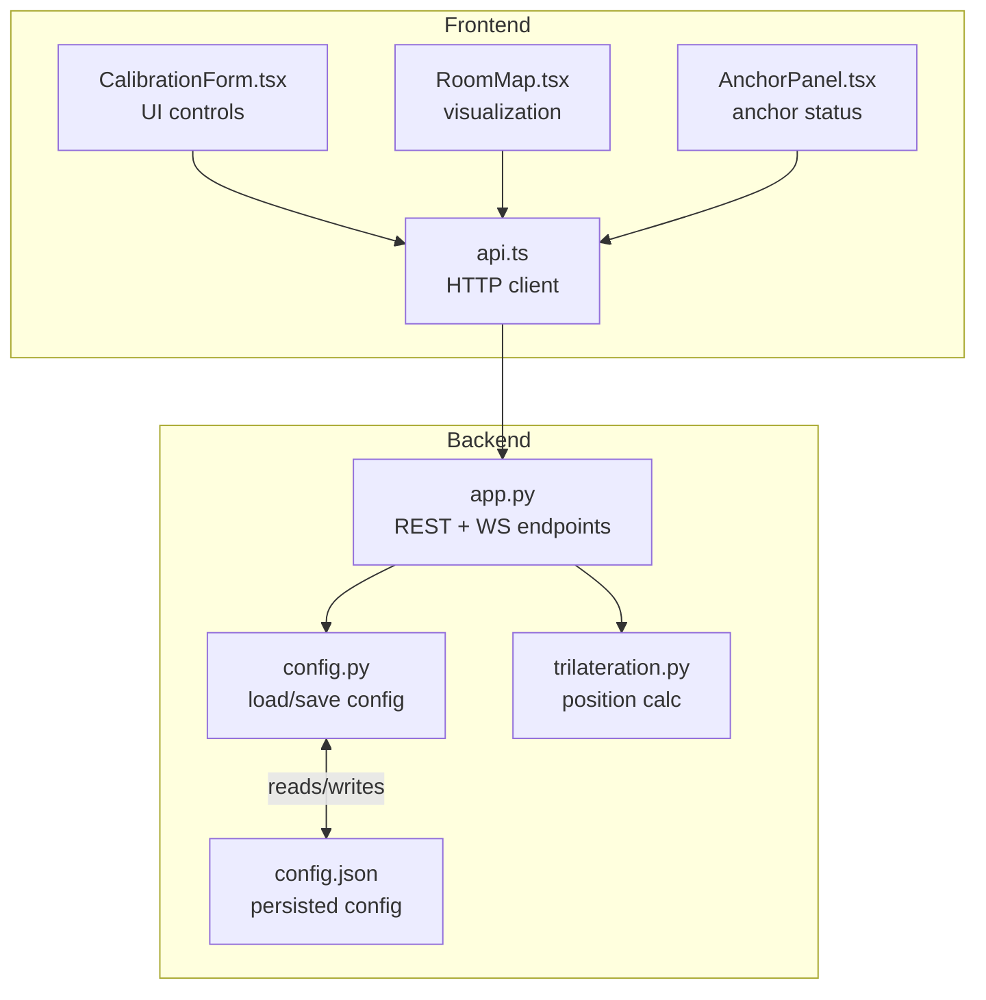
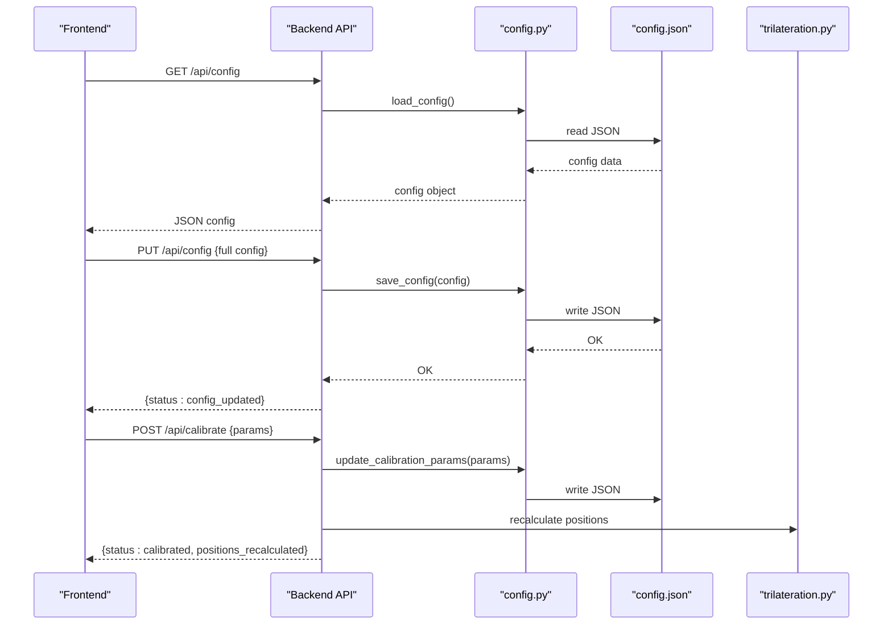
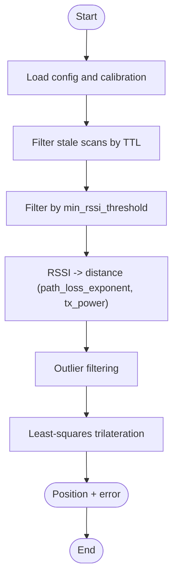
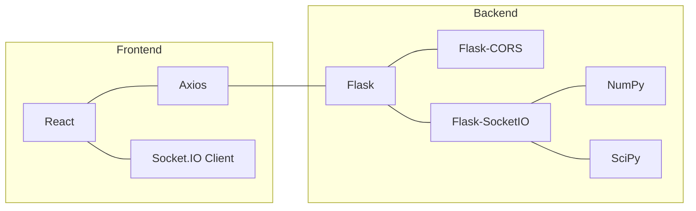

# System Configuration

<cite>
**Referenced Files in This Document**
- [config.py](file://backend/config.py)
- [config.json](file://backend/config.json)
- [app.py](file://backend/app.py)
- [trilateration.py](file://backend/trilateration.py)
- [api.ts](file://frontend/src/services/api.ts)
- [CalibrationForm.tsx](file://frontend/src/components/CalibrationForm.tsx)
- [RoomMap.tsx](file://frontend/src/components/RoomMap.tsx)
- [AnchorPanel.tsx](file://frontend/src/components/AnchorPanel.tsx)
- [requirements.txt](file://backend/requirements.txt)
- [package.json](file://frontend/package.json)
</cite>

## Table of Contents
1. [Introduction](#introduction)
2. [Project Structure](#project-structure)
3. [Core Components](#core-components)
4. [Architecture Overview](#architecture-overview)
5. [Detailed Component Analysis](#detailed-component-analysis)
6. [Dependency Analysis](#dependency-analysis)
7. [Performance Considerations](#performance-considerations)
8. [Troubleshooting Guide](#troubleshooting-guide)
9. [Conclusion](#conclusion)
10. [Appendices](#appendices)

## Introduction
This document describes the system configuration management for the BLE Room Positioning System. It covers the configuration file structure, loading and persistence mechanisms, validation and defaults, and the integration between backend and frontend components. It also documents the JSON schema, parameter constraints, and practical configuration scenarios for room layouts and anchor positioning strategies.

## Project Structure
The configuration system spans the backend Python service and the frontend React application:
- Backend: configuration loader/saver, REST endpoints, and trilateration engine
- Frontend: configuration UI, API clients, and visualization components

**Diagram sources**
- [config.py:1-95](file://backend/config.py#L1-L95)
- [app.py:1-398](file://backend/app.py#L1-L398)
- [trilateration.py:1-218](file://backend/trilateration.py#L1-L218)
- [api.ts:1-66](file://frontend/src/services/api.ts#L1-L66)
- [CalibrationForm.tsx:1-290](file://frontend/src/components/CalibrationForm.tsx#L1-L290)
- [RoomMap.tsx:1-229](file://frontend/src/components/RoomMap.tsx#L1-L229)
- [AnchorPanel.tsx:1-143](file://frontend/src/components/AnchorPanel.tsx#L1-L143)

**Section sources**
- [config.py:1-95](file://backend/config.py#L1-L95)
- [app.py:1-398](file://backend/app.py#L1-L398)
- [api.ts:1-66](file://frontend/src/services/api.ts#L1-L66)

## Core Components
- Configuration loader and saver: reads/writes the JSON configuration file and provides convenience getters for anchors and calibration parameters.
- REST endpoints: expose configuration and calibration operations to the frontend.
- Trilateration engine: consumes calibration parameters to compute positions.
- Frontend API client: wraps HTTP calls to backend endpoints.
- Frontend UI components: present and edit configuration and visualize positions.

Key responsibilities:
- Load configuration from disk or initialize defaults and persist them.
- Expose endpoints to update anchors, calibration, and full configuration.
- Compute positions using RSSI-to-distance conversion and trilateration.
- Render room map and anchor status with live updates.

**Section sources**
- [config.py:44-95](file://backend/config.py#L44-L95)
- [app.py:123-348](file://backend/app.py#L123-L348)
- [trilateration.py:11-218](file://backend/trilateration.py#L11-L218)
- [api.ts:12-66](file://frontend/src/services/api.ts#L12-L66)

## Architecture Overview
The configuration lifecycle:
- On startup, the backend loads configuration from config.json; if missing, it writes defaults.
- Frontend fetches configuration and calibration parameters, then allows editing.
- Updates are persisted via PUT endpoints and trigger re-triangulation.
- Real-time position updates are streamed via WebSocket.

**Diagram sources**
- [config.py:44-58](file://backend/config.py#L44-L58)
- [app.py:334-348](file://backend/app.py#L334-L348)
- [app.py:282-321](file://backend/app.py#L282-L321)
- [trilateration.py:155-218](file://backend/trilateration.py#L155-L218)

## Detailed Component Analysis

### Configuration File Structure and Schema
The configuration is stored as a JSON object with the following top-level keys:
- room: width_m, height_m
- anchors: map of anchor_id to x, y, label
- calibration: path_loss_exponent, tx_power_dbm, min_rssi_threshold, scan_ttl_seconds
- beacon_filters: list of MAC addresses to track (empty means track all)

JSON schema outline:
- room: object with numeric width_m and height_m
- anchors: object whose values are objects with numeric x, y, and string label
- calibration: object with numeric path_loss_exponent, tx_power_dbm, min_rssi_threshold, scan_ttl_seconds
- beacon_filters: array of strings (MAC addresses)

Constraints and defaults:
- Defaults are embedded in the backend and written to disk if missing.
- Calibration parameters are validated by the backend endpoints and used by the trilateration engine.

Practical examples:
- Room layout: define width_m and height_m to match the physical room.
- Anchor positioning: place anchors at known corners or edges; ensure labels reflect physical locations.
- Beacon filters: restrict tracking to specific beacons by MAC address.

**Section sources**
- [config.json:1-30](file://backend/config.json#L1-L30)
- [config.py:12-41](file://backend/config.py#L12-L41)
- [app.py:334-348](file://backend/app.py#L334-L348)

### Configuration Loading Mechanism and Defaults
Behavior:
- load_config checks for the presence of config.json; if absent, writes DEFAULT_CONFIG and returns a copy.
- save_config persists the configuration object to config.json.
- Convenience getters provide anchor positions and calibration parameters.

Validation:
- The backend validates incoming requests for calibration and anchor updates; invalid keys are ignored.
- Trilateration applies thresholds and outlier filtering.

Persistence:
- All updates go through save_config, ensuring atomic writes.

**Section sources**
- [config.py:44-58](file://backend/config.py#L44-L58)
- [config.py:60-95](file://backend/config.py#L60-L95)
- [app.py:282-321](file://backend/app.py#L282-L321)
- [app.py:224-254](file://backend/app.py#L224-L254)

### Configuration Endpoints and Frontend Integration
Endpoints:
- GET /api/config: returns full configuration
- PUT /api/config: replaces full configuration
- GET /api/anchors: lists anchors with status and last-seen metrics
- PUT /api/anchors: updates anchor positions
- GET /api/calibrate: returns calibration parameters and room/beacon_filters
- POST /api/calibrate: updates calibration parameters and recalculates positions
- GET /api/positions: returns current positions
- GET /api/scan-data: returns recent scan data

Frontend integration:
- api.ts encapsulates HTTP calls to the backend.
- CalibrationForm.tsx fetches and updates calibration and anchors.
- RoomMap.tsx renders the room map and beacon positions.
- AnchorPanel.tsx displays anchor status and detected beacons.

**Section sources**
- [app.py:123-348](file://backend/app.py#L123-L348)
- [api.ts:12-66](file://frontend/src/services/api.ts#L12-L66)
- [CalibrationForm.tsx:30-100](file://frontend/src/components/CalibrationForm.tsx#L30-L100)
- [RoomMap.tsx:28-229](file://frontend/src/components/RoomMap.tsx#L28-L229)
- [AnchorPanel.tsx:30-143](file://frontend/src/components/AnchorPanel.tsx#L30-L143)

### Trilateration and Calibration Parameters
The trilateration engine converts RSSI to distance using the log-distance path loss model and performs least-squares trilateration. Calibration parameters influence:
- path_loss_exponent: affects distance estimation sensitivity
- tx_power_dbm: reference TX power at 1 meter
- min_rssi_threshold: filters weak signals
- scan_ttl_seconds: determines freshness of scan data

**Diagram sources**
- [app.py:48-105](file://backend/app.py#L48-L105)
- [trilateration.py:11-218](file://backend/trilateration.py#L11-L218)

**Section sources**
- [trilateration.py:11-218](file://backend/trilateration.py#L11-L218)
- [app.py:48-105](file://backend/app.py#L48-L105)

### Frontend Configuration UI and Visualization
CalibrationForm.tsx:
- Fetches current calibration and room dimensions.
- Allows updating anchor positions and calibration parameters.
- Provides hints and guidance for tuning.

RoomMap.tsx:
- Renders a scaled room map with anchors and beacon positions.
- Draws grid, labels, and uncertainty circles.

AnchorPanel.tsx:
- Displays anchor status, last-seen timestamps, and detected beacons.

**Section sources**
- [CalibrationForm.tsx:30-290](file://frontend/src/components/CalibrationForm.tsx#L30-L290)
- [RoomMap.tsx:28-229](file://frontend/src/components/RoomMap.tsx#L28-L229)
- [AnchorPanel.tsx:30-143](file://frontend/src/components/AnchorPanel.tsx#L30-L143)

## Dependency Analysis
Backend dependencies:
- Flask, Flask-CORS, Flask-SocketIO for HTTP and WebSocket
- NumPy and SciPy for numerical optimization

Frontend dependencies:
- Axios for HTTP
- React and Socket.IO client for UI and real-time updates

**Diagram sources**
- [requirements.txt:1-7](file://backend/requirements.txt#L1-L7)
- [package.json:12-29](file://frontend/package.json#L12-L29)

**Section sources**
- [requirements.txt:1-7](file://backend/requirements.txt#L1-L7)
- [package.json:12-29](file://frontend/package.json#L12-L29)

## Performance Considerations
- Calibration parameters directly impact computation cost and accuracy; tune path_loss_exponent and tx_power_dbm to reduce outlier filtering overhead.
- scan_ttl_seconds affects how often trilateration runs; lower TTL increases frequency but CPU usage.
- Beacon filters reduce the number of beacons processed, improving throughput.
- RoomMap rendering scales linearly with number of anchors and beacons; consider limiting rendered items for large deployments.

## Troubleshooting Guide
Common configuration errors and resolutions:
- Missing config.json: The backend auto-initializes defaults; verify the file exists after first run.
- Invalid calibration parameters: Only recognized keys are accepted; ensure keys match the calibration schema.
- Stale scan data: Adjust scan_ttl_seconds to reflect network latency and device reporting intervals.
- Weak RSSI readings: Increase min_rssi_threshold or move anchors closer to targets.
- Poor accuracy: Adjust path_loss_exponent and tx_power_dbm; validate anchor positions and room dimensions.

Operational tips:
- Use the calibration guide in the frontend to iteratively improve accuracy.
- Monitor anchor status and last-seen timestamps to detect connectivity issues.
- Limit tracked beacons via beacon_filters to reduce processing load.

**Section sources**
- [config.py:44-58](file://backend/config.py#L44-L58)
- [app.py:282-321](file://backend/app.py#L282-L321)
- [CalibrationForm.tsx:269-284](file://frontend/src/components/CalibrationForm.tsx#L269-L284)

## Conclusion
The configuration system provides a robust foundation for managing room geometry, anchor placement, and signal calibration. The backend ensures defaults and persistence, while the frontend offers intuitive controls and visualization. Proper configuration of room dimensions, anchor coordinates, and calibration parameters yields reliable position estimates.

## Appendices

### Configuration File Format and Constraints
- room.width_m, room.height_m: positive numeric values representing room size in meters
- anchors.<anchor_id>.x, anchors.<anchor_id>.y: numeric coordinates in meters
- anchors.<anchor_id>.label: human-readable identifier
- calibration.path_loss_exponent: numeric; typical indoor range 2.7–3.5
- calibration.tx_power_dbm: numeric; typical BLE beacon reference around -59 to -65
- calibration.min_rssi_threshold: numeric; default -90 dBm
- calibration.scan_ttl_seconds: integer; default 15 seconds
- beacon_filters: array of MAC addresses; empty means track all

**Section sources**
- [config.json:1-30](file://backend/config.json#L1-L30)
- [config.py:12-41](file://backend/config.py#L12-L41)
- [trilateration.py:11-32](file://backend/trilateration.py#L11-L32)

### Practical Configuration Scenarios
- Corner layout: Place anchors at three corners to maximize triangulation reliability.
- Edge layout: Position anchors along walls for coverage in long rooms.
- Center anchor: Add a fourth anchor near the room center to improve accuracy in the middle area.
- Beacon filters: Use beacon_filters to focus on specific assets during testing or deployment.

**Section sources**
- [config.json:6-22](file://backend/config.json#L6-L22)
- [app.py:68-70](file://backend/app.py#L68-L70)

### Configuration Persistence and Backup/Restore
- Persistence: All updates are written atomically to config.json via save_config.
- Backup: Copy config.json to a safe location before major changes.
- Restore: Replace config.json with a backed-up copy and restart the backend.

**Section sources**
- [config.py:54-58](file://backend/config.py#L54-L58)

### Versioning and Migration
- No explicit version field is present in the configuration; treat config.json as a single-version artifact.
- Migration strategy: Back up current config.json, then apply new defaults from the backend and manually reconcile differences if schema evolves.

**Section sources**
- [config.py:44-51](file://backend/config.py#L44-L51)