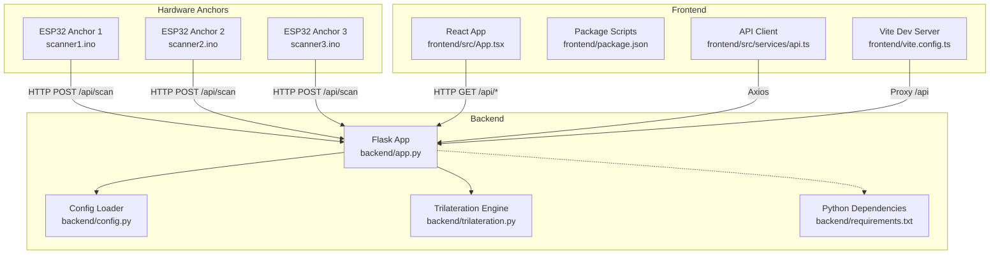
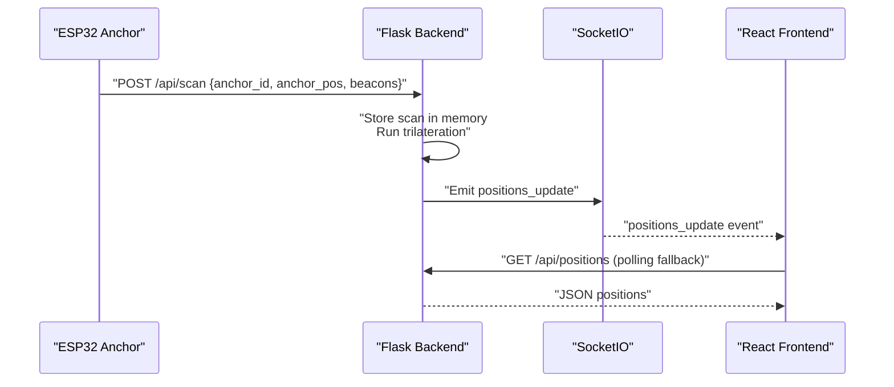
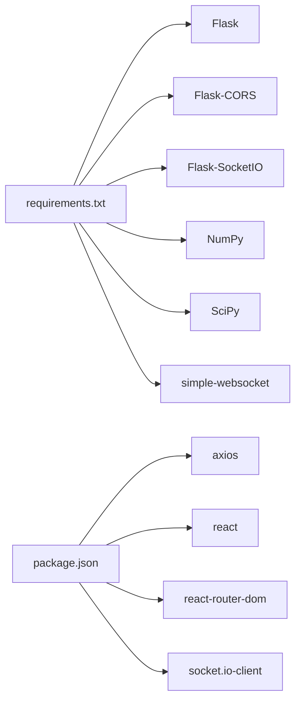

# Deployment and Operations

<cite>
**Referenced Files in This Document**
- [backend/app.py](file://backend/app.py)
- [backend/config.py](file://backend/config.py)
- [backend/config.json](file://backend/config.json)
- [backend/trilateration.py](file://backend/trilateration.py)
- [backend/requirements.txt](file://backend/requirements.txt)
- [frontend/vite.config.ts](file://frontend/vite.config.ts)
- [frontend/package.json](file://frontend/package.json)
- [frontend/src/services/api.ts](file://frontend/src/services/api.ts)
- [frontend/src/App.tsx](file://frontend/src/App.tsx)
- [scanner1/scanner1.ino](file://scanner1/scanner1.ino)
- [scanner2/scanner2.ino](file://scanner2/scanner2.ino)
- [scanner3/scanner3.ino](file://scanner3/scanner3.ino)
</cite>

## Table of Contents
1. [Introduction](#introduction)
2. [Project Structure](#project-structure)
3. [Core Components](#core-components)
4. [Architecture Overview](#architecture-overview)
5. [Detailed Component Analysis](#detailed-component-analysis)
6. [Dependency Analysis](#dependency-analysis)
7. [Performance Considerations](#performance-considerations)
8. [Troubleshooting Guide](#troubleshooting-guide)
9. [Conclusion](#conclusion)
10. [Appendices](#appendices)

## Introduction
This document provides production-grade deployment and operations guidance for the BLE Room Positioning System. It covers backend and frontend deployment, containerization and orchestration, monitoring and logging, operational procedures, security, scaling, and performance tuning. The system consists of:
- Backend: Python Flask service with WebSocket support, serving REST endpoints and real-time updates.
- Frontend: React SPA served via Vite’s development server in local builds; production-ready static assets built for distribution.
- Hardware Anchors: ESP32-C3 devices running NimBLE-based scanners that periodically POST BLE scan data to the backend.

## Project Structure
The repository is organized into three primary areas:
- backend: Flask application, configuration, trilateration engine, and runtime dependencies.
- frontend: React application with TypeScript, Vite build tooling, and client-side API integration.
- scannerN: Arduino projects for three ESP32 anchors sending BLE scan data to the backend.

**Diagram sources**
- [backend/app.py:112-121](file://backend/app.py#L112-L121)
- [backend/config.py:44-57](file://backend/config.py#L44-L57)
- [backend/trilateration.py:155-218](file://backend/trilateration.py#L155-L218)
- [backend/requirements.txt:1-7](file://backend/requirements.txt#L1-L7)
- [frontend/vite.config.ts:4-15](file://frontend/vite.config.ts#L4-L15)
- [frontend/package.json:6-11](file://frontend/package.json#L6-L11)
- [frontend/src/services/api.ts:1-66](file://frontend/src/services/api.ts#L1-L66)
- [frontend/src/App.tsx:54-172](file://frontend/src/App.tsx#L54-L172)
- [scanner1/scanner1.ino:30](file://scanner1/scanner1.ino#L30)
- [scanner2/scanner2.ino:30](file://scanner2/scanner2.ino#L30)
- [scanner3/scanner3.ino:30](file://scanner3/scanner3.ino#L30)

**Section sources**
- [backend/app.py:112-121](file://backend/app.py#L112-L121)
- [backend/config.py:44-57](file://backend/config.py#L44-L57)
- [backend/trilateration.py:155-218](file://backend/trilateration.py#L155-L218)
- [backend/requirements.txt:1-7](file://backend/requirements.txt#L1-L7)
- [frontend/vite.config.ts:4-15](file://frontend/vite.config.ts#L4-L15)
- [frontend/package.json:6-11](file://frontend/package.json#L6-L11)
- [frontend/src/services/api.ts:1-66](file://frontend/src/services/api.ts#L1-L66)
- [frontend/src/App.tsx:54-172](file://frontend/src/App.tsx#L54-L172)
- [scanner1/scanner1.ino:30](file://scanner1/scanner1.ino#L30)
- [scanner2/scanner2.ino:30](file://scanner2/scanner2.ino#L30)
- [scanner3/scanner3.ino:30](file://scanner3/scanner3.ino#L30)

## Core Components
- Backend Flask API
  - REST endpoints for health checks, scan ingestion, positions, anchors, calibration, and configuration.
  - WebSocket event handling for real-time updates.
  - In-memory stores for recent scans and cached positions guarded by locks.
  - Trilateration pipeline converting RSSI to distances and estimating positions.
- Configuration Management
  - JSON-backed configuration for room dimensions, anchor positions, calibration parameters, and optional beacon filters.
- Frontend React Application
  - Axios-based API client for backend endpoints.
  - Real-time updates via Socket.IO with fallback polling.
  - Vite dev server proxying API requests to the backend.
- Hardware Anchors
  - ESP32-C3 devices scanning BLE advertisements and posting JSON payloads to the backend.

Key operational endpoints:
- Health: GET /api/health
- Scan ingestion: POST /api/scan
- Positions: GET /api/positions
- Anchors: GET /api/anchors, PUT /api/anchors
- Calibration: GET /api/calibrate, POST /api/calibrate
- Config: GET /api/config, PUT /api/config
- Scan data: GET /api/scan-data

**Section sources**
- [backend/app.py:112-348](file://backend/app.py#L112-L348)
- [backend/config.py:44-95](file://backend/config.py#L44-L95)
- [backend/config.json:1-30](file://backend/config.json#L1-L30)
- [backend/trilateration.py:11-218](file://backend/trilateration.py#L11-L218)
- [frontend/src/services/api.ts:1-66](file://frontend/src/services/api.ts#L1-L66)
- [frontend/src/App.tsx:54-172](file://frontend/src/App.tsx#L54-L172)
- [scanner1/scanner1.ino:120-141](file://scanner1/scanner1.ino#L120-L141)

## Architecture Overview
The system operates as a distributed pipeline:
- Hardware anchors continuously capture BLE advertisements and POST scan payloads to the backend.
- The backend validates and stores scan data, runs trilateration, caches positions, and emits real-time updates via WebSocket.
- The frontend polls or subscribes to real-time updates to render live positioning.

**Diagram sources**
- [backend/app.py:123-171](file://backend/app.py#L123-L171)
- [backend/app.py:354-377](file://backend/app.py#L354-L377)
- [frontend/src/App.tsx:140-172](file://frontend/src/App.tsx#L140-L172)
- [frontend/src/services/api.ts:13-16](file://frontend/src/services/api.ts#L13-L16)
- [scanner1/scanner1.ino:120-141](file://scanner1/scanner1.ino#L120-L141)

## Detailed Component Analysis

### Backend Deployment and Process Management
- Runtime
  - Host binding: 0.0.0.0
  - Port: 5000
  - Debugging: enabled in development entry point
- Process model
  - Single-threaded development server; production should use a WSGI server (e.g., Gunicorn/uWSGI) behind a reverse proxy.
- Environment configuration
  - Configuration file location is derived from the backend module path.
  - Calibration parameters and anchor positions are persisted to JSON.
- Startup and shutdown
  - Use a process supervisor (systemd, PM2) to manage lifecycle and auto-restart.
  - Implement graceful shutdown hooks to drain connections before termination.
- Security considerations
  - Restrict CORS origins in production; avoid wildcard in production deployments.
  - Place behind TLS termination (reverse proxy/Nginx) with strong cipher suites.
  - Enforce authentication/authorization for administrative endpoints (/api/config, /api/anchors, /api/calibrate).
- Monitoring
  - Health endpoint exposes uptime and counts for diagnostics.
  - Add structured logging and metrics collection (e.g., Prometheus metrics via a middleware).
- Logging
  - Redirect stdout/stderr to a log aggregator (e.g., systemd-journald, Fluent Bit).
- Backup and recovery
  - Back up config.json regularly; restore by replacing the file and restarting the service.
- Maintenance
  - Rotate logs, monitor disk usage, and schedule periodic re-calibration.

Operational endpoints and roles:
- /api/health: health and status
- /api/scan: ingest BLE scan data
- /api/positions: serve cached positions
- /api/anchors: manage anchor positions
- /api/calibrate: tune calibration parameters
- /api/config: read/update full configuration
- /api/scan-data: inspect raw scan data

**Section sources**
- [backend/app.py:383-397](file://backend/app.py#L383-L397)
- [backend/config.py:9](file://backend/config.py#L9)
- [backend/config.py:44-57](file://backend/config.py#L44-L57)
- [backend/app.py:112-348](file://backend/app.py#L112-L348)

### Frontend Deployment and Static Serving
- Local development
  - Vite dev server listens on port 3000 with proxy to backend at 5000.
- Production build
  - Use Vite to produce static assets; serve via Nginx/Apache or CDN.
- Network configuration
  - Ensure CORS is aligned between frontend proxy and backend in production.
- Health and connectivity
  - Frontend polls /api/health and other endpoints; configure appropriate timeouts and retry policies.

**Section sources**
- [frontend/vite.config.ts:4-15](file://frontend/vite.config.ts#L4-L15)
- [frontend/package.json:6-11](file://frontend/package.json#L6-L11)
- [frontend/src/services/api.ts:54-57](file://frontend/src/services/api.ts#L54-L57)
- [frontend/src/App.tsx:107-114](file://frontend/src/App.tsx#L107-L114)

### Hardware Anchors (ESP32)
- Responsibilities
  - Scan BLE advertisements, construct JSON payloads, and POST to backend.
- Network configuration
  - Configure SSID/password and backend URL per device.
  - Use NTP for timestamp synchronization when available.
- Operational notes
  - Scans occur at intervals controlled by calibration mode flag.
  - Memory cleanup after scans to prevent leaks on constrained devices.
- Security considerations
  - Use secure Wi-Fi credentials and HTTPS endpoints in production.
  - Consider device firmware updates and secure boot if applicable.

**Section sources**
- [scanner1/scanner1.ino:28-30](file://scanner1/scanner1.ino#L28-L30)
- [scanner1/scanner1.ino:146-198](file://scanner1/scanner1.ino#L146-L198)
- [scanner2/scanner2.ino:28-30](file://scanner2/scanner2.ino#L28-L30)
- [scanner2/scanner2.ino:146-198](file://scanner2/scanner2.ino#L146-L198)
- [scanner3/scanner3.ino:28-30](file://scanner3/scanner3.ino#L28-L30)
- [scanner3/scanner3.ino:146-198](file://scanner3/scanner3.ino#L146-L198)

### Containerization Options and Orchestration
- Container image
  - Base image: python:3.x slim
  - Install dependencies from requirements.txt
  - Copy backend code and config.json
  - Expose port 5000
  - Entrypoint: run WSGI server (e.g., gunicorn) bound to 0.0.0.0
- Frontend image
  - Multi-stage build: Vite build → static assets served by Nginx/alpine
- Orchestration
  - Kubernetes: Deploy backend as Deployment with readiness/liveness probes; expose via Service/Ingress
  - Frontend: Static site via Ingress or CDN
  - Anchors: Not containerized; deploy firmware images directly to ESP32 devices
- Secrets and config
  - Store Wi-Fi credentials and backend URLs in secrets/configmaps
  - Persist backend config.json via PersistentVolumeClaim if dynamic updates are required
- Scaling
  - Backend: Stateless; scale horizontally behind a load balancer
  - Frontend: Stateless; scale replicas behind a load balancer
- Observability
  - Sidecar or initContainer for log shipping
  - Metrics scraping for CPU/memory utilization

[No sources needed since this section provides general guidance]

### Monitoring and Alerting
- Health endpoint
  - Use GET /api/health for liveness/readiness checks
- Metrics
  - Track anchors reporting, beacons tracked, and uptime
  - Add custom metrics for latency, throughput, and error rates
- Logs
  - Centralized logging for backend and frontend
  - Frontend errors captured via browser console and Sentry-like tools
- Alerts
  - Thresholds for offline anchors, stale scan data, and backend errors

**Section sources**
- [backend/app.py:112-121](file://backend/app.py#L112-L121)
- [frontend/src/App.tsx:107-114](file://frontend/src/App.tsx#L107-L114)

### Operational Procedures
- Startup
  - Provision infrastructure and secrets
  - Deploy containers and apply manifests
  - Verify readiness of backend and anchors
- Graceful shutdown
  - Drain traffic, stop accepting new connections, and terminate workers cleanly
- Backup and recovery
  - Snapshot config.json and database if used
  - Restore by replacing config and restarting services
- Routine maintenance
  - Monitor logs and metrics
  - Rotate logs and clean old artifacts
  - Perform periodic recalibration

[No sources needed since this section provides general guidance]

### Security Considerations
- Network
  - TLS termination at reverse proxy; enforce HTTPS
  - Restrict CORS origins to frontend domain(s)
  - Firewall rules: allow inbound 80/443 to load balancer/proxy; restrict backend 5000 to internal network
- Authentication
  - Require tokens for administrative endpoints
  - Rate-limit sensitive endpoints
- Secrets
  - Store Wi-Fi credentials and backend URLs in secure secret stores
- Compliance
  - Audit logs for configuration changes
  - Data retention and anonymization policies

[No sources needed since this section provides general guidance]

### Scaling, Load Balancing, and High Availability
- Horizontal scaling
  - Scale backend pods behind a load balancer
  - Use sticky sessions only if required; otherwise rely on stateless design
- Load balancing
  - Layer 7 LB for WebSocket upgrades; ensure session affinity if needed
- High availability
  - Multi-AZ deployments for backend and storage
  - Redundant anchors for resilience
- Frontend
  - CDN for global distribution; cache-busting via asset hashes

[No sources needed since this section provides general guidance]

### Performance Tuning and Capacity Planning
- Backend
  - Optimize trilateration by adjusting scan TTL and beacon filters
  - Tune path-loss exponent and TX power per beacon type
  - Reduce scan intervals only if anchors can sustain the load
- Frontend
  - Minimize polling frequency; rely on WebSocket updates
  - Lazy-load components and optimize rendering
- Infrastructure
  - Right-size VMs/CPU/memory based on concurrent anchors and beacons
  - Monitor CPU and memory; autoscale based on load metrics

[No sources needed since this section provides general guidance]

## Dependency Analysis
Runtime dependencies and relationships:
- Backend depends on Flask, Flask-CORS, Flask-SocketIO, NumPy, SciPy, and simple-websocket.
- Frontend depends on React, React-DOM, React Router, Socket.IO client, and Axios.
- Hardware anchors depend on NimBLE and ArduinoJson libraries.

**Diagram sources**
- [backend/requirements.txt:1-7](file://backend/requirements.txt#L1-L7)
- [frontend/package.json:12-29](file://frontend/package.json#L12-L29)

**Section sources**
- [backend/requirements.txt:1-7](file://backend/requirements.txt#L1-L7)
- [frontend/package.json:12-29](file://frontend/package.json#L12-L29)

## Performance Considerations
- Trilateration cost
  - Least-squares optimization scales with number of anchors per beacon; limit outliers and use filters.
- Data freshness
  - Adjust scan TTL to balance responsiveness vs. noise.
- Endpoint efficiency
  - Cache positions and avoid recomputation when inputs are unchanged.
- Network efficiency
  - Batch scan data and minimize payload sizes.

[No sources needed since this section provides general guidance]

## Troubleshooting Guide
Common issues and resolutions:
- Backend not reachable
  - Verify port binding and firewall rules; confirm reverse proxy configuration.
- No positions displayed
  - Check anchor connectivity and backend logs; ensure anchors are broadcasting and backend receives POSTs.
- Stale or missing data
  - Inspect scan TTL and beacon filters; adjust calibration parameters.
- WebSocket disconnects
  - Confirm reverse proxy supports WebSocket upgrades; check client reconnection settings.
- Frontend API failures
  - Validate proxy configuration and CORS; ensure base URL matches backend.

**Section sources**
- [backend/app.py:112-121](file://backend/app.py#L112-L121)
- [frontend/vite.config.ts:8-13](file://frontend/vite.config.ts#L8-L13)
- [frontend/src/App.tsx:140-172](file://frontend/src/App.tsx#L140-L172)
- [scanner1/scanner1.ino:120-141](file://scanner1/scanner1.ino#L120-L141)

## Conclusion
This guide outlines a production-ready deployment strategy for the BLE Room Positioning System. By separating concerns across backend, frontend, and hardware anchors, and by applying sound operational practices—monitoring, security hardening, scaling, and maintenance—you can achieve reliable, real-time indoor positioning at scale.

[No sources needed since this section summarizes without analyzing specific files]

## Appendices
- Appendix A: Example environment variables and secrets
  - BACKEND_HOST, BACKEND_PORT, BACKEND_TLS_ENABLED
  - WIFI_SSID, WIFI_PASSWORD
  - BACKEND_API_URL
- Appendix B: Health check integration
  - Liveness probe: GET /api/health
  - Readiness probe: wait until anchors_reporting > 0

[No sources needed since this section provides general guidance]