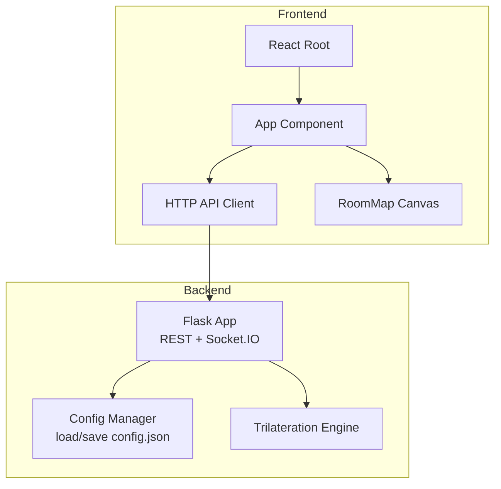
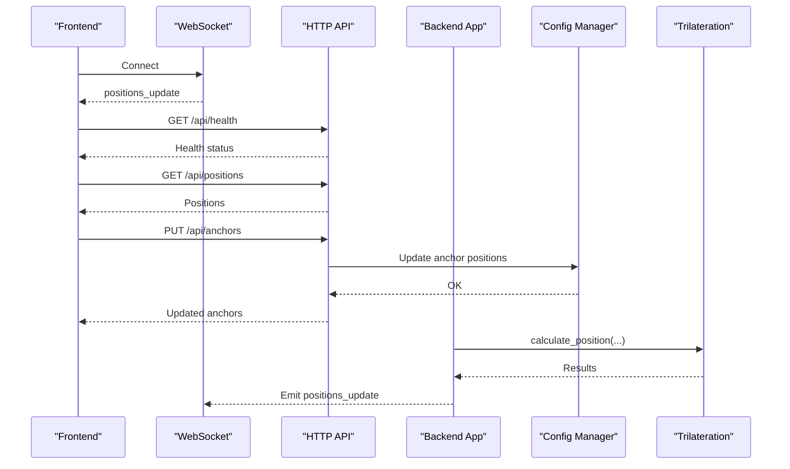
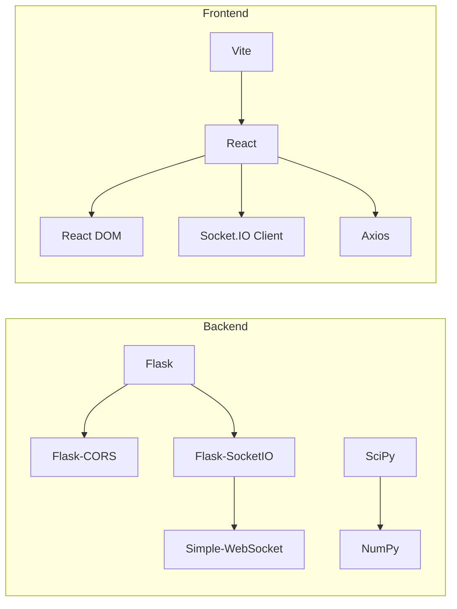

# Maintenance and Operations

<cite>
**Referenced Files in This Document**
- [backend/app.py](file://backend/app.py)
- [backend/config.py](file://backend/config.py)
- [backend/trilateration.py](file://backend/trilateration.py)
- [backend/config.json](file://backend/config.json)
- [backend/requirements.txt](file://backend/requirements.txt)
- [frontend/src/main.tsx](file://frontend/src/main.tsx)
- [frontend/src/App.tsx](file://frontend/src/App.tsx)
- [frontend/src/services/api.ts](file://frontend/src/services/api.ts)
- [frontend/vite.config.ts](file://frontend/vite.config.ts)
- [frontend/package.json](file://frontend/package.json)
</cite>

## Table of Contents
1. [Introduction](#introduction)
2. [Project Structure](#project-structure)
3. [Core Components](#core-components)
4. [Architecture Overview](#architecture-overview)
5. [Detailed Component Analysis](#detailed-component-analysis)
6. [Dependency Analysis](#dependency-analysis)
7. [Performance Considerations](#performance-considerations)
8. [Troubleshooting Guide](#troubleshooting-guide)
9. [Conclusion](#conclusion)
10. [Appendices](#appendices)

## Introduction
This document provides comprehensive guidance for routine maintenance and operations of the BLE Room Positioning System. It covers system startup and shutdown procedures, backup and recovery of configuration and runtime state, routine maintenance tasks, operational troubleshooting, capacity planning, performance tuning, updates and rollbacks, and emergency response procedures. The guidance is grounded in the repository’s backend Flask application, configuration management, and frontend React client.

## Project Structure
The system comprises:
- Backend service written in Python using Flask and Socket.IO for real-time updates, plus a trilateration engine for position estimation.
- Frontend built with React and Vite, communicating with the backend via HTTP and WebSocket connections.
- Configuration stored in a JSON file managed by the backend.

**Diagram sources**
- [backend/app.py:23-25](file://backend/app.py#L23-L25)
- [backend/config.py:44-57](file://backend/config.py#L44-L57)
- [backend/trilateration.py:155-218](file://backend/trilateration.py#L155-L218)
- [frontend/src/main.tsx:1-11](file://frontend/src/main.tsx#L1-L11)
- [frontend/src/App.tsx:54-172](file://frontend/src/App.tsx#L54-L172)
- [frontend/src/services/api.ts:1-66](file://frontend/src/services/api.ts#L1-L66)
- [frontend/src/components/RoomMap.tsx:28-229](file://frontend/src/components/RoomMap.tsx#L28-L229)

**Section sources**
- [backend/app.py:23-25](file://backend/app.py#L23-L25)
- [backend/config.py:9-51](file://backend/config.py#L9-L51)
- [frontend/src/main.tsx:1-11](file://frontend/src/main.tsx#L1-L11)
- [frontend/vite.config.ts:1-16](file://frontend/vite.config.ts#L1-L16)

## Core Components
- Backend Flask application initializes CORS and Socket.IO, exposes REST endpoints for health, scan ingestion, positions, anchors, calibration, and configuration, and emits real-time updates.
- Configuration manager handles loading defaults, saving, and updating anchor positions and calibration parameters.
- Trilateration engine converts RSSI to distance, filters outliers, and computes positions via least-squares optimization.
- Frontend React application connects via WebSocket for live updates and HTTP for polling fallback, renders a room map and anchor panel, and provides calibration controls.

Key operational responsibilities:
- Startup: Load configuration, initialize in-memory stores, start web server.
- Shutdown: Graceful termination of web server and cleanup of resources.
- Maintenance: Backup configuration, rotate logs, clear caches, and clean up stale data.
- Troubleshooting: Health checks, WebSocket diagnostics, and calibration adjustments.
- Scaling: Add anchors, tune TTL, and optimize rendering.

**Section sources**
- [backend/app.py:121-144](file://backend/app.py#L121-L144)
- [backend/app.py:147-194](file://backend/app.py#L147-L194)
- [backend/app.py:197-207](file://backend/app.py#L197-L207)
- [backend/app.py:210-245](file://backend/app.py#L210-L245)
- [backend/app.py:280-303](file://backend/app.py#L280-L303)
- [backend/app.py:306-355](file://backend/app.py#L306-L355)
- [backend/app.py:358-371](file://backend/app.py#L358-L371)
- [backend/config.py:44-95](file://backend/config.py#L44-L95)
- [backend/trilateration.py:11-33](file://backend/trilateration.py#L11-L33)
- [backend/trilateration.py:69-153](file://backend/trilateration.py#L69-L153)
- [frontend/src/App.tsx:56-172](file://frontend/src/App.tsx#L56-L172)
- [frontend/src/services/api.ts:12-65](file://frontend/src/services/api.ts#L12-L65)

## Architecture Overview
The system follows a client-server pattern:
- Backend exposes REST endpoints and WebSocket channels.
- Frontend polls endpoints and subscribes to real-time updates.
- Configuration is persisted to a JSON file and loaded at startup.

**Diagram sources**
- [backend/app.py:378-401](file://backend/app.py#L378-L401)
- [backend/app.py:121-144](file://backend/app.py#L121-L144)
- [backend/app.py:197-207](file://backend/app.py#L197-L207)
- [backend/app.py:248-277](file://backend/app.py#L248-L277)
- [backend/config.py:77-86](file://backend/config.py#L77-L86)
- [backend/trilateration.py:155-218](file://backend/trilateration.py#L155-L218)
- [frontend/src/App.tsx:140-172](file://frontend/src/App.tsx#L140-L172)

## Detailed Component Analysis

### System Startup and Shutdown Procedures
- Startup sequence:
  - Load configuration from JSON; create defaults if missing.
  - Initialize in-memory scan store and position cache with locks.
  - Start Flask app with CORS and Socket.IO.
  - Print system summary and bind to host/port.
- Shutdown sequence:
  - Stop the Flask server gracefully.
  - No explicit teardown hooks are present; ensure process termination is handled by the hosting environment.

Operational notes:
- The backend prints a startup summary including room dimensions, anchor count, and calibration parameters.
- The server binds to 0.0.0.0 on port 5000.

**Section sources**
- [backend/config.py:44-57](file://backend/config.py#L44-L57)
- [backend/app.py:412-421](file://backend/app.py#L412-L421)
- [backend/app.py:407-421](file://backend/app.py#L407-L421)

### Backup and Recovery Processes
- Configuration backup:
  - Back up the configuration file path used by the backend.
  - The configuration file path is derived from the backend module location.
- Historical data and system state:
  - In-memory stores (scan store and position cache) are cleared during recalculation but not persisted.
  - No persistent database or logs are implemented; backups should focus on configuration and manual exports of scan data via the API.

Recovery steps:
- Restore configuration file from backup.
- Restart backend to reload configuration.
- Verify system readiness via health endpoint.

**Section sources**
- [backend/config.py:9](file://backend/config.py#L9)
- [backend/config.py:54-57](file://backend/config.py#L54-L57)
- [backend/app.py:121-144](file://backend/app.py#L121-L144)
- [backend/app.py:280-303](file://backend/app.py#L280-L303)

### Routine Maintenance Tasks
- Log rotation:
  - The backend does not implement application-level logging; configure process-level logging externally.
- Cache clearing and cleanup:
  - Position cache is cleared and rebuilt during trilateration runs.
  - Stale scan data older than the configured TTL is ignored automatically.
- System cleanup:
  - Periodically review anchor status and remove inactive anchors from configuration.
  - Ensure beacon filters are maintained to reduce unnecessary processing.

**Section sources**
- [backend/app.py:48-114](file://backend/app.py#L48-L114)
- [backend/app.py:39-46](file://backend/app.py#L39-L46)
- [backend/app.py:54-55](file://backend/app.py#L54-L55)

### Operational Troubleshooting Procedures
Common issues and resolutions:
- Anchor connectivity problems:
  - Use the health endpoint to confirm active anchors and system readiness.
  - Inspect anchor status and last-seen timestamps via the anchors endpoint.
  - Verify WebSocket connectivity; the frontend falls back to polling if disconnected.
- Positioning accuracy issues:
  - Adjust calibration parameters (path loss exponent, TX power, RSSI threshold, TTL).
  - Recalculate positions after calibration changes.
- Frontend rendering problems:
  - Confirm WebSocket connection status indicator.
  - Check periodic polling fallback and network proxy configuration.

Diagnostic endpoints:
- Health: GET /api/health
- Anchors: GET /api/anchors
- Positions: GET /api/positions
- Scan data: GET /api/scan-data
- Calibration: GET /api/calibrate

**Section sources**
- [backend/app.py:121-144](file://backend/app.py#L121-L144)
- [backend/app.py:210-245](file://backend/app.py#L210-L245)
- [backend/app.py:197-207](file://backend/app.py#L197-L207)
- [backend/app.py:280-303](file://backend/app.py#L280-L303)
- [backend/app.py:306-355](file://backend/app.py#L306-L355)
- [frontend/src/App.tsx:125-137](file://frontend/src/App.tsx#L125-L137)
- [frontend/src/App.tsx:140-172](file://frontend/src/App.tsx#L140-L172)
- [frontend/vite.config.ts:8-13](file://frontend/vite.config.ts#L8-L13)

### Capacity Planning Guidance
- Scaling anchor nodes:
  - Add anchors to configuration; ensure positions are calibrated.
  - Monitor system readiness (minimum 3 anchors reporting).
- Concurrent users and throughput:
  - The backend processes trilateration on each incoming scan and emits updates.
  - Optimize TTL and beacon filters to reduce processing overhead.
- Peak load handling:
  - Ensure adequate CPU for least-squares optimization.
  - Consider externalizing trilateration to a worker queue if latency grows under load.

**Section sources**
- [backend/app.py:48-114](file://backend/app.py#L48-L114)
- [backend/app.py:54-55](file://backend/app.py#L54-L55)
- [backend/trilateration.py:123-152](file://backend/trilateration.py#L123-L152)

### Performance Tuning Recommendations
- Backend processing:
  - Tune path loss exponent and TX power for improved accuracy and fewer outlier-filtered measurements.
  - Adjust scan TTL to balance responsiveness and stability.
  - Reduce beacon filters to limit per-cycle computation.
- Frontend rendering:
  - Canvas rendering is efficient; avoid excessive re-renders by minimizing props changes.
  - Prefer WebSocket updates; rely on polling only when disconnected.

**Section sources**
- [backend/trilateration.py:11-33](file://backend/trilateration.py#L11-L33)
- [backend/trilateration.py:35-66](file://backend/trilateration.py#L35-L66)
- [frontend/src/components/RoomMap.tsx:28-229](file://frontend/src/components/RoomMap.tsx#L28-L229)

### System Updates, Patch Management, and Rollback
- Update procedure:
  - Update backend dependencies via requirements file.
  - Rebuild and redeploy frontend assets if applicable.
  - Restart backend service.
- Patch management:
  - Pin dependency versions in requirements and package manifests.
  - Test calibration and positioning after updates.
- Rollback:
  - Revert to previous container/image or binary.
  - Restore configuration from backup.
  - Validate system readiness via health endpoint.

**Section sources**
- [backend/requirements.txt:1-7](file://backend/requirements.txt#L1-L7)
- [frontend/package.json:12-29](file://frontend/package.json#L12-L29)
- [backend/config.py:54-57](file://backend/config.py#L54-L57)
- [backend/app.py:121-144](file://backend/app.py#L121-L144)

### Emergency Response Procedures
- Critical failure scenarios:
  - Backend crash or unresponsive server.
  - WebSocket disconnects persistently.
  - No anchors reporting or insufficient data for trilateration.
- Actions:
  - Restart backend service.
  - Verify network connectivity and proxy settings for frontend.
  - Check anchor hardware and Wi-Fi availability.
  - Restore configuration from backup if corrupted.
  - Validate trilateration parameters and recalibrate if needed.

**Section sources**
- [frontend/vite.config.ts:8-13](file://frontend/vite.config.ts#L8-L13)
- [backend/app.py:121-144](file://backend/app.py#L121-L144)
- [backend/app.py:306-355](file://backend/app.py#L306-L355)

## Dependency Analysis
Runtime dependencies:
- Backend requires Flask, CORS, Socket.IO, NumPy, SciPy, and a WebSocket library.
- Frontend depends on React, React DOM, Socket.IO client, Axios, and Vite for development.

**Diagram sources**
- [backend/requirements.txt:1-7](file://backend/requirements.txt#L1-L7)
- [frontend/package.json:12-29](file://frontend/package.json#L12-L29)

**Section sources**
- [backend/requirements.txt:1-7](file://backend/requirements.txt#L1-L7)
- [frontend/package.json:12-29](file://frontend/package.json#L12-L29)

## Performance Considerations
- Trilateration cost:
  - Least-squares optimization scales with the number of anchors used per beacon.
  - Outlier filtering reduces computational load by limiting inputs.
- Network efficiency:
  - WebSocket provides real-time updates; polling acts as a fallback.
  - Proxy configuration ensures low-latency API access from the browser.
- Rendering efficiency:
  - Canvas-based room map minimizes DOM overhead.
  - Avoid frequent reflows by batching updates.

[No sources needed since this section provides general guidance]

## Troubleshooting Guide
- Health and readiness:
  - Use health endpoint to confirm active anchors and system status.
- Connectivity:
  - Verify WebSocket connection and fallback polling intervals.
- Calibration:
  - Adjust path loss exponent and TX power to improve accuracy.
- Frontend:
  - Check proxy settings and base URL for API requests.

**Section sources**
- [backend/app.py:121-144](file://backend/app.py#L121-L144)
- [frontend/src/App.tsx:125-137](file://frontend/src/App.tsx#L125-L137)
- [frontend/src/App.tsx:140-172](file://frontend/src/App.tsx#L140-L172)
- [frontend/vite.config.ts:8-13](file://frontend/vite.config.ts#L8-L13)
- [frontend/src/services/api.ts:3-10](file://frontend/src/services/api.ts#L3-L10)

## Conclusion
This guide outlines practical, code-grounded procedures for operating the BLE Room Positioning System. By following the startup/shutdown, backup/recovery, maintenance, troubleshooting, capacity planning, and emergency response recommendations, operators can maintain reliable and accurate positioning while scaling and evolving the system.

[No sources needed since this section summarizes without analyzing specific files]

## Appendices

### Appendix A: Endpoint Reference
- GET /api/health
- POST /api/scan
- GET /api/positions
- GET /api/anchors
- PUT /api/anchors
- GET /api/scan-data
- POST /api/calibrate
- GET /api/calibrate
- GET /api/config
- PUT /api/config

**Section sources**
- [backend/app.py:121-144](file://backend/app.py#L121-L144)
- [backend/app.py:147-194](file://backend/app.py#L147-L194)
- [backend/app.py:197-207](file://backend/app.py#L197-L207)
- [backend/app.py:210-245](file://backend/app.py#L210-L245)
- [backend/app.py:280-303](file://backend/app.py#L280-L303)
- [backend/app.py:306-355](file://backend/app.py#L306-L355)
- [backend/app.py:358-371](file://backend/app.py#L358-L371)

### Appendix B: Configuration Locations
- Backend configuration file path is resolved from the backend module directory.
- Default configuration is created if the file does not exist.

**Section sources**
- [backend/config.py:9](file://backend/config.py#L9)
- [backend/config.py:44-51](file://backend/config.py#L44-L51)
- [backend/config.json:1-30](file://backend/config.json#L1-L30)