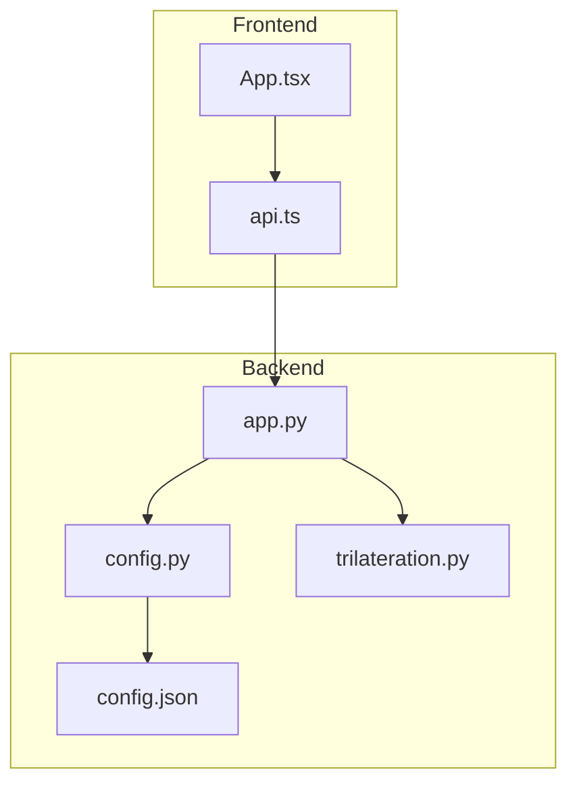
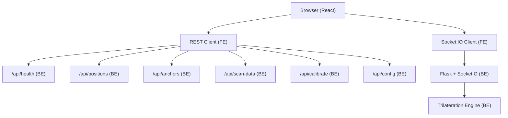
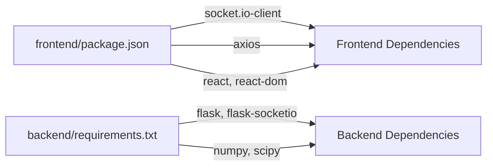

# Monitoring and Logging

<cite>
**Referenced Files in This Document**
- [app.py](file://backend/app.py)
- [config.py](file://backend/config.py)
- [config.json](file://backend/config.json)
- [api.ts](file://frontend/src/services/api.ts)
- [App.tsx](file://frontend/src/App.tsx)
- [trilateration.py](file://backend/trilateration.py)
- [requirements.txt](file://backend/requirements.txt)
- [package.json](file://frontend/package.json)
</cite>

## Table of Contents
1. [Introduction](#introduction)
2. [Project Structure](#project-structure)
3. [Core Components](#core-components)
4. [Architecture Overview](#architecture-overview)
5. [Detailed Component Analysis](#detailed-component-analysis)
6. [Dependency Analysis](#dependency-analysis)
7. [Performance Considerations](#performance-considerations)
8. [Troubleshooting Guide](#troubleshooting-guide)
9. [Conclusion](#conclusion)
10. [Appendices](#appendices)

## Introduction
This document provides a comprehensive guide to implementing system monitoring and logging strategies for the BLE Room Positioning System. It covers:
- Health check endpoints and automated monitoring integration
- Logging configuration for backend and frontend
- Performance metrics collection (response times, memory/CPU, WebSocket stats)
- Monitoring dashboards with Prometheus/Grafana
- Alerting for critical failures, anchor connectivity, and accuracy degradation
- Log analysis techniques for troubleshooting and optimization
- Guidance to integrate with existing IT monitoring systems

## Project Structure
The system consists of:
- Backend Flask application with Socket.IO for real-time updates
- Frontend React application consuming REST APIs and WebSocket streams
- Trilateration engine for position estimation
- Persistent configuration stored in JSON

**Diagram sources**
- [app.py:112-120](file://backend/app.py#L112-L120)
- [api.ts:54-57](file://frontend/src/services/api.ts#L54-L57)
- [config.py:44-57](file://backend/config.py#L44-L57)
- [config.json:1-30](file://backend/config.json#L1-L30)
- [trilateration.py:155-218](file://backend/trilateration.py#L155-L218)

**Section sources**
- [app.py:112-120](file://backend/app.py#L112-L120)
- [api.ts:54-57](file://frontend/src/services/api.ts#L54-L57)
- [config.py:44-57](file://backend/config.py#L44-L57)
- [config.json:1-30](file://backend/config.json#L1-L30)
- [trilateration.py:155-218](file://backend/trilateration.py#L155-L218)

## Core Components
- Health endpoint: Provides system status, uptime, and live telemetry
- REST endpoints: Positions, anchors, scan data, calibration, and configuration
- WebSocket: Real-time position updates and event-driven communication
- Trilateration engine: RSSI-to-distance conversion, outlier filtering, and least-squares trilateration
- Configuration: Room dimensions, anchor positions, and calibration parameters

Key implementation references:
- Health endpoint definition and response payload
- REST endpoints for positions, anchors, scan data, calibration, and configuration
- WebSocket connect/request handlers and emitted events
- Trilateration pipeline: RSSI to distance, outlier filtering, and position estimation

**Section sources**
- [app.py:112-120](file://backend/app.py#L112-L120)
- [app.py:173-183](file://backend/app.py#L173-L183)
- [app.py:186-221](file://backend/app.py#L186-L221)
- [app.py:256-279](file://backend/app.py#L256-L279)
- [app.py:282-331](file://backend/app.py#L282-L331)
- [app.py:334-347](file://backend/app.py#L334-L347)
- [app.py:354-377](file://backend/app.py#L354-L377)
- [trilateration.py:11-32](file://backend/trilateration.py#L11-L32)
- [trilateration.py:35-66](file://backend/trilateration.py#L35-L66)
- [trilateration.py:69-152](file://backend/trilateration.py#L69-L152)
- [trilateration.py:155-218](file://backend/trilateration.py#L155-L218)

## Architecture Overview
The monitoring and logging architecture integrates backend health checks, REST endpoints, and WebSocket streams with frontend telemetry and external observability platforms.

**Diagram sources**
- [App.tsx:54-172](file://frontend/src/App.tsx#L54-L172)
- [api.ts:54-63](file://frontend/src/services/api.ts#L54-L63)
- [app.py:112-120](file://backend/app.py#L112-L120)
- [app.py:173-183](file://backend/app.py#L173-L183)
- [app.py:186-221](file://backend/app.py#L186-L221)
- [app.py:256-279](file://backend/app.py#L256-L279)
- [app.py:282-331](file://backend/app.py#L282-L331)
- [app.py:334-347](file://backend/app.py#L334-L347)
- [app.py:354-377](file://backend/app.py#L354-L377)
- [trilateration.py:155-218](file://backend/trilateration.py#L155-L218)

## Detailed Component Analysis

### Health Endpoint (/api/health)
Purpose:
- Provide system status, uptime, and live telemetry for monitoring integrations
- Enable automated health checks and alerting

Response fields:
- status: Operational status indicator
- uptime_seconds: Server uptime in seconds
- anchors_reporting: Number of anchors currently reporting data
- beacons_tracked: Number of beacons with computed positions

Integration:
- Frontend polls the endpoint periodically to reflect system health
- External monitoring systems can scrape this endpoint for synthetic checks

Operational notes:
- Uses server-side time for uptime
- Relies on in-memory stores to compute live counts

**Section sources**
- [app.py:112-120](file://backend/app.py#L112-L120)
- [App.tsx:107-114](file://frontend/src/App.tsx#L107-L114)
- [api.ts:54-57](file://frontend/src/services/api.ts#L54-L57)

### REST Endpoints for Telemetry
Endpoints used for monitoring and diagnostics:
- GET /api/positions: Current positions and timestamps
- GET /api/anchors: Anchor status, online/offline, last seen, beacon counts
- GET /api/scan-data: Latest raw scan data with ages
- GET/POST /api/calibrate: Calibration parameters and recalculations
- GET/PUT /api/config: Full configuration for system state

Frontend consumption:
- Polling intervals when WebSocket is unavailable
- Real-time updates via WebSocket events

**Section sources**
- [app.py:173-183](file://backend/app.py#L173-L183)
- [app.py:186-221](file://backend/app.py#L186-L221)
- [app.py:256-279](file://backend/app.py#L256-L279)
- [app.py:282-331](file://backend/app.py#L282-L331)
- [app.py:334-347](file://backend/app.py#L334-L347)
- [App.tsx:66-137](file://frontend/src/App.tsx#L66-L137)
- [api.ts:13-63](file://frontend/src/services/api.ts#L13-L63)

### WebSocket Events and Metrics
Events:
- connect/disconnect: Connection state changes
- positions_update: Real-time position updates
- error: Error propagation from backend

Metrics derived from WebSocket:
- Connection uptime and reconnection attempts
- Message throughput and latency (via timestamp differences)
- Event error rates

Frontend behavior:
- Automatic reconnection with exponential backoff
- Fallback polling when disconnected

**Section sources**
- [app.py:354-377](file://backend/app.py#L354-L377)
- [App.tsx:140-172](file://frontend/src/App.tsx#L140-L172)

### Trilateration Pipeline and Accuracy Signals
The trilateration engine produces:
- Estimated positions with error margins
- Anchors used per calculation
- Method and messages for diagnostics

Frontend displays:
- Beacon positions and error circles
- Per-anchor RSSI and estimated distances

These outputs serve as:
- Accuracy indicators for alerting thresholds
- Inputs for dashboard panels and logs

**Section sources**
- [trilateration.py:155-218](file://backend/trilateration.py#L155-L218)
- [App.tsx:208-252](file://frontend/src/App.tsx#L208-L252)

### Logging Configuration

#### Backend Python Applications
Current state:
- Limited console prints for errors and startup info

Recommended enhancements:
- Use Python logging module with structured JSON format
- Configure log levels: ERROR for exceptions, WARNING for anomalies, INFO for lifecycle events, DEBUG for verbose traces
- Implement rotating file handler with size limits and retention
- Centralized logging: ship logs to ELK stack, Loki, or cloud logging services
- Include correlation IDs for request-scoped logs

Implementation references:
- Startup banner and error printing locations
- Health endpoint response construction

**Section sources**
- [app.py:161-163](file://backend/app.py#L161-L163)
- [app.py:383-397](file://backend/app.py#L383-L397)
- [app.py:112-120](file://backend/app.py#L112-L120)

#### Frontend React Components
Current state:
- Console-based logging for network and WebSocket events

Recommended enhancements:
- Integrate a logging library with configurable levels
- Capture frontend errors, warnings, and performance metrics
- Ship logs to centralized backend or log aggregation service
- Tag logs with user session, device, and anchor identifiers

Implementation references:
- Health polling and error handling
- WebSocket connect/disconnect/error logs

**Section sources**
- [App.tsx:107-114](file://frontend/src/App.tsx#L107-L114)
- [App.tsx:147-167](file://frontend/src/App.tsx#L147-L167)

### Performance Metrics Collection

#### Backend Metrics
- Response times: Instrument Flask routes with timing middleware or decorators
- Memory/CPU: Use platform-specific metrics or third-party libraries
- Trilateration duration: Measure per-beacon computation time
- WebSocket connection statistics: Track connections, disconnections, and error rates

#### Frontend Metrics
- Network request durations: Axios interceptors
- Rendering performance: React profiling and frame metrics
- WebSocket latency: Timestamp deltas between emission and reception

#### Trilateration Metrics
- Outlier filtering effectiveness
- Success rate per beacon and anchor
- Error distribution histograms

**Section sources**
- [app.py:112-120](file://backend/app.py#L112-L120)
- [trilateration.py:155-218](file://backend/trilateration.py#L155-L218)
- [App.tsx:140-172](file://frontend/src/App.tsx#L140-L172)

### Monitoring Dashboard Setup (Prometheus + Grafana)

#### Backend Instrumentation
- Expose metrics endpoint (e.g., Prometheus exporter)
- Track: request rates, durations, error rates, queue sizes, trilateration timings
- Annotate with labels: beacon_id, anchor_id, method

#### Frontend Instrumentation
- Export browser metrics to backend or directly to Prometheus
- Track: page load times, WebSocket latency, error rates

#### Dashboard Panels
- System health: uptime, anchors reporting, beacons tracked
- Position accuracy: average error, error distribution, anchors used
- Connectivity: WebSocket connections, reconnections, latency
- Trilateration: success rate, per-beacon timings, outlier counts

[No sources needed since this section provides general guidance]

### Alerting Mechanisms
- Critical system failures: Health endpoint downtime or repeated errors
- Anchor connectivity: Offline anchors exceeding TTL thresholds
- Positioning accuracy: Elevated error margins or declining success rates
- Trilateration anomalies: Outlier spikes or convergence failures

Alert channels:
- Email, Slack, PagerDuty, or ITSM tools
- Threshold-based and anomaly-based rules

[No sources needed since this section provides general guidance]

### Log Analysis Techniques
- Correlation: Match backend request IDs with frontend logs
- Timeline analysis: Cross-reference anchor timestamps and position updates
- Anomaly detection: Identify RSSI drops, outlier distances, and connection flapping
- Root cause: Trace from frontend symptoms to backend trilateration outcomes

[No sources needed since this section provides general guidance]

## Dependency Analysis
External dependencies relevant to monitoring:
- Backend: Flask, Flask-CORS, Flask-SocketIO, NumPy, SciPy, simple-websocket
- Frontend: React, React DOM, axios, socket.io-client

**Diagram sources**
- [package.json:12-29](file://frontend/package.json#L12-L29)
- [requirements.txt:1-7](file://backend/requirements.txt#L1-L7)

**Section sources**
- [package.json:12-29](file://frontend/package.json#L12-L29)
- [requirements.txt:1-7](file://backend/requirements.txt#L1-L7)

## Performance Considerations
- Optimize trilateration loops and outlier filtering thresholds
- Reduce polling frequency when WebSocket is healthy
- Cache frequently accessed configuration and precompute constants
- Scale backend horizontally behind a reverse proxy and load balancer

[No sources needed since this section provides general guidance]

## Troubleshooting Guide
Common issues and resolutions:
- Health endpoint returns errors: Verify backend process and database availability
- No positions displayed: Confirm anchors are online and within TTL
- WebSocket disconnects: Inspect network connectivity and firewall rules
- Accuracy degradation: Adjust calibration parameters and verify anchor placements

Diagnostic steps:
- Review backend logs for trilateration exceptions
- Inspect frontend console for network and WebSocket errors
- Compare RSSI thresholds and scan TTL settings

**Section sources**
- [app.py:161-163](file://backend/app.py#L161-L163)
- [App.tsx:147-167](file://frontend/src/App.tsx#L147-L167)
- [config.py:44-57](file://backend/config.py#L44-L57)
- [config.json:23-28](file://backend/config.json#L23-L28)

## Conclusion
By instrumenting health checks, REST endpoints, and WebSocket streams; configuring structured logging; collecting performance metrics; and building Grafana dashboards with targeted alerts, the BLE Room Positioning System can achieve robust operational visibility. These practices enable rapid incident response, continuous accuracy monitoring, and smooth integration with existing IT monitoring ecosystems.

[No sources needed since this section summarizes without analyzing specific files]

## Appendices

### Appendix A: Health Endpoint Payload Reference
- status: ok
- uptime_seconds: server uptime in seconds
- anchors_reporting: number of anchors with fresh data
- beacons_tracked: number of tracked beacons

**Section sources**
- [app.py:112-120](file://backend/app.py#L112-L120)

### Appendix B: Configuration Keys for Monitoring
- Calibration parameters: path_loss_exponent, tx_power_dbm, min_rssi_threshold, scan_ttl_seconds
- Room dimensions: width_m, height_m
- Anchor positions: x, y, label

**Section sources**
- [config.py:12-41](file://backend/config.py#L12-L41)
- [config.json:1-30](file://backend/config.json#L1-L30)