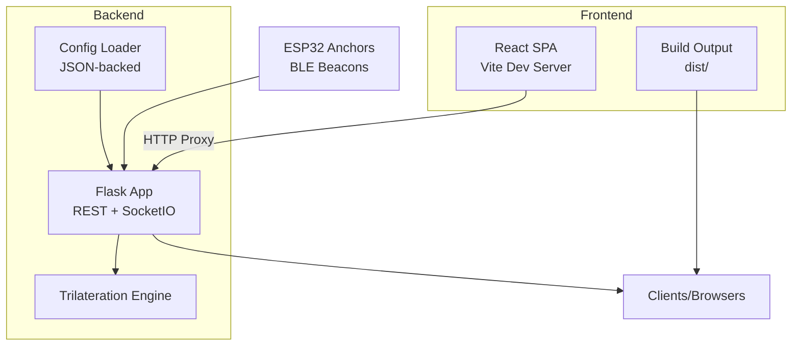
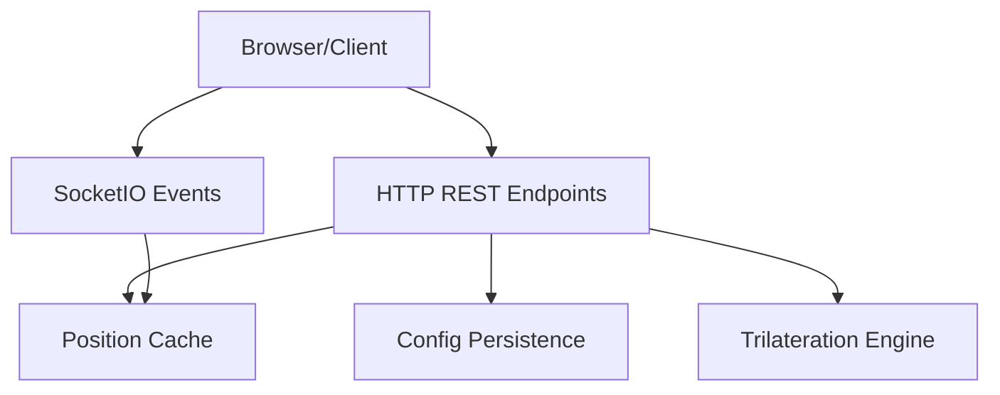
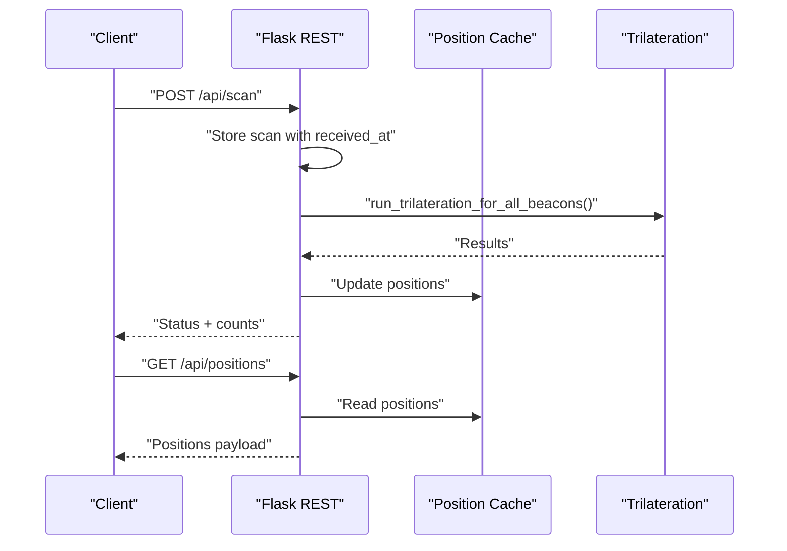
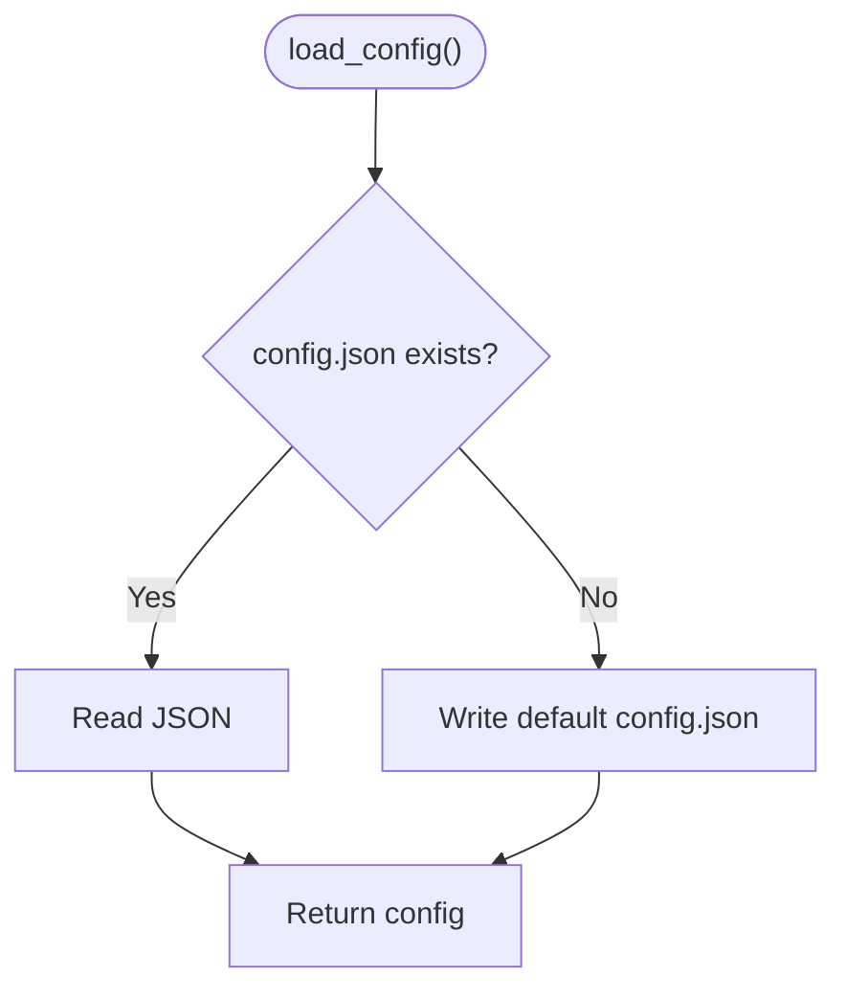
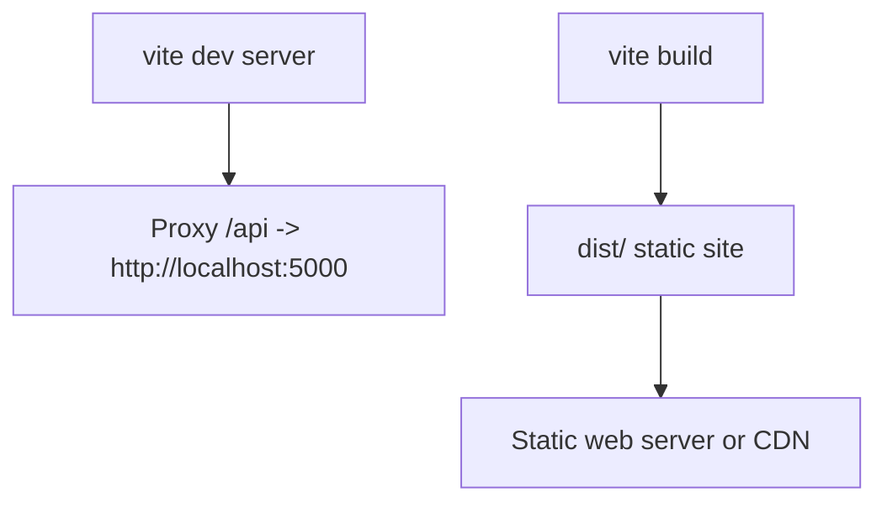
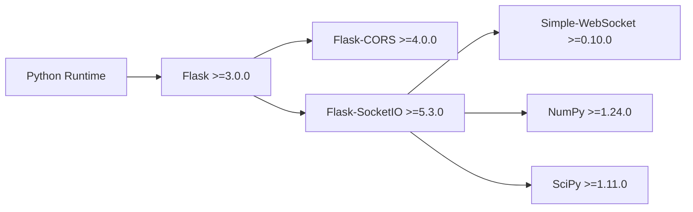

# Production Deployment

<cite>
**Referenced Files in This Document**
- [backend/app.py](file://backend/app.py)
- [backend/config.py](file://backend/config.py)
- [backend/config.json](file://backend/config.json)
- [backend/requirements.txt](file://backend/requirements.txt)
- [frontend/package.json](file://frontend/package.json)
- [frontend/vite.config.ts](file://frontend/vite.config.ts)
- [frontend/index.html](file://frontend/index.html)
</cite>

## Table of Contents
1. [Introduction](#introduction)
2. [Project Structure](#project-structure)
3. [Core Components](#core-components)
4. [Architecture Overview](#architecture-overview)
5. [Detailed Component Analysis](#detailed-component-analysis)
6. [Dependency Analysis](#dependency-analysis)
7. [Performance Considerations](#performance-considerations)
8. [Troubleshooting Guide](#troubleshooting-guide)
9. [Conclusion](#conclusion)
10. [Appendices](#appendices)

## Introduction
This document provides production deployment strategies for a BLE Room Positioning System composed of a Flask backend with WebSocket support and a React/TypeScript frontend built with Vite. It covers server requirements, OS compatibility, networking prerequisites, backend deployment with WSGI servers, frontend static site hosting, environment configuration, step-by-step deployment procedures, security hardening, and CI/CD recommendations.

## Project Structure
The repository is split into two primary areas:
- Backend: Python Flask application exposing REST endpoints and WebSocket events, plus configuration persistence.
- Frontend: React application built with Vite, configured for local proxying to the backend during development.

**Diagram sources**
- [backend/app.py:23-25](file://backend/app.py#L23-L25)
- [backend/config.py:44-57](file://backend/config.py#L44-L57)
- [frontend/vite.config.ts:6-14](file://frontend/vite.config.ts#L6-L14)

**Section sources**
- [backend/app.py:112-347](file://backend/app.py#L112-L347)
- [backend/config.py:44-95](file://backend/config.py#L44-L95)
- [frontend/vite.config.ts:1-16](file://frontend/vite.config.ts#L1-L16)

## Core Components
- Flask REST API and WebSocket server:
  - Health checks, scan ingestion, position retrieval, anchor status, calibration, and full configuration management.
  - Real-time updates via SocketIO.
- Configuration management:
  - Room dimensions, anchor positions, calibration parameters, and optional beacon filters persisted to a JSON file.
- Frontend build and dev server:
  - Vite-based React application with a development proxy targeting the backend.

Key runtime characteristics:
- Uses threading locks for shared in-memory stores (scan cache and position cache).
- Freshness of scan data is enforced via a TTL mechanism.
- Trilateration runs on-demand and emits live updates.

**Section sources**
- [backend/app.py:39-104](file://backend/app.py#L39-L104)
- [backend/app.py:112-347](file://backend/app.py#L112-L347)
- [backend/config.py:44-95](file://backend/config.py#L44-L95)

## Architecture Overview
The system consists of clients/browsers connecting to the backend over HTTP/HTTPS and WebSockets. During development, the frontend’s Vite dev server proxies API requests to the backend. In production, the built frontend is served statically by a web server or CDN.

**Diagram sources**
- [backend/app.py:23-25](file://backend/app.py#L23-L25)
- [backend/app.py:112-347](file://backend/app.py#L112-L347)
- [backend/config.py:44-57](file://backend/config.py#L44-L57)

## Detailed Component Analysis

### Backend: Flask Application
- Entry point and development server:
  - The application starts a development server bound to all interfaces with unsafe Werkzeug settings enabled for development convenience.
- REST endpoints:
  - Health, scan ingestion, positions, anchors, calibration, and configuration management.
- WebSocket events:
  - Connect and request positions handlers emit live updates.
- Threading and caching:
  - Thread-safe in-memory stores guarded by locks; TTL-based freshness for scans.

**Diagram sources**
- [backend/app.py:123-170](file://backend/app.py#L123-L170)
- [backend/app.py:173-183](file://backend/app.py#L173-L183)
- [backend/app.py:48-104](file://backend/app.py#L48-L104)

**Section sources**
- [backend/app.py:23-25](file://backend/app.py#L23-L25)
- [backend/app.py:112-347](file://backend/app.py#L112-L347)
- [backend/app.py:39-104](file://backend/app.py#L39-L104)

### Configuration Management
- Default configuration includes room dimensions, anchor coordinates, calibration parameters, and optional beacon filters.
- Configuration is loaded from and saved to a JSON file; defaults are created if missing.
- Helper functions expose anchor positions and calibration parameters.

**Diagram sources**
- [backend/config.py:44-57](file://backend/config.py#L44-L57)

**Section sources**
- [backend/config.py:11-41](file://backend/config.py#L11-L41)
- [backend/config.py:44-95](file://backend/config.py#L44-L95)

### Frontend Build and Proxy
- Vite dev server runs on a local port and proxies API requests to the backend.
- The built SPA resides under the dist folder after a production build.

**Diagram sources**
- [frontend/vite.config.ts:6-14](file://frontend/vite.config.ts#L6-L14)
- [frontend/package.json:6-11](file://frontend/package.json#L6-L11)

**Section sources**
- [frontend/vite.config.ts:1-16](file://frontend/vite.config.ts#L1-L16)
- [frontend/package.json:1-31](file://frontend/package.json#L1-L31)

## Dependency Analysis
Runtime dependencies for the backend include Flask, CORS, SocketIO, NumPy, SciPy, and a lightweight WebSocket library. The frontend depends on React, React DOM, routing, Socket.IO client, and Vite for building.

**Diagram sources**
- [backend/requirements.txt:1-7](file://backend/requirements.txt#L1-L7)

**Section sources**
- [backend/requirements.txt:1-7](file://backend/requirements.txt#L1-L7)
- [frontend/package.json:12-29](file://frontend/package.json#L12-L29)

## Performance Considerations
- Concurrency model:
  - The development server uses a single-threaded async engine; production requires a multi-process WSGI server.
- Caching:
  - Position cache is cleared and updated on each trilateration cycle; ensure adequate memory for expected beacon counts.
- Trilateration cost:
  - Computation scales with the number of beacons and anchors; tune beacon filters and TTL to reduce workload.
- Network:
  - WebSocket emits frequent updates; consider rate-limiting client requests and optimizing polling intervals.

[No sources needed since this section provides general guidance]

## Troubleshooting Guide
Common operational issues and remedies:
- Health endpoint:
  - Use the health check to confirm service availability and inspect anchor/position metrics.
- Scan freshness:
  - If positions are stale, verify scan TTL and anchor reporting intervals.
- WebSocket connectivity:
  - Confirm CORS settings and origin allowances; ensure reverse proxy preserves WebSocket upgrades.
- Configuration persistence:
  - Validate JSON file permissions and path correctness.

**Section sources**
- [backend/app.py:112-120](file://backend/app.py#L112-L120)
- [backend/app.py:39-46](file://backend/app.py#L39-L46)
- [backend/config.py:44-57](file://backend/config.py#L44-L57)

## Conclusion
This guide outlines a pragmatic production deployment strategy for the BLE Room Positioning System. By separating concerns between a WSGI-backed backend and a static frontend, you can achieve reliable scaling, robust monitoring, and secure delivery. The provided steps and diagrams map directly to the repository’s code and configuration.

[No sources needed since this section summarizes without analyzing specific files]

## Appendices

### A. Server Requirements
- Hardware:
  - CPU: Multi-core sufficient for concurrent WSGI workers and background trilateration tasks.
  - RAM: Minimum several GB to accommodate Python runtime, NumPy/SciPy, and caches; scale with beacon/anchor counts.
  - Disk: Local storage for configuration JSON and logs; SSD recommended for I/O-heavy operations.
- Operating systems:
  - Linux distributions (Ubuntu LTS, CentOS/RHEL) are recommended for production stability and package management.
- Networking:
  - Open TCP ports for HTTP/HTTPS and WebSocket traffic.
  - Allow outbound access for any external integrations if applicable.
  - Configure firewall policies to restrict inbound connections to necessary ports.

[No sources needed since this section provides general guidance]

### B. Backend Deployment with WSGI (Gunicorn/uWSGI)
- Choose a WSGI server:
  - Gunicorn: Recommended for simplicity and strong Python ecosystem integration.
  - uWSGI: Offers advanced features and fine-grained control.
- Application entry:
  - Use the Flask application factory pattern; avoid running the development server in production.
- Process management:
  - Use systemd or supervisor to manage WSGI processes, auto-restart on failure, and log rotation.
- Configuration files:
  - WSGI module path and application callable.
  - Worker count and threading model aligned with CPU cores.
- Reverse proxy:
  - Place Nginx/Apache in front of the WSGI server to offload static assets, enforce TLS, and handle load balancing.

[No sources needed since this section provides general guidance]

### C. Frontend Static Site Deployment
- Build:
  - Produce a production build using the provided build script; the output resides in the dist directory.
- Hosting:
  - Serve dist via Nginx/Apache as a static site.
  - Enable gzip/brotli compression and appropriate cache headers.
- CDN:
  - Distribute static assets globally; ensure cache invalidation on new deployments.
- SSL/TLS:
  - Terminate TLS at the CDN or reverse proxy; configure HSTS and modern cipher suites.

**Section sources**
- [frontend/package.json:6-11](file://frontend/package.json#L6-L11)
- [frontend/index.html:1-27](file://frontend/index.html#L1-L27)

### D. Environment Configuration
- Configuration file:
  - The backend persists configuration in a JSON file; ensure write permissions and backups.
- Secrets management:
  - Store sensitive keys in environment variables or a secret manager; mount at container runtime or deploy-time.
- Validation:
  - Validate configuration on startup; reject malformed JSON or out-of-range values.
- Development vs. production:
  - Use separate configuration files or environment-specific overlays.

**Section sources**
- [backend/config.py:44-57](file://backend/config.py#L44-L57)
- [backend/config.json](file://backend/config.json)

### E. Step-by-Step Deployment Procedures
- Development environment:
  - Install Python dependencies and start the backend; launch the frontend dev server with proxy enabled.
- Production environment:
  - Build the frontend; deploy backend behind a WSGI server; place a reverse proxy in front; configure SSL/TLS; set up monitoring and logging.
- Rollback:
  - Keep previous artifact versions; automate blue/green or rolling updates.

[No sources needed since this section provides general guidance]

### F. Security Hardening
- Firewall:
  - Restrict inbound traffic to necessary ports; allow only trusted networks for administrative endpoints.
- HTTPS:
  - Enforce TLS termination at the reverse proxy; use strong ciphers and protocols; enable HTTP/2.
- Access control:
  - Rate limit API endpoints; consider IP allowlists for administrative routes; rotate tokens if using authentication.
- Transport:
  - Ensure WebSocket upgrades are supported and properly proxied.

[No sources needed since this section provides general guidance]

### G. CI/CD Pipeline Recommendations
- Build stages:
  - Lint and test backend; build and test frontend; produce artifacts.
- Deploy stages:
  - Deploy backend to WSGI containers; deploy static frontend to CDN; run smoke tests against health endpoints.
- Automation:
  - Use declarative infrastructure (e.g., Docker/Podman) and orchestration (e.g., systemd or container orchestrators) for repeatable deployments.

[No sources needed since this section provides general guidance]