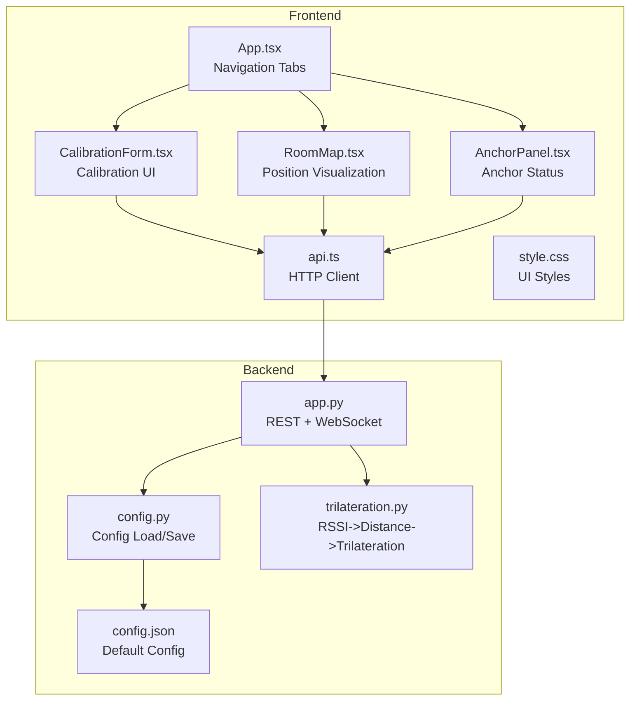
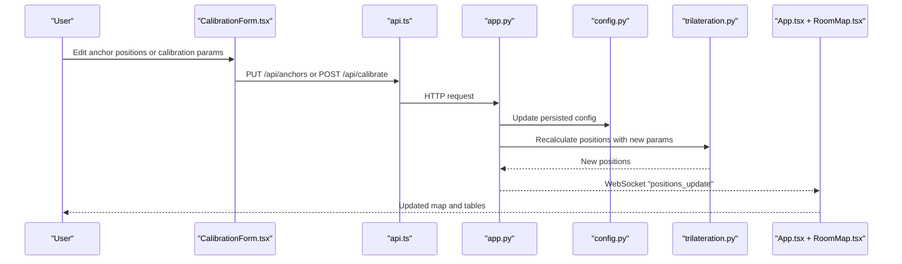
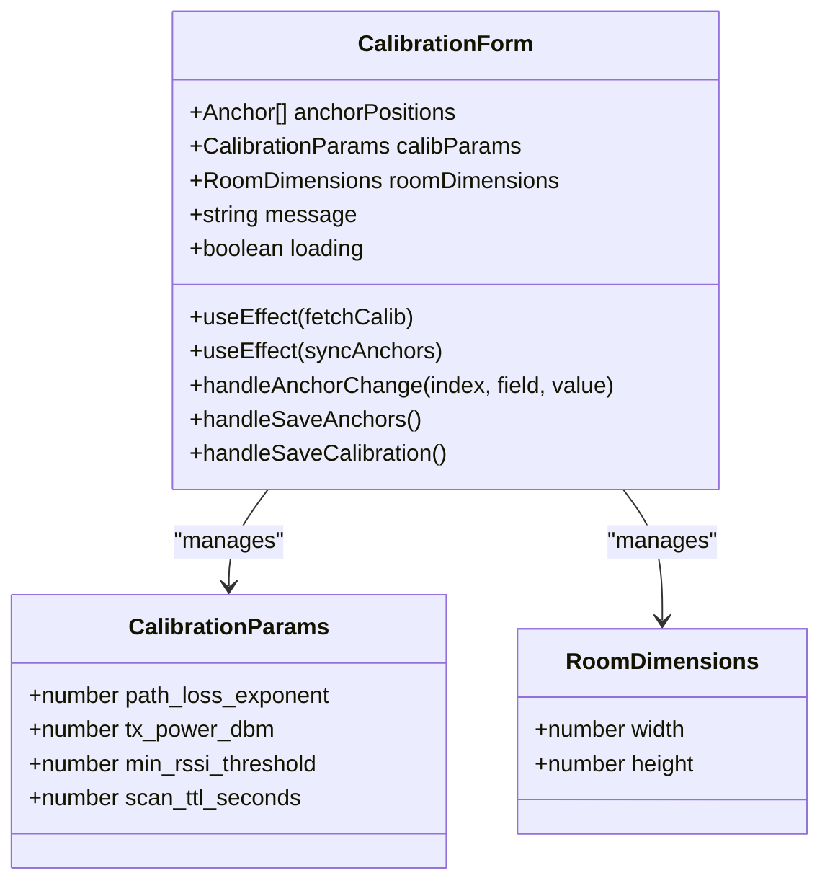
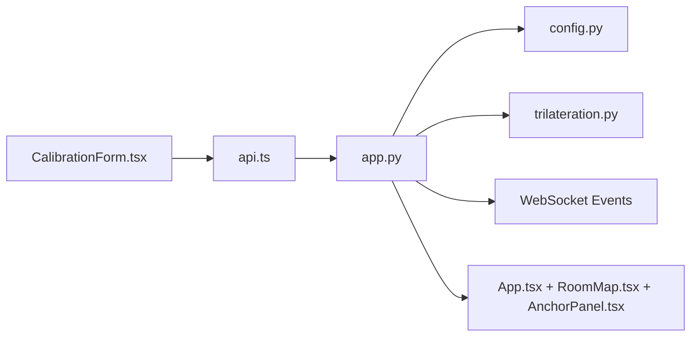

# Calibration Interface

<cite>
**Referenced Files in This Document**
- [CalibrationForm.tsx](file://frontend/src/components/CalibrationForm.tsx)
- [api.ts](file://frontend/src/services/api.ts)
- [App.tsx](file://frontend/src/App.tsx)
- [RoomMap.tsx](file://frontend/src/components/RoomMap.tsx)
- [AnchorPanel.tsx](file://frontend/src/components/AnchorPanel.tsx)
- [style.css](file://frontend/src/style.css)
- [app.py](file://backend/app.py)
- [config.py](file://backend/config.py)
- [trilateration.py](file://backend/trilateration.py)
- [config.json](file://backend/config.json)
</cite>

## Table of Contents
1. [Introduction](#introduction)
2. [Project Structure](#project-structure)
3. [Core Components](#core-components)
4. [Architecture Overview](#architecture-overview)
5. [Detailed Component Analysis](#detailed-component-analysis)
6. [Dependency Analysis](#dependency-analysis)
7. [Performance Considerations](#performance-considerations)
8. [Troubleshooting Guide](#troubleshooting-guide)
9. [Conclusion](#conclusion)
10. [Appendices](#appendices)

## Introduction
This document explains the CalibrationForm component and the calibration page functionality for the BLE Room Positioning System. It covers the form interface for adjusting calibration parameters (path loss exponent, TX power, RSSI thresholds, and scan TTL), real-time parameter validation, input field types, user feedback mechanisms, form submission, API integration, success/error handling, anchor selection integration, parameter persistence, and immediate effects on positioning calculations. It also provides practical examples of validation rules, default value handling, and user guidance for optimal calibration procedures, along with navigation from the dashboard to the calibration view and back.

## Project Structure
The calibration interface spans the frontend React application and the backend Flask service. The frontend includes:
- A dedicated CalibrationForm component that renders the calibration UI and manages state.
- An API service module that encapsulates HTTP calls to the backend.
- Navigation tabs in the main App component to switch between Dashboard and Calibration views.
- Supporting components for displaying room maps and anchor status.

The backend exposes REST endpoints for anchors, positions, scan data, and calibration parameters, and runs periodic trilateration to compute positions and emits updates via WebSocket.

**Diagram sources**
- [App.tsx:177-290](file://frontend/src/App.tsx#L177-L290)
- [CalibrationForm.tsx:30-290](file://frontend/src/components/CalibrationForm.tsx#L30-L290)
- [api.ts:1-66](file://frontend/src/services/api.ts#L1-L66)
- [RoomMap.tsx:28-229](file://frontend/src/components/RoomMap.tsx#L28-L229)
- [AnchorPanel.tsx:30-143](file://frontend/src/components/AnchorPanel.tsx#L30-L143)
- [style.css:320-492](file://frontend/src/style.css#L320-L492)
- [app.py:117-422](file://backend/app.py#L117-L422)
- [config.py:44-95](file://backend/config.py#L44-L95)
- [trilateration.py:11-218](file://backend/trilateration.py#L11-L218)
- [config.json:1-30](file://backend/config.json#L1-L30)

**Section sources**
- [App.tsx:56-290](file://frontend/src/App.tsx#L56-L290)
- [CalibrationForm.tsx:30-290](file://frontend/src/components/CalibrationForm.tsx#L30-L290)
- [api.ts:1-66](file://frontend/src/services/api.ts#L1-L66)
- [app.py:117-422](file://backend/app.py#L117-L422)
- [config.py:44-95](file://backend/config.py#L44-L95)
- [trilateration.py:11-218](file://backend/trilateration.py#L11-L218)
- [config.json:1-30](file://backend/config.json#L1-L30)

## Core Components
- CalibrationForm: Manages anchor positions, calibration parameters, and user feedback. Provides two primary actions: saving anchor positions and saving calibration parameters. Integrates with the API service and displays messages for success or failure.
- API service: Encapsulates HTTP calls to backend endpoints for anchors, positions, scan data, calibration, and health checks.
- App: Hosts navigation tabs between Dashboard and Calibration pages, maintains global state, and orchestrates real-time updates via WebSocket.
- RoomMap and AnchorPanel: Visualize live positions and anchor status; used on the Dashboard to validate calibration effectiveness.
- Backend endpoints: Provide GET/PUT anchors, GET positions, GET/POST calibration, GET scan data, and health checks. Trilateration runs on updates and emits real-time position updates.

Key responsibilities:
- Real-time parameter validation occurs on the frontend via numeric input controls with step and min/max attributes.
- Parameter persistence is handled by the backend configuration file and endpoints.
- Immediate effect on positioning is achieved by re-running trilateration after calibration updates and emitting WebSocket updates.

**Section sources**
- [CalibrationForm.tsx:30-290](file://frontend/src/components/CalibrationForm.tsx#L30-L290)
- [api.ts:13-63](file://frontend/src/services/api.ts#L13-L63)
- [App.tsx:56-290](file://frontend/src/App.tsx#L56-L290)
- [RoomMap.tsx:28-229](file://frontend/src/components/RoomMap.tsx#L28-L229)
- [AnchorPanel.tsx:30-143](file://frontend/src/components/AnchorPanel.tsx#L30-L143)
- [app.py:117-422](file://backend/app.py#L117-L422)

## Architecture Overview
The calibration workflow integrates frontend forms with backend endpoints and real-time updates:

**Diagram sources**
- [CalibrationForm.tsx:75-100](file://frontend/src/components/CalibrationForm.tsx#L75-L100)
- [api.ts:24-51](file://frontend/src/services/api.ts#L24-L51)
- [app.py:248-344](file://backend/app.py#L248-L344)
- [config.py:77-95](file://backend/config.py#L77-L95)
- [trilateration.py:155-218](file://backend/trilateration.py#L155-L218)
- [App.tsx:160-175](file://frontend/src/App.tsx#L160-L175)

## Detailed Component Analysis

### CalibrationForm Component
Responsibilities:
- Initialize state from backend calibration data on mount.
- Allow editing of anchor positions and calibration parameters.
- Persist changes via API calls and show user feedback.
- Provide a guided calibration procedure.

Input field types and validation:
- Numeric inputs with step and min/max attributes for precise tuning.
- Room dimensions inputs are disabled and populated from backend config.
- Anchor position inputs accept decimal steps for fine adjustment.
- Calibration parameters include hints and recommended ranges.

Real-time parameter validation:
- Frontend validation via HTML input attributes ensures values fall within acceptable ranges.
- Fallback conversion to numeric defaults prevents invalid states.

User feedback:
- Success/error messages displayed conditionally.
- Loading state disables buttons during network operations.

Form submission:
- Save Anchor Positions: PUT /api/anchors with array of anchor updates.
- Save Calibration Parameters: POST /api/calibrate with partial parameter object.

Integration with anchor selection and positioning:
- On anchor save, the parent refreshes anchors and room config.
- On calibration save, the backend recalculates positions and emits updates.

Practical examples:
- Path Loss Exponent typical ranges: free space ~2.0, indoor 2.7–3.5, dense walls 3.5–5.0.
- TX Power typical range: -59 to -65 dBm for BLE beacons.
- RSSI Threshold default: -90 dBm; lower values ignore weak signals.
- Scan TTL default: 15 seconds; tune based on anchor freshness requirements.

**Section sources**
- [CalibrationForm.tsx:30-290](file://frontend/src/components/CalibrationForm.tsx#L30-L290)
- [api.ts:24-51](file://frontend/src/services/api.ts#L24-L51)
- [App.tsx:277-287](file://frontend/src/App.tsx#L277-L287)

#### Class Diagram: CalibrationForm State and Methods

**Diagram sources**
- [CalibrationForm.tsx:31-100](file://frontend/src/components/CalibrationForm.tsx#L31-L100)

### API Integration
Endpoints used by the CalibrationForm:
- GET /api/calibrate: Retrieve current calibration parameters and room dimensions.
- PUT /api/anchors: Update anchor positions.
- POST /api/calibrate: Update calibration parameters and trigger recalculation.

Error handling:
- Frontend sets messages on success or failure and logs errors.
- Backend validates request payloads and returns structured error responses.

**Section sources**
- [api.ts:13-63](file://frontend/src/services/api.ts#L13-L63)
- [app.py:306-355](file://backend/app.py#L306-L355)

### Backend Calibration Workflow
On receiving calibration updates:
- Validate allowed keys and extract parameters.
- Persist to configuration file.
- Re-run trilateration for all beacons with new parameters.
- Emit WebSocket positions_update with recalculated results.

Trilateration pipeline:
- RSSI to distance conversion using log-distance path loss model.
- Outlier filtering using median absolute deviation.
- Least-squares trilateration to estimate 2D positions.
- Error estimation and anchor details included in results.

**Section sources**
- [app.py:306-344](file://backend/app.py#L306-L344)
- [trilateration.py:11-218](file://backend/trilateration.py#L11-L218)
- [config.py:89-95](file://backend/config.py#L89-L95)

### Page Navigation: Dashboard to Calibration and Back
Navigation mechanism:
- Two tabs in the header: Dashboard and Calibration.
- Clicking a tab switches the active page state.
- Calibration page mounts the CalibrationForm component and passes anchors and an update callback.

Dashboard integration:
- RoomMap and AnchorPanel consume live positions and anchor status.
- WebSocket updates trigger re-renders and automatic refresh of data.

**Section sources**
- [App.tsx:177-290](file://frontend/src/App.tsx#L177-L290)
- [RoomMap.tsx:28-229](file://frontend/src/components/RoomMap.tsx#L28-L229)
- [AnchorPanel.tsx:30-143](file://frontend/src/components/AnchorPanel.tsx#L30-L143)

## Dependency Analysis
Frontend dependencies:
- CalibrationForm depends on API service for HTTP operations.
- App orchestrates data fetching, WebSocket connections, and page routing.
- RoomMap and AnchorPanel depend on props passed from App.

Backend dependencies:
- app.py depends on config.py for persistent storage and trilateration.py for position computation.
- trilateration.py uses numerical libraries for robust least-squares optimization.

**Diagram sources**
- [CalibrationForm.tsx:1-3](file://frontend/src/components/CalibrationForm.tsx#L1-L3)
- [api.ts:1-10](file://frontend/src/services/api.ts#L1-L10)
- [app.py:13-25](file://backend/app.py#L13-L25)
- [config.py:6-10](file://backend/config.py#L6-L10)
- [trilateration.py:6-8](file://backend/trilateration.py#L6-L8)

**Section sources**
- [CalibrationForm.tsx:1-3](file://frontend/src/components/CalibrationForm.tsx#L1-L3)
- [api.ts:1-10](file://frontend/src/services/api.ts#L1-L10)
- [app.py:13-25](file://backend/app.py#L13-L25)
- [config.py:6-10](file://backend/config.py#L6-L10)
- [trilateration.py:6-8](file://backend/trilateration.py#L6-L8)

## Performance Considerations
- Trilateration runs on each calibration update; keep parameter changes incremental to minimize recomputation overhead.
- Scan TTL affects freshness and recalculation frequency; tune based on anchor reporting cadence.
- WebSocket updates reduce polling overhead; fallback polling is used when WebSocket is unavailable.
- Canvas rendering in RoomMap scales linearly with room size; avoid excessive redraws by updating only when data changes.

[No sources needed since this section provides general guidance]

## Troubleshooting Guide
Common issues and resolutions:
- Backend offline: The header shows a status banner indicating backend unreachability. Ensure the backend server is running on port 5000.
- Anchors not reporting: The health status indicates anchors reporting vs total; wait until all anchors are online.
- No positions displayed: The system requires at least 3 anchors with fresh data; ensure anchors are placed and broadcasting.
- Calibration not taking effect: Confirm that Save Calibration Parameters was clicked and that the backend recalculated positions; verify WebSocket connectivity for real-time updates.
- Invalid input values: Use numeric inputs with step and min/max constraints; defaults prevent invalid states.

**Section sources**
- [App.tsx:208-222](file://frontend/src/App.tsx#L208-L222)
- [App.tsx:108-117](file://frontend/src/App.tsx#L108-L117)
- [CalibrationForm.tsx:182-255](file://frontend/src/components/CalibrationForm.tsx#L182-L255)

## Conclusion
The CalibrationForm provides a focused interface for tuning BLE positioning parameters and anchor locations. Its integration with backend endpoints and WebSocket-driven updates enables immediate feedback on calibration effectiveness. By combining frontend validation, persistent configuration, and robust trilateration, the system supports iterative calibration to achieve accurate indoor localization.

[No sources needed since this section summarizes without analyzing specific files]

## Appendices

### Practical Calibration Procedure
- Place anchors at measured positions and save anchor positions.
- Power on anchors and ensure WiFi connectivity.
- Place a BLE beacon at a known reference point (e.g., room center).
- Observe Dashboard; if calculated position does not match reference, adjust Path Loss Exponent and TX Power.
- Test at multiple reference points to validate accuracy across the room.
- Save calibration parameters to persist changes and trigger immediate recalculation.

**Section sources**
- [CalibrationForm.tsx:269-284](file://frontend/src/components/CalibrationForm.tsx#L269-L284)

### Default Values and Ranges
- Path Loss Exponent: default 2.0; typical ranges: free space ~2.0, indoor 2.7–3.5, dense walls 3.5–5.0.
- TX Power (dBm at 1m): default -59; typical BLE beacons -59 to -65 dBm.
- Min RSSI Threshold (dBm): default -90; lower values ignore weak signals.
- Scan TTL (seconds): default 15; typical 5–60 seconds.

**Section sources**
- [config.json:23-28](file://backend/config.json#L23-L28)
- [CalibrationForm.tsx:182-255](file://frontend/src/components/CalibrationForm.tsx#L182-L255)

### UI Styling Notes
- The calibration page uses a card-based layout with form grids and hint text.
- Buttons are styled with hover and disabled states.
- Messages display success or error outcomes with distinct styles.

**Section sources**
- [style.css:320-492](file://frontend/src/style.css#L320-L492)