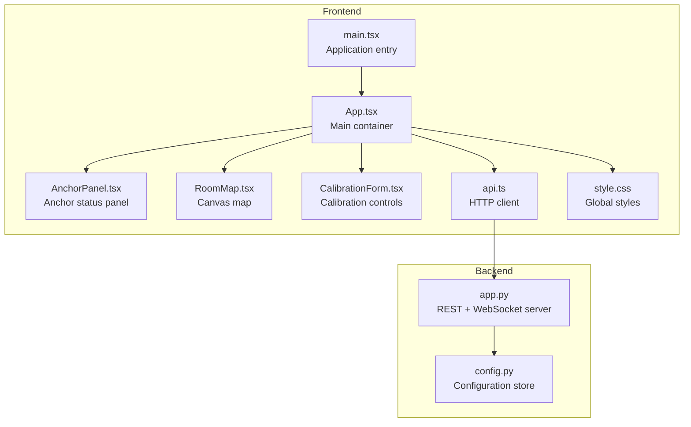
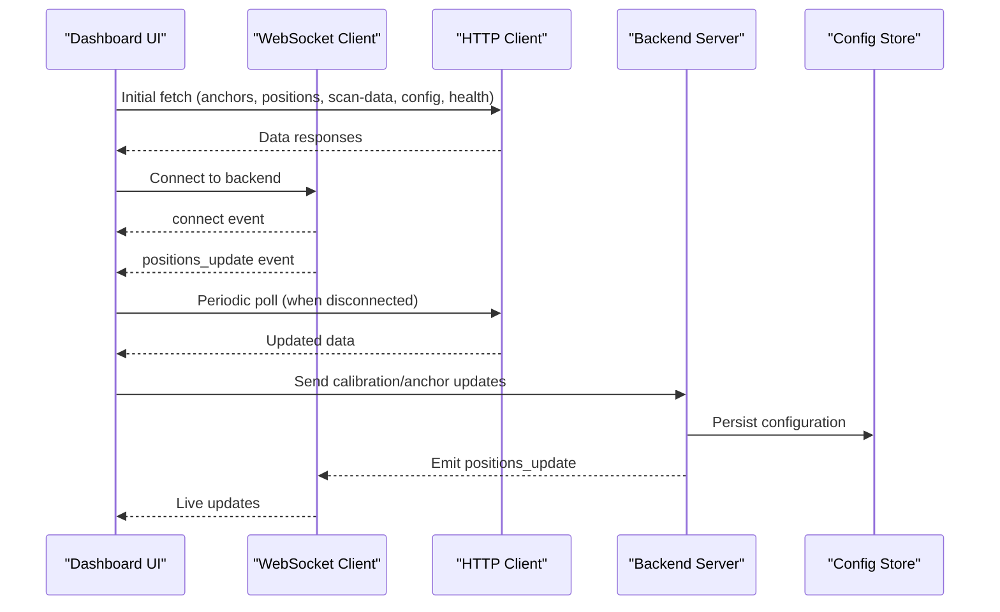
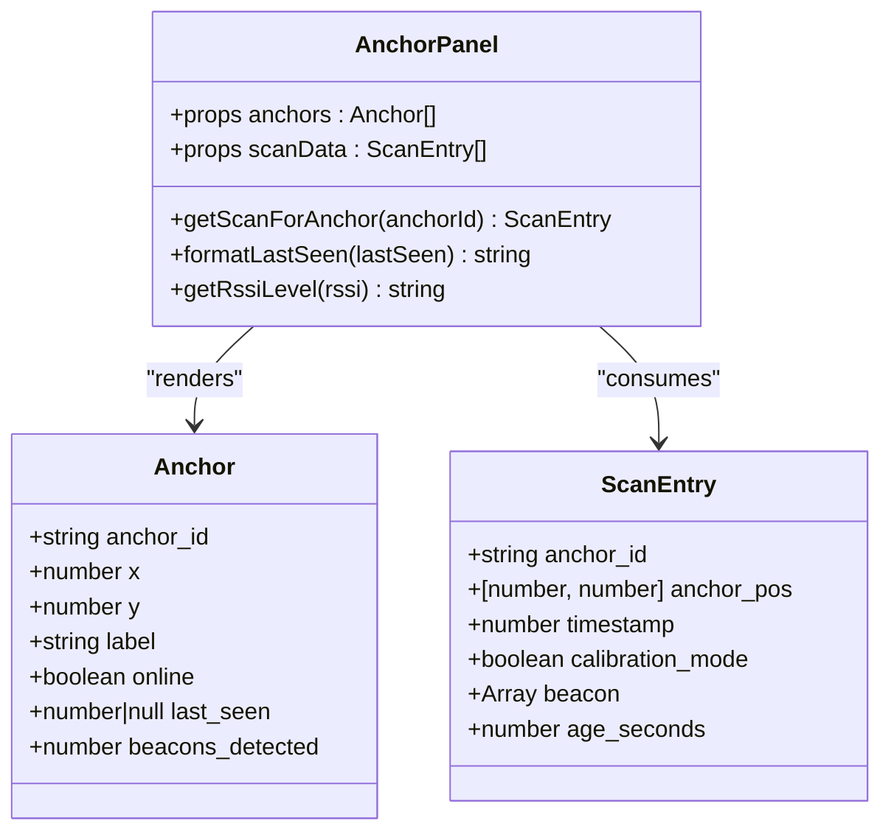
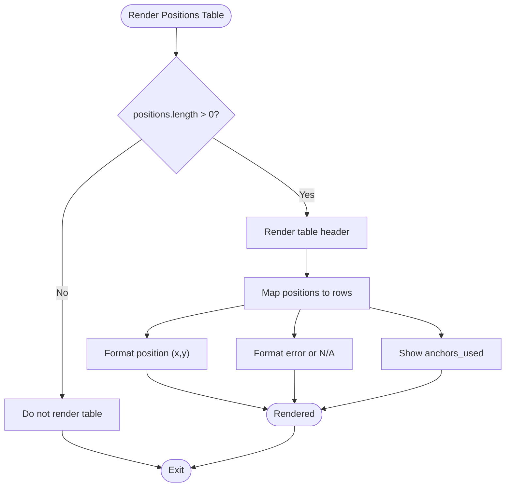
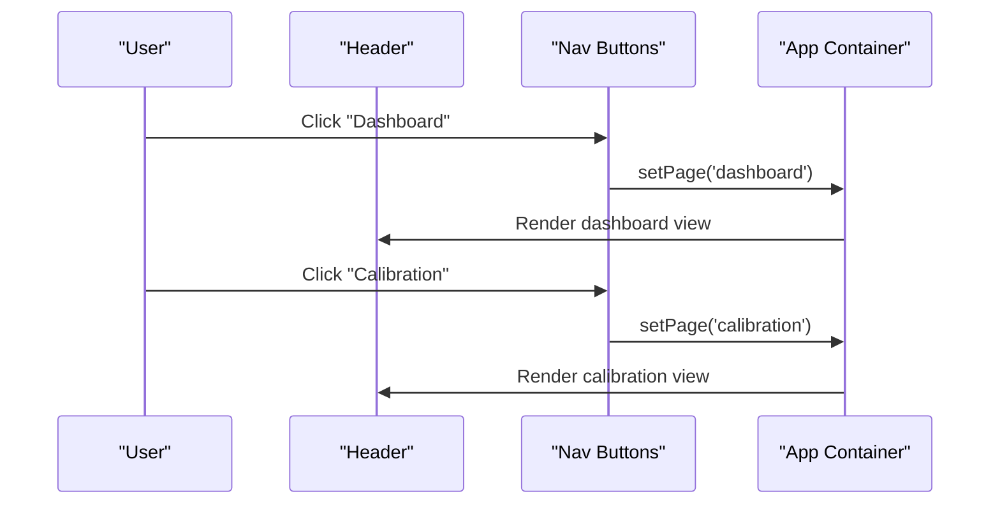
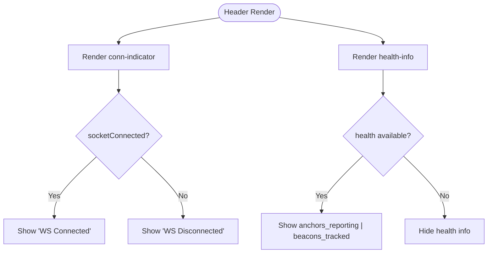
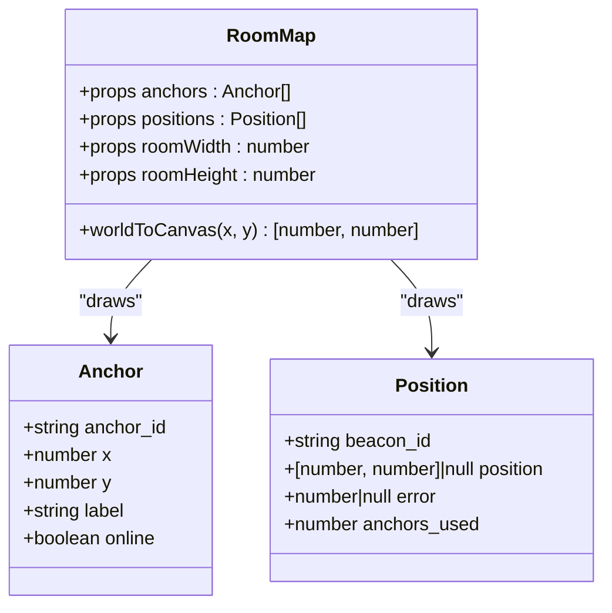
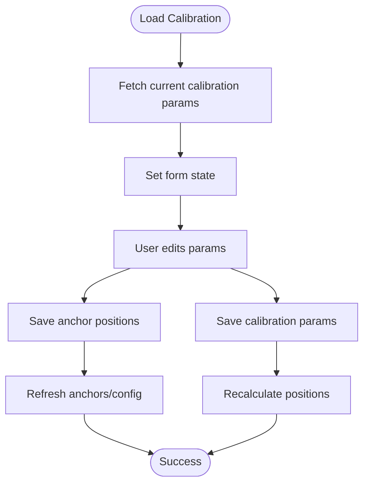
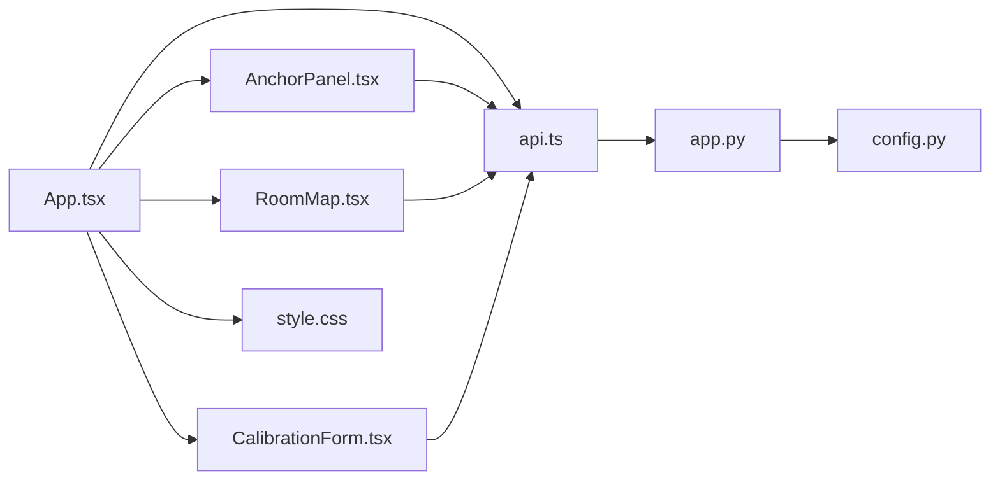

# Dashboard Interface

<cite>
**Referenced Files in This Document**
- [App.tsx](file://frontend/src/App.tsx)
- [AnchorPanel.tsx](file://frontend/src/components/AnchorPanel.tsx)
- [RoomMap.tsx](file://frontend/src/components/RoomMap.tsx)
- [CalibrationForm.tsx](file://frontend/src/components/CalibrationForm.tsx)
- [api.ts](file://frontend/src/services/api.ts)
- [style.css](file://frontend/src/style.css)
- [main.tsx](file://frontend/src/main.tsx)
- [app.py](file://backend/app.py)
- [config.py](file://backend/config.py)
</cite>

## Table of Contents
1. [Introduction](#introduction)
2. [Project Structure](#project-structure)
3. [Core Components](#core-components)
4. [Architecture Overview](#architecture-overview)
5. [Detailed Component Analysis](#detailed-component-analysis)
6. [Dependency Analysis](#dependency-analysis)
7. [Performance Considerations](#performance-considerations)
8. [Troubleshooting Guide](#troubleshooting-guide)
9. [Conclusion](#conclusion)

## Introduction
This document provides comprehensive technical documentation for the dashboard interface components of the BLE Room Positioning System. It focuses on the AnchorPanel component displaying anchor status and beacon detection metrics, the positions summary table with beacon tracking information, the tabbed interface between dashboard and calibration views, and header status indicators for WebSocket connectivity and system health. The document also covers responsive layout design, CSS styling approaches, component composition patterns, data binding, conditional rendering, user interaction handling, real-time updates via WebSockets, polling fallback mechanisms, and error state management.

## Project Structure
The dashboard interface is built with React and TypeScript in the frontend, communicating with a Flask backend that exposes REST APIs and WebSocket endpoints. The frontend components are organized under src/components, with shared styles in src/style.css and service abstractions in src/services/api.ts. The main application entry point is in src/main.tsx, which renders the App component.

**Diagram sources**
- [main.tsx:1-11](file://frontend/src/main.tsx#L1-L11)
- [App.tsx:1-274](file://frontend/src/App.tsx#L1-L274)
- [AnchorPanel.tsx:1-143](file://frontend/src/components/AnchorPanel.tsx#L1-L143)
- [RoomMap.tsx:1-229](file://frontend/src/components/RoomMap.tsx#L1-L229)
- [CalibrationForm.tsx:1-290](file://frontend/src/components/CalibrationForm.tsx#L1-L290)
- [api.ts:1-66](file://frontend/src/services/api.ts#L1-L66)
- [style.css:1-805](file://frontend/src/style.css#L1-L805)
- [app.py:1-398](file://backend/app.py#L1-L398)
- [config.py:1-95](file://backend/config.py#L1-L95)

**Section sources**
- [main.tsx:1-11](file://frontend/src/main.tsx#L1-L11)
- [App.tsx:1-274](file://frontend/src/App.tsx#L1-L274)
- [style.css:1-805](file://frontend/src/style.css#L1-L805)

## Core Components
This section documents the primary dashboard components and their responsibilities:

- AnchorPanel: Displays anchor status cards with connectivity indicators, last seen timestamps, beacon counts, and detected beacon details.
- RoomMap: Renders a canvas-based room map showing anchor positions, beacon locations, and uncertainty circles.
- Positions Summary Table: Lists tracked beacons with position coordinates, error metrics, and anchor usage statistics.
- Tabbed Interface: Switches between Dashboard and Calibration pages with active state management.
- Header Status Indicators: Shows WebSocket connection status and system health metrics.

Key implementation patterns:
- Data binding: Props-driven composition with useState/useEffect for state management.
- Conditional rendering: Visibility toggles based on presence of scan data, calibration mode, and health availability.
- Real-time updates: WebSocket subscriptions with fallback polling when disconnected.
- Error handling: Try/catch blocks around API calls and explicit error state management.

**Section sources**
- [AnchorPanel.tsx:1-143](file://frontend/src/components/AnchorPanel.tsx#L1-L143)
- [RoomMap.tsx:1-229](file://frontend/src/components/RoomMap.tsx#L1-L229)
- [App.tsx:1-274](file://frontend/src/App.tsx#L1-L274)
- [api.ts:1-66](file://frontend/src/services/api.ts#L1-L66)

## Architecture Overview
The dashboard integrates frontend React components with backend services through REST APIs and WebSocket connections. The backend aggregates BLE scan data from ESP32 anchors, runs trilateration calculations, and emits real-time position updates. The frontend polls initial data and subscribes to WebSocket events for live updates.

**Diagram sources**
- [App.tsx:117-172](file://frontend/src/App.tsx#L117-L172)
- [api.ts:13-63](file://frontend/src/services/api.ts#L13-L63)
- [app.py:112-171](file://backend/app.py#L112-L171)
- [app.py:354-377](file://backend/app.py#L354-L377)
- [config.py:44-95](file://backend/config.py#L44-L95)

## Detailed Component Analysis

### AnchorPanel Component
The AnchorPanel displays anchor status cards with connectivity indicators, position details, last seen timestamps, beacon counts, and detected beacon tables. It conditionally renders beacon details and calibration badges based on scan data.

**Diagram sources**
- [AnchorPanel.tsx:1-143](file://frontend/src/components/AnchorPanel.tsx#L1-L143)

Key behaviors:
- Connectivity indicators: Cards use online/offline classes and status dots.
- Timestamp formatting: Human-readable "ago" values derived from last_seen.
- Beacon table: Displays up to five detected beacons with RSSI levels mapped to CSS classes.
- Calibration badge: Appears when scan indicates calibration_mode.

Conditional rendering highlights:
- Beacon table visibility: Only shown when scan data exists and beacons are present.
- More beacons indicator: Shows count of additional beacons beyond the displayed list.
- Calibration badge: Visible when calibration_mode is true.

**Section sources**
- [AnchorPanel.tsx:30-143](file://frontend/src/components/AnchorPanel.tsx#L30-L143)

### Positions Summary Table
The positions summary table presents beacon tracking information including position coordinates, error metrics, and anchor usage statistics. It is conditionally rendered when tracked positions exist.

**Diagram sources**
- [App.tsx:218-252](file://frontend/src/App.tsx#L218-L252)

**Section sources**
- [App.tsx:218-252](file://frontend/src/App.tsx#L218-L252)

### Tabbed Interface: Dashboard and Calibration Views
The application implements a tabbed interface switching between Dashboard and Calibration views. Navigation buttons manage active state and trigger page rendering.

**Diagram sources**
- [App.tsx:174-202](file://frontend/src/App.tsx#L174-L202)
- [App.tsx:257-268](file://frontend/src/App.tsx#L257-L268)

**Section sources**
- [App.tsx:52-52](file://frontend/src/App.tsx#L52-L52)
- [App.tsx:178-191](file://frontend/src/App.tsx#L178-L191)
- [App.tsx:257-268](file://frontend/src/App.tsx#L257-L268)

### Header Status Indicators
The header displays WebSocket connection status and system health metrics. Connection status is indicated by a colored dot and text, while health info shows anchors reporting and beacons tracked.

**Diagram sources**
- [App.tsx:192-201](file://frontend/src/App.tsx#L192-L201)

**Section sources**
- [App.tsx:62-62](file://frontend/src/App.tsx#L62-L62)
- [App.tsx:192-201](file://frontend/src/App.tsx#L192-L201)

### RoomMap Component
The RoomMap component renders a canvas-based room visualization with grid lines, anchor markers, beacon positions, and legends. It converts world coordinates to canvas pixel coordinates and draws geometric shapes for anchors and beacons.

**Diagram sources**
- [RoomMap.tsx:18-23](file://frontend/src/components/RoomMap.tsx#L18-L23)

Rendering highlights:
- Grid overlay: Vertical and horizontal lines every meter.
- Scale indicators: Labels for meter distances along axes.
- Anchor markers: Triangles filled based on online/offline status.
- Beacon markers: Circles with uncertainty areas and error labels.
- Legend: Visual guide for anchors and beacons.

**Section sources**
- [RoomMap.tsx:28-229](file://frontend/src/components/RoomMap.tsx#L28-L229)

### CalibrationForm Component
The CalibrationForm manages room dimensions, anchor positions, and signal calibration parameters. It supports saving anchor positions and calibration settings, with loading states and user feedback messages.

**Diagram sources**
- [CalibrationForm.tsx:44-100](file://frontend/src/components/CalibrationForm.tsx#L44-L100)

**Section sources**
- [CalibrationForm.tsx:30-290](file://frontend/src/components/CalibrationForm.tsx#L30-L290)

## Dependency Analysis
The dashboard components depend on shared services and styles, with the backend providing REST endpoints and WebSocket events.

**Diagram sources**
- [App.tsx:1-12](file://frontend/src/App.tsx#L1-L12)
- [AnchorPanel.tsx:1-28](file://frontend/src/components/AnchorPanel.tsx#L1-L28)
- [RoomMap.tsx:1-23](file://frontend/src/components/RoomMap.tsx#L1-L23)
- [CalibrationForm.tsx:1-28](file://frontend/src/components/CalibrationForm.tsx#L1-L28)
- [api.ts:1-10](file://frontend/src/services/api.ts#L1-L10)
- [style.css:1-12](file://frontend/src/style.css#L1-L12)
- [app.py:1-25](file://backend/app.py#L1-L25)
- [config.py:1-10](file://backend/config.py#L1-L10)

**Section sources**
- [App.tsx:1-12](file://frontend/src/App.tsx#L1-L12)
- [api.ts:1-66](file://frontend/src/services/api.ts#L1-L66)
- [app.py:1-398](file://backend/app.py#L1-L398)
- [config.py:1-95](file://backend/config.py#L1-L95)

## Performance Considerations
- Real-time updates: WebSocket provides low-latency updates; polling fallback ensures resilience when WebSocket is unavailable.
- Rendering efficiency: Canvas drawing in RoomMap is optimized by clearing and redrawing only on prop changes.
- Data fetching: Initial loads and periodic polling balance responsiveness with server load.
- Conditional rendering: Components avoid unnecessary DOM nodes when data is absent.

[No sources needed since this section provides general guidance]

## Troubleshooting Guide
Common issues and resolutions:
- WebSocket disconnection: The header shows "WS Disconnected"; the app falls back to polling. Verify backend connectivity and network configuration.
- No positions displayed: Ensure anchors are reporting and beacons are detected; check calibration parameters and scan TTL.
- Anchor status stuck offline: Confirm scan TTL and server-side freshness checks; verify anchor hardware connectivity.
- Calibration not taking effect: Save calibration parameters and confirm backend recalculations; verify beacon filters if applicable.

Error handling patterns:
- API failures: Try/catch blocks log errors and prevent crashes; health state resets to null on failure.
- WebSocket errors: Error events are logged; UI remains functional via polling.
- Form submissions: Loading states and success/error messages inform users of outcomes.

**Section sources**
- [App.tsx:125-137](file://frontend/src/App.tsx#L125-L137)
- [App.tsx:165-167](file://frontend/src/App.tsx#L165-L167)
- [App.tsx:70-72](file://frontend/src/App.tsx#L70-L72)
- [App.tsx:89-91](file://frontend/src/App.tsx#L89-L91)
- [App.tsx:112-114](file://frontend/src/App.tsx#L112-L114)

## Conclusion
The dashboard interface combines real-time WebSocket updates with resilient polling, structured component composition, and responsive styling to deliver a comprehensive BLE positioning monitoring experience. The AnchorPanel, RoomMap, and Positions Summary Table provide actionable insights into anchor status, beacon tracking, and system health, while the tabbed interface and header indicators streamline navigation and operational awareness.