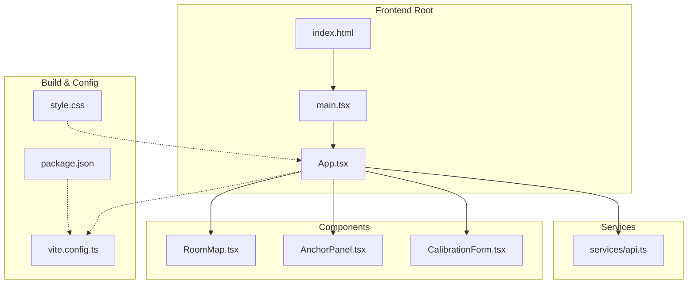
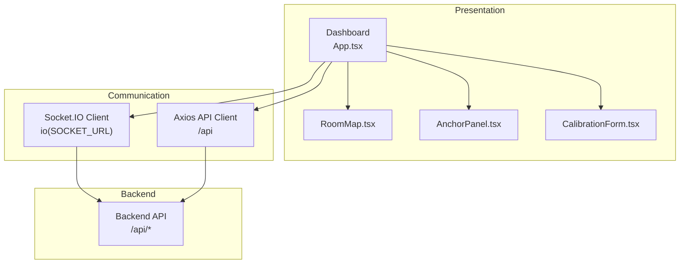
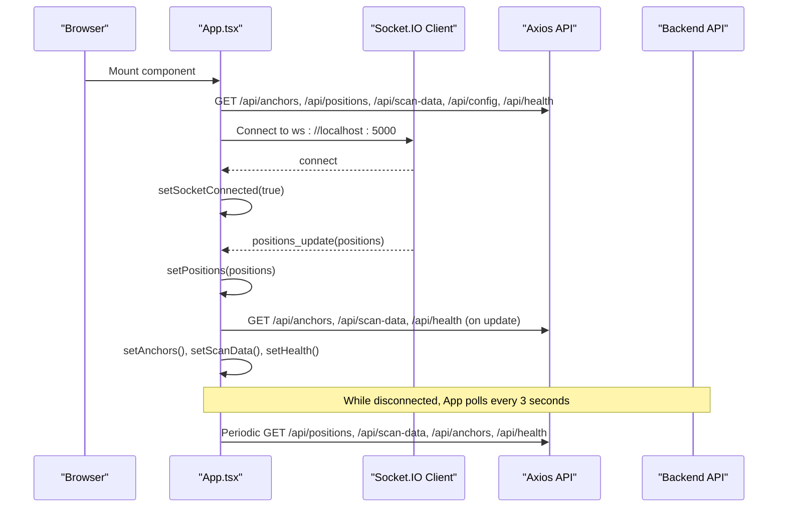
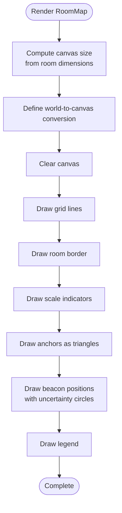
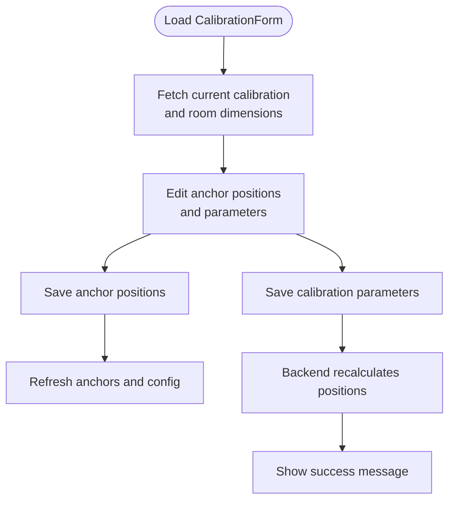
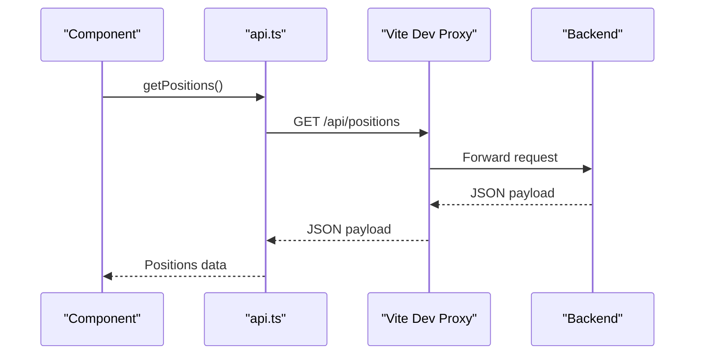
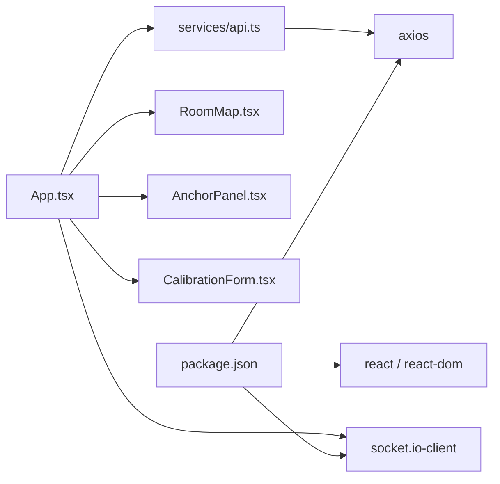

# Frontend Application

<cite>
**Referenced Files in This Document**
- [App.tsx](file://frontend/src/App.tsx)
- [main.tsx](file://frontend/src/main.tsx)
- [RoomMap.tsx](file://frontend/src/components/RoomMap.tsx)
- [AnchorPanel.tsx](file://frontend/src/components/AnchorPanel.tsx)
- [CalibrationForm.tsx](file://frontend/src/components/CalibrationForm.tsx)
- [api.ts](file://frontend/src/services/api.ts)
- [style.css](file://frontend/src/style.css)
- [vite.config.ts](file://frontend/vite.config.ts)
- [package.json](file://frontend/package.json)
- [index.html](file://frontend/index.html)
</cite>

## Table of Contents
1. [Introduction](#introduction)
2. [Project Structure](#project-structure)
3. [Core Components](#core-components)
4. [Architecture Overview](#architecture-overview)
5. [Detailed Component Analysis](#detailed-component-analysis)
6. [Dependency Analysis](#dependency-analysis)
7. [Performance Considerations](#performance-considerations)
8. [Troubleshooting Guide](#troubleshooting-guide)
9. [Conclusion](#conclusion)
10. [Appendices](#appendices)

## Introduction
This document describes the React-based frontend application for a BLE room positioning system. It covers the component architecture, real-time communication via Socket.IO, HTTP API integration, state management, and user interaction patterns. It also provides guidance on responsive design, browser compatibility, performance optimization, and extending the interface with new visualization components and monitoring features.

## Project Structure
The frontend is organized around a small set of React components, a centralized API service layer, and a minimal build configuration. The application renders a dashboard with a RoomMap visualization, an AnchorPanel status monitor, and a CalibrationForm configuration interface. Routing is handled via a simple tabbed navigation within a single-page application.

**Diagram sources**
- [index.html:1-27](file://frontend/index.html#L1-L27)
- [main.tsx:1-11](file://frontend/src/main.tsx#L1-L11)
- [App.tsx:1-274](file://frontend/src/App.tsx#L1-L274)
- [RoomMap.tsx:1-229](file://frontend/src/components/RoomMap.tsx#L1-L229)
- [AnchorPanel.tsx:1-143](file://frontend/src/components/AnchorPanel.tsx#L1-L143)
- [CalibrationForm.tsx:1-290](file://frontend/src/components/CalibrationForm.tsx#L1-L290)
- [api.ts:1-66](file://frontend/src/services/api.ts#L1-L66)
- [vite.config.ts:1-16](file://frontend/vite.config.ts#L1-L16)
- [package.json:1-31](file://frontend/package.json#L1-L31)
- [style.css:1-805](file://frontend/src/style.css#L1-L805)

**Section sources**
- [index.html:1-27](file://frontend/index.html#L1-L27)
- [main.tsx:1-11](file://frontend/src/main.tsx#L1-L11)
- [App.tsx:1-274](file://frontend/src/App.tsx#L1-L274)
- [vite.config.ts:1-16](file://frontend/vite.config.ts#L1-L16)
- [package.json:1-31](file://frontend/package.json#L1-L31)

## Core Components
- App: Central orchestrator managing state, real-time updates, and page routing. It fetches initial data, sets up periodic polling, and establishes a Socket.IO connection for live updates.
- RoomMap: Canvas-based visualization of anchors and tracked beacons with coordinate scaling and legends.
- AnchorPanel: Grid of anchor cards displaying status, position, last-seen timestamps, beacon counts, and recent detections.
- CalibrationForm: Form for adjusting room dimensions, anchor positions, and signal calibration parameters, with feedback messages and guided steps.

Key responsibilities:
- Real-time updates: Socket.IO client listens for positions and health updates, toggling between WebSocket and polling modes.
- HTTP API: Axios-based service encapsulates backend endpoints for positions, anchors, scan data, calibration, and health checks.
- State management: React hooks manage local state for anchors, positions, scan data, room dimensions, health, and socket connection status.

**Section sources**
- [App.tsx:56-271](file://frontend/src/App.tsx#L56-L271)
- [RoomMap.tsx:28-226](file://frontend/src/components/RoomMap.tsx#L28-L226)
- [AnchorPanel.tsx:30-133](file://frontend/src/components/AnchorPanel.tsx#L30-L133)
- [CalibrationForm.tsx:30-286](file://frontend/src/components/CalibrationForm.tsx#L30-L286)
- [api.ts:1-66](file://frontend/src/services/api.ts#L1-L66)

## Architecture Overview
The frontend integrates three primary layers:
- Presentation Layer: React components render UI and handle user interactions.
- Communication Layer: Socket.IO client manages real-time WebSocket connections; Axios handles HTTP requests to the backend API.
- Data Layer: Local state stores application data and drives component rendering.

**Diagram sources**
- [App.tsx:54-172](file://frontend/src/App.tsx#L54-L172)
- [api.ts:3-10](file://frontend/src/services/api.ts#L3-L10)
- [vite.config.ts:8-13](file://frontend/vite.config.ts#L8-L13)

## Detailed Component Analysis

### App Component
Responsibilities:
- Manages page state (dashboard vs calibration).
- Fetches initial data via API service functions.
- Sets up periodic polling fallback when WebSocket is disconnected.
- Establishes Socket.IO connection with reconnection and transport preferences.
- Handles real-time updates for positions and health, and triggers related refreshes.

Real-time behavior:
- On connect/disconnect, updates connection indicator.
- On positions_update, updates positions and refreshes anchors, scan data, and health.
- On error, logs error message.

Routing:
- Tabbed navigation switches between dashboard and calibration views.

State and props:
- Anchors, positions, scan data, room dimensions, health, and socket connection status are managed locally.
- Props passed to child components include anchors, positions, room dimensions, and callbacks.

**Section sources**
- [App.tsx:56-271](file://frontend/src/App.tsx#L56-L271)

### RoomMap Component
Canvas rendering:
- Converts world coordinates (meters) to canvas pixel coordinates using a fixed scale factor and padding.
- Draws room grid, borders, and scale indicators.
- Renders anchors as colored triangles with labels and coordinates.
- Renders beacon positions as circles with uncertainty areas and IDs.

Rendering lifecycle:
- Uses a canvas effect that runs when anchors, positions, room dimensions, or canvas size change.

Interaction patterns:
- No interactive controls; static visualization.

Customization options:
- Scale factor and padding constants can be adjusted for different room sizes.
- Colors and fonts can be tuned via CSS variables.

**Section sources**
- [RoomMap.tsx:28-226](file://frontend/src/components/RoomMap.tsx#L28-L226)

### AnchorPanel Component
Display:
- Grid of anchor cards showing online/offline status, ID, position, last seen, and beacon count.
- For each anchor, shows detected beacons in a table with RSSI levels and TX power.
- Highlights anchors in calibration mode.

Behavior:
- Formats relative time for "last seen".
- Limits beacon list display to a subset with a "more" indicator.

Accessibility:
- Uses semantic markup and readable labels.

**Section sources**
- [AnchorPanel.tsx:30-133](file://frontend/src/components/AnchorPanel.tsx#L30-L133)

### CalibrationForm Component
Inputs:
- Room dimensions (read-only from backend).
- Anchor positions editable per anchor.
- Signal calibration parameters: path loss exponent, TX power reference, RSSI threshold, and scan TTL.

Actions:
- Saves anchor positions and calibration parameters via API service.
- Provides feedback messages for success/error states.
- Guides users through a calibration workflow.

Validation and UX:
- Numeric inputs with step and min/max constraints.
- Disabled saving while loading.

**Section sources**
- [CalibrationForm.tsx:30-286](file://frontend/src/components/CalibrationForm.tsx#L30-L286)

### API Service Layer
Endpoints:
- GET /api/positions: beacon positions and errors.
- GET /api/anchors: anchor configuration and status.
- PUT /api/anchors: update anchor positions.
- GET /api/scan-data: latest raw scan data.
- GET /api/calibrate: calibration parameters and room dimensions.
- POST /api/calibrate: update calibration parameters.
- GET /api/health: system health metrics.
- GET /api/config: full configuration including room dimensions.

HTTP client:
- Axios instance configured with base URL and JSON headers.
- Exported functions encapsulate endpoint calls.

Error handling:
- Functions log failures to console; higher-level components surface messages and disable actions when needed.

**Section sources**
- [api.ts:1-66](file://frontend/src/services/api.ts#L1-L66)

### Real-Time Communication with Socket.IO
Connection setup:
- Creates a Socket.IO client pointing to the backend server URL.
- Enables WebSocket and polling transports, with automatic reconnection and delay.

Events:
- connect: marks connection as established.
- disconnect: marks connection as lost.
- positions_update: receives position updates and refreshes related data.
- error: logs error messages.

Fallback behavior:
- When disconnected, periodic polling ensures data remains current.

**Section sources**
- [App.tsx:139-172](file://frontend/src/App.tsx#L139-L172)

### State Management and Props
State management:
- Local React state holds anchors, positions, scan data, room dimensions, health, and socket connection status.
- Callbacks are used to propagate updates from child components to parent (e.g., CalibrationForm invokes onAnchorsUpdated).

Props:
- RoomMap receives anchors, positions, and room dimensions.
- AnchorPanel receives anchors and scan data.
- CalibrationForm receives anchors and an update callback.

Events:
- Button clicks trigger API calls and state updates.
- Socket.IO events trigger state updates.

**Section sources**
- [App.tsx:58-123](file://frontend/src/App.tsx#L58-L123)
- [RoomMap.tsx:18-23](file://frontend/src/components/RoomMap.tsx#L18-L23)
- [AnchorPanel.tsx:25-28](file://frontend/src/components/AnchorPanel.tsx#L25-L28)
- [CalibrationForm.tsx:25-28](file://frontend/src/components/CalibrationForm.tsx#L25-L28)

### User Interaction Patterns
- Navigation: Clicking tabs switches between dashboard and calibration pages.
- Calibration: Edit anchor positions and parameters, then save; receive immediate feedback.
- Monitoring: View anchor statuses and beacon detections in real-time.
- Visualization: RoomMap displays live positions and uncertainty areas.

Responsive behavior:
- Dashboard layout adapts to single-column on smaller screens.
- Form grids stack on mobile.

**Section sources**
- [App.tsx:174-270](file://frontend/src/App.tsx#L174-L270)
- [style.css:500-508](file://frontend/src/style.css#L500-L508)

## Architecture Overview

**Diagram sources**
- [App.tsx:117-172](file://frontend/src/App.tsx#L117-L172)
- [api.ts:13-57](file://frontend/src/services/api.ts#L13-L57)
- [vite.config.ts:8-13](file://frontend/vite.config.ts#L8-L13)

## Detailed Component Analysis

### RoomMap Rendering Flow

**Diagram sources**
- [RoomMap.tsx:34-214](file://frontend/src/components/RoomMap.tsx#L34-L214)

### Calibration Workflow

**Diagram sources**
- [CalibrationForm.tsx:44-100](file://frontend/src/components/CalibrationForm.tsx#L44-L100)

### API Call Sequence

**Diagram sources**
- [api.ts:13-16](file://frontend/src/services/api.ts#L13-L16)
- [vite.config.ts:8-13](file://frontend/vite.config.ts#L8-L13)

## Dependency Analysis
External libraries:
- React and React DOM for UI rendering.
- Axios for HTTP requests.
- Socket.IO client for WebSocket communication.
- Vite for development server and proxy configuration.

Internal dependencies:
- App imports components and API service.
- Components depend on shared prop types and styles.

**Diagram sources**
- [package.json:12-17](file://frontend/package.json#L12-L17)
- [App.tsx:1-12](file://frontend/src/App.tsx#L1-L12)
- [api.ts:1-1](file://frontend/src/services/api.ts#L1-L1)

**Section sources**
- [package.json:12-17](file://frontend/package.json#L12-L17)
- [App.tsx:1-12](file://frontend/src/App.tsx#L1-L12)
- [api.ts:1-1](file://frontend/src/services/api.ts#L1-L1)

## Performance Considerations
- Canvas rendering: RoomMap uses a single canvas element and clears/re-renders on state changes. For large datasets, consider debouncing updates or limiting render frequency.
- Polling fallback: When disconnected, polling runs every 3 seconds. Adjust intervals based on backend throughput and UI responsiveness needs.
- Image assets: Prefer vector graphics or SVG for icons to reduce bundle size.
- CSS: Leverage CSS variables and media queries for efficient responsive behavior.
- Build optimization: Use production builds for deployment; ensure Vite is configured for optimal asset handling.

[No sources needed since this section provides general guidance]

## Troubleshooting Guide
Common issues and resolutions:
- WebSocket disconnections: The app automatically falls back to polling. Verify backend connectivity and network stability.
- CORS/proxy errors: Ensure Vite proxy targets the correct backend address and origin is changed.
- API timeouts: Increase timeout values in Axios configuration if needed.
- Canvas rendering anomalies: Confirm room dimensions and scale factors are consistent with backend configuration.

**Section sources**
- [App.tsx:125-137](file://frontend/src/App.tsx#L125-L137)
- [vite.config.ts:8-13](file://frontend/vite.config.ts#L8-L13)
- [api.ts:5-10](file://frontend/src/services/api.ts#L5-L10)

## Conclusion
The frontend provides a cohesive, real-time interface for monitoring BLE anchors and tracking beacons within a room. Its modular component architecture, robust API integration, and responsive design enable effective operation across devices. Extending the interface involves adding new visualization components, integrating additional monitoring panels, and customizing room layouts and calibration parameters.

[No sources needed since this section summarizes without analyzing specific files]

## Appendices

### Practical Usage Examples
- Viewing tracked beacons: Switch to the dashboard and observe the RoomMap and positions table updating in real-time.
- Calibrating the system: Navigate to the calibration page, enter anchor positions, and tune signal parameters; save changes to trigger recalculations.
- Monitoring anchor status: Use the AnchorPanel to review online/offline states, last-seen timestamps, and detected beacons.

[No sources needed since this section provides general guidance]

### Customization Options
- RoomMap: Adjust scale factor and padding for different room sizes; modify colors and fonts via CSS.
- CalibrationForm: Add new parameters by extending the form state and API calls; update the backend accordingly.
- Styling: Use CSS variables and media queries to adapt layouts for various screen sizes.

[No sources needed since this section provides general guidance]

### Integration with Backend Services
- Endpoint alignment: Ensure frontend endpoints match backend routes and payloads.
- Authentication: If required, integrate authentication headers in the Axios client.
- Error propagation: Surface backend errors to users with actionable messages.

**Section sources**
- [api.ts:13-63](file://frontend/src/services/api.ts#L13-L63)
- [vite.config.ts:8-13](file://frontend/vite.config.ts#L8-L13)