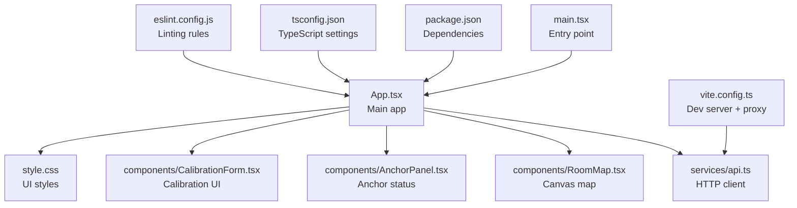
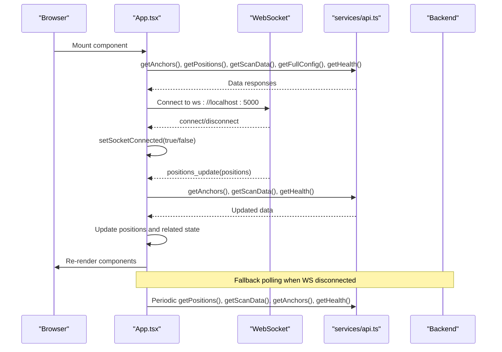
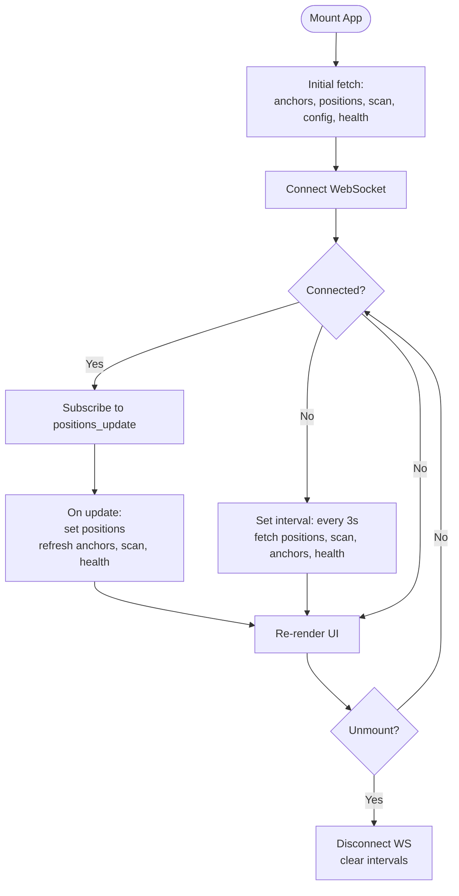
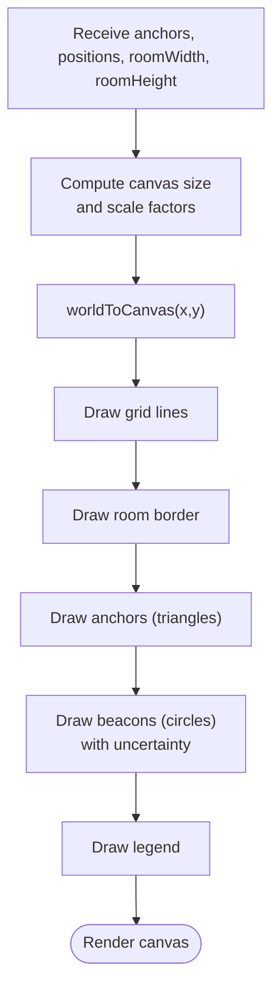
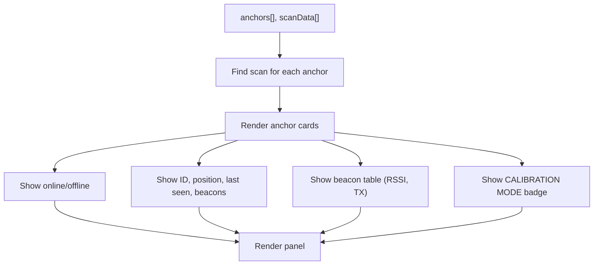
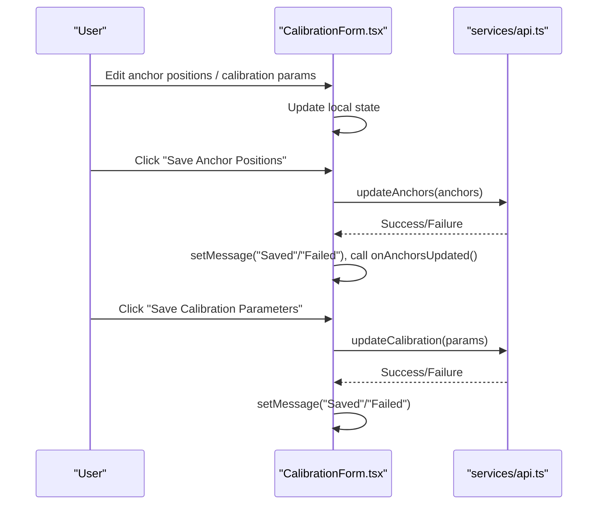
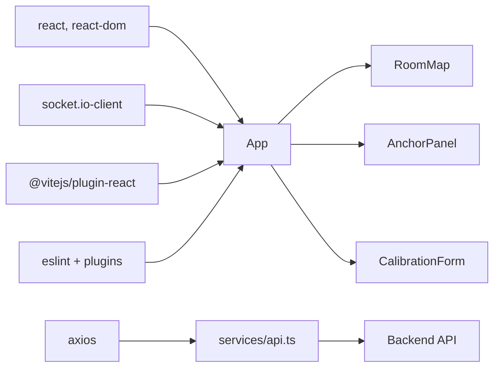

# React Application Architecture

<cite>
**Referenced Files in This Document**
- [App.tsx](file://frontend/src/App.tsx)
- [main.tsx](file://frontend/src/main.tsx)
- [api.ts](file://frontend/src/services/api.ts)
- [RoomMap.tsx](file://frontend/src/components/RoomMap.tsx)
- [AnchorPanel.tsx](file://frontend/src/components/AnchorPanel.tsx)
- [CalibrationForm.tsx](file://frontend/src/components/CalibrationForm.tsx)
- [style.css](file://frontend/src/style.css)
- [vite.config.ts](file://frontend/vite.config.ts)
- [package.json](file://frontend/package.json)
- [tsconfig.json](file://frontend/tsconfig.json)
- [eslint.config.js](file://frontend/eslint.config.js)
</cite>

## Table of Contents
1. [Introduction](#introduction)
2. [Project Structure](#project-structure)
3. [Core Components](#core-components)
4. [Architecture Overview](#architecture-overview)
5. [Detailed Component Analysis](#detailed-component-analysis)
6. [Dependency Analysis](#dependency-analysis)
7. [Performance Considerations](#performance-considerations)
8. [Troubleshooting Guide](#troubleshooting-guide)
9. [Conclusion](#conclusion)
10. [Appendices](#appendices)

## Introduction
This document describes the React application architecture for a BLE room positioning dashboard. It covers the main App component’s state management with useState and useEffect hooks, component composition patterns, routing between dashboard and calibration pages, data fetching strategies using custom hooks and callback functions, error handling, lifecycle management, TypeScript interfaces, and integration with the Vite build system. It also documents fallback polling when WebSocket is unavailable, connection status indicators, and health monitoring integration.

## Project Structure
The frontend is organized around a small set of core files:
- Entry point renders the App component inside Strict Mode.
- App orchestrates state, routing, real-time updates via WebSocket, and periodic polling fallback.
- Services encapsulate API calls to the backend.
- Components render the dashboard map, anchor panel, and calibration form.
- Styles define responsive layouts and status indicators.

**Diagram sources**
- [main.tsx:1-11](file://frontend/src/main.tsx#L1-L11)
- [App.tsx:1-274](file://frontend/src/App.tsx#L1-L274)
- [api.ts:1-66](file://frontend/src/services/api.ts#L1-L66)
- [RoomMap.tsx:1-229](file://frontend/src/components/RoomMap.tsx#L1-L229)
- [AnchorPanel.tsx:1-143](file://frontend/src/components/AnchorPanel.tsx#L1-L143)
- [CalibrationForm.tsx:1-290](file://frontend/src/components/CalibrationForm.tsx#L1-L290)
- [style.css:1-805](file://frontend/src/style.css#L1-L805)
- [vite.config.ts:1-16](file://frontend/vite.config.ts#L1-L16)
- [package.json:1-31](file://frontend/package.json#L1-L31)
- [tsconfig.json:1-25](file://frontend/tsconfig.json#L1-L25)
- [eslint.config.js:1-22](file://frontend/eslint.config.js#L1-L22)

**Section sources**
- [main.tsx:1-11](file://frontend/src/main.tsx#L1-L11)
- [App.tsx:1-274](file://frontend/src/App.tsx#L1-L274)
- [vite.config.ts:1-16](file://frontend/vite.config.ts#L1-L16)
- [package.json:1-31](file://frontend/package.json#L1-L31)
- [tsconfig.json:1-25](file://frontend/tsconfig.json#L1-L25)
- [eslint.config.js:1-22](file://frontend/eslint.config.js#L1-L22)

## Core Components
- App: Central orchestrator managing page state, real-time updates, polling fallback, and health monitoring.
- RoomMap: Canvas-based rendering of anchors and beacon positions with coordinate scaling.
- AnchorPanel: Grid of anchor cards displaying status, coordinates, last-seen, beacon counts, and detected beacons.
- CalibrationForm: Form to edit anchor positions and signal calibration parameters, with save actions and feedback messages.
- API service: Axios-based HTTP client with typed endpoints for positions, anchors, scan data, calibration, health, and config.

Key TypeScript interfaces:
- Anchor: Anchor metadata and connectivity status.
- Position: Trilateration result for a beacon.
- ScanEntry: Latest raw scan data per anchor.
- Configuration objects: Room dimensions and calibration parameters.

**Section sources**
- [App.tsx:14-50](file://frontend/src/App.tsx#L14-L50)
- [RoomMap.tsx:3-23](file://frontend/src/components/RoomMap.tsx#L3-L23)
- [AnchorPanel.tsx:1-28](file://frontend/src/components/AnchorPanel.tsx#L1-L28)
- [CalibrationForm.tsx:4-28](file://frontend/src/components/CalibrationForm.tsx#L4-L28)
- [api.ts:12-63](file://frontend/src/services/api.ts#L12-L63)

## Architecture Overview
The application follows a unidirectional data flow:
- App initializes state and triggers initial fetches.
- Real-time updates arrive via WebSocket; on connect/disconnect, App toggles connection status and subscribes to events.
- On positions_update, App updates positions and refreshes related data.
- When WebSocket is disconnected, App falls back to periodic polling to keep the UI fresh.
- Health endpoint informs header indicators for anchors reporting and beacons tracked.

**Diagram sources**
- [App.tsx:117-172](file://frontend/src/App.tsx#L117-L172)
- [api.ts:13-63](file://frontend/src/services/api.ts#L13-L63)

## Detailed Component Analysis

### App Component
Responsibilities:
- Manages page state (dashboard/calibration).
- Holds application-wide state: anchors, positions, scan data, room dimensions, health, and WebSocket connection status.
- Implements initial data loading and periodic polling fallback.
- Establishes WebSocket connection with reconnection and transport selection.
- Renders navigation tabs and header status indicators.

State management patterns:
- useState for page, anchors, positions, scanData, roomDims, health, socketConnected.
- useCallback for data-fetching functions to stabilize dependencies for effects.
- useEffect for initial fetches and periodic polling; cleanup intervals.
- WebSocket lifecycle: connect, disconnect, error handlers; cleanup on unmount.

Routing:
- Navigation buttons switch page state; conditional rendering selects dashboard or calibration views.

Real-time vs polling:
- On connect, subscribe to positions_update and refresh related data.
- On disconnect, fall back to polling every 3 seconds.

Header status:
- Connection indicator reflects socketConnected.
- Health info displays anchors reporting and beacons tracked.

**Diagram sources**
- [App.tsx:117-172](file://frontend/src/App.tsx#L117-L172)

**Section sources**
- [App.tsx:56-271](file://frontend/src/App.tsx#L56-L271)

### RoomMap Component
Responsibilities:
- Renders a canvas-based room map with anchors and beacon positions.
- Converts world coordinates (meters) to canvas pixel coordinates using a fixed scale factor and padding.
- Draws grid, borders, labels, and legends.
- Draws anchors as triangles (online/offline) and beacons as circles with uncertainty.

Performance considerations:
- Uses a single canvas context and clears/re-draws on state changes.
- Effect dependency array includes anchors, positions, room dimensions, and computed canvas sizes.

**Diagram sources**
- [RoomMap.tsx:28-214](file://frontend/src/components/RoomMap.tsx#L28-L214)

**Section sources**
- [RoomMap.tsx:28-229](file://frontend/src/components/RoomMap.tsx#L28-L229)

### AnchorPanel Component
Responsibilities:
- Displays a grid of anchor cards with status, coordinates, last seen, and beacon counts.
- Shows detected beacons per anchor with RSSI levels and TX power.
- Highlights calibration mode badges.

Utility helpers:
- getScanForAnchor: Matches scan entries to anchors.
- formatLastSeen: Human-readable time since last seen.

**Diagram sources**
- [AnchorPanel.tsx:30-134](file://frontend/src/components/AnchorPanel.tsx#L30-L134)

**Section sources**
- [AnchorPanel.tsx:30-143](file://frontend/src/components/AnchorPanel.tsx#L30-L143)

### CalibrationForm Component
Responsibilities:
- Edits anchor positions and signal calibration parameters.
- Fetches current calibration and room dimensions on mount.
- Saves anchor positions and calibration parameters via API.
- Provides feedback messages and loading states.

State management:
- Local state for anchorPositions, calibParams, roomDimensions, message, loading.
- Synchronizes anchorPositions with incoming anchors via effect.

Event handling:
- Input handlers update local state.
- Save handlers trigger API calls and update UI feedback.

**Diagram sources**
- [CalibrationForm.tsx:30-100](file://frontend/src/components/CalibrationForm.tsx#L30-L100)
- [api.ts:25-51](file://frontend/src/services/api.ts#L25-L51)

**Section sources**
- [CalibrationForm.tsx:30-290](file://frontend/src/components/CalibrationForm.tsx#L30-L290)

### API Service Layer
Responsibilities:
- Creates an Axios instance with base URL pointing to the Vite proxy (/api).
- Exposes typed functions for positions, anchors, scan data, calibration, health, and config.
- Encapsulates HTTP errors and returns response data.

Integration with Vite proxy:
- Requests to /api are proxied to http://localhost:5000 during development.

**Section sources**
- [api.ts:1-66](file://frontend/src/services/api.ts#L1-L66)
- [vite.config.ts:8-14](file://frontend/vite.config.ts#L8-L14)

## Dependency Analysis
External libraries and tooling:
- React and ReactDOM for UI rendering.
- socket.io-client for real-time communication.
- axios for HTTP requests.
- Vite plugin-react for JSX transforms and HMR.
- ESLint with React Hooks and React Refresh plugins.

Build and runtime:
- Vite dev server runs on port 3000 with proxy to backend.
- TypeScript configured for bundler mode with strictness and JSX transform.
- ESLint configuration enforces recommended rules and React-specific checks.

**Diagram sources**
- [package.json:12-28](file://frontend/package.json#L12-L28)
- [vite.config.ts:2](file://frontend/vite.config.ts#L2)
- [App.tsx:1-12](file://frontend/src/App.tsx#L1-L12)
- [api.ts:1](file://frontend/src/services/api.ts#L1)

**Section sources**
- [package.json:12-28](file://frontend/package.json#L12-L28)
- [vite.config.ts:1-16](file://frontend/vite.config.ts#L1-L16)
- [tsconfig.json:10-21](file://frontend/tsconfig.json#L10-L21)
- [eslint.config.js:7-21](file://frontend/eslint.config.js#L7-L21)

## Performance Considerations
- UseEffect dependency stability: useCallback wraps data-fetching functions to prevent unnecessary re-renders when passed to effects.
- Minimal re-renders: Only App holds global state; child components receive props and re-render only when their inputs change.
- Canvas optimization: RoomMap performs a single pass drawing and relies on effect dependencies to redraw efficiently.
- Polling cadence: 3-second intervals balance freshness and resource usage; only active when WebSocket is disconnected.
- Loading states: CalibrationForm disables buttons while saving to prevent concurrent writes.

[No sources needed since this section provides general guidance]

## Troubleshooting Guide
Common issues and remedies:
- WebSocket connection failures:
  - Verify backend is running on port 5000.
  - Check browser console for WebSocket errors.
  - Confirm CORS/proxy settings in development.
- No real-time updates:
  - Ensure positions_update events are emitted by backend.
  - Check App’s socket.on handlers and setSocketConnected logic.
- Stale data:
  - Confirm fallback polling is active when socketConnected is false.
  - Verify periodic interval and fetch functions are invoked.
- Health indicators missing:
  - Ensure getHealth returns expected shape and is fetched on mount and periodically.
- API errors:
  - Inspect console logs for failed fetches.
  - Verify /api proxy targets the correct backend address.

**Section sources**
- [App.tsx:140-172](file://frontend/src/App.tsx#L140-L172)
- [App.tsx:125-137](file://frontend/src/App.tsx#L125-L137)
- [api.ts:54-57](file://frontend/src/services/api.ts#L54-L57)

## Conclusion
The application employs a clean separation of concerns: App manages state and lifecycle, RoomMap and AnchorPanel render visualizations, CalibrationForm handles configuration, and services encapsulate API access. Real-time updates via WebSocket are prioritized with a robust fallback polling mechanism. TypeScript interfaces ensure type safety, and Vite provides a fast development experience with a proxy to the backend.

[No sources needed since this section summarizes without analyzing specific files]

## Appendices

### TypeScript Interfaces Summary
- Anchor: anchor_id, x, y, label, online, last_seen, beacons_detected.
- Position: beacon_id, position, error, anchors_used, method, anchor_details.
- ScanEntry: anchor_id, anchor_pos, timestamp, calibration_mode, beacons, age_seconds.
- Configuration: calibration parameters and room dimensions.

**Section sources**
- [App.tsx:14-50](file://frontend/src/App.tsx#L14-L50)
- [RoomMap.tsx:3-16](file://frontend/src/components/RoomMap.tsx#L3-L16)
- [AnchorPanel.tsx:1-23](file://frontend/src/components/AnchorPanel.tsx#L1-L23)
- [CalibrationForm.tsx:4-23](file://frontend/src/components/CalibrationForm.tsx#L4-L23)

### Vite and Build Configuration Notes
- Dev server: port 3000 with /api proxy to backend.
- React plugin for JSX transforms and HMR.
- TypeScript: bundler mode, JSX transform, strictness.
- ESLint: recommended rules plus React Hooks and React Refresh.

**Section sources**
- [vite.config.ts:4-15](file://frontend/vite.config.ts#L4-L15)
- [tsconfig.json:2-21](file://frontend/tsconfig.json#L2-L21)
- [eslint.config.js:7-21](file://frontend/eslint.config.js#L7-L21)