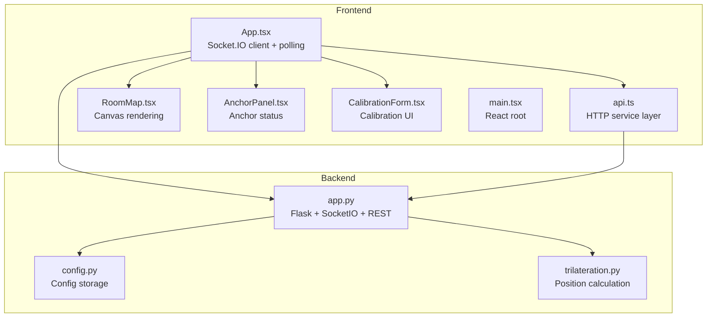
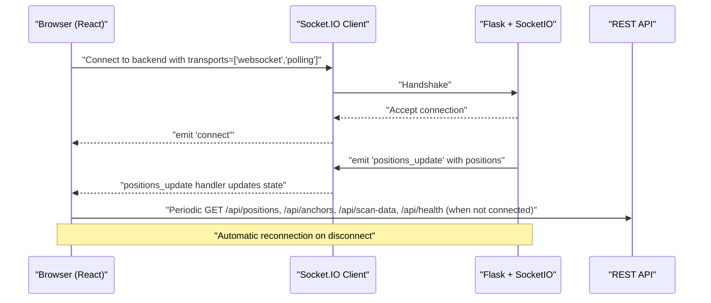
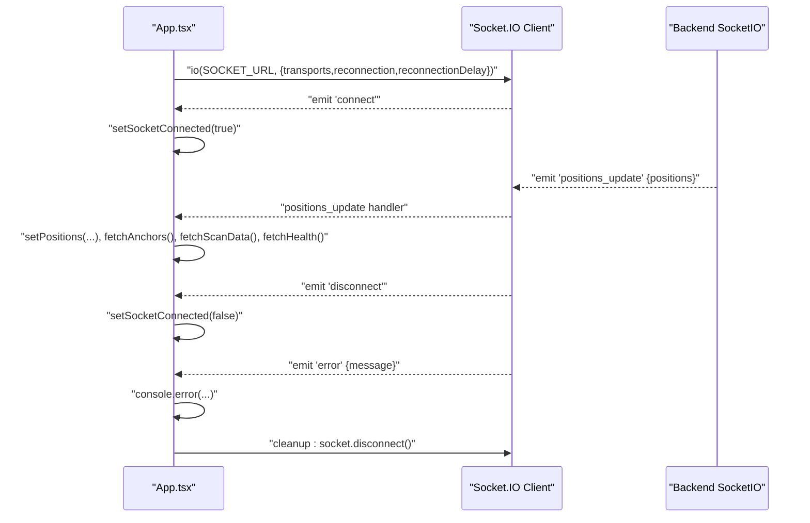
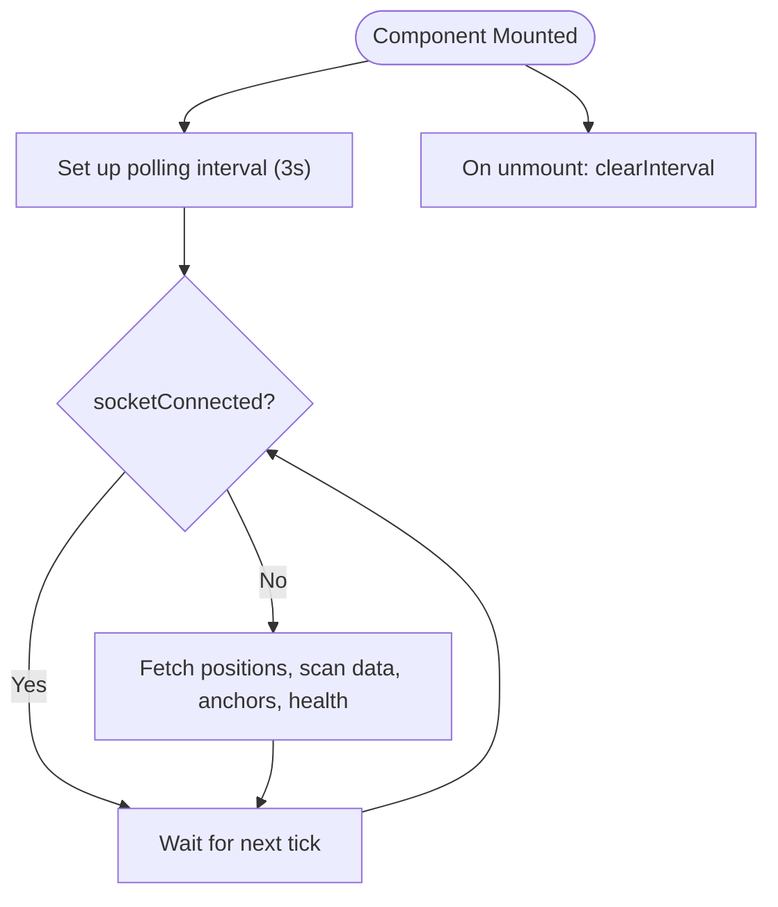
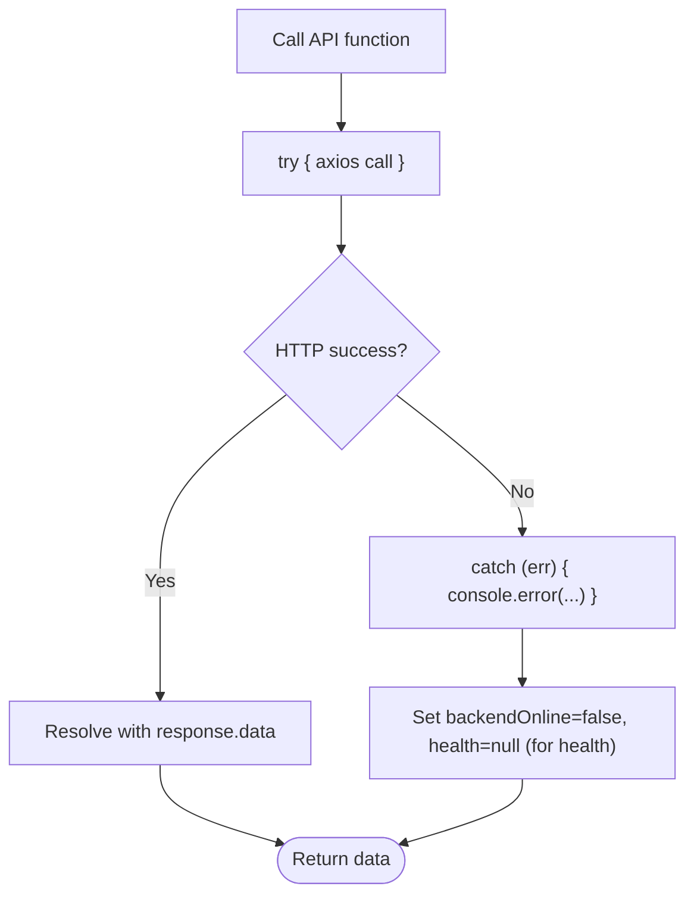
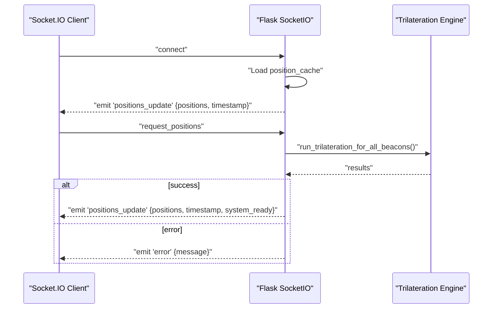
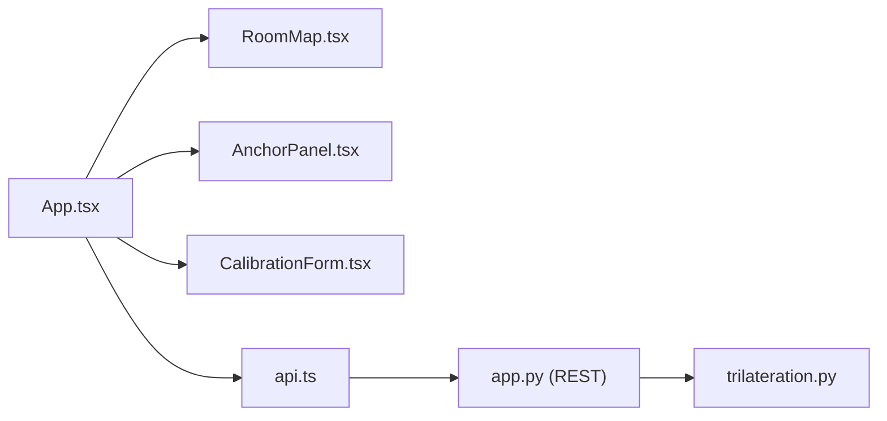
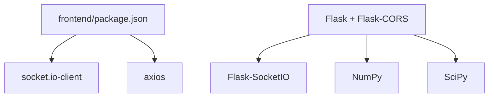

# Real-time Communication

<cite>
**Referenced Files in This Document**
- [App.tsx](file://frontend/src/App.tsx)
- [api.ts](file://frontend/src/services/api.ts)
- [main.tsx](file://frontend/src/main.tsx)
- [RoomMap.tsx](file://frontend/src/components/RoomMap.tsx)
- [AnchorPanel.tsx](file://frontend/src/components/AnchorPanel.tsx)
- [CalibrationForm.tsx](file://frontend/src/components/CalibrationForm.tsx)
- [package.json](file://frontend/package.json)
- [app.py](file://backend/app.py)
- [config.py](file://backend/config.py)
- [trilateration.py](file://backend/trilateration.py)
</cite>

## Table of Contents
1. [Introduction](#introduction)
2. [Project Structure](#project-structure)
3. [Core Components](#core-components)
4. [Architecture Overview](#architecture-overview)
5. [Detailed Component Analysis](#detailed-component-analysis)
6. [Dependency Analysis](#dependency-analysis)
7. [Performance Considerations](#performance-considerations)
8. [Troubleshooting Guide](#troubleshooting-guide)
9. [Conclusion](#conclusion)

## Introduction
This document explains the real-time communication layer built with Socket.IO client in the frontend and the backend server. It covers WebSocket connection establishment with automatic reconnection, transport protocol selection, connection status monitoring, event-driven architecture for receiving positions_update events, connection/disconnection callbacks, and error handling. It also documents the fallback polling mechanism that activates when WebSocket fails, including polling intervals and data refresh strategies. Additionally, it describes the HTTP API service layer for REST requests, error handling patterns, and retry mechanisms. Practical examples demonstrate event listener management, cleanup procedures, and connection lifecycle handling, along with performance considerations, memory leak prevention, and graceful degradation to polling mode.

## Project Structure
The real-time communication spans the frontend React application and the backend Python server:
- Frontend: React app with Socket.IO client, HTTP API service layer, and UI components.
- Backend: Flask app with SocketIO server, REST endpoints, and trilateration engine.

**Diagram sources**
- [App.tsx:1-294](file://frontend/src/App.tsx#L1-L294)
- [api.ts:1-66](file://frontend/src/services/api.ts#L1-L66)
- [RoomMap.tsx:1-229](file://frontend/src/components/RoomMap.tsx#L1-L229)
- [AnchorPanel.tsx:1-143](file://frontend/src/components/AnchorPanel.tsx#L1-L143)
- [CalibrationForm.tsx:1-290](file://frontend/src/components/CalibrationForm.tsx#L1-L290)
- [main.tsx:1-11](file://frontend/src/main.tsx#L1-L11)
- [app.py:1-422](file://backend/app.py#L1-L422)
- [config.py:1-95](file://backend/config.py#L1-L95)
- [trilateration.py:1-218](file://backend/trilateration.py#L1-L218)

**Section sources**
- [App.tsx:1-294](file://frontend/src/App.tsx#L1-L294)
- [api.ts:1-66](file://frontend/src/services/api.ts#L1-L66)
- [main.tsx:1-11](file://frontend/src/main.tsx#L1-L11)
- [app.py:1-422](file://backend/app.py#L1-L422)
- [config.py:1-95](file://backend/config.py#L1-L95)
- [trilateration.py:1-218](file://backend/trilateration.py#L1-L218)

## Core Components
- Socket.IO client in the frontend establishes a WebSocket connection with automatic reconnection and fallback to polling when WebSocket fails. It listens for positions_update events and handles connection/disconnection and error callbacks.
- The backend Flask app runs a SocketIO server that emits positions_update events and exposes REST endpoints for HTTP requests.
- The HTTP API service layer encapsulates Axios-based REST calls for fetching positions, anchors, scan data, calibration parameters, health checks, and full configuration.
- The polling mechanism periodically refreshes data when the WebSocket is not connected.

Key implementation references:
- Socket.IO client initialization and event listeners: [App.tsx:142-175](file://frontend/src/App.tsx#L142-L175)
- Polling fallback interval: [App.tsx:128-140](file://frontend/src/App.tsx#L128-L140)
- HTTP API service functions: [api.ts:13-63](file://frontend/src/services/api.ts#L13-L63)
- Backend SocketIO event handlers: [app.py:378-401](file://backend/app.py#L378-L401)
- Backend REST endpoints: [app.py:121-372](file://backend/app.py#L121-L372)

**Section sources**
- [App.tsx:142-175](file://frontend/src/App.tsx#L142-L175)
- [App.tsx:128-140](file://frontend/src/App.tsx#L128-L140)
- [api.ts:13-63](file://frontend/src/services/api.ts#L13-L63)
- [app.py:378-401](file://backend/app.py#L378-L401)
- [app.py:121-372](file://backend/app.py#L121-L372)

## Architecture Overview
The real-time architecture combines WebSocket and HTTP:
- WebSocket: Real-time push of positions_update events from backend to frontend.
- HTTP: REST API for initial data load and periodic fallback polling when WebSocket is unavailable.
- Trilateration: Backend computes positions from raw scan data and emits updates.

**Diagram sources**
- [App.tsx:142-175](file://frontend/src/App.tsx#L142-L175)
- [App.tsx:128-140](file://frontend/src/App.tsx#L128-L140)
- [app.py:378-401](file://backend/app.py#L378-L401)
- [api.ts:13-63](file://frontend/src/services/api.ts#L13-L63)

## Detailed Component Analysis

### Socket.IO Client Layer (Frontend)
- Connection establishment: Initializes Socket.IO client with transports set to websocket and polling, enabling automatic fallback.
- Automatic reconnection: Enabled with a fixed reconnection delay.
- Event-driven architecture:
  - connect: Sets connection state to true.
  - disconnect: Sets connection state to false.
  - positions_update: Updates positions and triggers refresh of anchors, scan data, and health.
  - error: Logs error messages.
- Lifecycle management: Disconnects socket on component unmount to prevent leaks.

**Diagram sources**
- [App.tsx:142-175](file://frontend/src/App.tsx#L142-L175)

**Section sources**
- [App.tsx:142-175](file://frontend/src/App.tsx#L142-L175)

### Fallback Polling Mechanism
- Purpose: Ensures data refresh when WebSocket is not connected.
- Interval: Every 3 seconds.
- Scope: Fetches positions, scan data, anchors, and health when socketConnected is false.
- Cleanup: Clears interval on component unmount.

**Diagram sources**
- [App.tsx:128-140](file://frontend/src/App.tsx#L128-L140)

**Section sources**
- [App.tsx:128-140](file://frontend/src/App.tsx#L128-L140)

### HTTP API Service Layer (Frontend)
- Base URL: /api
- Axios instance: Configured with base URL and JSON content-type header.
- Functions:
  - getPositions(): GET /api/positions
  - getAnchors(): GET /api/anchors
  - updateAnchors(): PUT /api/anchors
  - getScanData(): GET /api/scan-data
  - getCalibration(): GET /api/calibrate
  - updateCalibration(): POST /api/calibrate
  - getHealth(): GET /api/health
  - getFullConfig(): GET /api/config

Error handling patterns:
- Try/catch around each API call to log failures and avoid unhandled exceptions.
- Health endpoint toggles backendOnline flag and clears health data on failure.

**Diagram sources**
- [api.ts:13-63](file://frontend/src/services/api.ts#L13-L63)
- [App.tsx:108-117](file://frontend/src/App.tsx#L108-L117)

**Section sources**
- [api.ts:1-66](file://frontend/src/services/api.ts#L1-L66)
- [App.tsx:108-117](file://frontend/src/App.tsx#L108-L117)

### Backend SocketIO Events (Python)
- connect: On client connect, emits positions_update with current cached positions and metadata.
- request_positions: On client request, recalculates positions and emits positions_update or error.

**Diagram sources**
- [app.py:378-401](file://backend/app.py#L378-L401)
- [app.py:48-114](file://backend/app.py#L48-L114)
- [trilateration.py:155-218](file://backend/trilateration.py#L155-L218)

**Section sources**
- [app.py:378-401](file://backend/app.py#L378-L401)
- [app.py:48-114](file://backend/app.py#L48-L114)
- [trilateration.py:155-218](file://backend/trilateration.py#L155-L218)

### Backend REST Endpoints (Python)
- Health: GET /api/health
- Positions: GET /api/positions
- Anchors: GET /api/anchors, PUT /api/anchors
- Scan data: GET /api/scan-data
- Calibration: GET /api/calibrate, POST /api/calibrate
- Config: GET /api/config, PUT /api/config

These endpoints are consumed by the frontend’s HTTP API service layer.

**Section sources**
- [app.py:121-372](file://backend/app.py#L121-L372)
- [api.ts:13-63](file://frontend/src/services/api.ts#L13-L63)

### UI Components and Data Flow
- RoomMap: Renders anchors and beacon positions on a canvas, scaled to room dimensions.
- AnchorPanel: Displays anchor status, last seen, and detected beacons.
- CalibrationForm: Allows updating anchor positions and calibration parameters; triggers re-triangulation.

**Diagram sources**
- [App.tsx:224-288](file://frontend/src/App.tsx#L224-L288)
- [RoomMap.tsx:28-229](file://frontend/src/components/RoomMap.tsx#L28-L229)
- [AnchorPanel.tsx:30-143](file://frontend/src/components/AnchorPanel.tsx#L30-L143)
- [CalibrationForm.tsx:30-290](file://frontend/src/components/CalibrationForm.tsx#L30-L290)
- [api.ts:1-66](file://frontend/src/services/api.ts#L1-L66)
- [app.py:121-372](file://backend/app.py#L121-L372)
- [trilateration.py:1-218](file://backend/trilateration.py#L1-L218)

**Section sources**
- [App.tsx:224-288](file://frontend/src/App.tsx#L224-L288)
- [RoomMap.tsx:28-229](file://frontend/src/components/RoomMap.tsx#L28-L229)
- [AnchorPanel.tsx:30-143](file://frontend/src/components/AnchorPanel.tsx#L30-L143)
- [CalibrationForm.tsx:30-290](file://frontend/src/components/CalibrationForm.tsx#L30-L290)

## Dependency Analysis
- Frontend dependencies:
  - socket.io-client for WebSocket and polling transport.
  - axios for HTTP REST calls.
- Backend dependencies:
  - Flask, Flask-CORS, Flask-SocketIO for WebSocket and REST.
  - NumPy and SciPy for numerical trilateration.

**Diagram sources**
- [package.json:12-17](file://frontend/package.json#L12-L17)
- [app.py:23-25](file://backend/app.py#L23-L25)

**Section sources**
- [package.json:12-17](file://frontend/package.json#L12-L17)
- [app.py:23-25](file://backend/app.py#L23-L25)

## Performance Considerations
- Transport selection: Prefer WebSocket for low-latency updates; fallback to polling ensures availability when WebSocket is blocked or unstable.
- Polling interval: 3 seconds strikes a balance between responsiveness and network overhead; adjust based on backend capacity and UI refresh needs.
- Data freshness: Backend maintains scan TTL to filter stale data; frontend avoids unnecessary re-renders by updating only when new positions arrive.
- Canvas rendering: RoomMap scales positions to pixels; ensure efficient redraws by minimizing DOM updates and using refs.
- Memory management: Always disconnect sockets on component unmount and clear intervals to prevent memory leaks.
- Backend computation: Trilateration runs on new scan data; avoid recalculating when not needed by emitting only on significant changes.

[No sources needed since this section provides general guidance]

## Troubleshooting Guide
Common issues and resolutions:
- WebSocket not connecting:
  - Verify backend is running on the expected host/port and CORS allows origins.
  - Check browser console for handshake errors.
  - Confirm transports include both websocket and polling.
- Frequent disconnections:
  - Adjust reconnection delay and enable reconnection to stabilize connectivity.
  - Inspect network stability and firewall rules.
- No real-time updates:
  - Ensure backend emits positions_update after trilateration completes.
  - Confirm frontend listens for positions_update and updates state accordingly.
- Polling not refreshing:
  - Verify socketConnected is false when expecting fallback.
  - Check interval is not cleared prematurely.
- HTTP errors:
  - Wrap API calls in try/catch and log errors.
  - Health endpoint toggles backendOnline; inspect for transient network issues.

**Section sources**
- [App.tsx:142-175](file://frontend/src/App.tsx#L142-L175)
- [App.tsx:128-140](file://frontend/src/App.tsx#L128-L140)
- [api.ts:13-63](file://frontend/src/services/api.ts#L13-L63)
- [app.py:378-401](file://backend/app.py#L378-L401)

## Conclusion
The real-time communication layer integrates Socket.IO for live updates and HTTP REST for reliable fallback. The frontend manages connection lifecycle, event listeners, and polling gracefully, while the backend performs trilateration and emits position updates. Proper error handling, lifecycle cleanup, and transport fallback ensure robust operation under varying network conditions.