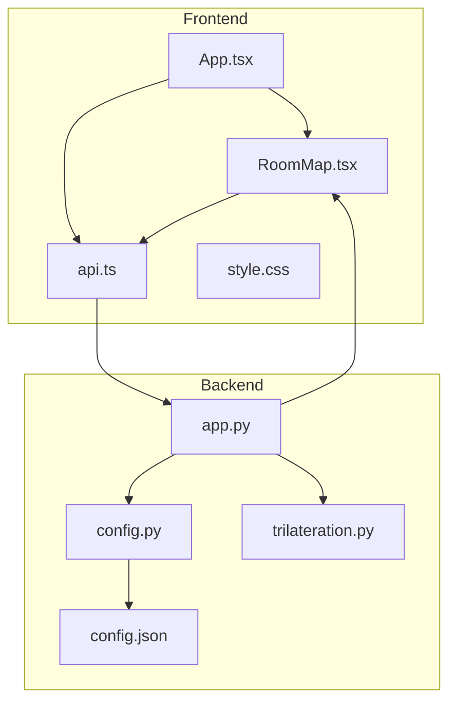
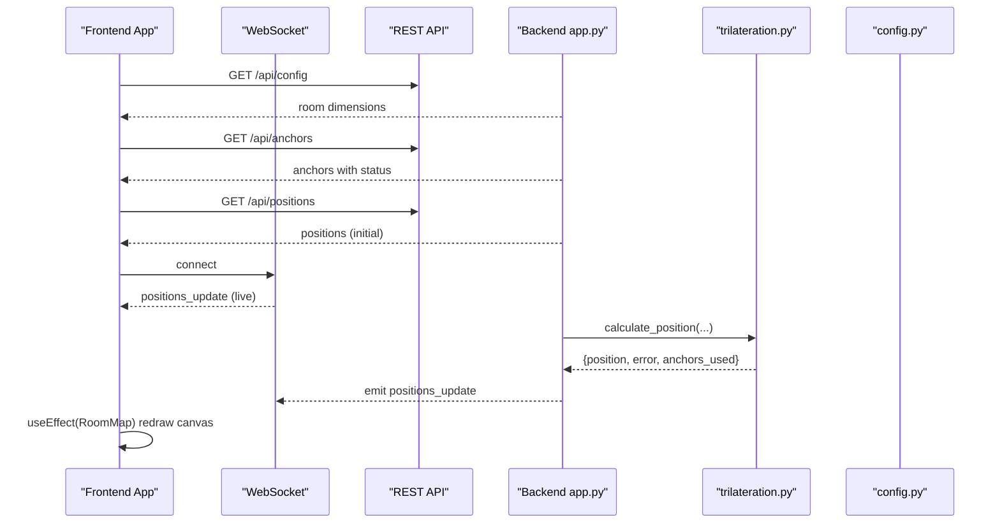
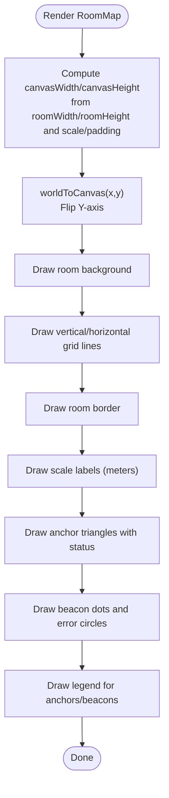
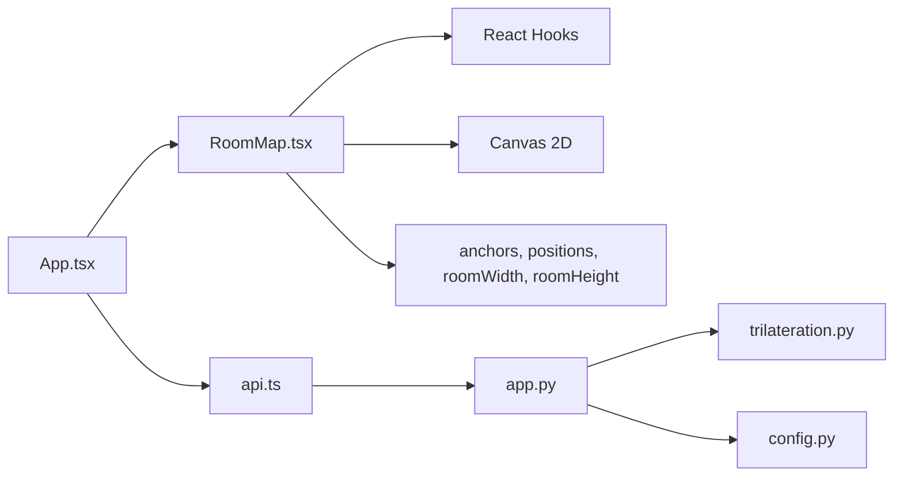

# Visualization Components

<cite>
**Referenced Files in This Document**
- [RoomMap.tsx](file://frontend/src/components/RoomMap.tsx)
- [App.tsx](file://frontend/src/App.tsx)
- [api.ts](file://frontend/src/services/api.ts)
- [style.css](file://frontend/src/style.css)
- [config.py](file://backend/config.py)
- [trilateration.py](file://backend/trilateration.py)
- [app.py](file://backend/app.py)
- [config.json](file://backend/config.json)
</cite>

## Table of Contents
1. [Introduction](#introduction)
2. [Project Structure](#project-structure)
3. [Core Components](#core-components)
4. [Architecture Overview](#architecture-overview)
5. [Detailed Component Analysis](#detailed-component-analysis)
6. [Dependency Analysis](#dependency-analysis)
7. [Performance Considerations](#performance-considerations)
8. [Troubleshooting Guide](#troubleshooting-guide)
9. [Conclusion](#conclusion)
10. [Appendices](#appendices)

## Introduction
This document explains the RoomMap visualization component that renders a canvas-based room layout, anchors, and beacon positions with real-time updates. It covers coordinate transformations from metric meters to screen pixels, scaling and responsiveness, drawing primitives for room boundaries, anchor markers, beacon positions with uncertainty circles, and legends. It also documents mouse interaction handling, zoom and pan capabilities, tooltip generation, customization examples, and performance optimization strategies for frequent redraws and large datasets.

## Project Structure
The RoomMap component lives in the frontend under the components directory and is integrated into the main application. It consumes real-time data from a backend service via REST and WebSocket, and renders a scalable SVG-like canvas overlay using HTML Canvas 2D.

**Diagram sources**
- [RoomMap.tsx:28-229](file://frontend/src/components/RoomMap.tsx#L28-L229)
- [App.tsx:56-274](file://frontend/src/App.tsx#L56-L274)
- [api.ts:1-66](file://frontend/src/services/api.ts#L1-L66)
- [app.py:1-398](file://backend/app.py#L1-L398)
- [config.py:44-95](file://backend/config.py#L44-L95)
- [trilateration.py:155-218](file://backend/trilateration.py#L155-L218)
- [config.json:1-30](file://backend/config.json#L1-L30)

**Section sources**
- [RoomMap.tsx:28-229](file://frontend/src/components/RoomMap.tsx#L28-L229)
- [App.tsx:56-274](file://frontend/src/App.tsx#L56-L274)
- [api.ts:1-66](file://frontend/src/services/api.ts#L1-L66)
- [app.py:1-398](file://backend/app.py#L1-L398)
- [config.py:44-95](file://backend/config.py#L44-L95)
- [trilateration.py:155-218](file://backend/trilateration.py#L155-L218)
- [config.json:1-30](file://backend/config.json#L1-L30)

## Core Components
- RoomMap: Canvas-based renderer that draws room boundaries, grid, anchors, beacon positions, uncertainty circles, and legends. Implements world-to-canvas coordinate transformation and responsive sizing.
- App: Orchestrates real-time data fetching via REST and WebSocket, manages room dimensions, and passes props to RoomMap.
- API service: Encapsulates REST endpoints for anchors, positions, scan data, calibration, and health.
- Backend: Provides REST endpoints and emits WebSocket events for live updates; runs trilateration to compute positions.

Key responsibilities:
- Coordinate transformation: meters to pixels using a fixed scale factor and padding.
- Drawing primitives: rectangles, lines, filled shapes, text, and arcs.
- Real-time updates: WebSocket-driven updates and fallback polling.
- Responsiveness: dynamic canvas sizing based on room dimensions.

**Section sources**
- [RoomMap.tsx:28-229](file://frontend/src/components/RoomMap.tsx#L28-L229)
- [App.tsx:56-274](file://frontend/src/App.tsx#L56-L274)
- [api.ts:1-66](file://frontend/src/services/api.ts#L1-L66)
- [app.py:112-184](file://backend/app.py#L112-L184)

## Architecture Overview
The RoomMap component receives anchor and position data from the backend. Positions are computed by the backend using trilateration and emitted via WebSocket. The frontend polls periodically if WebSocket is unavailable. RoomMap renders a pixel-per-meter grid with padding, draws room borders and scale indicators, and overlays anchor and beacon markers with status and uncertainty.

**Diagram sources**
- [App.tsx:117-172](file://frontend/src/App.tsx#L117-L172)
- [api.ts:13-16](file://frontend/src/services/api.ts#L13-L16)
- [app.py:112-184](file://backend/app.py#L112-L184)
- [app.py:354-377](file://backend/app.py#L354-L377)
- [trilateration.py:155-218](file://backend/trilateration.py#L155-L218)
- [config.py:44-75](file://backend/config.py#L44-L75)

## Detailed Component Analysis

### RoomMap Rendering Pipeline
RoomMap computes canvas dimensions from room width and height, applies a fixed scale factor, and adds padding. It converts world coordinates (meters) to canvas coordinates (pixels) with a flipped Y-axis to match canvas conventions. The effect redraws the room background, grid, border, scale indicators, anchors, and beacons.

**Diagram sources**
- [RoomMap.tsx:28-229](file://frontend/src/components/RoomMap.tsx#L28-L229)
- [RoomMap.tsx:34-40](file://frontend/src/components/RoomMap.tsx#L34-L40)
- [RoomMap.tsx:52-98](file://frontend/src/components/RoomMap.tsx#L52-L98)
- [RoomMap.tsx:100-127](file://frontend/src/components/RoomMap.tsx#L100-L127)
- [RoomMap.tsx:129-168](file://frontend/src/components/RoomMap.tsx#L129-L168)
- [RoomMap.tsx:170-213](file://frontend/src/components/RoomMap.tsx#L170-L213)

**Section sources**
- [RoomMap.tsx:28-229](file://frontend/src/components/RoomMap.tsx#L28-L229)

### Coordinate Transformation and Scaling
- Fixed scale: 50 pixels per meter.
- Padding: 60 pixels around the room area.
- Canvas size: width = roomWidth * scale + padding*2; height = roomHeight * scale + padding*2.
- Conversion: worldToCanvas(x, y) = (PADDING + x*scale, canvasHeight - (PADDING + y*scale)).
- Grid and border are drawn using transformed coordinates.

Responsive considerations:
- Canvas width/height are recomputed when room dimensions change.
- The parent container allows horizontal scrolling to fit large rooms.

**Section sources**
- [RoomMap.tsx:25-32](file://frontend/src/components/RoomMap.tsx#L25-L32)
- [RoomMap.tsx:34-40](file://frontend/src/components/RoomMap.tsx#L34-L40)
- [style.css:118-119](file://frontend/src/style.css#L118-L119)

### Drawing Functions and Elements
- Room background: fills the room rectangle with a light background.
- Grid: draws vertical and horizontal lines every 1 meter.
- Border: outlines the room rectangle.
- Scale indicators: labels every 2 meters along axes.
- Anchors: filled triangles with online/offline coloring; labels and coordinates rendered below.
- Beacons: filled circles with uncertainty error circles; ID and error shown near the marker.
- Legend: small icon/key for anchors and beacons.

Customization hooks:
- Colors and sizes are embedded in the drawing code; can be externalized via props or theme variables.

**Section sources**
- [RoomMap.tsx:52-98](file://frontend/src/components/RoomMap.tsx#L52-L98)
- [RoomMap.tsx:100-127](file://frontend/src/components/RoomMap.tsx#L100-L127)
- [RoomMap.tsx:129-168](file://frontend/src/components/RoomMap.tsx#L129-L168)
- [RoomMap.tsx:170-213](file://frontend/src/components/RoomMap.tsx#L170-L213)

### Real-Time Updates and Data Flow
- WebSocket: listens for positions_update events and updates state.
- Fallback polling: periodic GET requests to REST endpoints when WebSocket is disconnected.
- Backend: trilateration runs on new scan data; emits positions_update with current results.

Integration points:
- RoomMap receives anchors, positions, and room dimensions as props.
- Room dimensions come from backend configuration.

**Section sources**
- [App.tsx:117-172](file://frontend/src/App.tsx#L117-L172)
- [App.tsx:125-137](file://frontend/src/App.tsx#L125-L137)
- [app.py:99-104](file://backend/app.py#L99-L104)
- [app.py:354-377](file://backend/app.py#L354-L377)
- [config.py:44-75](file://backend/config.py#L44-L75)

### Mouse Interaction, Zoom, Pan, and Tooltips
Current implementation:
- No explicit mouse handlers for zoom/pan in RoomMap.
- Tooltips are not implemented in the canvas rendering.

Recommended enhancements:
- Add mousemove/mousedown/mouseup handlers to support panning and zoom gestures.
- Implement hit-testing for anchors and beacons to show tooltips with details.
- Use a separate overlay layer (e.g., a semi-transparent div) for interactive tooltips.

[No sources needed since this section provides enhancement suggestions not present in current code]

### Practical Customization Examples
- Change colors:
  - Modify anchor online/offline colors and beacon dot/error circle colors in the drawing code.
- Adjust marker styles:
  - Change anchor triangle size and beacon dot radius.
- Add new elements:
  - Draw paths between consecutive beacon positions.
  - Render anchor labels differently (e.g., icons or badges).
- Theming:
  - Extract colors and sizes into props or CSS variables for consistent theming.

[No sources needed since this section provides customization ideas not tied to specific code lines]

## Dependency Analysis
RoomMap depends on:
- React hooks (useEffect, useRef) for lifecycle and DOM access.
- Canvas 2D context for drawing.
- Props: anchors, positions, roomWidth, roomHeight.

Integration with App:
- App manages state, WebSocket, and REST calls; passes props to RoomMap.

Backend dependencies:
- Trilateration module for position computation.
- Config module for room dimensions and calibration.

**Diagram sources**
- [RoomMap.tsx:28-229](file://frontend/src/components/RoomMap.tsx#L28-L229)
- [App.tsx:56-274](file://frontend/src/App.tsx#L56-L274)
- [api.ts:1-66](file://frontend/src/services/api.ts#L1-L66)
- [app.py:1-398](file://backend/app.py#L1-L398)
- [trilateration.py:1-218](file://backend/trilateration.py#L1-L218)
- [config.py:44-95](file://backend/config.py#L44-L95)

**Section sources**
- [RoomMap.tsx:28-229](file://frontend/src/components/RoomMap.tsx#L28-L229)
- [App.tsx:56-274](file://frontend/src/App.tsx#L56-L274)
- [api.ts:1-66](file://frontend/src/services/api.ts#L1-L66)
- [app.py:1-398](file://backend/app.py#L1-L398)
- [trilateration.py:1-218](file://backend/trilateration.py#L1-L218)
- [config.py:44-95](file://backend/config.py#L44-L95)

## Performance Considerations
- Frequent redraws:
  - Use requestAnimationFrame for smoother animations if adding zoom/pan transitions.
  - Debounce or throttle WebSocket updates to reduce render pressure.
- Memory management:
  - Avoid retaining references to old contexts; recreate context on mount.
  - Limit the number of drawn elements by filtering out stale or low-priority items.
- Canvas optimization:
  - Batch draw calls; minimize state changes (fillStyle/strokeStyle).
  - Use clipping regions for large rooms to limit redraw area.
- Data efficiency:
  - Send only changed positions over WebSocket; avoid full payload on each update.
  - Cache transformed coordinates when static (e.g., grid lines) and reuse.

[No sources needed since this section provides general guidance]

## Troubleshooting Guide
Common issues and remedies:
- Canvas not updating:
  - Ensure useEffect dependencies include all props driving the render (anchors, positions, roomWidth, roomHeight).
- Incorrect scaling or cropping:
  - Verify scale factor and padding values; confirm worldToCanvas conversion and flipped Y-axis.
- Missing real-time updates:
  - Confirm WebSocket connection state and that positions_update events are emitted by the backend.
- Large room overflow:
  - The parent container enables horizontal scrolling; adjust container styles if needed.

**Section sources**
- [RoomMap.tsx:28-229](file://frontend/src/components/RoomMap.tsx#L28-L229)
- [App.tsx:117-172](file://frontend/src/App.tsx#L117-L172)
- [style.css:118-119](file://frontend/src/style.css#L118-L119)

## Conclusion
RoomMap provides a robust, canvas-based visualization of BLE anchors and beacon positions with real-time updates. Its coordinate transformation and responsive sizing enable accurate rendering across varying room sizes. Extending interactivity (zoom/pan/tooltip) and optimizing rendering will further enhance user experience and performance for larger datasets.

## Appendices

### Coordinate Transformation Reference
- Scale factor: 50 pixels per meter.
- Padding: 60 pixels on all sides.
- Conversion: worldToCanvas(x, y) applies horizontal shift and vertical flip to match canvas coordinates.

**Section sources**
- [RoomMap.tsx:25-40](file://frontend/src/components/RoomMap.tsx#L25-L40)

### Backend Configuration and Trilateration
- Room dimensions and anchors are loaded from backend configuration.
- Trilateration computes positions and errors; backend emits updates via WebSocket.

**Section sources**
- [config.py:44-75](file://backend/config.py#L44-L75)
- [trilateration.py:155-218](file://backend/trilateration.py#L155-L218)
- [app.py:99-104](file://backend/app.py#L99-L104)