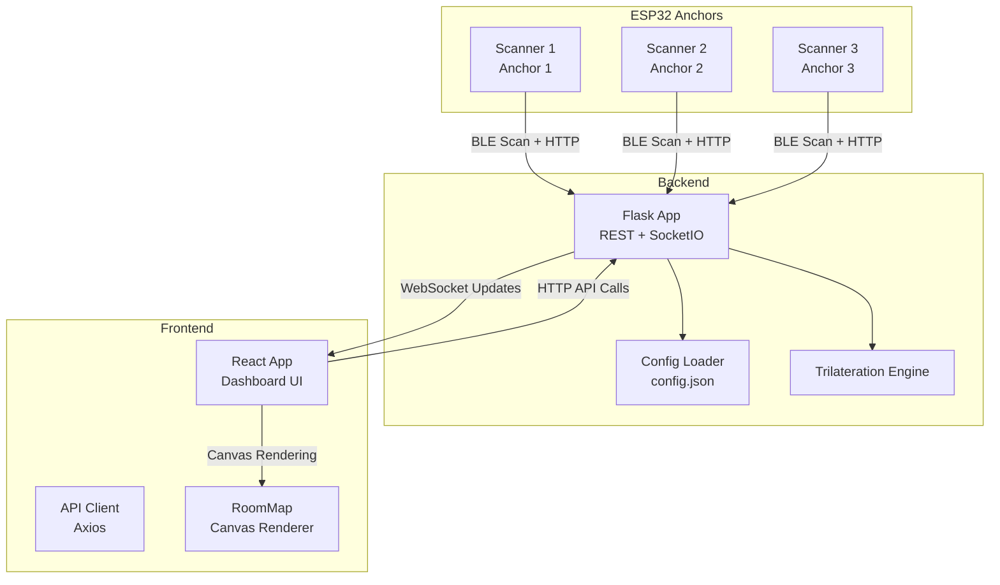
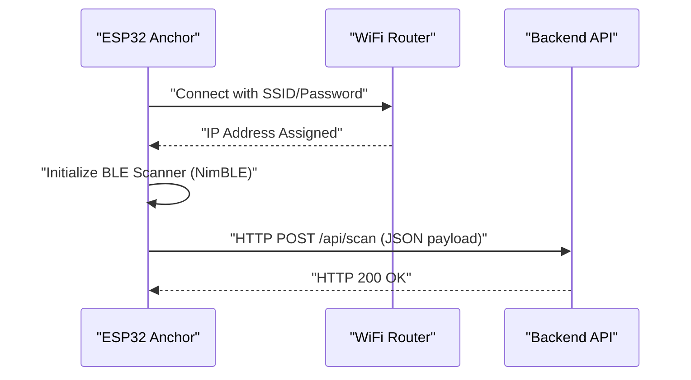
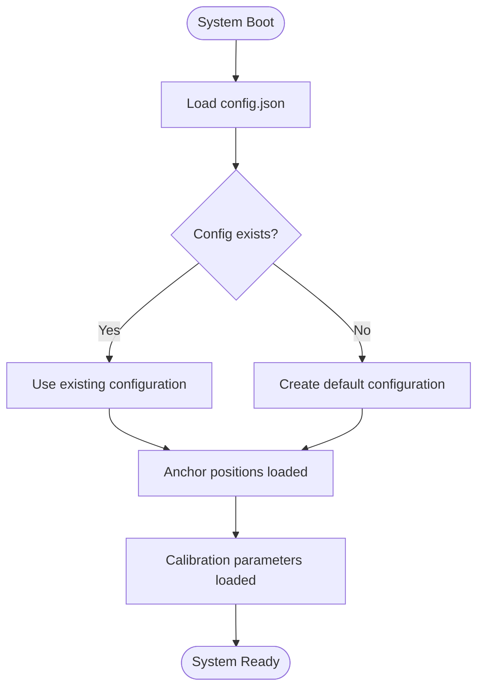
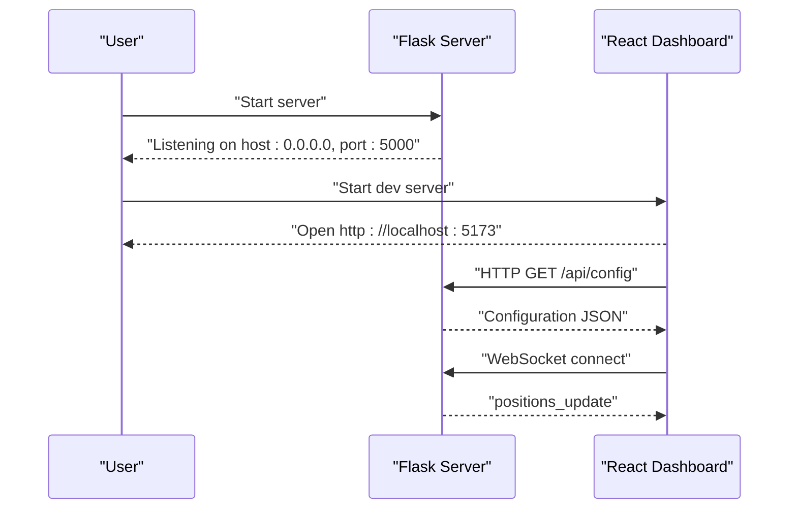
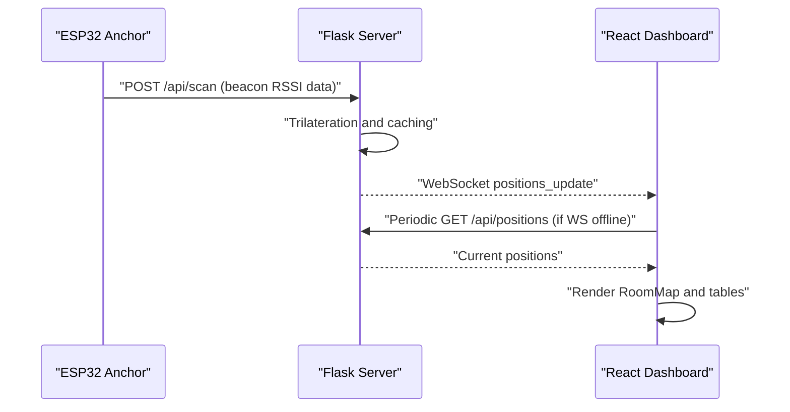
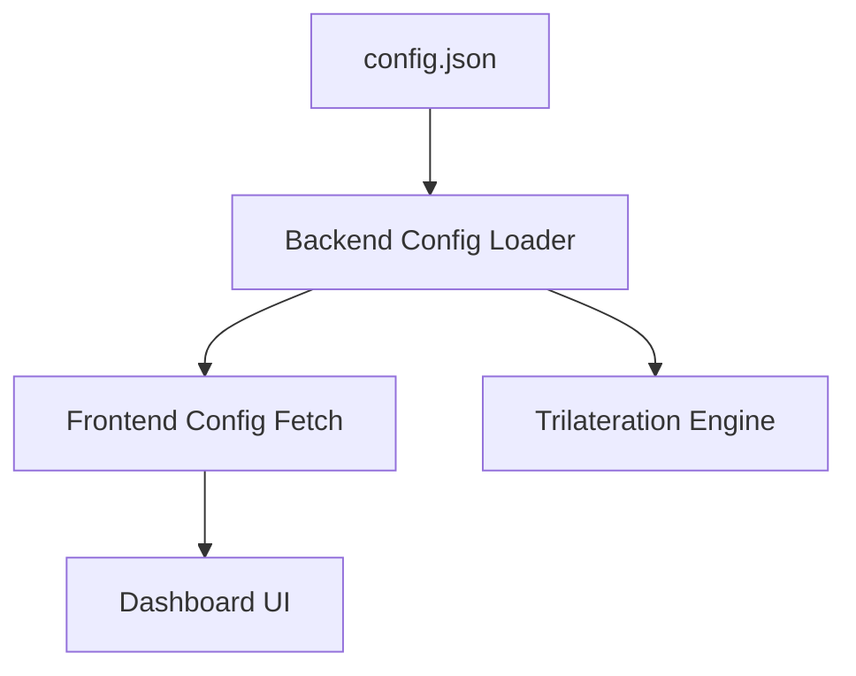
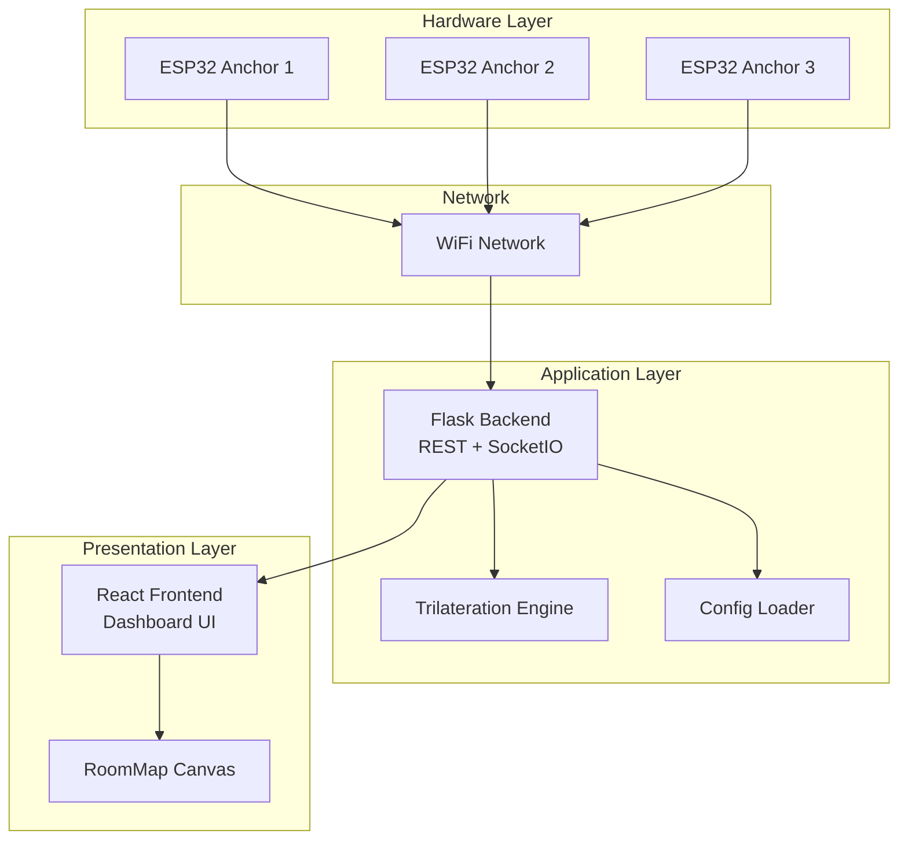

# Getting Started

<cite>
**Referenced Files in This Document**
- [backend/requirements.txt](file://backend/requirements.txt)
- [frontend/package.json](file://frontend/package.json)
- [backend/app.py](file://backend/app.py)
- [backend/config.py](file://backend/config.py)
- [backend/config.json](file://backend/config.json)
- [backend/trilateration.py](file://backend/trilateration.py)
- [frontend/src/App.tsx](file://frontend/src/App.tsx)
- [frontend/src/services/api.ts](file://frontend/src/services/api.ts)
- [frontend/src/components/RoomMap.tsx](file://frontend/src/components/RoomMap.tsx)
- [frontend/src/components/AnchorPanel.tsx](file://frontend/src/components/AnchorPanel.tsx)
- [frontend/src/components/CalibrationForm.tsx](file://frontend/src/components/CalibrationForm.tsx)
- [scanner1/scanner1.ino](file://scanner1/scanner1.ino)
- [scanner2/scanner2.ino](file://scanner2/scanner2.ino)
- [scanner3/scanner3.ino](file://scanner3/scanner3.ino)
</cite>

## Table of Contents
1. [Introduction](#introduction)
2. [Prerequisites](#prerequisites)
3. [Project Structure](#project-structure)
4. [Quick Start Tutorial](#quick-start-tutorial)
5. [Hardware Setup](#hardware-setup)
6. [Initial System Configuration](#initial-system-configuration)
7. [Running the System](#running-the-system)
8. [Real-Time Positioning Verification](#real-time-positioning-verification)
9. [Common Setup Issues and Troubleshooting](#common-setup-issues-and-troubleshooting)
10. [Environment Variables and Configuration](#environment-variables-and-configuration)
11. [Architecture Overview](#architecture-overview)
12. [Conclusion](#conclusion)

## Introduction
This guide helps you quickly set up and run the BLE Room Positioning System. It covers prerequisites, hardware deployment of ESP32 anchors, backend and frontend installation, initial configuration, and end-to-end verification of real-time positioning.

## Prerequisites
Ensure your development environment meets the following requirements:
- Python 3.8 or newer
- Node.js (compatible with the frontend toolchain)
- Arduino IDE with ESP32 board support
- ESP32-C3 boards (one per anchor)
- BLE beacons to track
- Basic understanding of WiFi networks and IP addressing

These requirements align with the project's backend dependencies and frontend toolchain.

**Section sources**
- [backend/requirements.txt:1-7](file://backend/requirements.txt#L1-L7)
- [frontend/package.json:12-28](file://frontend/package.json#L12-L28)

## Project Structure
The repository is organized into three main parts:
- backend: Flask web server, configuration loader, trilateration engine, and API endpoints
- frontend: React-based dashboard with real-time updates via WebSocket
- scanner1/scanner2/scanner3: ESP32-C3 firmware for anchors using NimBLE

**Diagram sources**
- [backend/app.py:23-25](file://backend/app.py#L23-L25)
- [backend/config.py:9-51](file://backend/config.py#L9-L51)
- [backend/trilateration.py:11-33](file://backend/trilateration.py#L11-L33)
- [frontend/src/App.tsx:54-172](file://frontend/src/App.tsx#L54-L172)
- [frontend/src/services/api.ts:3-65](file://frontend/src/services/api.ts#L3-L65)
- [frontend/src/components/RoomMap.tsx:28-229](file://frontend/src/components/RoomMap.tsx#L28-L229)
- [scanner1/scanner1.ino:120-141](file://scanner1/scanner1.ino#L120-L141)

**Section sources**
- [backend/app.py:23-25](file://backend/app.py#L23-L25)
- [frontend/src/App.tsx:54-172](file://frontend/src/App.tsx#L54-L172)
- [scanner1/scanner1.ino:120-141](file://scanner1/scanner1.ino#L120-L141)

## Quick Start Tutorial
Follow these steps to deploy three anchors, configure the backend, run the frontend, and verify real-time positioning.

Step-by-step procedure:
1. Prepare ESP32 anchors
   - Flash scanner1, scanner2, and scanner3 firmware to three ESP32-C3 boards
   - Configure WiFi credentials and backend URL in each sketch
   - Verify serial output shows successful WiFi and BLE initialization

2. Start the backend
   - Install Python dependencies
   - Launch the Flask server with SocketIO

3. Start the frontend
   - Install Node.js dependencies
   - Run the React development server

4. Verify real-time positioning
   - Open the dashboard
   - Confirm anchors appear online and beacon positions update

**Section sources**
- [scanner1/scanner1.ino:28-30](file://scanner1/scanner1.ino#L28-L30)
- [scanner1/scanner1.ino:203-230](file://scanner1/scanner1.ino#L203-L230)
- [backend/requirements.txt:1-7](file://backend/requirements.txt#L1-L7)
- [backend/app.py:383-397](file://backend/app.py#L383-L397)
- [frontend/package.json:6-11](file://frontend/package.json#L6-L11)
- [frontend/src/App.tsx:117-137](file://frontend/src/App.tsx#L117-L137)

## Hardware Setup
Deploy three ESP32 anchors around the room perimeter. Each anchor runs a dedicated sketch that:
- Connects to WiFi with a configurable SSID/password
- Initializes BLE scanning with NimBLE
- Periodically sends scan results to the backend via HTTP POST
- Optionally synchronizes time via NTP

Key hardware steps:
- Flash the appropriate scanner firmware to each ESP32-C3
- Set unique anchor identifiers and positions in the firmware
- Configure WiFi credentials and the backend URL
- Power anchors and confirm serial output indicates successful boot and WiFi connection

**Diagram sources**
- [scanner1/scanner1.ino:62-79](file://scanner1/scanner1.ino#L62-L79)
- [scanner1/scanner1.ino:221-229](file://scanner1/scanner1.ino#L221-L229)
- [scanner1/scanner1.ino:120-141](file://scanner1/scanner1.ino#L120-L141)
- [backend/app.py:123-171](file://backend/app.py#L123-L171)

**Section sources**
- [scanner1/scanner1.ino:28-30](file://scanner1/scanner1.ino#L28-L30)
- [scanner1/scanner1.ino:203-230](file://scanner1/scanner1.ino#L203-L230)
- [scanner1/scanner1.ino:120-141](file://scanner1/scanner1.ino#L120-L141)

## Initial System Configuration
Configure room dimensions, anchor positions, and calibration parameters to match your physical setup.

Backend configuration:
- Room dimensions and anchor positions are defined in the configuration file
- Calibration parameters include path loss exponent, TX power, RSSI threshold, and scan TTL
- The configuration loader reads and writes to the configuration file

Frontend integration:
- The dashboard fetches configuration and displays room dimensions
- Calibration controls allow updating anchor positions and calibration parameters

**Diagram sources**
- [backend/config.py:44-57](file://backend/config.py#L44-L57)
- [backend/config.json:1-30](file://backend/config.json#L1-L30)
- [frontend/src/App.tsx:93-105](file://frontend/src/App.tsx#L93-L105)

**Section sources**
- [backend/config.py:9-51](file://backend/config.py#L9-L51)
- [backend/config.json:1-30](file://backend/config.json#L1-L30)
- [frontend/src/App.tsx:93-105](file://frontend/src/App.tsx#L93-L105)

## Running the System
Start the backend and frontend applications to serve the dashboard and process BLE data.

Backend startup:
- Install dependencies using the provided requirements file
- Run the Flask application with SocketIO enabled
- The server logs room dimensions, anchor count, and calibration parameters

Frontend startup:
- Install dependencies using the provided package manifest
- Start the development server
- Access the dashboard in a browser

**Diagram sources**
- [backend/requirements.txt:1-7](file://backend/requirements.txt#L1-L7)
- [backend/app.py:383-397](file://backend/app.py#L383-L397)
- [frontend/package.json:6-11](file://frontend/package.json#L6-L11)
- [frontend/src/App.tsx:140-172](file://frontend/src/App.tsx#L140-L172)

**Section sources**
- [backend/app.py:383-397](file://backend/app.py#L383-L397)
- [frontend/src/App.tsx:117-137](file://frontend/src/App.tsx#L117-L137)

## Real-Time Positioning Verification
Once anchors are deployed and the system is running, verify real-time positioning by checking the dashboard.

What to observe:
- Anchors appear as online markers on the room map
- Beacon positions update dynamically with uncertainty circles
- The positions summary table shows calculated coordinates and error metrics

**Diagram sources**
- [backend/app.py:123-171](file://backend/app.py#L123-L171)
- [backend/trilateration.py:155-218](file://backend/trilateration.py#L155-L218)
- [frontend/src/App.tsx:157-163](file://frontend/src/App.tsx#L157-L163)
- [frontend/src/App.tsx:174-271](file://frontend/src/App.tsx#L174-L271)

**Section sources**
- [backend/app.py:123-171](file://backend/app.py#L123-L171)
- [backend/trilateration.py:155-218](file://backend/trilateration.py#L155-L218)
- [frontend/src/App.tsx:157-163](file://frontend/src/App.tsx#L157-L163)

## Common Setup Issues and Troubleshooting
Below are typical problems and their solutions:

- Backend fails to start due to missing dependencies
  - Ensure all Python packages from the requirements file are installed
  - Verify the correct Python interpreter is used

- Frontend build or runtime errors
  - Install Node.js dependencies as defined in the package manifest
  - Check for port conflicts (default frontend port differs from backend)

- ESP32 anchor cannot connect to WiFi
  - Confirm SSID and password are correct in the firmware
  - Ensure the router allows station connections and the ESP32 is within range

- No real-time updates in the dashboard
  - Verify WebSocket connectivity and backend logs
  - Check that anchors are sending scan data to the backend URL

- Incorrect or missing beacon positions
  - Adjust calibration parameters (path loss exponent, TX power, RSSI threshold)
  - Recalculate positions after changing parameters

- Anchor positions not reflected in the dashboard
  - Save updated anchor positions from the calibration form
  - Refresh the dashboard to fetch the latest configuration

**Section sources**
- [backend/requirements.txt:1-7](file://backend/requirements.txt#L1-L7)
- [frontend/package.json:6-11](file://frontend/package.json#L6-L11)
- [scanner1/scanner1.ino:28-30](file://scanner1/scanner1.ino#L28-L30)
- [frontend/src/App.tsx:140-172](file://frontend/src/App.tsx#L140-L172)
- [frontend/src/components/CalibrationForm.tsx:75-100](file://frontend/src/components/CalibrationForm.tsx#L75-L100)

## Environment Variables and Configuration
Environment configuration is handled centrally in the backend configuration file and consumed by both backend and frontend components.

Backend configuration highlights:
- Room dimensions and anchor positions
- Calibration parameters (path loss exponent, TX power, RSSI threshold, scan TTL)
- Beacon filters (optional)

Frontend configuration highlights:
- Room dimensions are fetched from the backend configuration
- Calibration parameters are editable via the calibration form

**Diagram sources**
- [backend/config.json:1-30](file://backend/config.json#L1-L30)
- [backend/config.py:44-57](file://backend/config.py#L44-L57)
- [frontend/src/App.tsx:93-105](file://frontend/src/App.tsx#L93-L105)

**Section sources**
- [backend/config.json:1-30](file://backend/config.json#L1-L30)
- [backend/config.py:44-57](file://backend/config.py#L44-L57)
- [frontend/src/App.tsx:93-105](file://frontend/src/App.tsx#L93-L105)

## Architecture Overview
The system architecture integrates hardware anchors, a backend server, and a real-time frontend dashboard.

**Diagram sources**
- [scanner1/scanner1.ino:120-141](file://scanner1/scanner1.ino#L120-L141)
- [backend/app.py:23-25](file://backend/app.py#L23-L25)
- [backend/trilateration.py:11-33](file://backend/trilateration.py#L11-L33)
- [backend/config.py:9-51](file://backend/config.py#L9-L51)
- [frontend/src/App.tsx:174-271](file://frontend/src/App.tsx#L174-L271)
- [frontend/src/components/RoomMap.tsx:28-229](file://frontend/src/components/RoomMap.tsx#L28-L229)

**Section sources**
- [backend/app.py:23-25](file://backend/app.py#L23-L25)
- [backend/trilateration.py:11-33](file://backend/trilateration.py#L11-L33)
- [frontend/src/App.tsx:174-271](file://frontend/src/App.tsx#L174-L271)

## Conclusion
You now have the essentials to deploy and operate the BLE Room Positioning System. Start with hardware anchors, install backend and frontend dependencies, configure room and anchor parameters, and verify real-time positioning through the dashboard. Use the troubleshooting section to resolve common issues and refine accuracy with calibration adjustments.