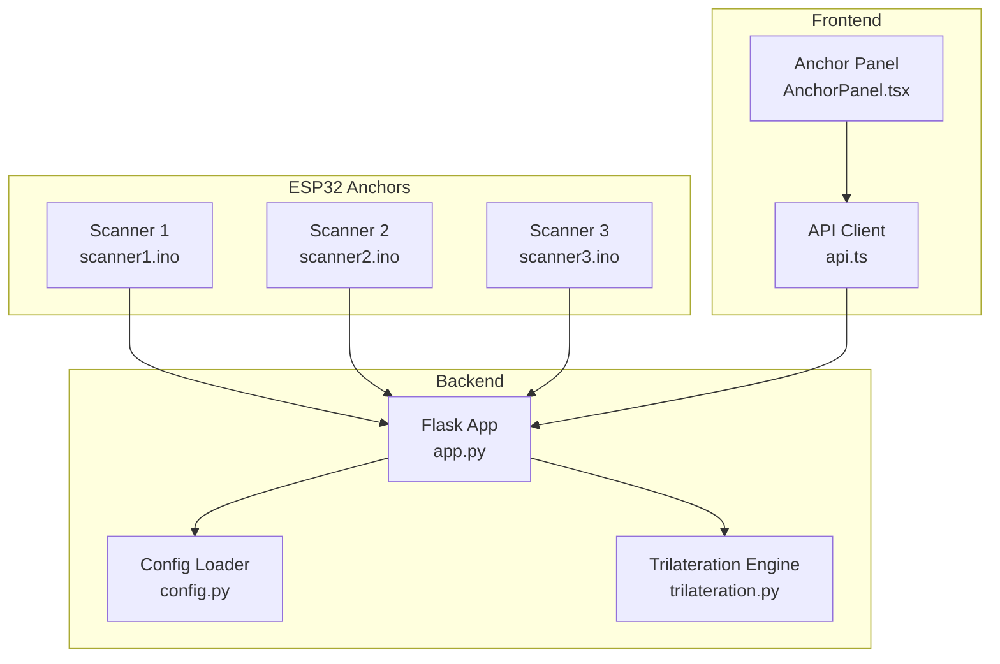
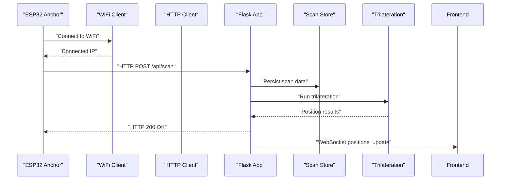
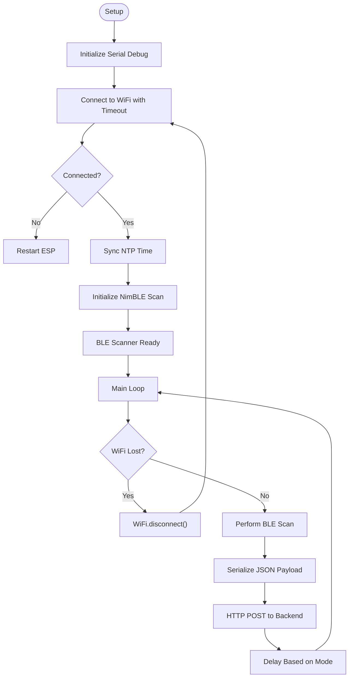
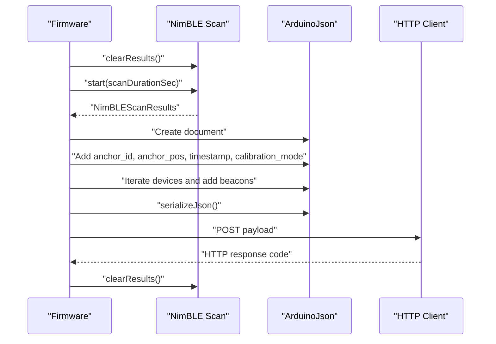
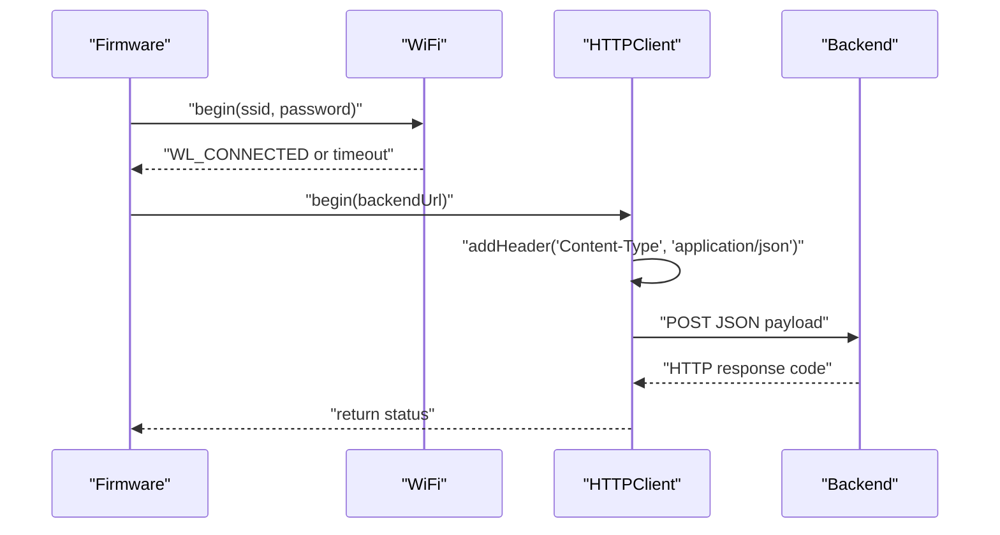
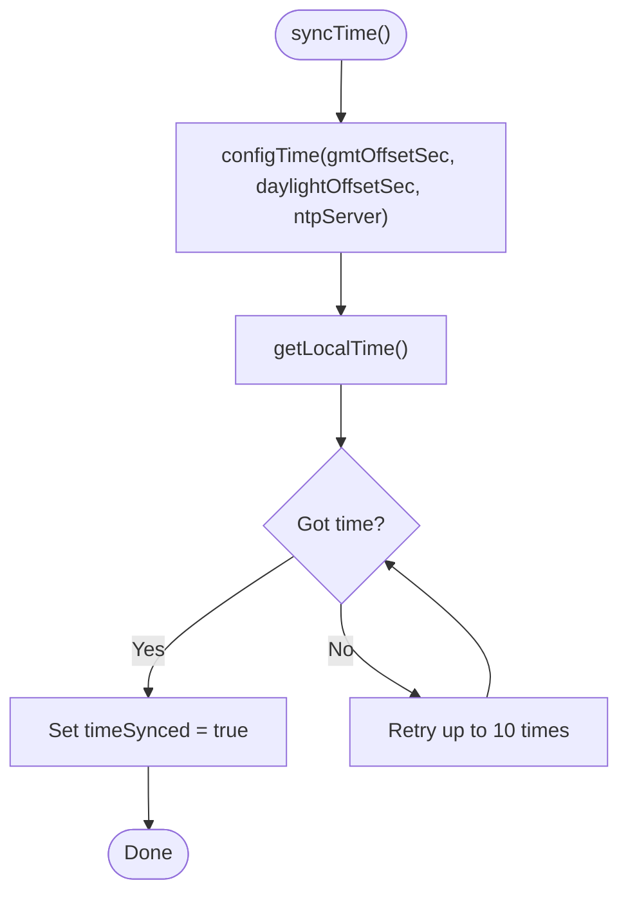
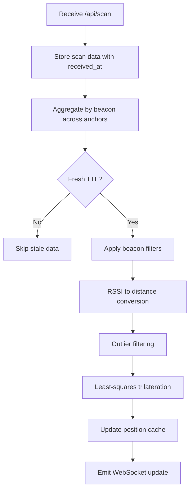
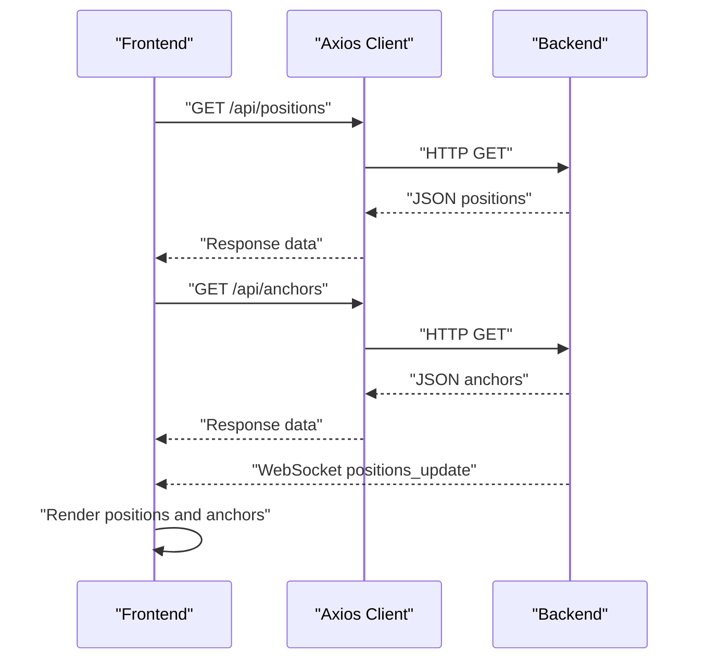
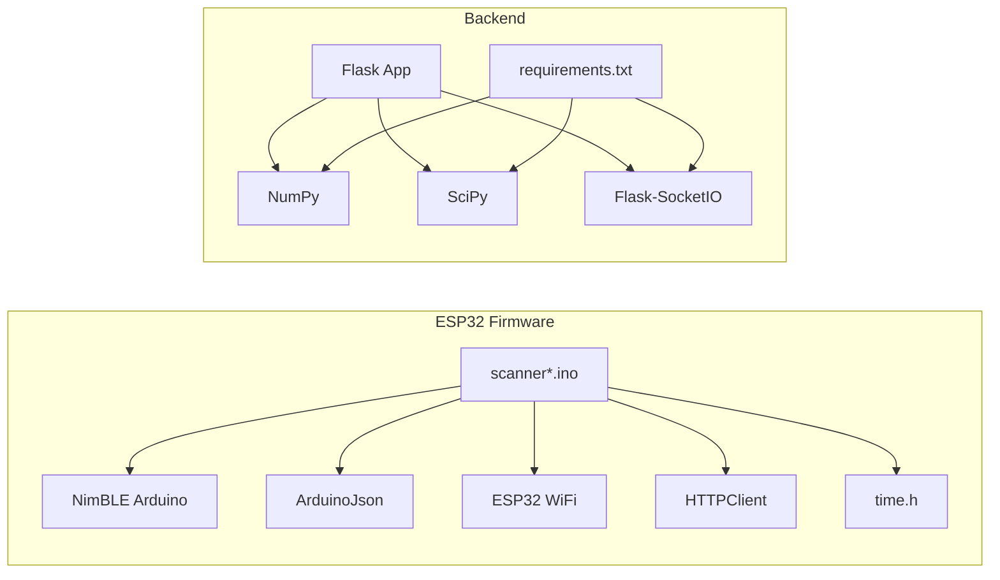

# Anchor Firmware Development

<cite>
**Referenced Files in This Document**
- [scanner1.ino](file://scanner1/scanner1.ino)
- [scanner2.ino](file://scanner2/scanner2.ino)
- [scanner3.ino](file://scanner3/scanner3.ino)
- [app.py](file://backend/app.py)
- [config.py](file://backend/config.py)
- [trilateration.py](file://backend/trilateration.py)
- [requirements.txt](file://backend/requirements.txt)
- [api.ts](file://frontend/src/services/api.ts)
- [AnchorPanel.tsx](file://frontend/src/components/AnchorPanel.tsx)
</cite>

## Table of Contents
1. [Introduction](#introduction)
2. [Project Structure](#project-structure)
3. [Core Components](#core-components)
4. [Architecture Overview](#architecture-overview)
5. [Detailed Component Analysis](#detailed-component-analysis)
6. [Dependency Analysis](#dependency-analysis)
7. [Performance Considerations](#performance-considerations)
8. [Troubleshooting Guide](#troubleshooting-guide)
9. [Conclusion](#conclusion)
10. [Appendices](#appendices)

## Introduction
This document provides comprehensive development guidance for the ESP32 anchor firmware in a BLE room positioning system. It covers firmware architecture, initialization routines, BLE scanning loops, RSSI collection mechanisms, HTTP communication protocols, NimBLE library integration, WiFi connectivity, NTP time synchronization, state management, error handling, and power optimization strategies. It also explains how the firmware integrates with the backend trilateration service and the React frontend.

## Project Structure
The project consists of three main parts:
- ESP32 anchor firmware (three identical scanners, each representing a physical anchor)
- Backend Flask service performing trilateration and serving data
- React frontend for visualization and configuration

**Diagram sources**
- [scanner1.ino:203-250](file://scanner1/scanner1.ino#L203-L250)
- [scanner2.ino:203-250](file://scanner2/scanner2.ino#L203-L250)
- [scanner3.ino:203-250](file://scanner3/scanner3.ino#L203-L250)
- [app.py:23-398](file://backend/app.py#L23-L398)
- [config.py:44-95](file://backend/config.py#L44-L95)
- [trilateration.py:11-218](file://backend/trilateration.py#L11-L218)
- [api.ts:1-66](file://frontend/src/services/api.ts#L1-L66)
- [AnchorPanel.tsx:30-143](file://frontend/src/components/AnchorPanel.tsx#L30-L143)

**Section sources**
- [scanner1.ino:1-250](file://scanner1/scanner1.ino#L1-L250)
- [scanner2.ino:1-250](file://scanner2/scanner2.ino#L1-L250)
- [scanner3.ino:1-250](file://scanner3/scanner3.ino#L1-L250)
- [app.py:1-398](file://backend/app.py#L1-L398)
- [config.py:1-95](file://backend/config.py#L1-L95)
- [trilateration.py:1-218](file://backend/trilateration.py#L1-L218)
- [api.ts:1-66](file://frontend/src/services/api.ts#L1-L66)
- [AnchorPanel.tsx:1-143](file://frontend/src/components/AnchorPanel.tsx#L1-L143)

## Core Components
- ESP32 Anchor Firmware (Scanner 1, 2, 3): Implements WiFi connectivity, NTP time sync, BLE scanning with NimBLE, JSON serialization, and HTTP POST to backend.
- Backend Flask Application: Receives scan data, runs trilateration, maintains caches, and exposes REST/WebSocket APIs.
- Trilateration Engine: Converts RSSI to distance, filters outliers, and computes 2D positions.
- Frontend React Application: Visualizes positions, anchors, and scan data; provides calibration controls.

Key implementation patterns:
- Initialization sequences for WiFi, NTP, and BLE scanning
- Periodic scanning with configurable intervals
- JSON payload construction with anchor metadata and beacon readings
- HTTP client usage with timeouts and error reporting
- Time synchronization fallback using millis()

**Section sources**
- [scanner1.ino:203-250](file://scanner1/scanner1.ino#L203-L250)
- [app.py:123-171](file://backend/app.py#L123-L171)
- [trilateration.py:155-218](file://backend/trilateration.py#L155-L218)
- [api.ts:13-66](file://frontend/src/services/api.ts#L13-L66)

## Architecture Overview
The system follows a distributed architecture:
- ESP32 anchors periodically collect BLE RSSI samples and transmit them to the backend
- Backend aggregates data from multiple anchors, applies calibration, and calculates positions
- Frontend subscribes to real-time updates and displays anchor/position status

**Diagram sources**
- [scanner1.ino:120-141](file://scanner1/scanner1.ino#L120-L141)
- [app.py:123-171](file://backend/app.py#L123-L171)
- [app.py:48-105](file://backend/app.py#L48-L105)
- [trilateration.py:155-218](file://backend/trilateration.py#L155-L218)

## Detailed Component Analysis

### ESP32 Anchor Firmware (Scanner 1)
This component initializes hardware, connects to WiFi, synchronizes time via NTP, configures BLE scanning, collects RSSI samples, constructs JSON payloads, and sends data to the backend.

**Diagram sources**
- [scanner1.ino:203-250](file://scanner1/scanner1.ino#L203-L250)
- [scanner1.ino:62-79](file://scanner1/scanner1.ino#L62-L79)
- [scanner1.ino:84-103](file://scanner1/scanner1.ino#L84-L103)
- [scanner1.ino:221-230](file://scanner1/scanner1.ino#L221-L230)
- [scanner1.ino:146-198](file://scanner1/scanner1.ino#L146-L198)
- [scanner1.ino:120-141](file://scanner1/scanner1.ino#L120-L141)

Key implementation details:
- WiFi connection with timeout and periodic reconnection checks
- NTP synchronization with fallback to millis()
- BLE scanning configuration with active scanning, interval, and window
- JSON payload construction including anchor metadata, timestamp, calibration mode, and beacon list
- HTTP POST with JSON header and timeout handling

**Section sources**
- [scanner1.ino:203-250](file://scanner1/scanner1.ino#L203-L250)
- [scanner1.ino:62-79](file://scanner1/scanner1.ino#L62-L79)
- [scanner1.ino:84-103](file://scanner1/scanner1.ino#L84-L103)
- [scanner1.ino:108-115](file://scanner1/scanner1.ino#L108-L115)
- [scanner1.ino:120-141](file://scanner1/scanner1.ino#L120-L141)
- [scanner1.ino:146-198](file://scanner1/scanner1.ino#L146-L198)
- [scanner1.ino:221-230](file://scanner1/scanner1.ino#L221-L230)

### BLE Scanning Implementation
The firmware performs periodic BLE scans and processes discovered devices:
- Clears previous scan results
- Starts scan with configured duration
- Iterates through results to extract MAC address, RSSI, TX power, and optional name
- Applies beacon filtering logic (default TX power vs. advertised TX power)
- Serializes data into JSON and sends to backend

**Diagram sources**
- [scanner1.ino:146-198](file://scanner1/scanner1.ino#L146-L198)
- [scanner1.ino:120-141](file://scanner1/scanner1.ino#L120-L141)

**Section sources**
- [scanner1.ino:146-198](file://scanner1/scanner1.ino#L146-L198)

### WiFi Connectivity and HTTP Communication
- WiFi credentials and backend URL are configured per anchor
- Connection attempts with timeout; on failure, firmware restarts
- HTTP POST with JSON payload and Content-Type header
- HTTP response logging and error reporting

**Diagram sources**
- [scanner1.ino:28-30](file://scanner1/scanner1.ino#L28-L30)
- [scanner1.ino:62-79](file://scanner1/scanner1.ino#L62-L79)
- [scanner1.ino:120-141](file://scanner1/scanner1.ino#L120-L141)

**Section sources**
- [scanner1.ino:28-30](file://scanner1/scanner1.ino#L28-L30)
- [scanner1.ino:62-79](file://scanner1/scanner1.ino#L62-L79)
- [scanner1.ino:120-141](file://scanner1/scanner1.ino#L120-L141)

### NTP Time Synchronization
- Configures NTP server and timezone offsets
- Attempts up to 10 retries to obtain local time
- Uses synchronized time for timestamps or falls back to millis()

**Diagram sources**
- [scanner1.ino:84-103](file://scanner1/scanner1.ino#L84-L103)

**Section sources**
- [scanner1.ino:84-103](file://scanner1/scanner1.ino#L84-L103)
- [scanner1.ino:108-115](file://scanner1/scanner1.ino#L108-L115)

### Backend Trilateration Pipeline
The backend receives scan data from anchors, filters stale entries, applies beacon filters, converts RSSI to distances, filters outliers, and computes positions using least-squares trilateration.

**Diagram sources**
- [app.py:123-171](file://backend/app.py#L123-L171)
- [app.py:48-105](file://backend/app.py#L48-L105)
- [trilateration.py:11-33](file://backend/trilateration.py#L11-L33)
- [trilateration.py:35-67](file://backend/trilateration.py#L35-L67)
- [trilateration.py:69-153](file://backend/trilateration.py#L69-L153)

**Section sources**
- [app.py:48-105](file://backend/app.py#L48-L105)
- [trilateration.py:11-33](file://backend/trilateration.py#L11-L33)
- [trilateration.py:35-67](file://backend/trilateration.py#L35-L67)
- [trilateration.py:69-153](file://backend/trilateration.py#L69-L153)

### Frontend Integration
The frontend consumes backend APIs via Axios, displaying anchor status, detected beacons, and real-time positions via WebSocket.

**Diagram sources**
- [api.ts:13-66](file://frontend/src/services/api.ts#L13-L66)
- [app.py:173-184](file://backend/app.py#L173-L184)
- [app.py:186-222](file://backend/app.py#L186-L222)
- [app.py:354-377](file://backend/app.py#L354-L377)

**Section sources**
- [api.ts:13-66](file://frontend/src/services/api.ts#L13-L66)
- [AnchorPanel.tsx:30-143](file://frontend/src/components/AnchorPanel.tsx#L30-L143)

## Dependency Analysis
External libraries and packages used:
- ESP32 firmware: NimBLE Arduino, ArduinoJson, ESP32 WiFi, HTTPClient, time.h
- Backend: Flask, Flask-CORS, Flask-SocketIO, NumPy, SciPy, simple-websocket

**Diagram sources**
- [scanner1.ino:12-16](file://scanner1/scanner1.ino#L12-L16)
- [requirements.txt:1-7](file://backend/requirements.txt#L1-L7)

**Section sources**
- [scanner1.ino:12-16](file://scanner1/scanner1.ino#L12-L16)
- [requirements.txt:1-7](file://backend/requirements.txt#L1-L7)

## Performance Considerations
- BLE scanning parameters: interval and window are tuned for ESP32-C3 RAM constraints; active scanning improves detection reliability
- Memory management: scan results cleared after each iteration to prevent leaks
- Network efficiency: JSON payloads compact; HTTP timeouts prevent blocking
- Trilateration optimization: outlier filtering reduces noise; least-squares minimizes error
- Frontend responsiveness: WebSocket streaming avoids polling overhead

[No sources needed since this section provides general guidance]

## Troubleshooting Guide
Common issues and remedies:
- WiFi connection failures: Verify SSID/password; adjust timeout; firmware restarts on persistent failure
- NTP sync errors: Confirm network connectivity; fallback to millis() timestamp
- HTTP POST failures: Check backend URL; inspect HTTP response codes; ensure JSON payload validity
- BLE scanning yields no devices: Increase scan duration; verify beacon TX power advertisement; confirm beacon proximity
- Backend stale data: Adjust scan TTL; verify anchor online status; check beacon filters

**Section sources**
- [scanner1.ino:62-79](file://scanner1/scanner1.ino#L62-L79)
- [scanner1.ino:84-103](file://scanner1/scanner1.ino#L84-L103)
- [scanner1.ino:120-141](file://scanner1/scanner1.ino#L120-L141)
- [app.py:39-46](file://backend/app.py#L39-L46)
- [app.py:186-222](file://backend/app.py#L186-L222)

## Conclusion
The ESP32 anchor firmware provides a robust foundation for BLE-based room positioning. Its modular design—WiFi/NTP initialization, NimBLE scanning, JSON serialization, and HTTP transport—integrates seamlessly with the backend trilateration engine and the React frontend. By tuning scan intervals, applying beacon filtering, and leveraging NTP timestamps, the system achieves reliable localization with real-time visualization.

[No sources needed since this section summarizes without analyzing specific files]

## Appendices

### Firmware Modification Guidelines
- Adding new anchors: Duplicate existing scanner file, update anchor ID, coordinates, and WiFi credentials
- Calibration adjustments: Modify default TX power and path loss exponent; toggle calibration mode for faster intervals
- Beacon filtering: Configure beacon filters in backend config to restrict tracked devices
- Debugging: Enable verbose serial output; monitor HTTP responses; verify NTP synchronization

**Section sources**
- [scanner1.ino:21-51](file://scanner1/scanner1.ino#L21-L51)
- [config.py:44-95](file://backend/config.py#L44-L95)

### Backend Configuration Options
- Room dimensions: width_m, height_m
- Anchor positions: x, y coordinates
- Calibration parameters: path_loss_exponent, tx_power_dbm, min_rssi_threshold, scan_ttl_seconds
- Beacon filters: list of MAC addresses to track

**Section sources**
- [config.py:12-41](file://backend/config.py#L12-L41)
- [app.py:282-332](file://backend/app.py#L282-L332)

### Trilateration Details
- RSSI to distance: Log-distance path loss model with clamping
- Outlier filtering: Median absolute deviation (MAD) with threshold factor
- Position estimation: Least-squares optimization using SciPy

**Section sources**
- [trilateration.py:11-33](file://backend/trilateration.py#L11-L33)
- [trilateration.py:35-67](file://backend/trilateration.py#L35-L67)
- [trilateration.py:69-153](file://backend/trilateration.py#L69-L153)