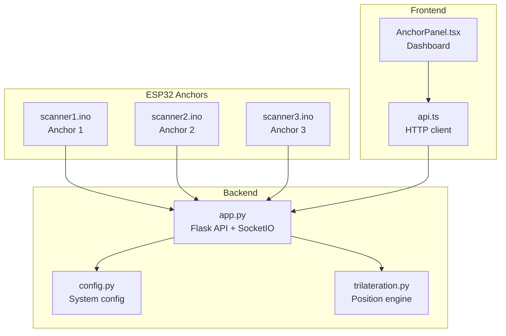
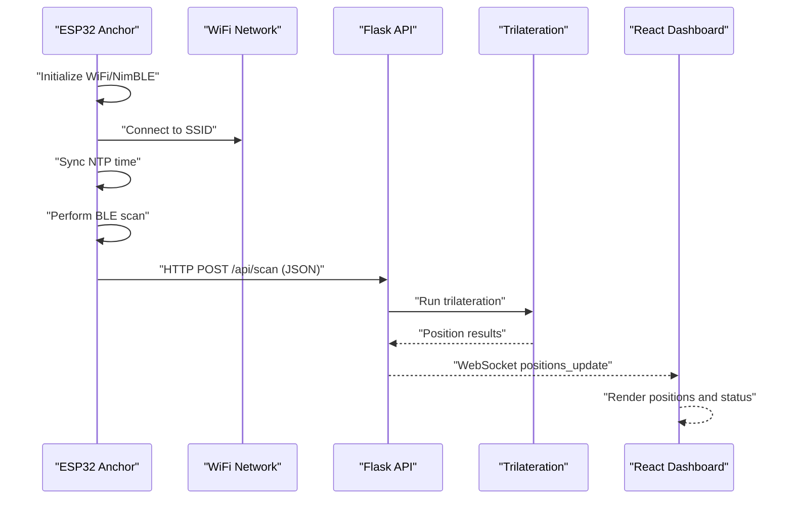
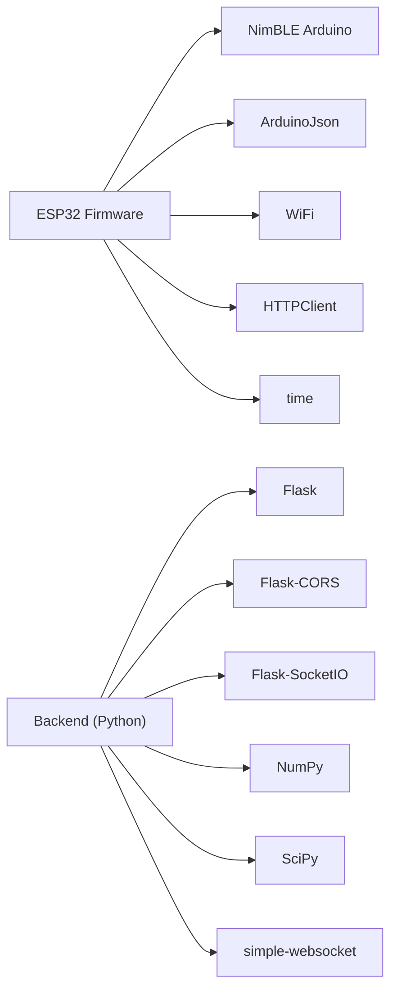

# ESP32 Anchor Setup

<cite>
**Referenced Files in This Document**
- [scanner1.ino](file://scanner1/scanner1.ino)
- [scanner2.ino](file://scanner2/scanner2.ino)
- [scanner3.ino](file://scanner3/scanner3.ino)
- [app.py](file://backend/app.py)
- [config.py](file://backend/config.py)
- [trilateration.py](file://backend/trilateration.py)
- [api.ts](file://frontend/src/services/api.ts)
- [AnchorPanel.tsx](file://frontend/src/components/AnchorPanel.tsx)
- [requirements.txt](file://backend/requirements.txt)
</cite>

## Table of Contents
1. [Introduction](#introduction)
2. [Project Structure](#project-structure)
3. [Core Components](#core-components)
4. [Architecture Overview](#architecture-overview)
5. [Detailed Component Analysis](#detailed-component-analysis)
6. [Dependency Analysis](#dependency-analysis)
7. [Performance Considerations](#performance-considerations)
8. [Troubleshooting Guide](#troubleshooting-guide)
9. [Conclusion](#conclusion)
10. [Appendices](#appendices)

## Introduction
This document provides comprehensive guidance for setting up ESP32 anchor nodes in a BLE room positioning system. It covers hardware requirements, Arduino IDE setup, firmware compilation and upload, physical wiring, power management, configuration of WiFi credentials and backend endpoints, and practical testing procedures. It also addresses common issues such as library conflicts, memory limitations, and compilation errors, along with firmware version management and update procedures.

## Project Structure
The project consists of:
- ESP32 anchor firmware (three distinct anchor configurations)
- Backend service (Flask API with WebSocket support)
- Frontend dashboard (React-based monitoring and calibration)
- Trilateration engine for position estimation

**Diagram sources**
- [scanner1.ino:1-250](file://scanner1/scanner1.ino#L1-L250)
- [scanner2.ino:1-250](file://scanner2/scanner2.ino#L1-L250)
- [scanner3.ino:1-250](file://scanner3/scanner3.ino#L1-L250)
- [app.py:1-398](file://backend/app.py#L1-L398)
- [config.py:1-95](file://backend/config.py#L1-L95)
- [trilateration.py:1-218](file://backend/trilateration.py#L1-L218)
- [api.ts:1-66](file://frontend/src/services/api.ts#L1-L66)
- [AnchorPanel.tsx:1-143](file://frontend/src/components/AnchorPanel.tsx#L1-L143)

**Section sources**
- [scanner1.ino:1-250](file://scanner1/scanner1.ino#L1-L250)
- [scanner2.ino:1-250](file://scanner2/scanner2.ino#L1-L250)
- [scanner3.ino:1-250](file://scanner3/scanner3.ino#L1-L250)
- [app.py:1-398](file://backend/app.py#L1-L398)
- [config.py:1-95](file://backend/config.py#L1-L95)
- [trilateration.py:1-218](file://backend/trilateration.py#L1-L218)
- [api.ts:1-66](file://frontend/src/services/api.ts#L1-L66)
- [AnchorPanel.tsx:1-143](file://frontend/src/components/AnchorPanel.tsx#L1-L143)

## Core Components
- ESP32-C3 Anchor Firmware: Each anchor runs a dedicated sketch optimized for NimBLE scanning, WiFi connectivity, NTP time synchronization, JSON serialization, and HTTP posting to the backend.
- Backend API: Receives scan data, performs trilateration, and emits real-time updates via WebSocket.
- Frontend Dashboard: Displays anchor status, detected beacons, and live positions.
- Trilateration Engine: Converts RSSI measurements into 2D coordinates using least-squares optimization.

Key configuration areas in the firmware:
- Anchor identity and position
- WiFi credentials and backend URL
- NTP server and timezone offset
- Scan duration and intervals
- Default TX power and calibration mode flag

**Section sources**
- [scanner1.ino:18-52](file://scanner1/scanner1.ino#L18-L52)
- [scanner2.ino:18-52](file://scanner2/scanner2.ino#L18-L52)
- [scanner3.ino:18-52](file://scanner3/scanner3.ino#L18-L52)
- [app.py:123-171](file://backend/app.py#L123-L171)
- [trilateration.py:155-218](file://backend/trilateration.py#L155-L218)

## Architecture Overview
The system operates as follows:
- Each anchor periodically scans BLE devices, collects RSSI and TX power, and posts JSON to the backend.
- The backend stores recent scans, filters stale data, and recalculates positions using trilateration.
- The frontend subscribes to WebSocket updates and displays live positions and anchor status.

**Diagram sources**
- [scanner1.ino:203-249](file://scanner1/scanner1.ino#L203-L249)
- [app.py:123-171](file://backend/app.py#L123-L171)
- [trilateration.py:48-105](file://backend/app.py#L48-L105)
- [api.ts:13-16](file://frontend/src/services/api.ts#L13-L16)

## Detailed Component Analysis

### ESP32-C3 Hardware and Firmware Overview
- Microcontroller: ESP32-C3 (single-core, integrated RF, low power)
- Radio: BLE using NimBLE library (lightweight alternative to ESP-IDF BLE)
- Connectivity: WiFi for HTTP transport and NTP time sync
- Power: Typically powered via USB or external 3.3V supply; ensure stable voltage and adequate current for BLE radio and WiFi
- Antenna: Integrated PCB antenna or external chip antenna; ensure unobstructed placement for optimal BLE reception

Firmware responsibilities:
- WiFi connection with timeout
- NTP time synchronization
- BLE scanning with configurable interval/window
- JSON payload construction with anchor ID, position, timestamp, and beacon list
- HTTP POST to backend endpoint
- Periodic reconnection and scan scheduling

Memory considerations:
- ESP32-C3 has limited RAM; the firmware clears BLE scan results after each iteration to prevent leaks.

**Section sources**
- [scanner1.ino:12-16](file://scanner1/scanner1.ino#L12-L16)
- [scanner1.ino:203-230](file://scanner1/scanner1.ino#L203-L230)
- [scanner1.ino:146-198](file://scanner1/scanner1.ino#L146-L198)
- [scanner1.ino:42-49](file://scanner1/scanner1.ino#L42-L49)

### Arduino IDE Setup and Library Installation
Required libraries (install via Arduino Library Manager):
- NimBLE Arduino (by h2zero)
- ArduinoJson (by Benoit Blanchon)
- WiFi (built-in)
- HTTPClient (built-in)
- time (built-in)

Board selection:
- Board: ESP32C3 Dev Module
- Partition Scheme: No OTA (Large App) or Minimal SPIFFS recommended for stability
- Flash Frequency: 80MHz
- Upload Speed: 921600 baud
- CPU Frequency: 160MHz (or as configured by board package)

Library conflicts:
- Avoid mixing ESP-IDF BLE with NimBLE in the same sketch
- Ensure ArduinoJson version is compatible with the compiler toolchain

**Section sources**
- [scanner1.ino:5-10](file://scanner1/scanner1.ino#L5-L10)
- [scanner2.ino:5-10](file://scanner2/scanner2.ino#L5-L10)
- [scanner3.ino:5-10](file://scanner3/scanner3.ino#L5-L10)

### Firmware Compilation and Upload Procedures
Steps:
1. Open the desired anchor sketch (e.g., scanner1.ino) in Arduino IDE
2. Select Board: ESP32C3 Dev Module
3. Install required libraries via Library Manager
4. Verify compilation (check for warnings)
5. Connect ESP32-C3 via USB-to-TTL adapter or development board
6. Upload the sketch
7. Open Serial Monitor at 115200 baud to observe boot messages and scan logs

Notes:
- Use a stable USB power source; avoid powering via GPIO pins
- If upload fails, reset the board to BOOT mode and retry

**Section sources**
- [scanner1.ino:203-230](file://scanner1/scanner1.ino#L203-L230)

### Physical Wiring and Power Management
- Power: 3.3V supply; ensure decoupling capacitors near VCC/GND
- Ground: Single-point ground plane for RF stability
- Antenna: Keep traces short and avoid routing near noisy digital signals
- Pull-ups/pull-downs: Not required for BLE antenna on ESP32-C3 unless using external RF front-end
- LEDs: Optional status indicator on a GPIO pin (not present in current sketches)
- Reset and Boot: Ensure BOOT pin pulled high; GPIO0 held high during normal operation

Power considerations:
- BLE transmit duty cycle affects average current draw; reduce scan window for lower power
- WiFi radio draws significant current; consider sleep modes between scans if applicable

**Section sources**
- [scanner1.ino:203-230](file://scanner1/scanner1.ino#L203-L230)

### Configuration of WiFi Credentials, Backend Address, and Anchor Identifiers
Each anchor sketch defines:
- Unique anchor identifier (anchorId)
- Anchor X/Y position in meters
- WiFi SSID and password
- Backend URL for HTTP POST
- NTP server and timezone offset
- Scan duration and intervals
- Default TX power and calibration mode flag

To configure:
- Edit the constants in the chosen anchor sketch (scanner1.ino, scanner2.ino, or scanner3.ino)
- Change anchorId to a unique value per anchor
- Set anchorX and anchorY to the physical coordinates
- Update ssid, wifiPassword, and backendUrl to match your network and backend deployment
- Adjust scanDurationSec, scanIntervalMs, and calibIntervalMs as needed

Example locations:
- Anchor identity and position: [scanner1.ino:18-24](file://scanner1/scanner1.ino#L18-L24)
- WiFi credentials and backend URL: [scanner1.ino:25-31](file://scanner1/scanner1.ino#L25-L31)
- NTP configuration: [scanner1.ino:32-38](file://scanner1/scanner1.ino#L32-L38)
- Scan settings: [scanner1.ino:39-49](file://scanner1/scanner1.ino#L39-L49)

**Section sources**
- [scanner1.ino:18-49](file://scanner1/scanner1.ino#L18-L49)
- [scanner2.ino:18-49](file://scanner2/scanner2.ino#L18-L49)
- [scanner3.ino:18-49](file://scanner3/scanner3.ino#L18-L49)

### Testing Procedures
Initial testing steps:
1. Upload the anchor sketch and open Serial Monitor at 115200 baud
2. Verify WiFi connection and IP assignment
3. Confirm NTP time sync
4. Observe BLE scan output and posted JSON structure
5. Check backend health endpoint and received scan data
6. Launch frontend and confirm WebSocket positions update

Serial output highlights:
- Anchor identification and board type
- WiFi connection status and IP
- NTP sync result
- Found device count and per-device RSSI/TX
- HTTP response code or error message

Backend verification:
- Health endpoint: GET /api/health
- Latest scan data: GET /api/scan-data
- Positions: GET /api/positions

Frontend verification:
- Anchor status panel shows online/offline and beacon counts
- Real-time positions appear via WebSocket

**Section sources**
- [scanner1.ino:203-249](file://scanner1/scanner1.ino#L203-L249)
- [app.py:112-121](file://backend/app.py#L112-L121)
- [app.py:256-279](file://backend/app.py#L256-L279)
- [app.py:173-183](file://backend/app.py#L173-L183)
- [api.ts:13-16](file://frontend/src/services/api.ts#L13-L16)

### Backend Integration and Trilateration
Backend responsibilities:
- Accept JSON scan payloads from anchors
- Maintain in-memory scan store with TTL
- Perform trilateration across anchors for each beacon
- Emit positions via SocketIO
- Serve REST endpoints for positions, anchors, calibration, and configuration

Trilateration pipeline:
- RSSI to distance conversion using log-distance path loss model
- Outlier filtering using median absolute deviation
- Least-squares optimization to estimate 2D position
- Error estimation and anchor usage metrics

**Section sources**
- [app.py:123-171](file://backend/app.py#L123-L171)
- [app.py:48-105](file://backend/app.py#L48-L105)
- [trilateration.py:11-33](file://backend/trilateration.py#L11-L33)
- [trilateration.py:35-67](file://backend/trilateration.py#L35-L67)
- [trilateration.py:69-153](file://backend/trilateration.py#L69-L153)

### Frontend Dashboard Integration
Frontend components:
- API service encapsulates HTTP calls to backend endpoints
- Anchor panel displays anchor status, last seen, beacon counts, and detected beacons
- Real-time updates via SocketIO subscription

Endpoints used:
- GET /api/positions
- GET /api/anchors
- PUT /api/anchors
- GET /api/scan-data
- GET /api/calibrate
- POST /api/calibrate
- GET /api/health
- GET /api/config

**Section sources**
- [api.ts:13-63](file://frontend/src/services/api.ts#L13-L63)
- [AnchorPanel.tsx:30-134](file://frontend/src/components/AnchorPanel.tsx#L30-L134)

## Dependency Analysis
External dependencies:
- Backend Python packages: Flask, Flask-CORS, Flask-SocketIO, NumPy, SciPy, simple-websocket
- Firmware libraries: NimBLE Arduino, ArduinoJson, WiFi, HTTPClient, time

**Diagram sources**
- [scanner1.ino:12-16](file://scanner1/scanner1.ino#L12-L16)
- [requirements.txt:1-7](file://backend/requirements.txt#L1-L7)

**Section sources**
- [scanner1.ino:12-16](file://scanner1/scanner1.ino#L12-L16)
- [requirements.txt:1-7](file://backend/requirements.txt#L1-L7)

## Performance Considerations
- Memory usage: ESP32-C3 RAM is limited; clear BLE scan results after each pass to prevent fragmentation
- Scan intervals: Balance responsiveness vs. power consumption; shorter intervals increase CPU and radio activity
- JSON payload size: Keep beacon lists reasonable; trim unnecessary fields
- WiFi stability: Implement periodic reconnection checks and timeouts
- Backend throughput: Ensure the backend can handle concurrent anchors and WebSocket updates

[No sources needed since this section provides general guidance]

## Troubleshooting Guide
Common issues and resolutions:
- Library conflicts: Remove conflicting BLE libraries; use only NimBLE Arduino
- Compilation errors: Verify toolchain compatibility; ensure correct board selected
- Memory errors: Reduce JSON document size; minimize dynamic allocations; clear BLE results
- WiFi connection failures: Increase wifiTimeoutMs; verify SSID/password; check router capacity
- HTTP POST failures: Confirm backend URL and network reachability; inspect HTTP error codes
- Time sync failures: Verify NTP server accessibility; adjust GMT offset
- Position calculation failures: Increase anchor count; tune path loss exponent and TX power

**Section sources**
- [scanner1.ino:62-79](file://scanner1/scanner1.ino#L62-L79)
- [scanner1.ino:120-141](file://scanner1/scanner1.ino#L120-L141)
- [scanner1.ino:84-103](file://scanner1/scanner1.ino#L84-L103)
- [trilateration.py:155-218](file://backend/trilateration.py#L155-L218)

## Conclusion
The ESP32 anchor setup involves careful firmware configuration, reliable WiFi connectivity, and robust backend integration. By following the hardware and software guidelines, performing thorough testing, and addressing common issues proactively, you can deploy a stable BLE room positioning system capable of real-time localization.

[No sources needed since this section summarizes without analyzing specific files]

## Appendices

### Appendix A: Backend Configuration Management
- Default room dimensions and anchor positions are stored in config.json
- Calibration parameters include path loss exponent, TX power reference, RSSI threshold, and scan TTL
- Beacon filters can restrict tracking to specific MAC addresses

**Section sources**
- [config.py:11-41](file://backend/config.py#L11-L41)
- [config.py:70-95](file://backend/config.py#L70-L95)

### Appendix B: Backend Endpoints Reference
- GET /api/health: System health and counts
- POST /api/scan: Receive scan data from anchors
- GET /api/positions: Current trilateration results
- GET /api/anchors: Anchor configurations and status
- PUT /api/anchors: Update anchor positions
- GET /api/scan-data: Latest raw scan data
- GET /api/calibrate: Current calibration parameters
- POST /api/calibrate: Update calibration parameters
- GET /api/config: Full system configuration
- PUT /api/config: Update full configuration

**Section sources**
- [app.py:112-183](file://backend/app.py#L112-L183)
- [app.py:186-222](file://backend/app.py#L186-L222)
- [app.py:256-332](file://backend/app.py#L256-L332)
- [app.py:334-348](file://backend/app.py#L334-L348)

### Appendix C: Firmware Version Management and Updates
- Maintain separate sketches per anchor for easy updates
- After updating libraries or board packages, recompile and verify Serial output
- For production deployments, consider version tags and checksums for firmware images
- Use consistent partition schemes and upload speeds across devices

**Section sources**
- [scanner1.ino:203-249](file://scanner1/scanner1.ino#L203-L249)