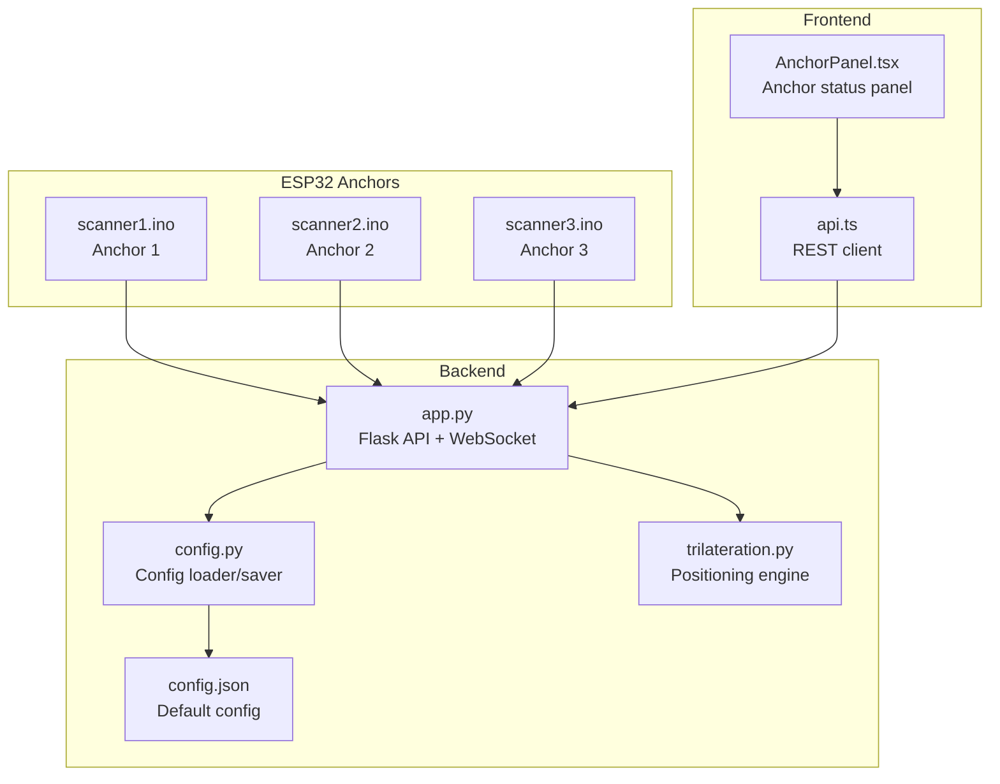
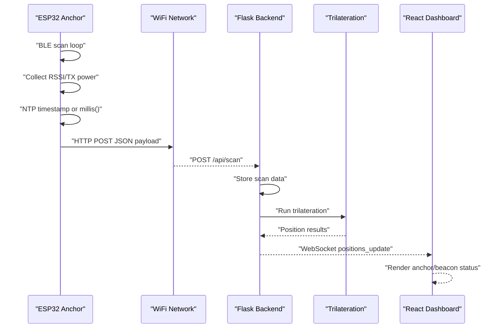
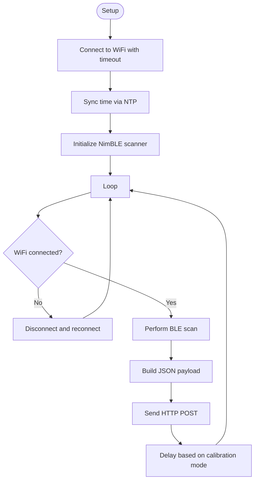
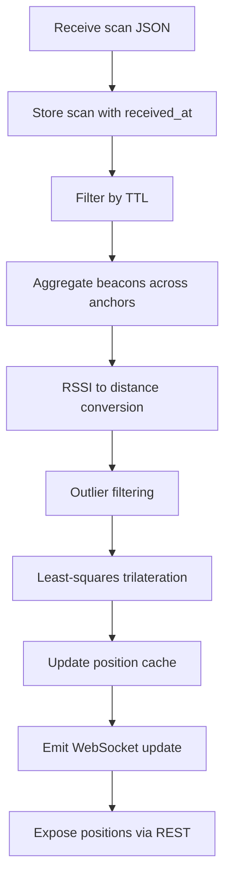
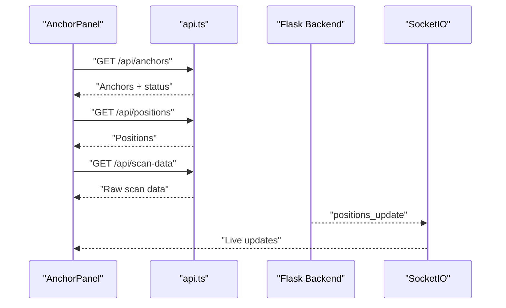
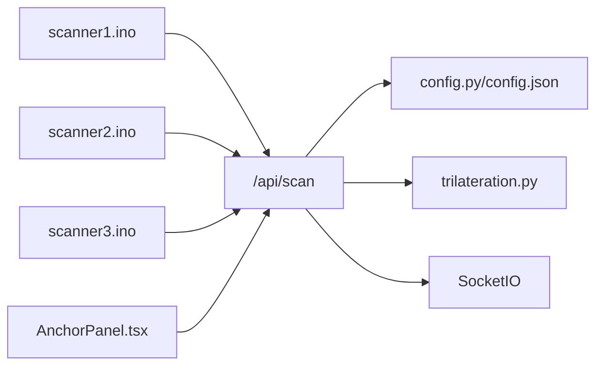

# Hardware Implementation

<cite>
**Referenced Files in This Document**
- [scanner1.ino](file://scanner1/scanner1.ino)
- [scanner2.ino](file://scanner2/scanner2.ino)
- [scanner3.ino](file://scanner3/scanner3.ino)
- [app.py](file://backend/app.py)
- [config.py](file://backend/config.py)
- [config.json](file://backend/config.json)
- [trilateration.py](file://backend/trilateration.py)
- [AnchorPanel.tsx](file://frontend/src/components/AnchorPanel.tsx)
- [api.ts](file://frontend/src/services/api.ts)
</cite>

## Table of Contents
1. [Introduction](#introduction)
2. [Project Structure](#project-structure)
3. [Core Components](#core-components)
4. [Architecture Overview](#architecture-overview)
5. [Detailed Component Analysis](#detailed-component-analysis)
6. [Dependency Analysis](#dependency-analysis)
7. [Performance Considerations](#performance-considerations)
8. [Troubleshooting Guide](#troubleshooting-guide)
9. [Conclusion](#conclusion)
10. [Appendices](#appendices)

## Introduction
This document describes the hardware implementation of ESP32 anchor nodes for a BLE-based room positioning system. Each anchor is an ESP32-C3 device running Arduino firmware that:
- Scans for BLE advertisements using the NimBLE library
- Collects RSSI and TX power metrics
- Synchronizes time via NTP
- Transmits scan data to a backend service over WiFi
- Operates independently with minimal configuration

The backend performs trilateration to estimate beacon positions and exposes a REST API and WebSocket interface for monitoring and calibration.

## Project Structure
The repository is organized into three primary areas:
- scanner1/scanner2/scanner3: Arduino firmware for three anchor nodes
- backend: Python Flask application with WebSocket support
- frontend: React-based dashboard for monitoring and calibration

**Diagram sources**
- [scanner1.ino:1-250](file://scanner1/scanner1.ino#L1-L250)
- [scanner2.ino:1-250](file://scanner2/scanner2.ino#L1-L250)
- [scanner3.ino:1-250](file://scanner3/scanner3.ino#L1-L250)
- [app.py:1-398](file://backend/app.py#L1-L398)
- [config.py:1-95](file://backend/config.py#L1-L95)
- [config.json:1-30](file://backend/config.json#L1-L30)
- [trilateration.py:1-218](file://backend/trilateration.py#L1-L218)
- [AnchorPanel.tsx:1-143](file://frontend/src/components/AnchorPanel.tsx#L1-L143)
- [api.ts:1-66](file://frontend/src/services/api.ts#L1-L66)

**Section sources**
- [scanner1.ino:1-250](file://scanner1/scanner1.ino#L1-L250)
- [scanner2.ino:1-250](file://scanner2/scanner2.ino#L1-L250)
- [scanner3.ino:1-250](file://scanner3/scanner3.ino#L1-L250)
- [app.py:1-398](file://backend/app.py#L1-L398)
- [config.py:1-95](file://backend/config.py#L1-L95)
- [config.json:1-30](file://backend/config.json#L1-L30)
- [trilateration.py:1-218](file://backend/trilateration.py#L1-L218)
- [AnchorPanel.tsx:1-143](file://frontend/src/components/AnchorPanel.tsx#L1-L143)
- [api.ts:1-66](file://frontend/src/services/api.ts#L1-L66)

## Core Components
- ESP32-C3 Anchor Firmware (scanner1/scanner2/scanner3): Implements BLE scanning, NTP time sync, WiFi connectivity, JSON serialization, and HTTP POST to the backend.
- Backend Flask Application (app.py): Receives scan data, runs trilateration, maintains in-memory caches, and exposes REST and WebSocket endpoints.
- Trilateration Engine (trilateration.py): Converts RSSI to distance, filters outliers, and computes 2D positions using least-squares optimization.
- Configuration (config.py, config.json): Stores room dimensions, anchor positions, and calibration parameters.
- Frontend Dashboard (AnchorPanel.tsx, api.ts): Visualizes anchor status, detected beacons, and live positions.

Key firmware capabilities:
- BLE scanning loop with configurable duration and interval
- RSSI and TX power extraction per beacon
- Timestamping via NTP or fallback
- HTTP POST with JSON payload
- WiFi reconnection with timeout
- Calibration mode toggle for faster intervals

**Section sources**
- [scanner1.ino:18-58](file://scanner1/scanner1.ino#L18-L58)
- [scanner1.ino:62-115](file://scanner1/scanner1.ino#L62-L115)
- [scanner1.ino:120-198](file://scanner1/scanner1.ino#L120-L198)
- [scanner1.ino:203-249](file://scanner1/scanner1.ino#L203-L249)
- [app.py:123-171](file://backend/app.py#L123-L171)
- [trilateration.py:11-33](file://backend/trilateration.py#L11-L33)
- [config.py:11-41](file://backend/config.py#L11-L41)
- [config.json:1-30](file://backend/config.json#L1-L30)
- [AnchorPanel.tsx:30-134](file://frontend/src/components/AnchorPanel.tsx#L30-L134)
- [api.ts:12-66](file://frontend/src/services/api.ts#L12-L66)

## Architecture Overview
The system follows a distributed architecture:
- Each anchor periodically scans BLE and sends data to the backend
- Backend aggregates scans, filters stale data, and recalculates positions
- Frontend subscribes to WebSocket updates and displays anchor and beacon status

**Diagram sources**
- [scanner1.ino:146-198](file://scanner1/scanner1.ino#L146-L198)
- [scanner1.ino:120-141](file://scanner1/scanner1.ino#L120-L141)
- [app.py:123-171](file://backend/app.py#L123-L171)
- [app.py:48-105](file://backend/app.py#L48-L105)
- [trilateration.py:155-218](file://backend/trilateration.py#L155-L218)
- [AnchorPanel.tsx:30-134](file://frontend/src/components/AnchorPanel.tsx#L30-L134)

## Detailed Component Analysis

### ESP32 Anchor Firmware (scanner1/scanner2/scanner3)
Each anchor firmware targets ESP32-C3 and uses NimBLE for BLE scanning, ArduinoJson for payload construction, and WiFi + HTTPClient for network communication. The firmware initializes WiFi, synchronizes time via NTP, sets up a BLE scanner, and enters a loop that:
- Ensures WiFi connectivity
- Performs a BLE scan
- Builds a JSON payload with anchor metadata, timestamp, and beacon readings
- Sends the payload to the backend
- Applies a delay controlled by calibration mode

Key configuration blocks:
- Anchor identity and physical coordinates
- WiFi credentials and backend URL
- NTP server and timezone offset
- Scan duration, intervals, and WiFi timeout
- Default TX power and calibration mode flag

Processing logic highlights:
- WiFi connection with timeout and periodic recheck
- NTP sync with retry and fallback to millis()
- BLE scan with active scanning and windowed intervals
- Payload assembly with beacon entries including optional name field
- HTTP POST with JSON header and timeout
- Memory cleanup of scan results to mitigate limited RAM on ESP32-C3

**Diagram sources**
- [scanner1.ino:203-249](file://scanner1/scanner1.ino#L203-L249)
- [scanner1.ino:62-79](file://scanner1/scanner1.ino#L62-L79)
- [scanner1.ino:84-103](file://scanner1/scanner1.ino#L84-L103)
- [scanner1.ino:221-229](file://scanner1/scanner1.ino#L221-L229)
- [scanner1.ino:146-198](file://scanner1/scanner1.ino#L146-L198)
- [scanner1.ino:120-141](file://scanner1/scanner1.ino#L120-L141)

**Section sources**
- [scanner1.ino:18-58](file://scanner1/scanner1.ino#L18-L58)
- [scanner1.ino:62-115](file://scanner1/scanner1.ino#L62-L115)
- [scanner1.ino:120-198](file://scanner1/scanner1.ino#L120-L198)
- [scanner1.ino:203-249](file://scanner1/scanner1.ino#L203-L249)

### Backend Trilateration Pipeline
The backend receives scan data from anchors and performs the following steps:
- Load configuration (room, anchors, calibration)
- Filter stale scans based on TTL
- Aggregate beacon readings across anchors
- Apply beacon filters if configured
- Convert RSSI to distance using calibrated TX power and path loss exponent
- Filter outliers using median absolute deviation
- Run least-squares trilateration to compute 2D positions
- Emit results via WebSocket and serve via REST endpoints

**Diagram sources**
- [app.py:123-171](file://backend/app.py#L123-L171)
- [app.py:48-105](file://backend/app.py#L48-L105)
- [trilateration.py:11-33](file://backend/trilateration.py#L11-L33)
- [trilateration.py:35-67](file://backend/trilateration.py#L35-L67)
- [trilateration.py:69-153](file://backend/trilateration.py#L69-L153)

**Section sources**
- [app.py:48-105](file://backend/app.py#L48-L105)
- [trilateration.py:11-33](file://backend/trilateration.py#L11-L33)
- [trilateration.py:35-67](file://backend/trilateration.py#L35-L67)
- [trilateration.py:69-153](file://backend/trilateration.py#L69-L153)

### Frontend Dashboard Integration
The frontend consumes backend endpoints and WebSocket events to present:
- Anchor status cards with online/offline indicators
- Detected beacon lists per anchor
- Live position updates for tracked beacons
- Calibration controls and configuration management

**Diagram sources**
- [AnchorPanel.tsx:30-134](file://frontend/src/components/AnchorPanel.tsx#L30-L134)
- [api.ts:12-66](file://frontend/src/services/api.ts#L12-L66)
- [app.py:354-377](file://backend/app.py#L354-L377)

**Section sources**
- [AnchorPanel.tsx:30-134](file://frontend/src/components/AnchorPanel.tsx#L30-L134)
- [api.ts:12-66](file://frontend/src/services/api.ts#L12-L66)
- [app.py:354-377](file://backend/app.py#L354-L377)

## Dependency Analysis
- Firmware-to-backend:
  - Each anchor posts JSON to /api/scan with anchor metadata, timestamp, and beacon list
  - Backend stores scans and triggers trilateration
- Backend-to-configuration:
  - Reads and writes config.json for room, anchors, and calibration parameters
- Backend-to-trilateration:
  - Uses RSSI-to-distance conversion and least-squares trilateration
- Frontend-to-backend:
  - REST endpoints for positions, anchors, scan data, calibration, and health
  - WebSocket for real-time position updates

**Diagram sources**
- [scanner1.ino:120-141](file://scanner1/scanner1.ino#L120-L141)
- [app.py:123-171](file://backend/app.py#L123-L171)
- [config.py:44-58](file://backend/config.py#L44-L58)
- [config.json:1-30](file://backend/config.json#L1-L30)
- [trilateration.py:155-218](file://backend/trilateration.py#L155-L218)
- [AnchorPanel.tsx:30-134](file://frontend/src/components/AnchorPanel.tsx#L30-L134)

**Section sources**
- [scanner1.ino:120-141](file://scanner1/scanner1.ino#L120-L141)
- [app.py:123-171](file://backend/app.py#L123-L171)
- [config.py:44-58](file://backend/config.py#L44-L58)
- [config.json:1-30](file://backend/config.json#L1-L30)
- [trilateration.py:155-218](file://backend/trilateration.py#L155-L218)
- [AnchorPanel.tsx:30-134](file://frontend/src/components/AnchorPanel.tsx#L30-L134)

## Performance Considerations
- BLE scanning cadence: Adjust scanDurationSec and scanIntervalMs to balance responsiveness and power consumption.
- WiFi robustness: The firmware checks connectivity periodically and reconnects with a cooldown to avoid thrashing.
- Memory management: Clearing BLE scan results prevents memory leaks on ESP32-C3.
- Backend TTL: Configure scan_ttl_seconds to filter stale data and reduce computation overhead.
- RSSI thresholds: Tune min_rssi_threshold to reduce noise and improve accuracy.
- Path loss exponent: Calibrate path_loss_exponent per environment for better distance estimation.

[No sources needed since this section provides general guidance]

## Troubleshooting Guide
Common issues and resolutions:
- WiFi connectivity problems:
  - Verify ssid and wifiPassword in firmware match the network.
  - Confirm backendUrl points to the correct IP/port.
  - Check wifiTimeoutMs and ensure the router responds within the timeout.
  - Monitor serial output for connection attempts and IP assignment.
- BLE scanning failures:
  - Ensure NimBLE is initialized and scanning parameters are set.
  - Confirm BLE devices are advertising and within range.
  - Reduce scanDurationSec if the device struggles to complete scans.
- Power management:
  - ESP32-C3 boards typically operate on 3.3V; ensure stable power supply.
  - Avoid excessive peripheral activity to minimize current draw.
- Backend errors:
  - Check backend logs for HTTP errors and trilateration exceptions.
  - Validate JSON payload structure sent by anchors.
  - Confirm calibration parameters are reasonable for the environment.

**Section sources**
- [scanner1.ino:28-30](file://scanner1/scanner1.ino#L28-L30)
- [scanner1.ino:45](file://scanner1/scanner1.ino#L45)
- [scanner1.ino:62-79](file://scanner1/scanner1.ino#L62-L79)
- [scanner1.ino:221-229](file://scanner1/scanner1.ino#L221-L229)
- [app.py:123-171](file://backend/app.py#L123-L171)
- [trilateration.py:145-152](file://backend/trilateration.py#L145-L152)

## Conclusion
The ESP32 anchor implementation provides a lightweight, reliable foundation for BLE-based room positioning. By combining NimBLE scanning, NTP time synchronization, and robust WiFi communication, each anchor contributes consistent data to the backend’s trilateration engine. The modular backend and intuitive frontend enable easy monitoring, calibration, and deployment across multiple anchor locations.

[No sources needed since this section summarizes without analyzing specific files]

## Appendices

### Hardware Requirements and Wiring
- Microcontroller: ESP32-C3 Dev Module
- Power: 3.3V supply; ensure adequate current capacity for WiFi and BLE radio
- Antenna: Internal or external antenna suitable for BLE operation
- Connectivity: Standard USB-to-TTL serial adapter for flashing and serial monitor
- Optional: Pull-up resistors for I2C sensors if integrating additional peripherals

[No sources needed since this section provides general guidance]

### Anchor Configuration Checklist
- Unique anchor ID: Set anchorId per anchor firmware
- Physical coordinates: Set anchorX and anchorY in meters
- WiFi credentials: Update ssid and wifiPassword
- Backend URL: Point backendUrl to the Flask server
- NTP settings: Configure ntpServer and timezone offsets
- Calibration mode: Toggle calibrationMode for faster intervals during setup
- Default TX power: Adjust defaultTxPower to match beacon TX settings

**Section sources**
- [scanner1.ino:21](file://scanner1/scanner1.ino#L21)
- [scanner1.ino:22-24](file://scanner1/scanner1.ino#L22-L24)
- [scanner1.ino:28-30](file://scanner1/scanner1.ino#L28-L30)
- [scanner1.ino:35-37](file://scanner1/scanner1.ino#L35-L37)
- [scanner1.ino:50-51](file://scanner1/scanner1.ino#L50-L51)
- [scanner1.ino:47-48](file://scanner1/scanner1.ino#L47-L48)

### Firmware Compilation and Upload (Arduino IDE)
- Install required libraries: NimBLE Arduino and ArduinoJson
- Select board: ESP32C3 Dev Module
- Set partition scheme and flash frequency as needed
- Compile and upload to each anchor device
- Open Serial Monitor at 115200 baud to observe boot and scan logs

**Section sources**
- [scanner1.ino:5-8](file://scanner1/scanner1.ino#L5-L8)
- [scanner1.ino:204](file://scanner1/scanner1.ino#L204)

### Hardware Testing Procedures
- Verify WiFi connection and IP assignment
- Confirm BLE devices are detected and RSSI values appear
- Check NTP time sync status
- Validate HTTP POST responses and backend reception
- Test WebSocket updates in the frontend dashboard

**Section sources**
- [scanner1.ino:62-79](file://scanner1/scanner1.ino#L62-L79)
- [scanner1.ino:84-103](file://scanner1/scanner1.ino#L84-L103)
- [scanner1.ino:120-141](file://scanner1/scanner1.ino#L120-L141)
- [app.py:354-377](file://backend/app.py#L354-L377)

### Signal Strength Optimization Techniques
- Beacon TX power: Calibrate defaultTxPower to match advertised TX power
- Environment: Minimize obstacles and reflective surfaces
- Placement: Elevate anchors and avoid metal enclosures
- Antenna orientation: Align antennas for optimal coverage
- RSSI thresholds: Increase min_rssi_threshold to filter noise

**Section sources**
- [trilateration.py:11-33](file://backend/trilateration.py#L11-L33)
- [config.py:34-41](file://backend/config.py#L34-L41)

### Anchor Placement Strategies and Environmental Factors
- Geometry: Place anchors to maximize triangulation diversity
- Coverage: Ensure overlapping coverage areas for multiple anchors
- Interference: Avoid RF sources and crowded channels
- Calibration: Use calibration mode to fine-tune TX power and path loss exponent

**Section sources**
- [config.json:6-22](file://backend/config.json#L6-L22)
- [config.py:11-41](file://backend/config.py#L11-L41)
- [scanner1.ino:50-51](file://scanner1/scanner1.ino#L50-L51)

### Backend Calibration Parameters
- path_loss_exponent: Indoor environments typically require higher values
- tx_power_dbm: Match to beacon specifications
- min_rssi_threshold: Filter out weak signals
- scan_ttl_seconds: Control freshness window for scans

**Section sources**
- [config.py:34-41](file://backend/config.py#L34-L41)
- [config.json:23-28](file://backend/config.json#L23-L28)
- [trilateration.py:169-172](file://backend/trilateration.py#L169-L172)

### Hardware Modification Possibilities
- Antenna upgrades: External PCB or chip antennas for improved gain
- Power regulation: Low-dropout regulators for stable 3.3V
- Enclosure: Shielded cases to reduce interference
- Sensors: Integrate temperature/humidity sensors if needed

[No sources needed since this section provides general guidance]