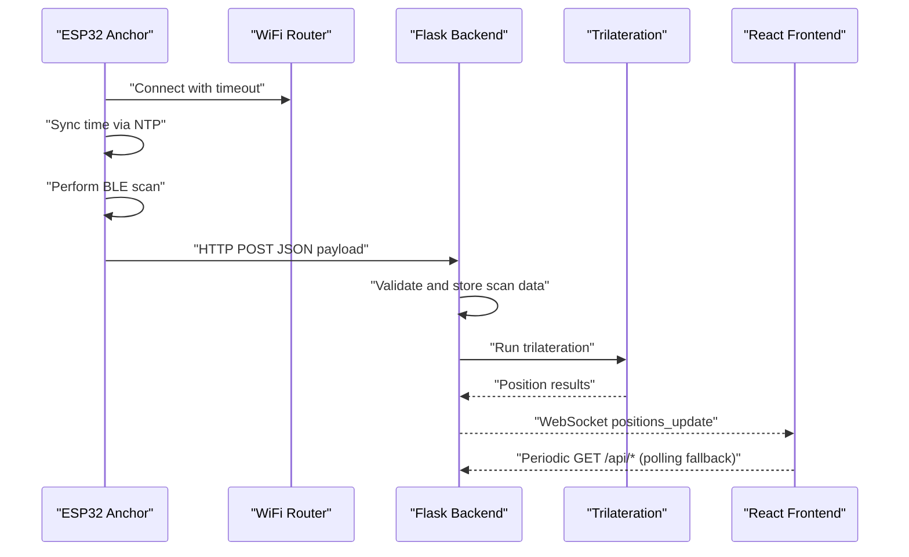
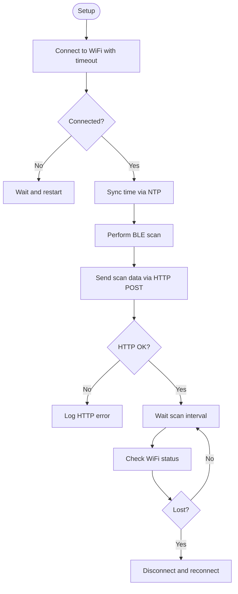
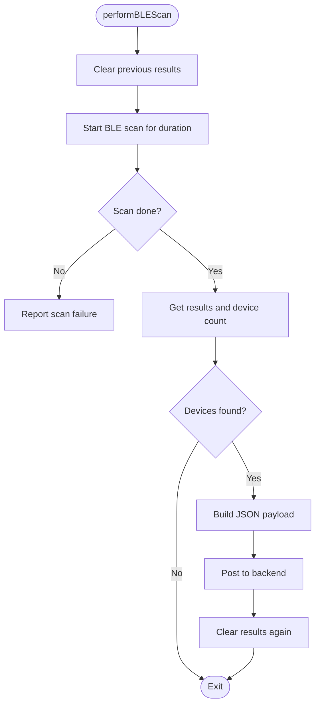
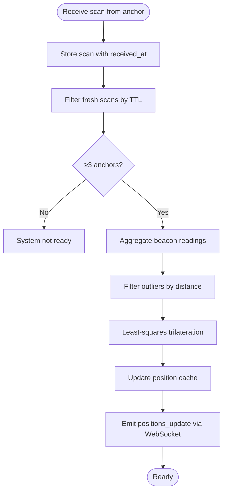
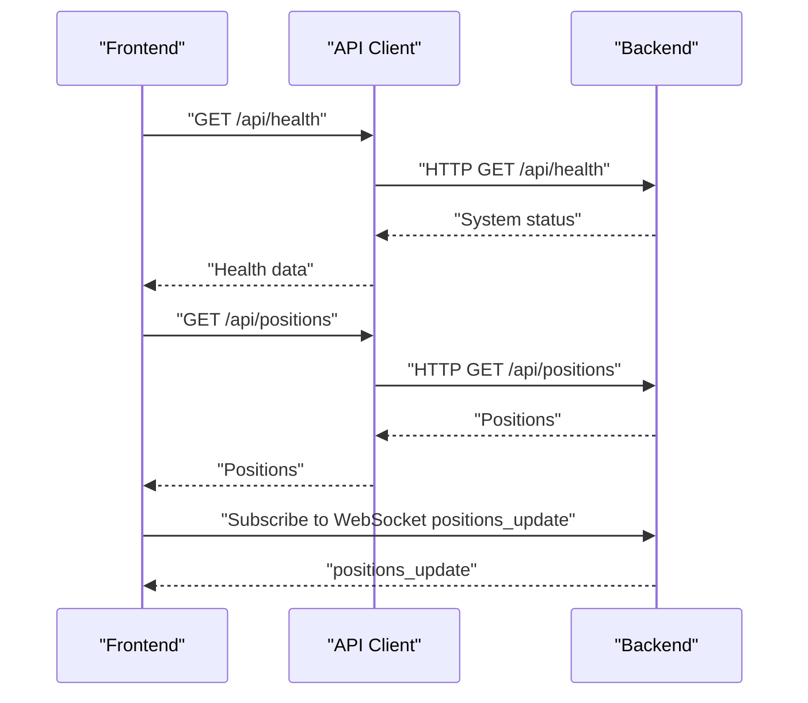
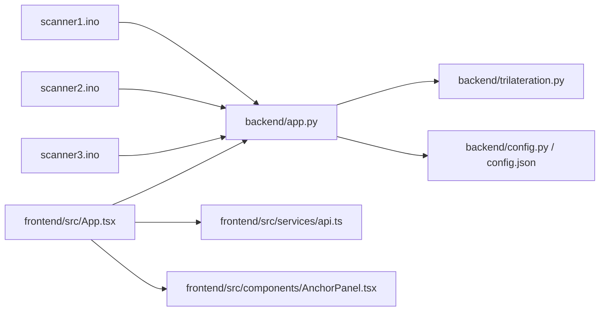

# Hardware Troubleshooting

<cite>
**Referenced Files in This Document**
- [scanner1.ino](file://scanner1/scanner1.ino)
- [scanner2.ino](file://scanner2/scanner2.ino)
- [scanner3.ino](file://scanner3/scanner3.ino)
- [app.py](file://backend/app.py)
- [trilateration.py](file://backend/trilateration.py)
- [config.py](file://backend/config.py)
- [config.json](file://backend/config.json)
- [api.ts](file://frontend/src/services/api.ts)
- [App.tsx](file://frontend/src/App.tsx)
- [AnchorPanel.tsx](file://frontend/src/components/AnchorPanel.tsx)
</cite>

## Table of Contents
1. [Introduction](#introduction)
2. [Project Structure](#project-structure)
3. [Core Components](#core-components)
4. [Architecture Overview](#architecture-overview)
5. [Detailed Component Analysis](#detailed-component-analysis)
6. [Dependency Analysis](#dependency-analysis)
7. [Performance Considerations](#performance-considerations)
8. [Troubleshooting Guide](#troubleshooting-guide)
9. [Conclusion](#conclusion)
10. [Appendices](#appendices)

## Introduction
This document provides a comprehensive hardware troubleshooting guide for the ESP32 anchor system. It focuses on diagnosing and resolving common hardware issues across WiFi connectivity, BLE scanning, power delivery, serial diagnostics, and deployment stability. It also covers backend-side diagnostics and frontend monitoring to help isolate whether issues originate in hardware or software.

## Project Structure
The system comprises:
- Three ESP32 anchor nodes (ESP32-C3) running NimBLE-based scanners that broadcast BLE scan data over WiFi to a backend service.
- A Python backend (Flask + Socket.IO) that receives scan data, runs trilateration, and emits live position updates.
- A React frontend that displays anchor status, detected beacons, and real-time positions.

```mermaid
graph TB
subgraph "ESP32 Anchors"
S1["Scanner 1<br/>scanner1.ino"]
S2["Scanner 2<br/>scanner2.ino"]
S3["Scanner 3<br/>scanner3.ino"]
end
subgraph "Network"
WiFi["WiFi Router"]
end
subgraph "Backend"
API["Flask API<br/>app.py"]
TRIL["Trilateration Engine<br/>trilateration.py"]
CFG["Config Store<br/>config.py / config.json"]
end
subgraph "Frontend"
FE["React App<br/>App.tsx"]
APIService["API Client<br/>api.ts"]
Panel["Anchor Panel<br/>AnchorPanel.tsx"]
end
S1 --> WiFi --> API
S2 --> WiFi --> API
S3 --> WiFi --> API
API --> TRIL
API --> CFG
API <- --> FE
FE --> APIService
APIService --> API
Panel --> FE
```

**Diagram sources**
- [scanner1.ino:1-255](file://scanner1/scanner1.ino#L1-L255)
- [scanner2.ino:1-255](file://scanner2/scanner2.ino#L1-L255)
- [scanner3.ino:1-255](file://scanner3/scanner3.ino#L1-L255)
- [app.py:1-422](file://backend/app.py#L1-L422)
- [trilateration.py:1-218](file://backend/trilateration.py#L1-L218)
- [config.py:1-95](file://backend/config.py#L1-L95)
- [config.json:1-30](file://backend/config.json#L1-L30)
- [App.tsx:1-294](file://frontend/src/App.tsx#L1-L294)
- [api.ts:1-66](file://frontend/src/services/api.ts#L1-L66)
- [AnchorPanel.tsx:1-143](file://frontend/src/components/AnchorPanel.tsx#L1-L143)

**Section sources**
- [scanner1.ino:1-255](file://scanner1/scanner1.ino#L1-L255)
- [scanner2.ino:1-255](file://scanner2/scanner2.ino#L1-L255)
- [scanner3.ino:1-255](file://scanner3/scanner3.ino#L1-L255)
- [app.py:1-422](file://backend/app.py#L1-L422)
- [trilateration.py:1-218](file://backend/trilateration.py#L1-L218)
- [config.py:1-95](file://backend/config.py#L1-L95)
- [config.json:1-30](file://backend/config.json#L1-L30)
- [App.tsx:1-294](file://frontend/src/App.tsx#L1-L294)
- [api.ts:1-66](file://frontend/src/services/api.ts#L1-L66)
- [AnchorPanel.tsx:1-143](file://frontend/src/components/AnchorPanel.tsx#L1-L143)

## Core Components
- ESP32 Anchors (scanner1/scanner2/scanner3.ino): Perform BLE scanning, collect RSSI and TX power, publish JSON over HTTP to the backend, and manage WiFi connectivity with timeouts.
- Backend (app.py): Receives scan data, maintains in-memory stores, runs trilateration, and emits WebSocket updates.
- Trilateration Engine (trilateration.py): Converts RSSI to distance, filters outliers, and computes 2D positions.
- Configuration (config.py/config.json): Stores room geometry, anchor positions, and calibration parameters.
- Frontend (App.tsx, api.ts, AnchorPanel.tsx): Polls backend endpoints, subscribes to WebSocket updates, and displays anchor and position status.

Key hardware-relevant behaviors:
- WiFi connection attempts with timeout and periodic reconnection.
- BLE scanning with active scan windows and result clearing to prevent memory leaks.
- HTTP POST to backend with explicit timeouts and error logging.
- Time synchronization via NTP with fallback to local timestamps.

**Section sources**
- [scanner1.ino:62-79](file://scanner1/scanner1.ino#L62-L79)
- [scanner1.ino:146-203](file://scanner1/scanner1.ino#L146-L203)
- [scanner1.ino:120-141](file://scanner1/scanner1.ino#L120-L141)
- [scanner1.ino:84-103](file://scanner1/scanner1.ino#L84-L103)
- [app.py:147-194](file://backend/app.py#L147-L194)
- [trilateration.py:11-33](file://backend/trilateration.py#L11-L33)
- [config.py:11-41](file://backend/config.py#L11-L41)
- [config.json:1-30](file://backend/config.json#L1-30)
- [App.tsx:143-175](file://frontend/src/App.tsx#L143-L175)
- [api.ts:12-63](file://frontend/src/services/api.ts#L12-L63)

## Architecture Overview
The hardware-centric flow involves:
- ESP32 anchors connecting to WiFi, syncing time, performing BLE scans, and posting JSON payloads.
- Backend receiving and validating payloads, storing scan data, and recalculating positions.
- Frontend consuming WebSocket updates and polling endpoints for status.



**Diagram sources**
- [scanner1.ino:62-79](file://scanner1/scanner1.ino#L62-L79)
- [scanner1.ino:84-103](file://scanner1/scanner1.ino#L84-L103)
- [scanner1.ino:146-203](file://scanner1/scanner1.ino#L146-L203)
- [scanner1.ino:120-141](file://scanner1/scanner1.ino#L120-L141)
- [app.py:147-194](file://backend/app.py#L147-L194)
- [trilateration.py:155-218](file://backend/trilateration.py#L155-L218)
- [App.tsx:143-175](file://frontend/src/App.tsx#L143-L175)
- [api.ts:12-63](file://frontend/src/services/api.ts#L12-L63)

## Detailed Component Analysis

### WiFi Connectivity and Network Authentication
Common symptoms:
- WiFi connection fails to establish.
- Periodic disconnections causing scan gaps.
- HTTP POST to backend fails with timeouts or errors.

Key behaviors:
- WiFi connect with timeout and retry logic.
- Periodic reconnection checks in loop.
- HTTP client with explicit timeout and error logging.



**Diagram sources**
- [scanner1.ino:62-79](file://scanner1/scanner1.ino#L62-L79)
- [scanner1.ino:240-254](file://scanner1/scanner1.ino#L240-L254)
- [scanner1.ino:120-141](file://scanner1/scanner1.ino#L120-L141)

**Section sources**
- [scanner1.ino:62-79](file://scanner1/scanner1.ino#L62-L79)
- [scanner1.ino:240-254](file://scanner1/scanner1.ino#L240-L254)
- [scanner1.ino:120-141](file://scanner1/scanner1.ino#L120-L141)

### BLE Scanning and RSSI Measurement
Common symptoms:
- No devices discovered.
- Inconsistent RSSI values.
- BLE scan failures reported.

Key behaviors:
- Active scanning with configurable intervals and windows.
- Results cleared after each scan to prevent memory leaks.
- RSSI and TX power collected per device; optional device name included.



**Diagram sources**
- [scanner1.ino:146-203](file://scanner1/scanner1.ino#L146-L203)

**Section sources**
- [scanner1.ino:146-203](file://scanner1/scanner1.ino#L146-L203)

### Backend Trilateration and Position Calculation
Common symptoms:
- Positions not appearing.
- Incorrect or unstable positions.
- Backend reports insufficient anchors.

Key behaviors:
- Freshness checks using TTL.
- RSSI-to-distance conversion with path loss exponent and TX power.
- Outlier filtering and least-squares trilateration.
- Real-time WebSocket emission of positions.



**Diagram sources**
- [app.py:48-114](file://backend/app.py#L48-L114)
- [trilateration.py:11-33](file://backend/trilateration.py#L11-L33)
- [trilateration.py:35-67](file://backend/trilateration.py#L35-L67)
- [trilateration.py:69-153](file://backend/trilateration.py#L69-L153)

**Section sources**
- [app.py:48-114](file://backend/app.py#L48-L114)
- [trilateration.py:11-33](file://backend/trilateration.py#L11-L33)
- [trilateration.py:35-67](file://backend/trilateration.py#L35-L67)
- [trilateration.py:69-153](file://backend/trilateration.py#L69-L153)

### Frontend Monitoring and Diagnostics
Common symptoms:
- No real-time updates.
- Backend unreachable.
- Anchor offline indicators.

Key behaviors:
- WebSocket connection with fallback to polling.
- Health endpoint to check system readiness.
- Anchor panel displaying online/offline status and beacon counts.



**Diagram sources**
- [App.tsx:108-175](file://frontend/src/App.tsx#L108-L175)
- [api.ts:12-63](file://frontend/src/services/api.ts#L12-L63)
- [app.py:121-144](file://backend/app.py#L121-L144)
- [app.py:197-207](file://backend/app.py#L197-L207)

**Section sources**
- [App.tsx:108-175](file://frontend/src/App.tsx#L108-L175)
- [api.ts:12-63](file://frontend/src/services/api.ts#L12-L63)
- [app.py:121-144](file://backend/app.py#L121-L144)
- [app.py:197-207](file://backend/app.py#L197-L207)

## Dependency Analysis
- ESP32 anchors depend on:
  - WiFi credentials and router reachability.
  - Backend URL availability and HTTP connectivity.
  - NTP server accessibility for time sync.
- Backend depends on:
  - Config persistence for room and anchor geometry.
  - Trilateration parameters for RSSI-to-distance conversion.
  - WebSocket clients for real-time updates.
- Frontend depends on:
  - Backend endpoints availability.
  - WebSocket connectivity for live updates.



**Diagram sources**
- [scanner1.ino:1-255](file://scanner1/scanner1.ino#L1-L255)
- [scanner2.ino:1-255](file://scanner2/scanner2.ino#L1-L255)
- [scanner3.ino:1-255](file://scanner3/scanner3.ino#L1-L255)
- [app.py:1-422](file://backend/app.py#L1-L422)
- [trilateration.py:1-218](file://backend/trilateration.py#L1-L218)
- [config.py:1-95](file://backend/config.py#L1-L95)
- [config.json:1-30](file://backend/config.json#L1-L30)
- [App.tsx:1-294](file://frontend/src/App.tsx#L1-L294)
- [api.ts:1-66](file://frontend/src/services/api.ts#L1-L66)
- [AnchorPanel.tsx:1-143](file://frontend/src/components/AnchorPanel.tsx#L1-L143)

**Section sources**
- [scanner1.ino:1-255](file://scanner1/scanner1.ino#L1-L255)
- [scanner2.ino:1-255](file://scanner2/scanner2.ino#L1-L255)
- [scanner3.ino:1-255](file://scanner3/scanner3.ino#L1-L255)
- [app.py:1-422](file://backend/app.py#L1-L422)
- [trilateration.py:1-218](file://backend/trilateration.py#L1-L218)
- [config.py:1-95](file://backend/config.py#L1-L95)
- [config.json:1-30](file://backend/config.json#L1-L30)
- [App.tsx:1-294](file://frontend/src/App.tsx#L1-L294)
- [api.ts:1-66](file://frontend/src/services/api.ts#L1-L66)
- [AnchorPanel.tsx:1-143](file://frontend/src/components/AnchorPanel.tsx#L1-L143)

## Performance Considerations
- BLE scan window and interval impact CPU and radio duty cycle; adjust for power vs. responsiveness trade-offs.
- HTTP timeouts and retry intervals should balance reliability with latency.
- Trilateration runs on every fresh scan; ensure adequate CPU headroom and avoid excessive outlier filtering that could drop below 3 anchors.
- Frontend polling cadence reduces WebSocket pressure but increases backend load.

[No sources needed since this section provides general guidance]

## Troubleshooting Guide

### WiFi Connectivity Problems
Symptoms:
- Anchor does not connect to WiFi.
- Periodic disconnects cause scan gaps.
- HTTP POST to backend fails with timeouts.

Checklist:
- Verify SSID and password correctness in the anchor firmware.
- Confirm router reachability and DHCP lease acquisition.
- Ensure NTP server is reachable for time sync.
- Review WiFi timeout and reconnection logic in firmware.
- Inspect HTTP client timeout and error logs in firmware.

Workflow:
1. Power anchor and observe Serial Monitor for WiFi connection attempts and IP assignment.
2. If connection fails, confirm router credentials and network availability.
3. If intermittent, enable periodic reconnection checks and reduce scan interval to minimize downtime.
4. Validate backend URL and firewall rules.

**Section sources**
- [scanner1.ino:28-30](file://scanner1/scanner1.ino#L28-L30)
- [scanner1.ino:62-79](file://scanner1/scanner1.ino#L62-L79)
- [scanner1.ino:240-254](file://scanner1/scanner1.ino#L240-L254)
- [scanner1.ino:120-141](file://scanner1/scanner1.ino#L120-L141)
- [scanner1.ino:35-37](file://scanner1/scanner1.ino#L35-L37)
- [scanner1.ino:84-103](file://scanner1/scanner1.ino#L84-L103)

### BLE Scanning Troubleshooting
Symptoms:
- No devices discovered.
- Inconsistent RSSI values.
- BLE scan failures reported.

Checklist:
- Confirm BLE beacon proximity and TX power settings.
- Verify active scan intervals and windows are appropriate for the environment.
- Ensure results are cleared after each scan to prevent memory pressure.
- Validate RSSI and TX power extraction and JSON payload construction.

Workflow:
1. Observe Serial Monitor for “Found X devices” messages.
2. If zero devices, move closer to beacons or increase scan duration.
3. If inconsistent RSSI, check for RF interference and antenna placement.
4. If scan failures occur, inspect NimBLE initialization and scan start return status.

**Section sources**
- [scanner1.ino:146-203](file://scanner1/scanner1.ino#L146-L203)
- [scanner1.ino:226-234](file://scanner1/scanner1.ino#L226-L234)
- [scanner1.ino:176-194](file://scanner1/scanner1.ino#L176-L194)

### Power-Related Issues
Symptoms:
- Voltage drops causing resets.
- Excessive current draw.
- Battery life short.

Checklist:
- Measure supply voltage under load; ESP32-C3 typically requires stable 3.3V.
- Use a current probe to measure quiescent and active current draw.
- Evaluate power path continuity and decoupling capacitors near the MCU.
- Consider power budget for WiFi and BLE radios.

Workflow:
1. Measure idle and active current; compare against typical values for ESP32-C3 variants.
2. If voltage drops occur under load, add bulk capacitance and improve PCB power routing.
3. Optimize sleep/idle modes and reduce radio duty cycles if applicable.

[No sources needed since this section provides general guidance]

### Serial Communication Debugging
Techniques:
- Open Arduino IDE Serial Monitor at 115200 baud.
- Look for connection messages, IP assignment, and HTTP response/error logs.
- Watch for BLE scan results and device counts.
- Monitor time sync messages and fallback behavior.

Workflow:
1. Connect USB-to-Serial adapter to ESP32 and open Serial Monitor.
2. Observe boot messages and WiFi connection attempts.
3. After successful connection, watch for HTTP POST responses and errors.
4. During BLE scans, review device discovery and RSSI values.

**Section sources**
- [scanner1.ino:208-216](file://scanner1/scanner1.ino#L208-L216)
- [scanner1.ino:62-79](file://scanner1/scanner1.ino#L62-L79)
- [scanner1.ino:120-141](file://scanner1/scanner1.ino#L120-L141)
- [scanner1.ino:146-203](file://scanner1/scanner1.ino#L146-L203)

### Anchor Deployment and Signal Quality
Symptoms:
- Intermittent connectivity.
- Poor positioning accuracy.
- Backend reports insufficient anchors.

Checklist:
- Ensure anchors are positioned to form a triangle with good coverage.
- Verify room dimensions and anchor coordinates match physical layout.
- Confirm backend TTL and freshness thresholds are appropriate for the deployment.
- Use frontend dashboard to monitor anchor online status and beacon counts.

Workflow:
1. Place anchors to maximize overlap and avoid occlusions.
2. Calibrate RSSI-to-distance parameters via backend calibration endpoints.
3. Monitor backend health and system readiness indicators.
4. Adjust scan intervals and TTL to balance responsiveness and stability.

**Section sources**
- [config.py:11-41](file://backend/config.py#L11-L41)
- [config.json:1-30](file://backend/config.json#L1-30)
- [app.py:48-114](file://backend/app.py#L48-L114)
- [App.tsx:208-222](file://frontend/src/App.tsx#L208-L222)

### Hardware Faults Diagnosis
GPIO Pin Issues:
- Symptoms: random resets, boot loops, or inability to initialize peripherals.
- Check wiring and pull-ups/pull-downs for any external peripherals.
- Verify no floating pins and correct power/ground connections.

Memory Problems:
- Symptoms: frequent crashes or scan failures.
- Confirm results are cleared after each scan to prevent memory leaks.
- Reduce JSON payload sizes if memory-constrained.

Timing Conflicts:
- Symptoms: missed scans or inconsistent timing.
- Validate scan intervals and windows; ensure sufficient time between scans.
- Consider disabling calibration mode during normal operation.

**Section sources**
- [scanner1.ino:201-202](file://scanner1/scanner1.ino#L201-L202)
- [scanner1.ino:229-231](file://scanner1/scanner1.ino#L229-L231)

### Environmental Troubleshooting
Temperature Effects:
- High temperatures can affect WiFi and BLE performance.
- Ensure adequate ventilation and avoid direct heat sources.

Humidity Impacts:
- Moisture can cause intermittent connections or corrosion.
- Use sealed enclosures and ensure proper drainage.

Electromagnetic Interference:
- Sources: WiFi routers, Bluetooth devices, motors, switching power supplies.
- Relocate anchors away from strong RF sources.
- Use shielding and proper grounding.

[No sources needed since this section provides general guidance]

### Preventive Maintenance and Inspection
- Visual inspection of PCB traces, solder joints, and connectors.
- Clean dust and debris from vents and connectors.
- Periodically verify WiFi credentials and backend URLs.
- Validate calibration parameters periodically and adjust as needed.

[No sources needed since this section provides general guidance]

### Replacement Part Identification
- ESP32-C3 module and associated components (antenna, crystal, decoupling caps).
- USB-to-Serial converter for programming and serial debugging.
- Enclosure and mounting hardware for anchors.

[No sources needed since this section provides general guidance]

### Escalation Procedures
- If firmware and environment checks fail, escalate to hardware validation with oscilloscope and spectrum analyzer.
- Document symptoms, logs, and steps taken before escalation.
- Engage professional technical support when hardware faults persist despite environmental and configuration validations.

[No sources needed since this section provides general guidance]

## Conclusion
This guide consolidates hardware troubleshooting for the ESP32 anchor system, focusing on WiFi connectivity, BLE scanning, power delivery, serial diagnostics, and deployment stability. By following the structured workflows and leveraging backend/frontend monitoring, most hardware issues can be isolated and resolved efficiently. For persistent or complex faults, escalate with documented evidence and seek professional support.

## Appendices

### Backend Calibration Parameters
- path_loss_exponent: Indoor path loss model tuning.
- tx_power_dbm: Reference TX power at 1 meter.
- min_rssi_threshold: Minimum RSSI to accept a reading.
- scan_ttl_seconds: Freshness threshold for scan data.

**Section sources**
- [config.py:34-39](file://backend/config.py#L34-L39)
- [config.json:23-28](file://backend/config.json#L23-L28)