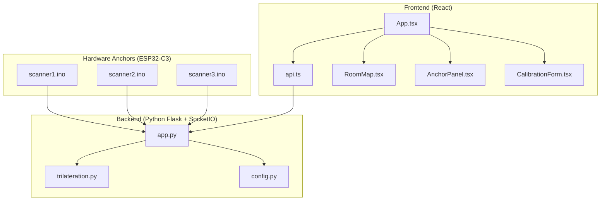
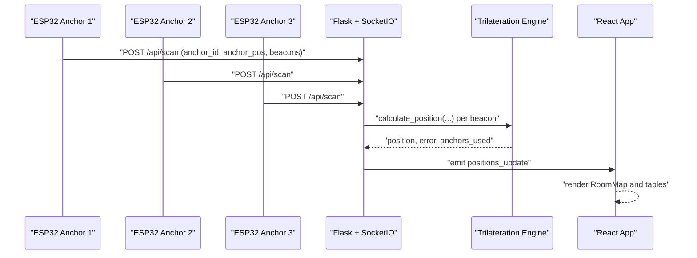
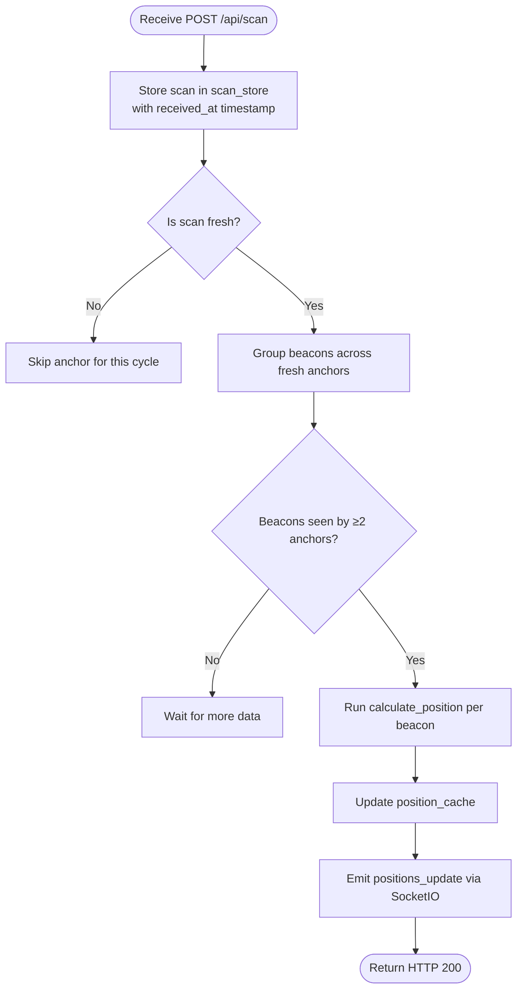
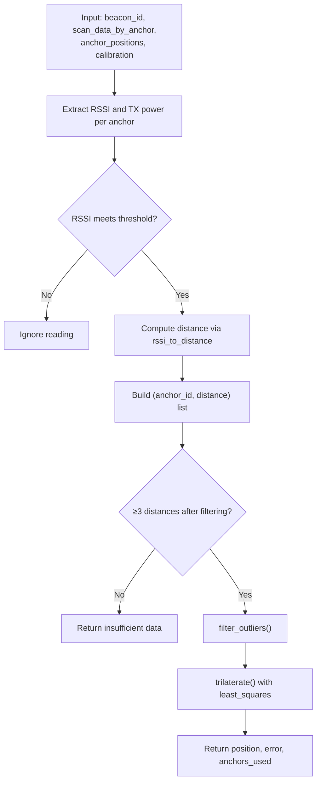
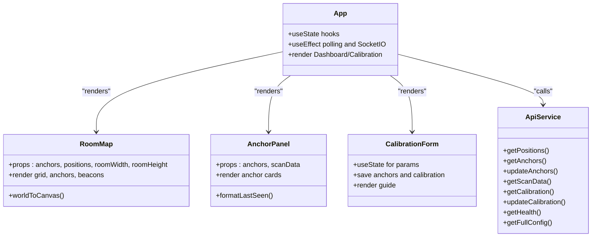
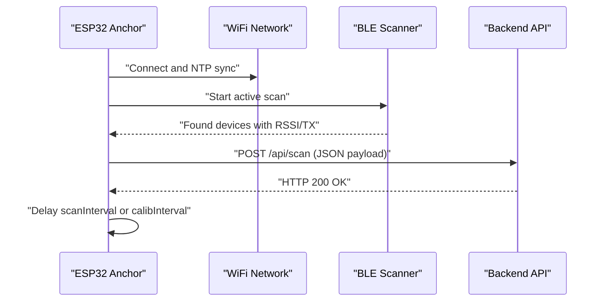
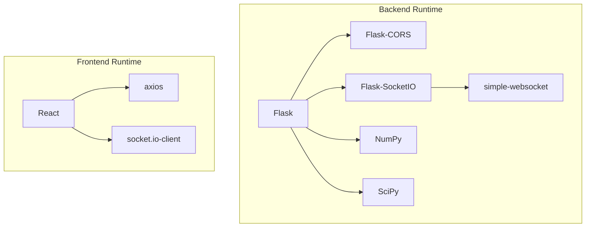

# Project Overview

<cite>
**Referenced Files in This Document**
- [app.py](file://backend/app.py)
- [trilateration.py](file://backend/trilateration.py)
- [config.py](file://backend/config.py)
- [api.ts](file://frontend/src/services/api.ts)
- [App.tsx](file://frontend/src/App.tsx)
- [RoomMap.tsx](file://frontend/src/components/RoomMap.tsx)
- [AnchorPanel.tsx](file://frontend/src/components/AnchorPanel.tsx)
- [CalibrationForm.tsx](file://frontend/src/components/CalibrationForm.tsx)
- [scanner1.ino](file://scanner1/scanner1.ino)
- [scanner2.ino](file://scanner2/scanner2.ino)
- [scanner3.ino](file://scanner3/scanner3.ino)
- [requirements.txt](file://backend/requirements.txt)
- [package.json](file://frontend/package.json)
</cite>

## Table of Contents
1. [Introduction](#introduction)
2. [Project Structure](#project-structure)
3. [Core Components](#core-components)
4. [Architecture Overview](#architecture-overview)
5. [Detailed Component Analysis](#detailed-component-analysis)
6. [Dependency Analysis](#dependency-analysis)
7. [Performance Considerations](#performance-considerations)
8. [Troubleshooting Guide](#troubleshooting-guide)
9. [Conclusion](#conclusion)
10. [Appendices](#appendices)

## Introduction
This document presents a comprehensive overview of the BLE Room Positioning System. It explains the system’s purpose as a real-time indoor localization solution that triangulates BLE beacon positions using RSSI measurements from multiple ESP32 anchors. The backend is implemented in Python with Flask and SocketIO, the frontend is a React application, and the anchors are ESP32-C3 microcontrollers running NimBLE-based scanners. The system supports trilateration-based position estimation, multi-anchor triangulation, and live visualization of tracked beacons overlaid on a room map. It also provides calibration controls for path-loss exponent, TX power, RSSI thresholds, and scan freshness.

## Project Structure
The repository is organized into three primary layers:
- Hardware anchors: Three ESP32-C3 boards (scanner1, scanner2, scanner3) that periodically scan BLE advertisements and POST scan data to the backend.
- Backend: A Python Flask service with SocketIO that receives scan data, runs trilateration, caches positions, and emits real-time updates to clients.
- Frontend: A React application that polls or subscribes to backend APIs and SocketIO to render a room map, anchor status, beacon positions, and calibration controls.

**Diagram sources**
- [app.py:1-398](file://backend/app.py#L1-L398)
- [trilateration.py:1-218](file://backend/trilateration.py#L1-L218)
- [config.py:1-95](file://backend/config.py#L1-L95)
- [api.ts:1-66](file://frontend/src/services/api.ts#L1-L66)
- [App.tsx:1-274](file://frontend/src/App.tsx#L1-L274)
- [RoomMap.tsx:1-229](file://frontend/src/components/RoomMap.tsx#L1-L229)
- [AnchorPanel.tsx:1-143](file://frontend/src/components/AnchorPanel.tsx#L1-L143)
- [CalibrationForm.tsx:1-290](file://frontend/src/components/CalibrationForm.tsx#L1-L290)
- [scanner1.ino:1-250](file://scanner1/scanner1.ino#L1-L250)
- [scanner2.ino:1-250](file://scanner2/scanner2.ino#L1-L250)
- [scanner3.ino:1-250](file://scanner3/scanner3.ino#L1-L250)

**Section sources**
- [app.py:1-398](file://backend/app.py#L1-L398)
- [trilateration.py:1-218](file://backend/trilateration.py#L1-L218)
- [config.py:1-95](file://backend/config.py#L1-L95)
- [api.ts:1-66](file://frontend/src/services/api.ts#L1-L66)
- [App.tsx:1-274](file://frontend/src/App.tsx#L1-L274)
- [RoomMap.tsx:1-229](file://frontend/src/components/RoomMap.tsx#L1-L229)
- [AnchorPanel.tsx:1-143](file://frontend/src/components/AnchorPanel.tsx#L1-L143)
- [CalibrationForm.tsx:1-290](file://frontend/src/components/CalibrationForm.tsx#L1-L290)
- [scanner1.ino:1-250](file://scanner1/scanner1.ino#L1-L250)
- [scanner2.ino:1-250](file://scanner2/scanner2.ino#L1-L250)
- [scanner3.ino:1-250](file://scanner3/scanner3.ino#L1-L250)

## Core Components
- Backend Flask server and SocketIO hub: Receives scan payloads from anchors, maintains in-memory stores for recent scans and cached positions, and emits real-time updates.
- Trilateration engine: Converts RSSI to distance using a log-distance path loss model, filters outliers, and solves a least-squares trilateration problem to estimate 2D positions.
- Configuration manager: Loads and persists room dimensions, anchor positions, and calibration parameters.
- Frontend React application: Provides dashboard and calibration views, renders a room map with anchors and beacon positions, and displays anchor status and beacon details.
- ESP32 anchors: Periodically scan BLE devices, collect RSSI and TX power, and POST structured payloads to the backend.

Key backend endpoints and events:
- HTTP POST /api/scan: Accepts anchor scan data.
- HTTP GET /api/positions: Returns cached positions.
- HTTP GET /api/anchors: Returns anchor status and metadata.
- HTTP PUT /api/anchors: Updates anchor positions.
- HTTP GET /api/scan-data: Returns recent raw scan data.
- HTTP POST /api/calibrate: Updates calibration parameters and recalculates positions.
- HTTP GET /api/calibrate: Returns current calibration and room configuration.
- HTTP GET /api/config and PUT /api/config: Full configuration read/write.
- SocketIO events: connect, request_positions, positions_update.

**Section sources**
- [app.py:112-398](file://backend/app.py#L112-L398)
- [trilateration.py:11-218](file://backend/trilateration.py#L11-L218)
- [config.py:44-95](file://backend/config.py#L44-L95)
- [api.ts:12-66](file://frontend/src/services/api.ts#L12-L66)

## Architecture Overview
The system follows a client-server architecture with real-time push:
- Anchors continuously broadcast BLE scan results to the backend.
- Backend aggregates scans, applies calibration, computes positions, and pushes updates via SocketIO.
- Frontend subscribes to updates and renders a responsive dashboard.

**Diagram sources**
- [app.py:123-171](file://backend/app.py#L123-L171)
- [app.py:48-106](file://backend/app.py#L48-L106)
- [trilateration.py:155-218](file://backend/trilateration.py#L155-L218)
- [App.tsx:139-172](file://frontend/src/App.tsx#L139-L172)

## Detailed Component Analysis

### Backend: Flask + SocketIO
Responsibilities:
- Ingest scan data from anchors and maintain a time-bounded scan store.
- Aggregate scans across anchors and run trilateration for each beacon observed by multiple anchors.
- Maintain a position cache and emit real-time updates.
- Expose REST endpoints for configuration, calibration, and diagnostics.

Processing logic highlights:
- Freshness checks using a configurable TTL.
- Beacon filtering by configured MAC list.
- Least-squares trilateration with outlier rejection.
- Real-time emission via SocketIO.

**Diagram sources**
- [app.py:39-106](file://backend/app.py#L39-L106)
- [trilateration.py:155-218](file://backend/trilateration.py#L155-L218)

**Section sources**
- [app.py:28-106](file://backend/app.py#L28-L106)
- [app.py:123-171](file://backend/app.py#L123-L171)
- [app.py:354-377](file://backend/app.py#L354-L377)

### Trilateration Engine
Core algorithms:
- RSSI-to-distance conversion using log-distance path loss model with configurable path-loss exponent and TX power.
- Outlier filtering using median absolute deviation to retain robust measurements.
- Least-squares trilateration minimizing residual errors across anchor constraints.
- Robust error estimation and reporting of anchors used.

**Diagram sources**
- [trilateration.py:11-33](file://backend/trilateration.py#L11-L33)
- [trilateration.py:35-67](file://backend/trilateration.py#L35-L67)
- [trilateration.py:69-153](file://backend/trilateration.py#L69-L153)
- [trilateration.py:155-218](file://backend/trilateration.py#L155-L218)

**Section sources**
- [trilateration.py:11-218](file://backend/trilateration.py#L11-L218)

### Configuration Management
- Loads defaults if config.json does not exist.
- Provides getters for anchor positions and calibration parameters.
- Supports updating anchor positions and calibration parameters with persistence.

**Section sources**
- [config.py:44-95](file://backend/config.py#L44-L95)

### Frontend: React Application
- App shell manages pages (Dashboard, Calibration), connects to SocketIO, and polls REST endpoints.
- RoomMap renders a scalable canvas-based room map with anchors and beacon positions, including uncertainty circles.
- AnchorPanel displays anchor status, last-seen timestamps, detected beacons, and RSSI levels.
- CalibrationForm allows adjusting anchor positions and calibration parameters, with guidance steps.

**Diagram sources**
- [App.tsx:56-274](file://frontend/src/App.tsx#L56-L274)
- [RoomMap.tsx:28-229](file://frontend/src/components/RoomMap.tsx#L28-L229)
- [AnchorPanel.tsx:30-143](file://frontend/src/components/AnchorPanel.tsx#L30-L143)
- [CalibrationForm.tsx:30-290](file://frontend/src/components/CalibrationForm.tsx#L30-L290)
- [api.ts:12-66](file://frontend/src/services/api.ts#L12-L66)

**Section sources**
- [App.tsx:56-274](file://frontend/src/App.tsx#L56-L274)
- [RoomMap.tsx:28-229](file://frontend/src/components/RoomMap.tsx#L28-L229)
- [AnchorPanel.tsx:30-143](file://frontend/src/components/AnchorPanel.tsx#L30-L143)
- [CalibrationForm.tsx:30-290](file://frontend/src/components/CalibrationForm.tsx#L30-L290)
- [api.ts:12-66](file://frontend/src/services/api.ts#L12-L66)

### ESP32 Anchors (NimBLE Scanners)
Each anchor board:
- Connects to WiFi and synchronizes time via NTP.
- Performs BLE active scans at intervals, collects RSSI and TX power, and optionally beacon names.
- Posts JSON payloads to the backend endpoint with anchor identity, position, timestamp, and beacon list.
- Supports a calibration mode with faster scan intervals.

**Diagram sources**
- [scanner1.ino:146-198](file://scanner1/scanner1.ino#L146-L198)
- [scanner2.ino:146-198](file://scanner2/scanner2.ino#L146-L198)
- [scanner3.ino:146-198](file://scanner3/scanner3.ino#L146-L198)
- [app.py:123-171](file://backend/app.py#L123-L171)

**Section sources**
- [scanner1.ino:120-198](file://scanner1/scanner1.ino#L120-L198)
- [scanner2.ino:120-198](file://scanner2/scanner2.ino#L120-L198)
- [scanner3.ino:120-198](file://scanner3/scanner3.ino#L120-L198)

## Dependency Analysis
External libraries and runtime dependencies:
- Backend: Flask, Flask-CORS, Flask-SocketIO, NumPy, SciPy, simple-websocket.
- Frontend: React, React DOM, axios, socket.io-client.

**Diagram sources**
- [requirements.txt:1-7](file://backend/requirements.txt#L1-L7)
- [package.json:12-29](file://frontend/package.json#L12-L29)

**Section sources**
- [requirements.txt:1-7](file://backend/requirements.txt#L1-L7)
- [package.json:12-29](file://frontend/package.json#L12-L29)

## Performance Considerations
- RSSI filtering: Use min_rssi_threshold to discard weak signals and reduce noise-induced errors.
- Outlier rejection: The trilateration module filters distances using median absolute deviation to mitigate multipath and interference.
- Scan freshness: Configure scan_ttl_seconds to balance responsiveness and stability.
- Anchor placement: Prefer non-collinear anchors and sufficient separation to improve triangulation accuracy.
- Frontend rendering: Canvas-based RoomMap scales efficiently; avoid excessive re-renders by leveraging memoization and efficient state updates.
- Backend throughput: Keep trilateration batched and avoid blocking operations; the current design runs calculations on receipt and emits updates asynchronously.

[No sources needed since this section provides general guidance]

## Troubleshooting Guide
Common issues and remedies:
- Anchors not appearing online:
  - Verify WiFi credentials and connectivity on each anchor.
  - Confirm backend URL and network reachability.
  - Check NTP synchronization and timestamp logic.
- No positions displayed:
  - Ensure at least two anchors detect the same beacon.
  - Adjust path_loss_exponent and tx_power_dbm in calibration.
  - Increase scan_interval_ms temporarily to improve detection.
- Weak RSSI or frequent disconnections:
  - Lower min_rssi_threshold cautiously.
  - Improve anchor placement and reduce obstacles.
- Frontend not receiving updates:
  - Confirm SocketIO transport and reconnection settings.
  - Check CORS configuration on the backend.
- Calibration drift:
  - Recompute positions after changing calibration parameters.
  - Validate anchor positions in the Calibration tab.

**Section sources**
- [scanner1.ino:62-103](file://scanner1/scanner1.ino#L62-L103)
- [scanner1.ino:235-249](file://scanner1/scanner1.ino#L235-L249)
- [app.py:354-377](file://backend/app.py#L354-L377)
- [config.py:89-95](file://backend/config.py#L89-L95)
- [CalibrationForm.tsx:89-100](file://frontend/src/components/CalibrationForm.tsx#L89-L100)

## Conclusion
The BLE Room Positioning System delivers a practical, real-time indoor localization platform. By combining ESP32 anchors with a Python backend and a React frontend, it enables accurate trilateration-based tracking of BLE beacons. The system’s modular design supports easy calibration, dynamic anchor repositioning, and live visualization, making it suitable for asset tracking, navigation, and occupancy monitoring in constrained environments.

[No sources needed since this section summarizes without analyzing specific files]

## Appendices

### Practical Workflow Example
- Deploy three ESP32 anchors at known (x, y) positions in the room.
- Power anchors and confirm WiFi connectivity; verify NTP time sync.
- Start the backend service and ensure SocketIO is reachable.
- Launch the React frontend and navigate to the Dashboard.
- Place a BLE beacon at known reference points and validate positions.
- Fine-tune calibration parameters until accuracy targets are met.
- Monitor live updates and anchor status in the UI.

[No sources needed since this section provides general guidance]