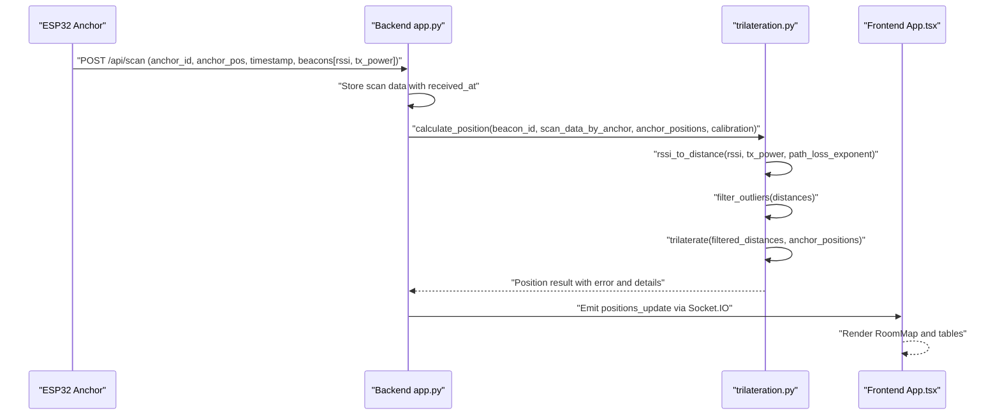
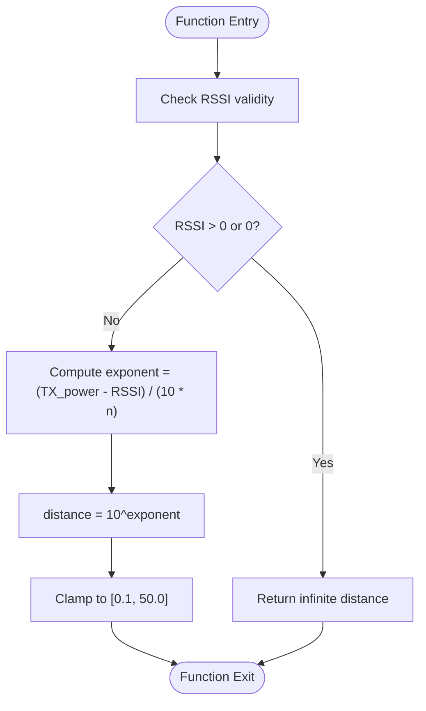
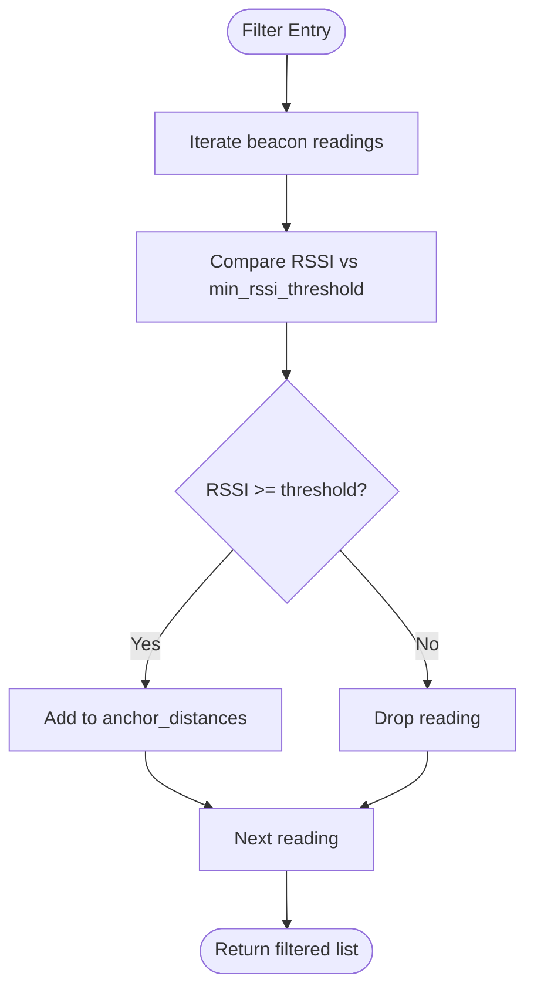
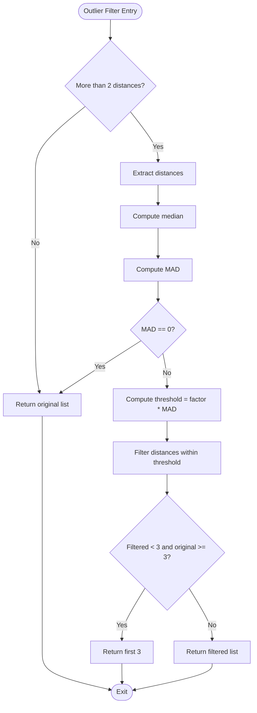
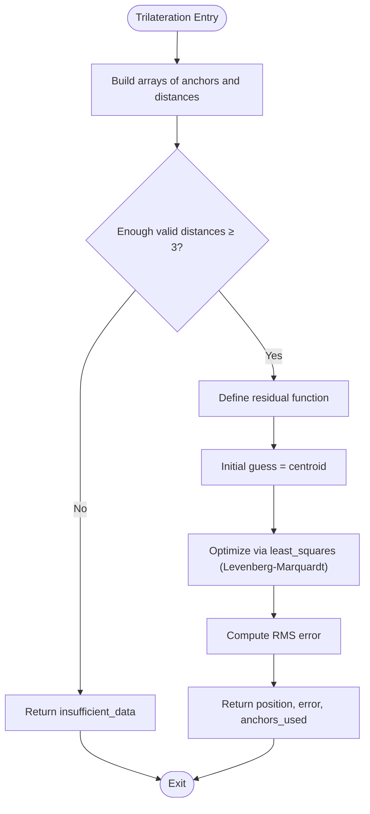
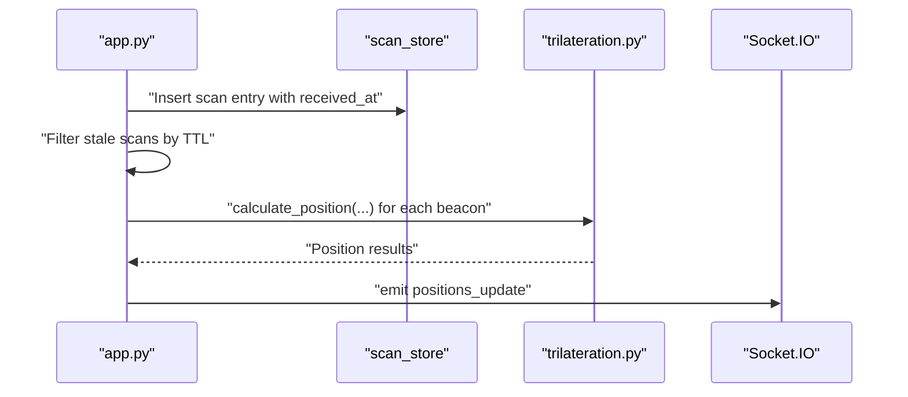
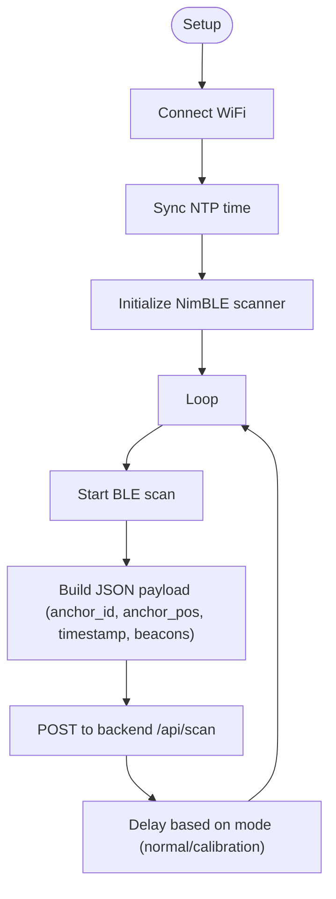
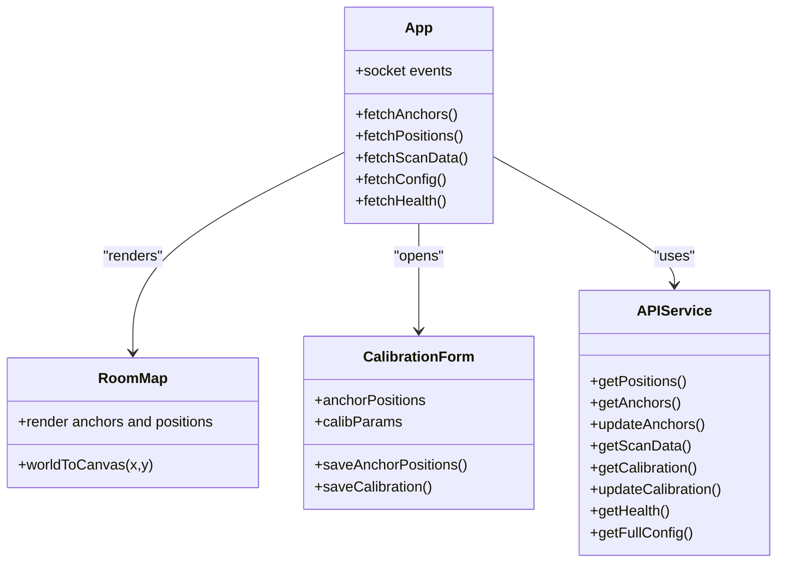

# BLE Signal Processing

<cite>
**Referenced Files in This Document**
- [app.py](file://backend/app.py)
- [trilateration.py](file://backend/trilateration.py)
- [config.py](file://backend/config.py)
- [config.json](file://backend/config.json)
- [scanner1.ino](file://scanner1/scanner1.ino)
- [scanner2.ino](file://scanner2/scanner2.ino)
- [scanner3.ino](file://scanner3/scanner3.ino)
- [api.ts](file://frontend/src/services/api.ts)
- [App.tsx](file://frontend/src/App.tsx)
- [RoomMap.tsx](file://frontend/src/components/RoomMap.tsx)
- [CalibrationForm.tsx](file://frontend/src/components/CalibrationForm.tsx)
</cite>

## Table of Contents
1. [Introduction](#introduction)
2. [Project Structure](#project-structure)
3. [Core Components](#core-components)
4. [Architecture Overview](#architecture-overview)
5. [Detailed Component Analysis](#detailed-component-analysis)
6. [Dependency Analysis](#dependency-analysis)
7. [Performance Considerations](#performance-considerations)
8. [Troubleshooting Guide](#troubleshooting-guide)
9. [Conclusion](#conclusion)
10. [Appendices](#appendices)

## Introduction
This document explains BLE signal processing fundamentals and the implementation in this project. It covers RSSI-to-distance conversion using the log-distance path loss model, signal filtering techniques (threshold-based filtering and outlier detection via median absolute deviation), and trilateration-based localization. It also documents environmental factors affecting BLE propagation, calibration parameters, and practical guidance for tuning, validation, and optimization.

## Project Structure
The system comprises:
- Backend service (Python Flask + Socket.IO) that receives BLE scan reports from anchors, applies signal processing, runs trilateration, and serves results to the frontend.
- Three ESP32 anchors (Arduino/NimBLE) that continuously scan BLE devices, collect RSSI and TX power, and POST scan data to the backend.
- Frontend (React + Socket.IO) that displays live positions, anchor status, and calibration controls.

```mermaid
graph TB
subgraph "ESP32 Anchors"
S1["scanner1.ino"]
S2["scanner2.ino"]
S3["scanner3.ino"]
end
subgraph "Backend"
APP["app.py"]
TRIL["trilateration.py"]
CFG["config.py<br/>config.json"]
end
subgraph "Frontend"
FE_APP["App.tsx"]
ROOM["RoomMap.tsx"]
CAL["CalibrationForm.tsx"]
API["api.ts"]
end
S1 --> APP
S2 --> APP
S3 --> APP
APP --> TRIL
APP --> CFG
FE_APP --> API
FE_APP --> ROOM
FE_APP --> CAL
FE_APP <- --> APP
```

**Diagram sources**
- [scanner1.ino:146-198](file://scanner1/scanner1.ino#L146-L198)
- [scanner2.ino:146-198](file://scanner2/scanner2.ino#L146-L198)
- [scanner3.ino:146-198](file://scanner3/scanner3.ino#L146-L198)
- [app.py:123-170](file://backend/app.py#L123-L170)
- [trilateration.py:155-217](file://backend/trilateration.py#L155-L217)
- [config.py:44-95](file://backend/config.py#L44-L95)
- [config.json:1-30](file://backend/config.json#L1-L30)
- [App.tsx:140-172](file://frontend/src/App.tsx#L140-L172)
- [RoomMap.tsx:28-229](file://frontend/src/components/RoomMap.tsx#L28-L229)
- [CalibrationForm.tsx:30-290](file://frontend/src/components/CalibrationForm.tsx#L30-L290)
- [api.ts:1-66](file://frontend/src/services/api.ts#L1-L66)

**Section sources**
- [app.py:1-398](file://backend/app.py#L1-L398)
- [trilateration.py:1-218](file://backend/trilateration.py#L1-L218)
- [config.py:1-95](file://backend/config.py#L1-L95)
- [config.json:1-30](file://backend/config.json#L1-L30)
- [scanner1.ino:1-250](file://scanner1/scanner1.ino#L1-L250)
- [scanner2.ino:1-250](file://scanner2/scanner2.ino#L1-L250)
- [scanner3.ino:1-250](file://scanner3/scanner3.ino#L1-L250)
- [App.tsx:1-274](file://frontend/src/App.tsx#L1-L274)
- [RoomMap.tsx:1-229](file://frontend/src/components/RoomMap.tsx#L1-L229)
- [CalibrationForm.tsx:1-290](file://frontend/src/components/CalibrationForm.tsx#L1-L290)
- [api.ts:1-66](file://frontend/src/services/api.ts#L1-L66)

## Core Components
- RSSI-to-distance conversion using the log-distance path loss model with configurable TX power reference and path loss exponent.
- Threshold-based filtering to discard weak signals below a configurable RSSI threshold.
- Outlier detection using median absolute deviation (MAD) to remove unreliable distance estimates.
- Least-squares trilateration to estimate 2D positions from multiple anchors.
- Real-time streaming of positions via WebSocket and periodic polling fallback.
- Calibration UI enabling adjustment of path loss exponent, TX power reference, RSSI threshold, and scan freshness TTL.

**Section sources**
- [trilateration.py:11-33](file://backend/trilateration.py#L11-L33)
- [trilateration.py:35-67](file://backend/trilateration.py#L35-L67)
- [trilateration.py:69-153](file://backend/trilateration.py#L69-L153)
- [app.py:48-105](file://backend/app.py#L48-L105)
- [CalibrationForm.tsx:180-256](file://frontend/src/components/CalibrationForm.tsx#L180-L256)
- [config.py:34-41](file://backend/config.py#L34-L41)

## Architecture Overview
The system operates as follows:
- Anchors periodically scan BLE devices and POST scan payloads containing anchor metadata, timestamps, and per-beacon RSSI/TX power.
- Backend validates and stores scan data, filters stale entries, and computes distances per beacon-anchor pair.
- Trilateration aggregates reliable distance measurements and estimates positions, emitting results via WebSocket.
- Frontend subscribes to real-time updates and displays positions, anchors, and calibration controls.



**Diagram sources**
- [scanner1.ino:146-198](file://scanner1/scanner1.ino#L146-L198)
- [app.py:123-170](file://backend/app.py#L123-L170)
- [trilateration.py:155-217](file://backend/trilateration.py#L155-L217)
- [App.tsx:140-172](file://frontend/src/App.tsx#L140-L172)
- [RoomMap.tsx:28-229](file://frontend/src/components/RoomMap.tsx#L28-L229)

## Detailed Component Analysis

### RSSI-to-Distance Conversion (Log-Distance Path Loss Model)
- Mathematical model: distance = 10^((TX_power − RSSI)/(10·n))
- Inputs:
  - RSSI: Received signal strength indicator (dBm, typically negative).
  - TX_power: Reference TX power at 1 meter (dBm).
  - n: Path loss exponent (environment-dependent).
- Output: Distance in meters clamped to a safe range (e.g., 0.1–50 m).
- Notes:
  - TX_power can be beacon-specific or a default calibrated value.
  - The path loss exponent increases with environmental complexity (e.g., free space ≈ 2.0, indoor 2.7–3.5, dense walls 3.5–5.0).



**Diagram sources**
- [trilateration.py:11-33](file://backend/trilateration.py#L11-L33)

**Section sources**
- [trilateration.py:11-33](file://backend/trilateration.py#L11-L33)
- [CalibrationForm.tsx:182-199](file://frontend/src/components/CalibrationForm.tsx#L182-L199)

### Threshold-Based Filtering for Weak Signals
- Discards beacon readings whose RSSI falls below a configurable threshold (default -90 dBm).
- Prevents noisy or far-field measurements from corrupting trilateration.



**Diagram sources**
- [trilateration.py:189-192](file://backend/trilateration.py#L189-L192)

**Section sources**
- [trilateration.py:189-192](file://backend/trilateration.py#L189-L192)
- [config.py:37-37](file://backend/config.py#L37-L37)

### Outlier Detection Using Median Absolute Deviation (MAD)
- Computes median and MAD across distances from multiple anchors for a given beacon.
- Removes outliers beyond a threshold factor (default 2.0 MADs).
- Ensures at least 3 measurements remain if possible; otherwise preserves up to 3 to maintain minimal data.



**Diagram sources**
- [trilateration.py:35-67](file://backend/trilateration.py#L35-L67)

**Section sources**
- [trilateration.py:35-67](file://backend/trilateration.py#L35-L67)

### Trilateration and Position Estimation
- Uses least-squares optimization to minimize residuals between measured distances and Euclidean distances from candidate position to anchors.
- Provides an estimated position (x, y) and RMS error across anchors.
- Requires at least 3 valid distances; otherwise returns insufficient data.



**Diagram sources**
- [trilateration.py:69-153](file://backend/trilateration.py#L69-L153)

**Section sources**
- [trilateration.py:69-153](file://backend/trilateration.py#L69-L153)

### Backend Pipeline and Real-Time Updates
- Receives scan payloads from anchors, stores them with timestamps, and runs trilateration across all beacons visible to 3+ anchors.
- Emits real-time position updates via Socket.IO; falls back to periodic polling if WebSocket is unavailable.
- Exposes REST endpoints for health, positions, anchors, scan data, and calibration.



**Diagram sources**
- [app.py:48-105](file://backend/app.py#L48-L105)
- [app.py:123-170](file://backend/app.py#L123-L170)
- [App.tsx:140-172](file://frontend/src/App.tsx#L140-L172)

**Section sources**
- [app.py:39-105](file://backend/app.py#L39-L105)
- [app.py:123-170](file://backend/app.py#L123-L170)
- [App.tsx:125-137](file://frontend/src/App.tsx#L125-L137)

### Anchor Scanners (ESP32 + NimBLE)
- Perform BLE scans, collect RSSI and TX power, and POST JSON payloads to the backend.
- Supports calibration mode with faster scan intervals.
- Uses NTP time synchronization when available; otherwise falls back to millisecond timestamps.



**Diagram sources**
- [scanner1.ino:203-230](file://scanner1/scanner1.ino#L203-L230)
- [scanner1.ino:235-249](file://scanner1/scanner1.ino#L235-L249)
- [scanner1.ino:146-198](file://scanner1/scanner1.ino#L146-L198)

**Section sources**
- [scanner1.ino:1-250](file://scanner1/scanner1.ino#L1-L250)
- [scanner2.ino:1-250](file://scanner2/scanner2.ino#L1-L250)
- [scanner3.ino:1-250](file://scanner3/scanner3.ino#L1-L250)

### Frontend Visualization and Calibration
- Real-time dashboard renders anchors and beacon positions with uncertainty circles and error metrics.
- Calibration form allows adjusting path loss exponent, TX power reference, RSSI threshold, and scan TTL.
- Uses Socket.IO for live updates and Axios for REST API calls.



**Diagram sources**
- [App.tsx:56-274](file://frontend/src/App.tsx#L56-L274)
- [RoomMap.tsx:28-229](file://frontend/src/components/RoomMap.tsx#L28-L229)
- [CalibrationForm.tsx:30-290](file://frontend/src/components/CalibrationForm.tsx#L30-L290)
- [api.ts:1-66](file://frontend/src/services/api.ts#L1-L66)

**Section sources**
- [App.tsx:1-274](file://frontend/src/App.tsx#L1-L274)
- [RoomMap.tsx:1-229](file://frontend/src/components/RoomMap.tsx#L1-L229)
- [CalibrationForm.tsx:1-290](file://frontend/src/components/CalibrationForm.tsx#L1-L290)
- [api.ts:1-66](file://frontend/src/services/api.ts#L1-L66)

## Dependency Analysis
- Backend depends on:
  - trilateration module for signal processing and localization.
  - config module for persistent calibration and anchor positions.
  - Flask and Socket.IO for HTTP and real-time communication.
- Frontend depends on:
  - Socket.IO client for live updates.
  - Axios for REST API calls.
  - React components for rendering.

```mermaid
graph LR
Scanner1["scanner1.ino"] --> Backend["app.py"]
Scanner2["scanner2.ino"] --> Backend
Scanner3["scanner3.ino"] --> Backend
Backend --> Tril["trilateration.py"]
Backend --> Cfg["config.py"]
FE["App.tsx"] --> API["api.ts"]
FE --> Room["RoomMap.tsx"]
FE --> Cal["CalibrationForm.tsx"]
FE <- --> Backend
```

**Diagram sources**
- [scanner1.ino:146-198](file://scanner1/scanner1.ino#L146-L198)
- [scanner2.ino:146-198](file://scanner2/scanner2.ino#L146-L198)
- [scanner3.ino:146-198](file://scanner3/scanner3.ino#L146-L198)
- [app.py:13-21](file://backend/app.py#L13-L21)
- [trilateration.py:1-218](file://backend/trilateration.py#L1-L218)
- [config.py:1-95](file://backend/config.py#L1-L95)
- [App.tsx:1-274](file://frontend/src/App.tsx#L1-L274)
- [api.ts:1-66](file://frontend/src/services/api.ts#L1-L66)
- [RoomMap.tsx:1-229](file://frontend/src/components/RoomMap.tsx#L1-L229)
- [CalibrationForm.tsx:1-290](file://frontend/src/components/CalibrationForm.tsx#L1-L290)

**Section sources**
- [app.py:13-21](file://backend/app.py#L13-L21)
- [trilateration.py:1-218](file://backend/trilateration.py#L1-L218)
- [config.py:1-95](file://backend/config.py#L1-L95)
- [App.tsx:1-274](file://frontend/src/App.tsx#L1-L274)
- [api.ts:1-66](file://frontend/src/services/api.ts#L1-L66)

## Performance Considerations
- RSSI-to-distance clamping prevents extreme outliers from causing numerical instability.
- MAD-based outlier filtering reduces sensitivity to sporadic multipath or interference spikes.
- Minimum RSSI threshold avoids noisy measurements that degrade trilateration accuracy.
- Scan TTL ensures stale data does not accumulate and skew results.
- Least-squares trilateration uses a robust solver with bounded iterations to balance speed and accuracy.
- Frontend rendering scales coordinates to a fixed pixel-per-meter ratio for consistent visualization.

[No sources needed since this section provides general guidance]

## Troubleshooting Guide
Common issues and remedies:
- No positions displayed:
  - Verify anchors are online and reporting (check health and anchors endpoints).
  - Confirm WiFi connectivity and backend reachability.
- Incorrect or unstable positions:
  - Adjust path loss exponent and TX power reference in calibration.
  - Increase RSSI threshold to filter out weak signals.
  - Ensure at least 3 anchors are consistently detecting the beacon.
- Poor localization accuracy:
  - Calibrate in multiple locations across the room.
  - Reduce scan TTL to favor fresher data.
  - Validate anchor positions and room dimensions.
- Noise and jitter:
  - Increase MAD threshold factor to remove more outliers.
  - Use longer scan windows on anchors to average RSSI readings.
- Frontend not updating:
  - Check WebSocket connection status and logs.
  - Enable polling fallback by refreshing pages if WebSocket fails.

**Section sources**
- [app.py:112-120](file://backend/app.py#L112-L120)
- [app.py:186-222](file://backend/app.py#L186-L222)
- [CalibrationForm.tsx:180-256](file://frontend/src/components/CalibrationForm.tsx#L180-L256)
- [App.tsx:140-172](file://frontend/src/App.tsx#L140-L172)

## Conclusion
This system integrates BLE RSSI collection from ESP32 anchors with robust signal processing and trilateration to deliver real-time indoor positioning. The log-distance path loss model, threshold-based filtering, and MAD-based outlier rejection provide a solid foundation for accurate localization. Calibration parameters enable environment-specific tuning, while the frontend offers intuitive monitoring and adjustment capabilities.

[No sources needed since this section summarizes without analyzing specific files]

## Appendices

### Environmental Factors and Parameter Tuning
- Path loss exponent (n):
  - Free space: ~2.0
  - Indoor typical: 2.7–3.5
  - Dense environments: 3.5–5.0
- TX power reference:
  - Use beacon-specific TX power when available; otherwise tune a default value to match measured RSSI at 1 m.
- RSSI threshold:
  - Start at -90 dBm; increase if noise dominates.
- Scan TTL:
  - Lower values reduce staleness but increase network traffic; adjust based on anchor frequency and backend capacity.

**Section sources**
- [trilateration.py:11-21](file://backend/trilateration.py#L11-L21)
- [CalibrationForm.tsx:182-199](file://frontend/src/components/CalibrationForm.tsx#L182-L199)
- [config.py:34-41](file://backend/config.py#L34-L41)

### Practical Validation Checklist
- Place anchors at known coordinates and verify dashboard anchors are online.
- Place a beacon at a known reference point; compare estimated position to expected.
- Test across multiple locations; record error metrics.
- Adjust path loss exponent and TX power until errors stabilize.
- Validate with multiple RSSI samples per anchor to confirm stability.

**Section sources**
- [CalibrationForm.tsx:269-284](file://frontend/src/components/CalibrationForm.tsx#L269-L284)
- [RoomMap.tsx:135-168](file://frontend/src/components/RoomMap.tsx#L135-L168)