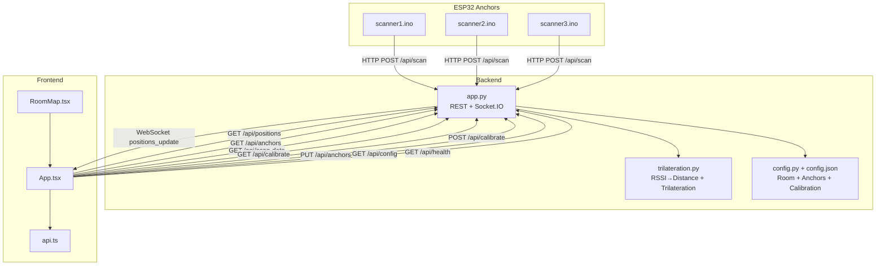
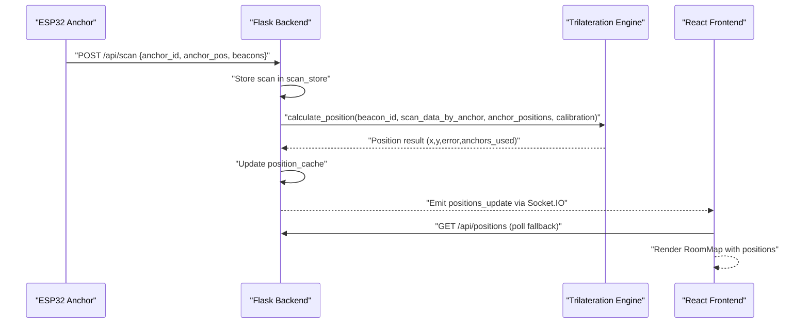
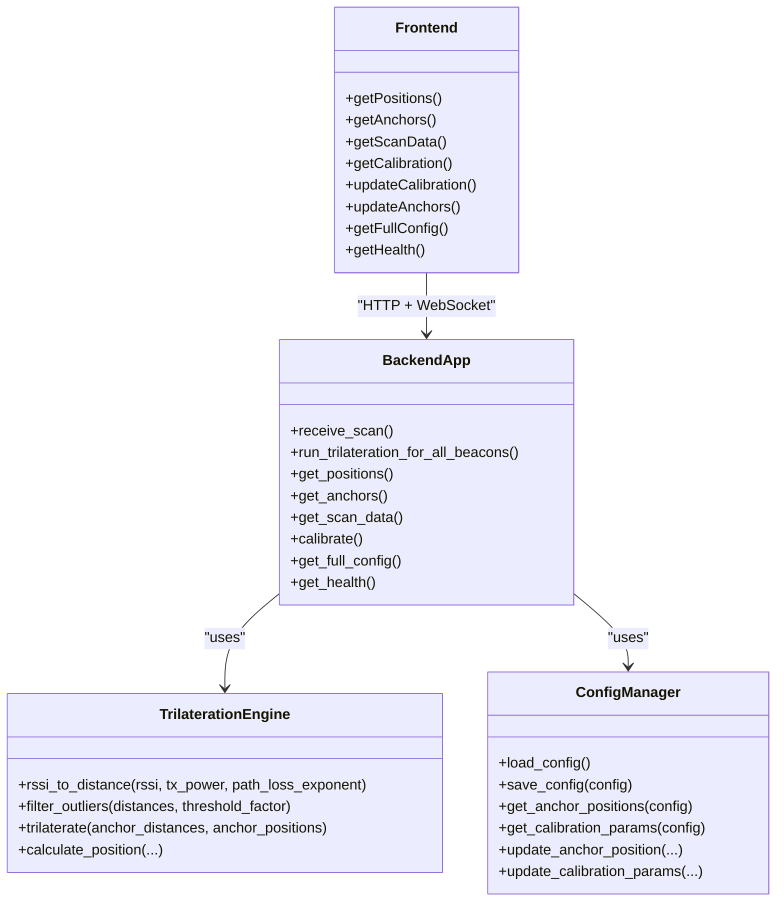
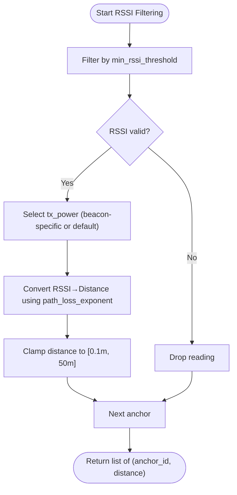
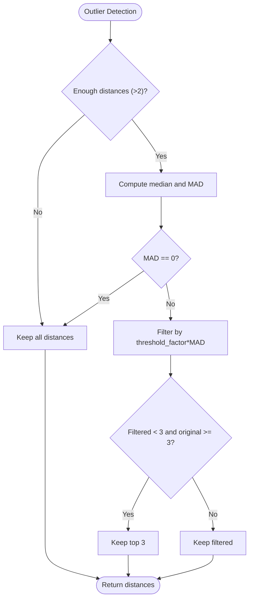
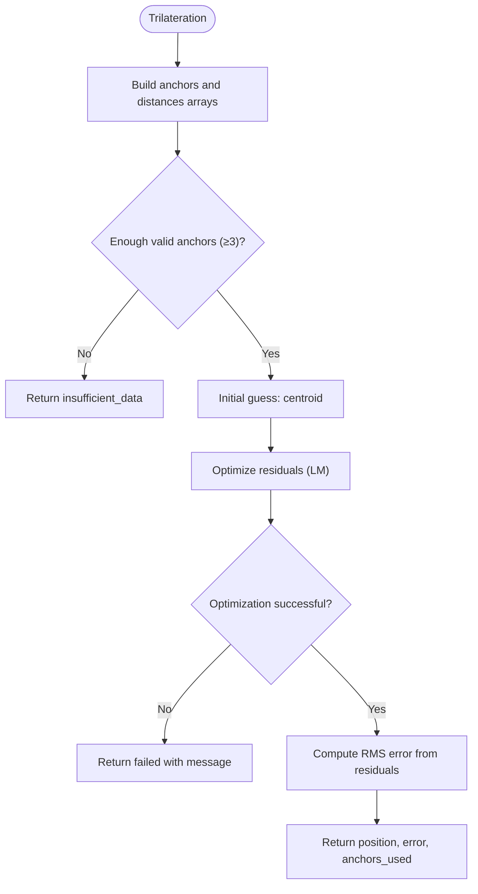
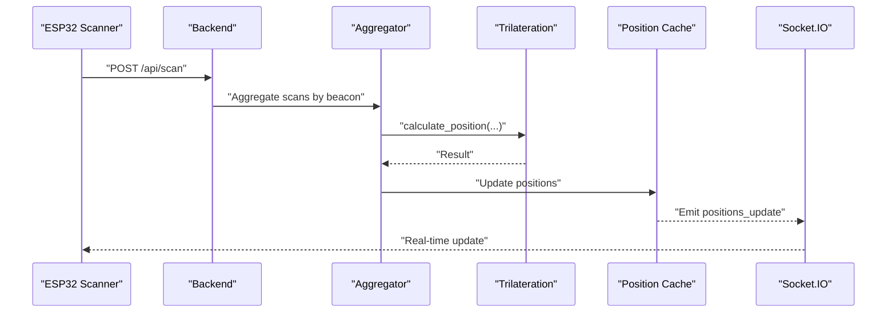
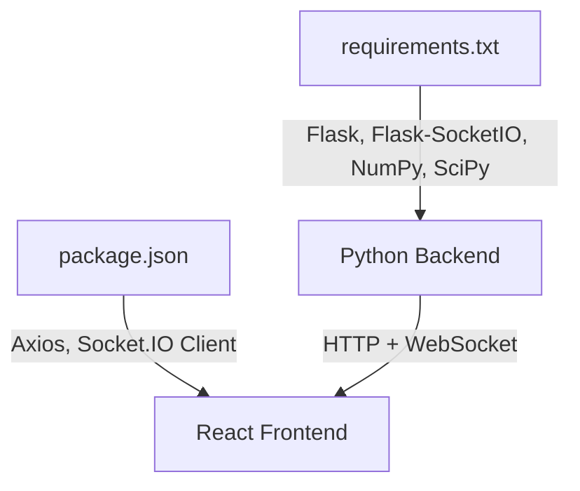

# Position Calculation Pipeline

<cite>
**Referenced Files in This Document**
- [app.py](file://backend/app.py)
- [trilateration.py](file://backend/trilateration.py)
- [config.py](file://backend/config.py)
- [config.json](file://backend/config.json)
- [api.ts](file://frontend/src/services/api.ts)
- [App.tsx](file://frontend/src/App.tsx)
- [RoomMap.tsx](file://frontend/src/components/RoomMap.tsx)
- [scanner1.ino](file://scanner1/scanner1.ino)
- [scanner2.ino](file://scanner2/scanner2.ino)
- [scanner3.ino](file://scanner3/scanner3.ino)
- [requirements.txt](file://backend/requirements.txt)
- [package.json](file://frontend/package.json)
</cite>

## Table of Contents
1. [Introduction](#introduction)
2. [Project Structure](#project-structure)
3. [Core Components](#core-components)
4. [Architecture Overview](#architecture-overview)
5. [Detailed Component Analysis](#detailed-component-analysis)
6. [Dependency Analysis](#dependency-analysis)
7. [Performance Considerations](#performance-considerations)
8. [Troubleshooting Guide](#troubleshooting-guide)
9. [Conclusion](#conclusion)
10. [Appendices](#appendices)

## Introduction
This document describes the end-to-end position calculation pipeline for a BLE Room Positioning System. It covers how raw BLE scan data is collected by ESP32 anchors, aggregated on the backend, processed through RSSI-to-distance conversion, outlier filtering, and finally trilateration to produce 2D position estimates. It documents data structures, calibration integration, error handling, fallback strategies, and performance considerations for real-time operation and scalability.

## Project Structure
The system comprises:
- Backend Python service (Flask + Socket.IO) that receives scan data, runs trilateration, and exposes REST APIs and WebSocket updates.
- Frontend React application that displays live positions and allows calibration and anchor configuration.
- ESP32-based BLE scanners that continuously scan for BLE beacons and POST scan payloads to the backend.

**Diagram sources**
- [app.py:123-171](file://backend/app.py#L123-L171)
- [trilateration.py:155-217](file://backend/trilateration.py#L155-L217)
- [config.py:44-95](file://backend/config.py#L44-L95)
- [api.ts:12-66](file://frontend/src/services/api.ts#L12-L66)
- [App.tsx:56-172](file://frontend/src/App.tsx#L56-L172)
- [RoomMap.tsx:28-229](file://frontend/src/components/RoomMap.tsx#L28-L229)
- [scanner1.ino:146-203](file://scanner1/scanner1.ino#L146-L203)
- [scanner2.ino:146-203](file://scanner2/scanner2.ino#L146-L203)
- [scanner3.ino:146-203](file://scanner3/scanner3.ino#L146-L203)

**Section sources**
- [app.py:23-398](file://backend/app.py#L23-L398)
- [trilateration.py:1-218](file://backend/trilateration.py#L1-L218)
- [config.py:1-95](file://backend/config.py#L1-L95)
- [config.json:1-30](file://backend/config.json#L1-L30)
- [api.ts:1-66](file://frontend/src/services/api.ts#L1-L66)
- [App.tsx:1-274](file://frontend/src/App.tsx#L1-L274)
- [RoomMap.tsx:1-229](file://frontend/src/components/RoomMap.tsx#L1-L229)
- [scanner1.ino:1-255](file://scanner1/scanner1.ino#L1-L255)
- [scanner2.ino:1-255](file://scanner2/scanner2.ino#L1-L255)
- [scanner3.ino:1-255](file://scanner3/scanner3.ino#L1-L255)

## Core Components
- Backend REST and WebSocket server: Receives scan payloads, maintains in-memory stores, runs trilateration, emits real-time updates.
- Trilateration engine: Converts RSSI to distance, filters outliers, and computes 2D position via least-squares optimization.
- Configuration manager: Loads and persists room geometry, anchor positions, and calibration parameters.
- Frontend dashboard: Polls and subscribes to backend for live positions, anchors, and scan data; renders a room map with tracked beacons.
- ESP32 scanners: Continuously scan BLE, extract RSSI and TX power, and POST structured payloads to the backend.

Key data structures:
- Anchor scan entry: anchor_id, anchor_pos, timestamp, received_at, calibration_mode, beacons.
- Beacon reading: beacon_id, rssi, tx_power (optional).
- Intermediate anchor_distances: list of (anchor_id, distance_meters).
- Trilateration result: position (x, y), error, anchors_used, method, anchor_details.

**Section sources**
- [app.py:30-37](file://backend/app.py#L30-L37)
- [app.py:123-171](file://backend/app.py#L123-L171)
- [trilateration.py:11-33](file://backend/trilateration.py#L11-L33)
- [trilateration.py:35-67](file://backend/trilateration.py#L35-L67)
- [trilateration.py:69-153](file://backend/trilateration.py#L69-L153)
- [trilateration.py:155-217](file://backend/trilateration.py#L155-L217)
- [config.py:12-41](file://backend/config.py#L12-L41)
- [config.json:1-30](file://backend/config.json#L1-L30)

## Architecture Overview
The pipeline is event-driven and real-time:
- ESP32 anchors POST scan payloads to the backend.
- Backend aggregates scans, filters stale entries, and runs trilateration for each beacon observed by multiple anchors.
- Results are cached and emitted via WebSocket to the frontend.
- Frontend renders positions and provides controls for calibration and anchor positioning.

**Diagram sources**
- [app.py:123-171](file://backend/app.py#L123-L171)
- [app.py:48-105](file://backend/app.py#L48-L105)
- [trilateration.py:155-217](file://backend/trilateration.py#L155-L217)
- [App.tsx:139-172](file://frontend/src/App.tsx#L139-L172)

## Detailed Component Analysis

### Backend REST and WebSocket Server
Responsibilities:
- Receive scan payloads and store them with timestamps.
- Aggregate scans across anchors and filter stale data.
- Run trilateration for each beacon with sufficient anchors.
- Expose REST endpoints for positions, anchors, scan data, calibration, and health.
- Emit real-time position updates via Socket.IO.

Processing stages:
- Freshness check: TTL-based staleness guard prevents outdated scans from influencing results.
- Beacon aggregation: Group beacon readings by beacon_id across anchors.
- Per-beacon pipeline: RSSI filtering, TX power selection, distance conversion, outlier filtering, trilateration.
- Caching and broadcasting: Update in-memory position cache and emit via WebSocket.

Error handling:
- Try/catch around trilateration invocation; errors are logged and empty results returned.
- Validation of required fields in incoming scan payloads.
- Graceful handling of missing or invalid calibration parameters.

Fallback strategies:
- If trilateration fails or insufficient anchors, result indicates failure and message.
- WebSocket fallback polling ensures UI remains responsive if WS disconnects.

**Section sources**
- [app.py:39-46](file://backend/app.py#L39-L46)
- [app.py:48-105](file://backend/app.py#L48-L105)
- [app.py:123-171](file://backend/app.py#L123-L171)
- [app.py:256-279](file://backend/app.py#L256-L279)
- [app.py:282-321](file://backend/app.py#L282-L321)
- [app.py:354-377](file://backend/app.py#L354-L377)

### Trilateration Engine
Core functions:
- RSSI to distance: Log-distance path loss model with clamping to a safe range.
- Outlier filtering: Uses Median Absolute Deviation (MAD) to remove extreme distance estimates; preserves at least 3 if possible.
- Trilateration: Least-squares optimization minimizing residual errors across anchor constraints; returns position, RMS error, and anchors used.

Data flow:
- Input: beacon_id, scan_data_by_anchor (list of beacon readings per anchor), anchor_positions, calibration.
- Output: position estimate, error, anchors_used, method, and per-anchor details.

Integration with calibration:
- path_loss_exponent and tx_power_dbm influence distance estimation.
- min_rssi_threshold filters weak signals.

Edge cases:
- Insufficient anchors (<3) return failure with message.
- Optimization failures return failure with message.

**Section sources**
- [trilateration.py:11-33](file://backend/trilateration.py#L11-L33)
- [trilateration.py:35-67](file://backend/trilateration.py#L35-L67)
- [trilateration.py:69-153](file://backend/trilateration.py#L69-L153)
- [trilateration.py:155-217](file://backend/trilateration.py#L155-L217)

### Configuration Management
- Default configuration includes room dimensions, anchor positions, and calibration parameters.
- Provides getters for anchor positions and calibration parameters.
- Supports updating anchor positions and calibration parameters via REST endpoints.

Configuration fields:
- Room: width_m, height_m
- Anchors: anchor_id -> {x, y, label}
- Calibration: path_loss_exponent, tx_power_dbm, min_rssi_threshold, scan_ttl_seconds
- Beacon filters: optional list of beacon MACs to track

**Section sources**
- [config.py:12-41](file://backend/config.py#L12-L41)
- [config.py:60-95](file://backend/config.py#L60-L95)
- [config.json:1-30](file://backend/config.json#L1-L30)

### Frontend Dashboard
- Real-time updates via Socket.IO; falls back to periodic polling if WS is unavailable.
- Displays anchors, positions, and scan data.
- Renders a room map with anchors and beacon positions, including uncertainty circles.

UI data models:
- Positions: beacon_id, position (x,y), error, anchors_used, anchor_details.
- Scan entries: anchor_id, anchor_pos, timestamp, calibration_mode, beacons, age_seconds.
- Anchors: anchor_id, x, y, label, online, last_seen, beacons_detected.

**Section sources**
- [App.tsx:14-51](file://frontend/src/App.tsx#L14-L51)
- [App.tsx:66-137](file://frontend/src/App.tsx#L66-L137)
- [App.tsx:139-172](file://frontend/src/App.tsx#L139-L172)
- [RoomMap.tsx:18-229](file://frontend/src/components/RoomMap.tsx#L18-L229)
- [api.ts:12-66](file://frontend/src/services/api.ts#L12-L66)

### ESP32 Scanners
- BLE scanning with NimBLE on ESP32-C3.
- Extract RSSI and TX power; optionally include device name.
- POST structured JSON to backend with anchor_id, anchor_pos, timestamp, calibration_mode, and beacons array.
- Supports calibration mode with faster scan intervals.

Payload structure:
- anchor_id, anchor_pos [x, y], timestamp ms, calibration_mode boolean, beacons array of {beacon_id, rssi, tx_power, name?}.

**Section sources**
- [scanner1.ino:146-203](file://scanner1/scanner1.ino#L146-L203)
- [scanner2.ino:146-203](file://scanner2/scanner2.ino#L146-L203)
- [scanner3.ino:146-203](file://scanner3/scanner3.ino#L146-L203)

## Architecture Overview

**Diagram sources**
- [app.py:123-398](file://backend/app.py#L123-L398)
- [trilateration.py:11-218](file://backend/trilateration.py#L11-L218)
- [config.py:44-95](file://backend/config.py#L44-L95)
- [api.ts:12-66](file://frontend/src/services/api.ts#L12-L66)

## Detailed Component Analysis

### RSSI Filtering and Distance Conversion
- RSSI filtering: Signals below min_rssi_threshold are ignored.
- TX power handling: Uses beacon-specific tx_power if present; otherwise defaults from calibration.
- Distance conversion: Applies log-distance path loss model with exponent n and reference TX power at 1 m, clamped to a safe range.

**Diagram sources**
- [trilateration.py:169-206](file://backend/trilateration.py#L169-L206)

**Section sources**
- [trilateration.py:11-33](file://backend/trilateration.py#L11-L33)
- [trilateration.py:169-206](file://backend/trilateration.py#L169-L206)

### Outlier Detection and Removal
- Uses Median Absolute Deviation (MAD) to detect outliers among distances from multiple anchors.
- Preserves at least 3 anchors if possible to maintain trilateration feasibility.

**Diagram sources**
- [trilateration.py:35-67](file://backend/trilateration.py#L35-L67)

**Section sources**
- [trilateration.py:35-67](file://backend/trilateration.py#L35-L67)

### Trilateration Computation
- Validates anchor positions and distance ranges.
- Builds arrays of anchor positions and measured distances.
- Defines residual function and uses least-squares optimization (Levenberg–Marquardt) with centroid initialization.
- Computes RMS error from residuals.

**Diagram sources**
- [trilateration.py:69-153](file://backend/trilateration.py#L69-L153)

**Section sources**
- [trilateration.py:69-153](file://backend/trilateration.py#L69-L153)

### End-to-End Pipeline Execution
- ESP32 scanners POST scan payloads with beacon readings.
- Backend stores scans, checks freshness, aggregates by beacon, and runs per-beacon pipeline.
- Results are cached and broadcast via WebSocket; frontend updates immediately.

**Diagram sources**
- [app.py:48-105](file://backend/app.py#L48-L105)
- [trilateration.py:155-217](file://backend/trilateration.py#L155-L217)

**Section sources**
- [app.py:48-105](file://backend/app.py#L48-L105)
- [trilateration.py:155-217](file://backend/trilateration.py#L155-L217)

## Dependency Analysis

**Diagram sources**
- [requirements.txt:1-7](file://backend/requirements.txt#L1-L7)
- [package.json:12-29](file://frontend/package.json#L12-L29)

**Section sources**
- [requirements.txt:1-7](file://backend/requirements.txt#L1-L7)
- [package.json:12-29](file://frontend/package.json#L12-L29)

## Performance Considerations
- Real-time responsiveness: WebSocket pushes updates; fallback polling every few seconds keeps UI updated.
- Data freshness: TTL-based staleness prevents stale scans from skewing results.
- Optimization limits: Trilateration sets maximum iterations to bound CPU usage.
- Memory safety: ESP32 scanners clear scan results to avoid memory leaks on constrained hardware.
- Scalability: Current design aggregates per beacon; for many beacons, consider batching and parallelization of per-beacon computations.

[No sources needed since this section provides general guidance]

## Troubleshooting Guide
Common issues and remedies:
- No positions displayed:
  - Verify anchors are reporting (online status) and have recent scans.
  - Check health endpoint for anchors_reporting and beacons_tracked counts.
- Weak signal or missing detections:
  - Adjust min_rssi_threshold to capture weaker signals.
  - Confirm beacon-specific tx_power is available; otherwise default tx_power is used.
- Inaccurate positions:
  - Tune path_loss_exponent to match environment.
  - Recalibrate by adjusting tx_power_dbm per beacon if TX power varies.
- Stale data:
  - Increase scan_ttl_seconds if anchors intermittently drop out.
- WebSocket disconnections:
  - UI automatically falls back to polling; monitor connection indicator.

Operational checks:
- Backend logs trilateration errors and returns empty results gracefully.
- Frontend shows connection status and health metrics.

**Section sources**
- [app.py:112-120](file://backend/app.py#L112-L120)
- [app.py:186-222](file://backend/app.py#L186-L222)
- [app.py:256-279](file://backend/app.py#L256-L279)
- [app.py:282-321](file://backend/app.py#L282-L321)
- [App.tsx:139-172](file://frontend/src/App.tsx#L139-L172)

## Conclusion
The system provides a robust, real-time position calculation pipeline from raw BLE scans to 2D estimates. It integrates beacon-specific TX power, RSSI filtering, outlier detection, and least-squares trilateration, with calibration parameters and real-time visualization. The modular design supports easy tuning and extension for larger deployments.

[No sources needed since this section summarizes without analyzing specific files]

## Appendices

### Data Model Definitions
- Anchor scan entry:
  - anchor_id: string
  - anchor_pos: [x, y]
  - timestamp: number (milliseconds)
  - received_at: number (server-side milliseconds)
  - calibration_mode: boolean
  - beacons: array of beacon readings
- Beacon reading:
  - beacon_id: string
  - rssi: number
  - tx_power: number (optional)
  - name: string (optional)
- Trilateration result:
  - beacon_id: string
  - position: [x, y] | null
  - error: number | null
  - anchors_used: number
  - method: string
  - anchor_details: array of {anchor_id, rssi, tx_power, estimated_distance_m}

**Section sources**
- [app.py:30-37](file://backend/app.py#L30-L37)
- [trilateration.py:155-217](file://backend/trilateration.py#L155-L217)
- [App.tsx:14-51](file://frontend/src/App.tsx#L14-L51)

### Practical Examples
- Example scan payload posted by an anchor:
  - anchor_id: "scanner-02"
  - anchor_pos: [10.0, 0.0]
  - timestamp: 1709945025000
  - calibration_mode: false
  - beacons: [{"beacon_id": "AA:BB:CC:DD:EE:FF", "rssi": -65, "tx_power": -59}]
- Example trilateration result:
  - beacon_id: "AA:BB:CC:DD:EE:FF"
  - position: [5.23, 2.11]
  - error: 0.456
  - anchors_used: 3
  - method: "least_squares"

**Section sources**
- [app.py:123-171](file://backend/app.py#L123-L171)
- [trilateration.py:155-217](file://backend/trilateration.py#L155-L217)

### Monitoring and Debugging Techniques
- Backend health endpoint: inspect anchors_reporting and beacons_tracked.
- Scan data endpoint: review raw beacons per anchor and their ages.
- Calibration endpoint: adjust path_loss_exponent, tx_power_dbm, min_rssi_threshold, and scan_ttl_seconds.
- Frontend connection indicator: WS connected/disconnected status.
- WebSocket events: subscribe to positions_update for live updates.

**Section sources**
- [app.py:112-120](file://backend/app.py#L112-L120)
- [app.py:256-279](file://backend/app.py#L256-L279)
- [app.py:282-321](file://backend/app.py#L282-L321)
- [App.tsx:139-172](file://frontend/src/App.tsx#L139-L172)