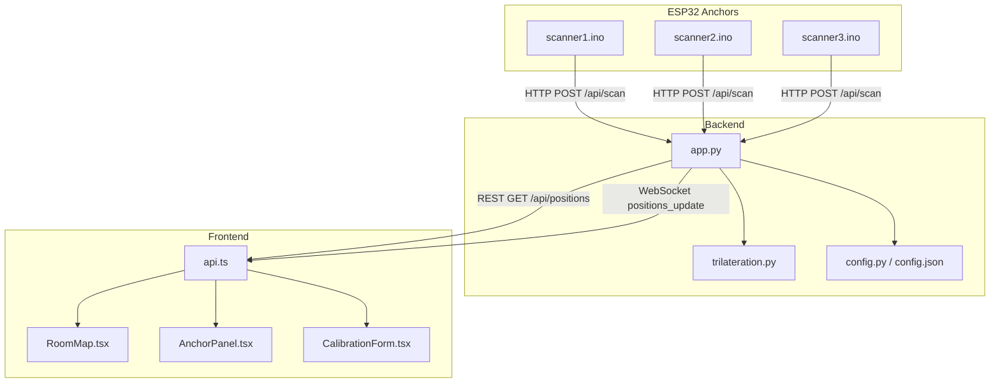
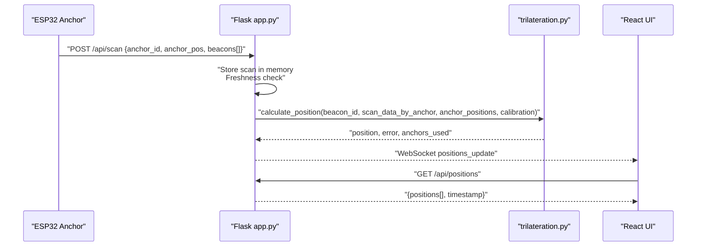
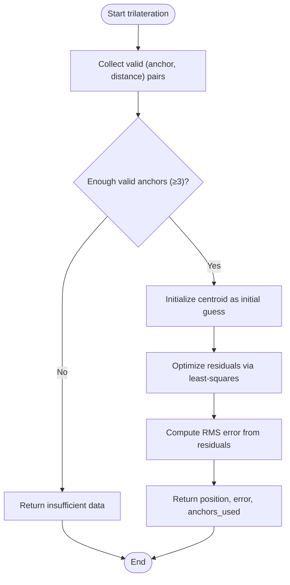
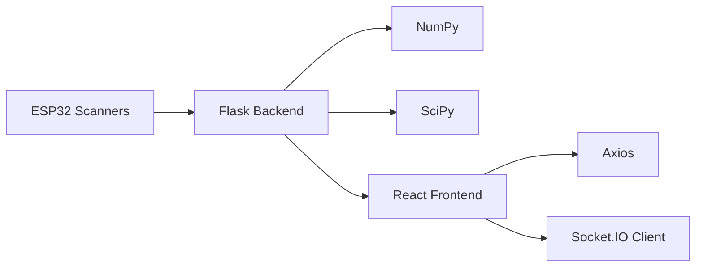

# Signal Processing and Algorithms

<cite>
**Referenced Files in This Document**
- [trilateration.py](file://backend/trilateration.py)
- [app.py](file://backend/app.py)
- [config.py](file://backend/config.py)
- [config.json](file://backend/config.json)
- [api.ts](file://frontend/src/services/api.ts)
- [RoomMap.tsx](file://frontend/src/components/RoomMap.tsx)
- [AnchorPanel.tsx](file://frontend/src/components/AnchorPanel.tsx)
- [CalibrationForm.tsx](file://frontend/src/components/CalibrationForm.tsx)
- [scanner1.ino](file://scanner1/scanner1.ino)
- [scanner2.ino](file://scanner2/scanner2.ino)
- [scanner3.ino](file://scanner3/scanner3.ino)
</cite>

## Table of Contents
1. [Introduction](#introduction)
2. [Project Structure](#project-structure)
3. [Core Components](#core-components)
4. [Architecture Overview](#architecture-overview)
5. [Detailed Component Analysis](#detailed-component-analysis)
6. [Dependency Analysis](#dependency-analysis)
7. [Performance Considerations](#performance-considerations)
8. [Troubleshooting Guide](#troubleshooting-guide)
9. [Conclusion](#conclusion)
10. [Appendices](#appendices)

## Introduction
This document explains the BLE signal processing and trilateration algorithms powering the room positioning system. It covers:
- RSSI-to-distance conversion using the log-distance path loss model
- Signal filtering and outlier detection
- Trilateration via least-squares optimization
- Multi-anchor triangulation, visibility, validation, and uncertainty quantification
- Calibration parameters and tuning
- Environmental considerations, multipath mitigation, and dynamic range
- Practical examples and guidance for extending the system

## Project Structure
The system comprises:
- Backend Python service (Flask + Socket.IO) that receives BLE scan data from anchors, runs trilateration, and exposes REST/WebSocket APIs
- Frontend React application that visualizes anchors, detected beacons, and computed positions
- ESP32-based BLE scanners (anchors) that periodically scan for BLE beacons and transmit scan results to the backend

**Diagram sources**
- [app.py:123-171](file://backend/app.py#L123-L171)
- [trilateration.py:155-218](file://backend/trilateration.py#L155-L218)
- [config.py:44-95](file://backend/config.py#L44-L95)
- [config.json:1-30](file://backend/config.json#L1-L30)
- [api.ts:12-66](file://frontend/src/services/api.ts#L12-L66)
- [RoomMap.tsx:28-229](file://frontend/src/components/RoomMap.tsx#L28-L229)
- [AnchorPanel.tsx:30-143](file://frontend/src/components/AnchorPanel.tsx#L30-L143)
- [CalibrationForm.tsx:30-290](file://frontend/src/components/CalibrationForm.tsx#L30-L290)
- [scanner1.ino:146-198](file://scanner1/scanner1.ino#L146-L198)
- [scanner2.ino:146-198](file://scanner2/scanner2.ino#L146-L198)
- [scanner3.ino:146-198](file://scanner3/scanner3.ino#L146-L198)

**Section sources**
- [app.py:123-171](file://backend/app.py#L123-L171)
- [trilateration.py:155-218](file://backend/trilateration.py#L155-L218)
- [config.py:44-95](file://backend/config.py#L44-L95)
- [config.json:1-30](file://backend/config.json#L1-L30)
- [api.ts:12-66](file://frontend/src/services/api.ts#L12-L66)
- [RoomMap.tsx:28-229](file://frontend/src/components/RoomMap.tsx#L28-L229)
- [AnchorPanel.tsx:30-143](file://frontend/src/components/AnchorPanel.tsx#L30-L143)
- [CalibrationForm.tsx:30-290](file://frontend/src/components/CalibrationForm.tsx#L30-L290)
- [scanner1.ino:146-198](file://scanner1/scanner1.ino#L146-L198)
- [scanner2.ino:146-198](file://scanner2/scanner2.ino#L146-L198)
- [scanner3.ino:146-198](file://scanner3/scanner3.ino#L146-L198)

## Core Components
- RSSI-to-distance conversion: Applies the log-distance path loss model to estimate distance from RSSI and TX power
- Outlier filtering: Uses median absolute deviation (MAD) to remove inconsistent distance estimates
- Trilateration: Least-squares optimization to compute 2D position from multiple anchor distances
- Multi-anchor triangulation: Aggregates scan data across anchors, validates visibility, and computes uncertainty
- Calibration: Tunable parameters for path loss exponent, TX power, RSSI threshold, and scan freshness

**Section sources**
- [trilateration.py:11-32](file://backend/trilateration.py#L11-L32)
- [trilateration.py:35-66](file://backend/trilateration.py#L35-L66)
- [trilateration.py:69-153](file://backend/trilateration.py#L69-L153)
- [trilateration.py:155-218](file://backend/trilateration.py#L155-L218)
- [config.py:12-41](file://backend/config.py#L12-L41)
- [config.json:23-28](file://backend/config.json#L23-L28)

## Architecture Overview
The end-to-end flow:
- Anchors collect BLE scan data and POST to backend
- Backend stores scans, filters stale data, and runs trilateration
- Results are served via REST and streamed via WebSocket
- Frontend displays anchors, detected beacons, and computed positions with uncertainty circles

**Diagram sources**
- [app.py:123-171](file://backend/app.py#L123-L171)
- [app.py:48-105](file://backend/app.py#L48-L105)
- [trilateration.py:155-218](file://backend/trilateration.py#L155-L218)
- [api.ts:12-16](file://frontend/src/services/api.ts#L12-L16)

## Detailed Component Analysis

### RSSI-to-Distance Conversion
- Implements the log-distance path loss model to convert RSSI to meters
- Includes bounds checking and clamping to a safe range
- Supports per-beacon TX power overrides

Key behaviors:
- Rejects invalid RSSI values (zero or positive)
- Computes distance using the formula derived from the log-distance model
- Clamps to a practical range to avoid extreme outliers

Practical notes:
- Path loss exponent depends on environment (free space vs. indoor)
- TX power can be beacon-specific or default calibrated value

**Section sources**
- [trilateration.py:11-32](file://backend/trilateration.py#L11-L32)
- [trilateration.py:194-197](file://backend/trilateration.py#L194-L197)
- [config.json:24-25](file://backend/config.json#L24-L25)

### Signal Filtering and Outlier Detection
- Filters out weak RSSI readings below a configurable threshold
- Applies MAD-based outlier detection to distance estimates
- Ensures at least three anchors are retained when possible

Processing logic:
- Weak signal rejection based on RSSI threshold
- Distance list filtered using median and MAD
- Minimum retention policy to preserve at least three anchors when feasible

**Section sources**
- [trilateration.py:189-191](file://backend/trilateration.py#L189-L191)
- [trilateration.py:35-66](file://backend/trilateration.py#L35-L66)

### Trilateration Implementation
- Least-squares optimization to minimize residual errors across anchor distance constraints
- Residuals defined as differences between measured and calculated distances
- Initial guess uses centroid of anchor positions
- Error metric is RMS residual across anchors

Algorithm highlights:
- Objective function: sum of squared residuals
- Optimization method: Levenberg–Marquardt
- Robust error reporting and failure handling

**Diagram sources**
- [trilateration.py:69-153](file://backend/trilateration.py#L69-L153)

**Section sources**
- [trilateration.py:69-153](file://backend/trilateration.py#L69-L153)

### Multi-Anchor Triangulation Pipeline
- Aggregates beacon readings across anchors
- Validates freshness of scan data
- Runs trilateration per beacon and caches results
- Emits real-time updates via WebSocket

Visibility and validation:
- Freshness window controlled by scan TTL
- Beacon filtering by configured list
- Minimum anchor count for position calculation

**Section sources**
- [app.py:48-105](file://backend/app.py#L48-L105)
- [app.py:173-183](file://backend/app.py#L173-L183)
- [config.json:27](file://backend/config.json#L27)

### Calibration Parameters and Tuning
Calibration parameters exposed via REST:
- Path loss exponent (n)
- TX power at 1 m (dBm)
- RSSI threshold (dBm)
- Scan TTL (seconds)

Tuning guidance:
- Adjust n for environment (free space ~2.0, indoor 2.7–3.5, dense walls 3.5–5.0)
- Calibrate TX power per beacon or globally
- Raise RSSI threshold to reduce noise
- Tune TTL to balance responsiveness and stability

**Section sources**
- [config.py:12-41](file://backend/config.py#L12-L41)
- [config.json:23-28](file://backend/config.json#L23-L28)
- [app.py:282-321](file://backend/app.py#L282-L321)
- [CalibrationForm.tsx:180-256](file://frontend/src/components/CalibrationForm.tsx#L180-L256)

### Frontend Visualization and Interaction
- RoomMap renders anchors, beacons, and uncertainty circles
- AnchorPanel shows detected beacons per anchor with RSSI levels
- CalibrationForm allows updating anchor positions and calibration parameters

**Section sources**
- [RoomMap.tsx:28-229](file://frontend/src/components/RoomMap.tsx#L28-L229)
- [AnchorPanel.tsx:30-143](file://frontend/src/components/AnchorPanel.tsx#L30-L143)
- [CalibrationForm.tsx:30-290](file://frontend/src/components/CalibrationForm.tsx#L30-L290)
- [api.ts:12-66](file://frontend/src/services/api.ts#L12-L66)

## Dependency Analysis
- Backend depends on NumPy and SciPy for numerical optimization
- Frontend uses Axios for REST and Socket.IO client for real-time updates
- Anchors depend on NimBLE for BLE scanning and HTTP for posting

**Diagram sources**
- [requirements.txt:1-7](file://backend/requirements.txt#L1-L7)
- [package.json:12-18](file://frontend/package.json#L12-L18)
- [scanner1.ino:146-198](file://scanner1/scanner1.ino#L146-L198)

**Section sources**
- [requirements.txt:1-7](file://backend/requirements.txt#L1-L7)
- [package.json:12-18](file://frontend/package.json#L12-L18)
- [scanner1.ino:146-198](file://scanner1/scanner1.ino#L146-L198)

## Performance Considerations
- RSSI-to-distance clamping prevents extreme outliers from skewing calculations
- MAD-based outlier filtering reduces sensitivity to sporadic noisy measurements
- Least-squares optimization with Levenberg–Marquardt converges efficiently for smooth residuals
- Freshness checks and TTL limit computational overhead by avoiding stale data
- Real-time streaming via WebSocket minimizes polling overhead

[No sources needed since this section provides general guidance]

## Troubleshooting Guide
Common issues and remedies:
- No positions computed
  - Ensure at least three fresh anchors report the beacon
  - Verify RSSI threshold is not too high
- Incorrect positions
  - Adjust path loss exponent for environment
  - Calibrate TX power per beacon or globally
- Jittery or unstable positions
  - Lower RSSI threshold to include more samples
  - Increase scan TTL to average over more samples
- Anchors appear offline
  - Confirm WiFi connectivity and backend reachability
  - Check freshness window and anchor interval settings

**Section sources**
- [trilateration.py:94-101](file://backend/trilateration.py#L94-L101)
- [app.py:39-46](file://backend/app.py#L39-L46)
- [app.py:123-171](file://backend/app.py#L123-L171)
- [config.json:27](file://backend/config.json#L27)

## Conclusion
The system combines robust signal processing (RSSI-to-distance, outlier filtering) with reliable trilateration (least-squares optimization) to deliver real-time room positioning. Calibration parameters enable environment-specific tuning, while the frontend provides intuitive visualization and controls. Extending the system can incorporate additional sensors and alternative strategies (e.g., Kalman filtering, particle filters) for improved accuracy and robustness.

[No sources needed since this section summarizes without analyzing specific files]

## Appendices

### Mathematical Foundations

- Log-distance path loss model
  - Distance estimation from RSSI, TX power, and path loss exponent
  - Bounds checking and clamping to realistic ranges

- Median Absolute Deviation (MAD) outlier detection
  - Robust measure of spread around median
  - Threshold factor determines sensitivity to outliers

- Least-squares trilateration
  - Minimizes sum of squared residuals between measured and calculated distances
  - Initial guess from anchor centroid improves convergence

- Error metric
  - Root mean square (RMS) of residuals indicates positional uncertainty

**Section sources**
- [trilateration.py:11-32](file://backend/trilateration.py#L11-L32)
- [trilateration.py:35-66](file://backend/trilateration.py#L35-L66)
- [trilateration.py:106-136](file://backend/trilateration.py#L106-L136)

### Practical Tuning Examples
- Environment calibration
  - Start with n ≈ 2.0 for free space; increase to 2.7–3.5 for typical indoor; higher values for dense walls
- TX power calibration
  - Measure RSSI at 1 m and adjust TX power accordingly
- Threshold tuning
  - Raise RSSI threshold to reduce noise; lower to include weak signals when necessary
- Stability tuning
  - Increase scan TTL to average over more samples; decrease for responsiveness

**Section sources**
- [CalibrationForm.tsx:180-256](file://frontend/src/components/CalibrationForm.tsx#L180-L256)
- [config.json:23-28](file://backend/config.json#L23-L28)

### Environmental Factors and Mitigation
- Multipath interference
  - Use MAD filtering to reject outliers caused by multipath
  - Increase scan duration and intervals to average over time
- Dynamic range
  - Apply RSSI threshold to avoid dominated contributions from extremely weak signals
- Obstruction handling
  - Prefer anchors positioned to minimize line-of-sight blockage
  - Validate anchor positions and update as needed

**Section sources**
- [trilateration.py:35-66](file://backend/trilateration.py#L35-L66)
- [trilateration.py:189-191](file://backend/trilateration.py#L189-L191)
- [scanner1.ino:42-51](file://scanner1/scanner1.ino#L42-L51)

### Algorithm Extension and Sensor Fusion
- Alternative positioning strategies
  - Extend trilateration with Kalman filtering for temporal smoothing
  - Integrate inertial sensors (IMU) for motion modeling
  - Incorporate Wi-Fi fingerprinting for coarse localization
- Additional sensor modalities
  - Camera-based fiducials for known-reference points
  - Ultra-wideband (UWB) for higher-precision ranging
  - Barometric pressure for floor-level identification

[No sources needed since this section provides general guidance]