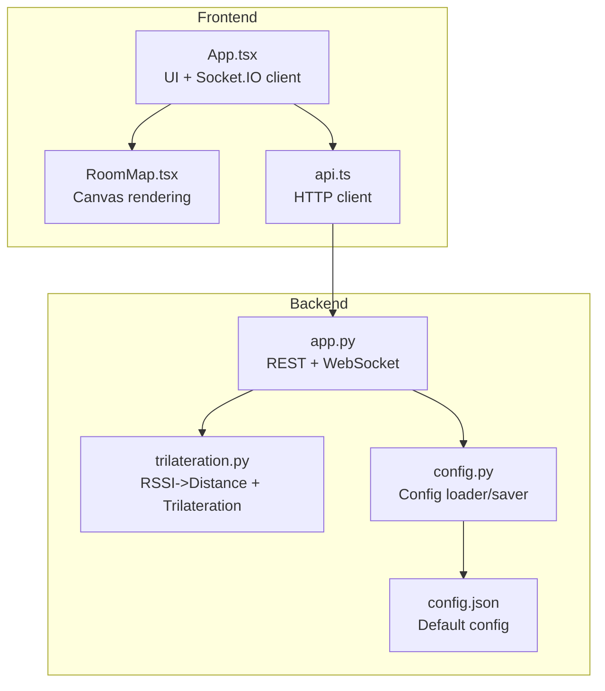
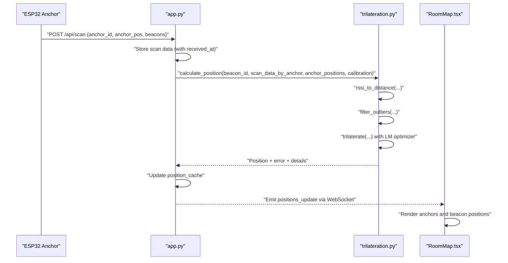
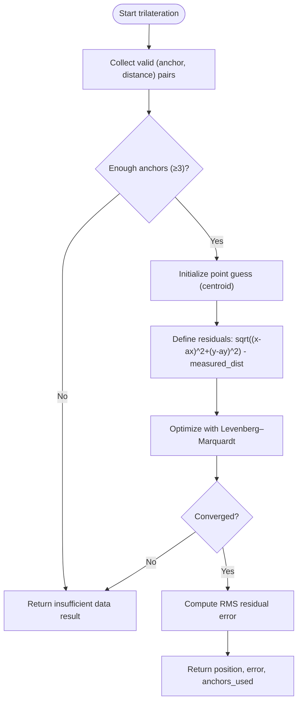
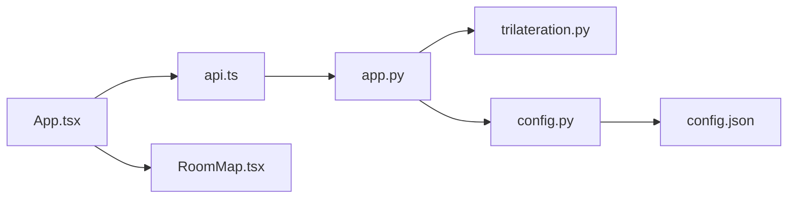

# Trilateration Algorithms

<cite>
**Referenced Files in This Document**
- [trilateration.py](file://backend/trilateration.py)
- [app.py](file://backend/app.py)
- [config.py](file://backend/config.py)
- [config.json](file://backend/config.json)
- [RoomMap.tsx](file://frontend/src/components/RoomMap.tsx)
- [api.ts](file://frontend/src/services/api.ts)
- [App.tsx](file://frontend/src/App.tsx)
</cite>

## Table of Contents
1. [Introduction](#introduction)
2. [Project Structure](#project-structure)
3. [Core Components](#core-components)
4. [Architecture Overview](#architecture-overview)
5. [Detailed Component Analysis](#detailed-component-analysis)
6. [Dependency Analysis](#dependency-analysis)
7. [Performance Considerations](#performance-considerations)
8. [Troubleshooting Guide](#troubleshooting-guide)
9. [Conclusion](#conclusion)
10. [Appendices](#appendices)

## Introduction
This document explains the trilateration algorithms and position calculation methods implemented in the BLE Room Positioning System. It covers:
- Least-squares trilateration with objective function formulation, residual computation, and optimization using the Levenberg–Marquardt algorithm
- Coordinate system transformations and 2D position estimation from multiple anchor distances
- Error metric computation via RMS residuals
- Multi-anchor triangulation workflow, visibility requirements, position validation, and uncertainty visualization
- Robustness features such as outlier rejection, convergence criteria, and failure handling
- Mathematical derivations, numerical stability considerations, and performance optimization techniques
- Practical configuration examples and integration with real-time positioning workflows

## Project Structure
The system comprises:
- Backend Python service exposing REST APIs and WebSocket events for BLE scan ingestion, trilateration, and real-time visualization
- Frontend React application for displaying room layout, anchors, beacon positions, and calibration controls
- Configuration files for room geometry, anchor positions, and calibration parameters

**Diagram sources**
- [app.py:1-398](file://backend/app.py#L1-L398)
- [trilateration.py:1-218](file://backend/trilateration.py#L1-L218)
- [config.py:1-95](file://backend/config.py#L1-L95)
- [config.json:1-30](file://backend/config.json#L1-L30)
- [App.tsx:1-274](file://frontend/src/App.tsx#L1-L274)
- [RoomMap.tsx:1-229](file://frontend/src/components/RoomMap.tsx#L1-L229)
- [api.ts:1-66](file://frontend/src/services/api.ts#L1-L66)

**Section sources**
- [app.py:1-398](file://backend/app.py#L1-L398)
- [trilateration.py:1-218](file://backend/trilateration.py#L1-L218)
- [config.py:1-95](file://backend/config.py#L1-L95)
- [config.json:1-30](file://backend/config.json#L1-L30)
- [App.tsx:1-274](file://frontend/src/App.tsx#L1-L274)
- [RoomMap.tsx:1-229](file://frontend/src/components/RoomMap.tsx#L1-L229)
- [api.ts:1-66](file://frontend/src/services/api.ts#L1-L66)

## Core Components
- RSSI-to-distance conversion using log-distance path loss model
- Outlier filtering using Median Absolute Deviation (MAD)
- Least-squares trilateration with Levenberg–Marquardt optimization
- Real-time orchestration and caching of positions
- Frontend visualization of anchors, beacons, and uncertainty circles

Key implementation references:
- RSSI to distance conversion: [rssi_to_distance:11-32](file://backend/trilateration.py#L11-L32)
- Outlier filtering: [filter_outliers:35-66](file://backend/trilateration.py#L35-L66)
- Trilateration pipeline: [calculate_position:155-217](file://backend/trilateration.py#L155-L217)
- Least-squares objective and residuals: [trilaterate:69-153](file://backend/trilateration.py#L69-L153)
- Backend orchestration: [run_trilateration_for_all_beacons:48-105](file://backend/app.py#L48-L105)
- Frontend rendering: [RoomMap:28-229](file://frontend/src/components/RoomMap.tsx#L28-L229)

**Section sources**
- [trilateration.py:11-217](file://backend/trilateration.py#L11-L217)
- [app.py:48-105](file://backend/app.py#L48-L105)
- [RoomMap.tsx:28-229](file://frontend/src/components/RoomMap.tsx#L28-L229)

## Architecture Overview
End-to-end flow:
- ESP32 anchors transmit BLE scan data to the backend via HTTP POST
- Backend stores scan data, filters stale entries, and runs trilateration across all visible beacons
- Results are cached and pushed to the frontend via WebSocket
- Frontend renders anchors and beacon positions with uncertainty circles

**Diagram sources**
- [app.py:123-171](file://backend/app.py#L123-L171)
- [app.py:48-105](file://backend/app.py#L48-L105)
- [trilateration.py:155-217](file://backend/trilateration.py#L155-L217)
- [RoomMap.tsx:28-229](file://frontend/src/components/RoomMap.tsx#L28-L229)

## Detailed Component Analysis

### RSSI-to-Distance Conversion
- Uses log-distance path loss model to estimate distance from RSSI
- Applies bounds clamping to prevent extreme values
- Supports per-beacon TX power override

References:
- [rssi_to_distance:11-32](file://backend/trilateration.py#L11-L32)

**Section sources**
- [trilateration.py:11-32](file://backend/trilateration.py#L11-L32)

### Outlier Filtering with MAD
- Filters distance measurements using Median Absolute Deviation
- Ensures at least 3 anchors are retained when possible
- Prevents degenerate solutions due to spurious measurements

References:
- [filter_outliers:35-66](file://backend/trilateration.py#L35-L66)

**Section sources**
- [trilateration.py:35-66](file://backend/trilateration.py#L35-L66)

### Least-Squares Trilateration (Levenberg–Marquardt)
- Objective function: sum of squared residuals between measured distances and Euclidean distances from candidate point
- Residuals: difference between calculated distance and measured distance for each anchor
- Initialization: centroid of anchor positions
- Optimization: Levenberg–Marquardt with bounded iteration count
- Error metric: RMS of residuals across anchors

References:
- [trilaterate:69-153](file://backend/trilateration.py#L69-L153)

**Diagram sources**
- [trilateration.py:69-153](file://backend/trilateration.py#L69-L153)

**Section sources**
- [trilateration.py:69-153](file://backend/trilateration.py#L69-L153)

### Multi-Anchor Triangulation Pipeline
- Aggregates fresh scan data across anchors within TTL window
- Filters beacons by configured list (optional)
- Runs trilateration per beacon and emits results via WebSocket

References:
- [run_trilateration_for_all_beacons:48-105](file://backend/app.py#L48-L105)

**Section sources**
- [app.py:48-105](file://backend/app.py#L48-L105)

### Coordinate System Transformations and Rendering
- World-to-canvas transform converts meters to pixel coordinates with flipped Y-axis
- Uncertainty circles rendered proportional to error estimate
- Anchors drawn as triangles; beacons as filled circles with labels

References:
- [RoomMap worldToCanvas:34-40](file://frontend/src/components/RoomMap.tsx#L34-L40)
- [RoomMap rendering:129-168](file://frontend/src/components/RoomMap.tsx#L129-L168)

**Section sources**
- [RoomMap.tsx:34-40](file://frontend/src/components/RoomMap.tsx#L34-L40)
- [RoomMap.tsx:129-168](file://frontend/src/components/RoomMap.tsx#L129-L168)

### Backend Orchestration and Real-Time Updates
- REST endpoints for health, scan ingestion, positions, anchors, calibration
- WebSocket event “positions_update” pushes live results to clients
- In-memory caches for scan data and positions

References:
- [app.py endpoints:112-331](file://backend/app.py#L112-L331)
- [app.py WebSocket handlers:354-377](file://backend/app.py#L354-L377)

**Section sources**
- [app.py:112-331](file://backend/app.py#L112-L331)
- [app.py:354-377](file://backend/app.py#L354-L377)

### Frontend Integration and Visualization
- Socket.IO client connects to backend and listens for “positions_update”
- Periodic polling fallback when WebSocket is unavailable
- Renders room grid, anchors, beacon positions, and uncertainty circles

References:
- [App socket setup:139-172](file://frontend/src/App.tsx#L139-L172)
- [RoomMap rendering:129-168](file://frontend/src/components/RoomMap.tsx#L129-L168)

**Section sources**
- [App.tsx:139-172](file://frontend/src/App.tsx#L139-L172)
- [RoomMap.tsx:129-168](file://frontend/src/components/RoomMap.tsx#L129-L168)

## Dependency Analysis
- Backend depends on NumPy and SciPy for numerical optimization
- Frontend communicates with backend via Axios and Socket.IO
- Configuration is persisted in JSON and loaded at runtime

**Diagram sources**
- [app.py:13-21](file://backend/app.py#L13-L21)
- [trilateration.py:6-8](file://backend/trilateration.py#L6-L8)
- [config.py:6-9](file://backend/config.py#L6-L9)
- [config.json:1-30](file://backend/config.json#L1-L30)
- [App.tsx:6-12](file://frontend/src/App.tsx#L6-L12)
- [api.ts:1-10](file://frontend/src/services/api.ts#L1-L10)
- [RoomMap.tsx:1-2](file://frontend/src/components/RoomMap.tsx#L1-L2)

**Section sources**
- [app.py:13-21](file://backend/app.py#L13-L21)
- [trilateration.py:6-8](file://backend/trilateration.py#L6-L8)
- [config.py:6-9](file://backend/config.py#L6-L9)
- [config.json:1-30](file://backend/config.json#L1-L30)
- [App.tsx:6-12](file://frontend/src/App.tsx#L6-L12)
- [api.ts:1-10](file://frontend/src/services/api.ts#L1-L10)
- [RoomMap.tsx:1-2](file://frontend/src/components/RoomMap.tsx#L1-L2)

## Performance Considerations
- Numerical stability
  - Distance clamping prevents extreme outliers from destabilizing optimization
  - MAD-based outlier filtering reduces sensitivity to gross errors
  - Initialization at anchor centroid improves convergence speed
- Optimization limits
  - Maximum iterations capped to bound CPU usage
  - Early exit when fewer than 3 anchors are available
- Data freshness
  - TTL-based filtering avoids stale scans from skewing results
- Visualization scaling
  - Canvas scaling factor ensures readable uncertainty circles

[No sources needed since this section provides general guidance]

## Troubleshooting Guide
Common issues and remedies:
- Insufficient anchors
  - Ensure at least 3 anchors report the beacon within TTL window
  - Verify anchor positions and labels in configuration
- Poor accuracy
  - Adjust path loss exponent and TX power for the beacon type
  - Increase minimum RSSI threshold to reduce noise
- Convergence failures
  - Verify anchor positions are physically plausible
  - Confirm distance estimates are reasonable after RSSI conversion
- Real-time updates not appearing
  - Check WebSocket connectivity and backend logs
  - Confirm frontend polling fallback is functioning

References:
- [Insufficient anchors result:94-101](file://backend/trilateration.py#L94-L101)
- [RSSI threshold filtering:189-192](file://backend/trilateration.py#L189-L192)
- [WebSocket handlers:354-377](file://backend/app.py#L354-L377)
- [Frontend polling fallback:125-137](file://frontend/src/App.tsx#L125-L137)

**Section sources**
- [trilateration.py:94-101](file://backend/trilateration.py#L94-L101)
- [trilateration.py:189-192](file://backend/trilateration.py#L189-L192)
- [app.py:354-377](file://backend/app.py#L354-L377)
- [App.tsx:125-137](file://frontend/src/App.tsx#L125-L137)

## Conclusion
The system implements a practical, robust trilateration pipeline:
- Converts RSSI to distances using calibrated path loss models
- Filters outliers and validates multi-anchor visibility
- Solves for 2D position using least-squares with Levenberg–Marquardt
- Computes RMS error as a reliability metric
- Provides real-time visualization with uncertainty circles

This foundation supports reliable indoor localization and can be extended with advanced techniques such as robust estimators, adaptive thresholds, and multi-floor support.

[No sources needed since this section summarizes without analyzing specific files]

## Appendices

### Mathematical Derivations and Formulation
- Log-distance path loss model
  - Distance estimate derived from RSSI, TX power, and path loss exponent
  - References: [rssi_to_distance:11-32](file://backend/trilateration.py#L11-L32)
- Least-squares objective and residuals
  - Objective: sum of squared differences between measured and calculated distances
  - Residuals: calculated minus measured distance per anchor
  - References: [trilaterate:106-116](file://backend/trilateration.py#L106-L116)
- Initialization and convergence
  - Initial guess: centroid of anchor positions
  - Optimization: Levenberg–Marquardt with bounded iterations
  - References: [trilaterate:118-130](file://backend/trilateration.py#L118-L130)
- Error metric
  - RMS residual computed from residuals
  - References: [trilaterate:134-136](file://backend/trilateration.py#L134-L136)

**Section sources**
- [trilateration.py:11-32](file://backend/trilateration.py#L11-L32)
- [trilateration.py:106-136](file://backend/trilateration.py#L106-L136)

### Configuration and Parameter Tuning
- Anchor positions
  - Calibrate anchors to precise room coordinates
  - Update via backend PUT /api/anchors
  - References: [update_anchors:224-253](file://backend/app.py#L224-L253), [config.json:6-22](file://backend/config.json#L6-L22)
- Calibration parameters
  - Path loss exponent (n): tune per environment (free space ~2.0, indoor 2.7–3.5, dense walls 3.5–5.0)
  - TX power (dBm): per-beacon or default
  - Min RSSI threshold: ignore weak signals
  - Scan TTL: freshness window for scans
  - References: [updateCalibration:282-321](file://backend/app.py#L282-L321), [config.json:23-28](file://backend/config.json#L23-L28)
- Frontend calibration UI
  - Save anchor positions and calibration parameters
  - References: [CalibrationForm:75-100](file://frontend/src/components/CalibrationForm.tsx#L75-L100)

**Section sources**
- [app.py:224-253](file://backend/app.py#L224-L253)
- [app.py:282-321](file://backend/app.py#L282-L321)
- [config.json:6-28](file://backend/config.json#L6-L28)
- [CalibrationForm.tsx:75-100](file://frontend/src/components/CalibrationForm.tsx#L75-L100)

### Integration with Real-Time Workflows
- Backend ingestion
  - POST /api/scan from anchors
  - Background trilateration and WebSocket push
  - References: [receive_scan:123-171](file://backend/app.py#L123-L171), [run_trilateration_for_all_beacons:48-105](file://backend/app.py#L48-L105)
- Frontend consumption
  - Socket.IO “positions_update” event
  - Fallback polling when WebSocket is down
  - References: [App socket handlers:139-172](file://frontend/src/App.tsx#L139-L172), [RoomMap rendering:129-168](file://frontend/src/components/RoomMap.tsx#L129-L168)

**Section sources**
- [app.py:123-171](file://backend/app.py#L123-L171)
- [app.py:48-105](file://backend/app.py#L48-L105)
- [App.tsx:139-172](file://frontend/src/App.tsx#L139-L172)
- [RoomMap.tsx:129-168](file://frontend/src/components/RoomMap.tsx#L129-L168)