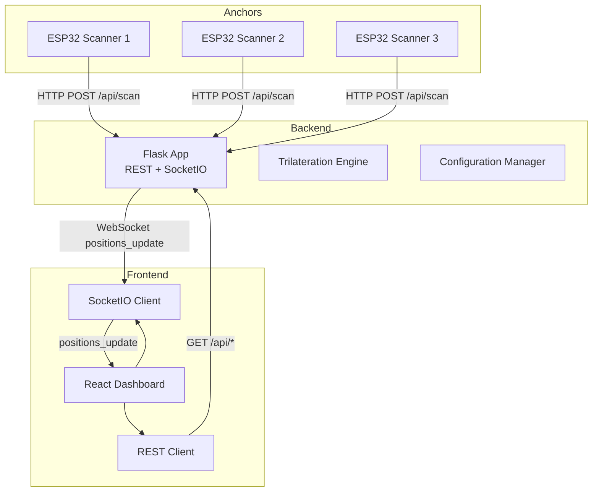
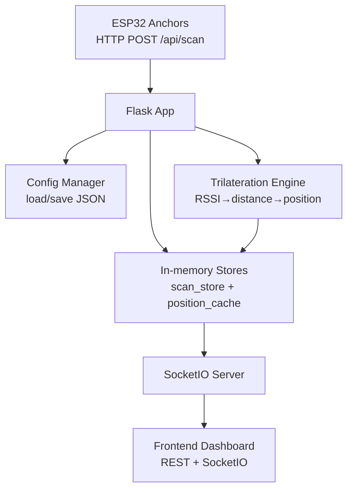
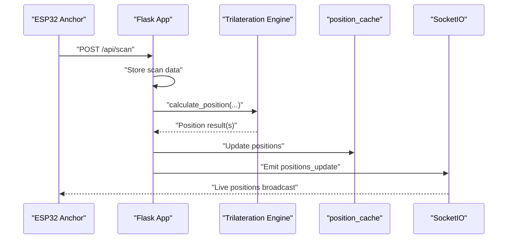
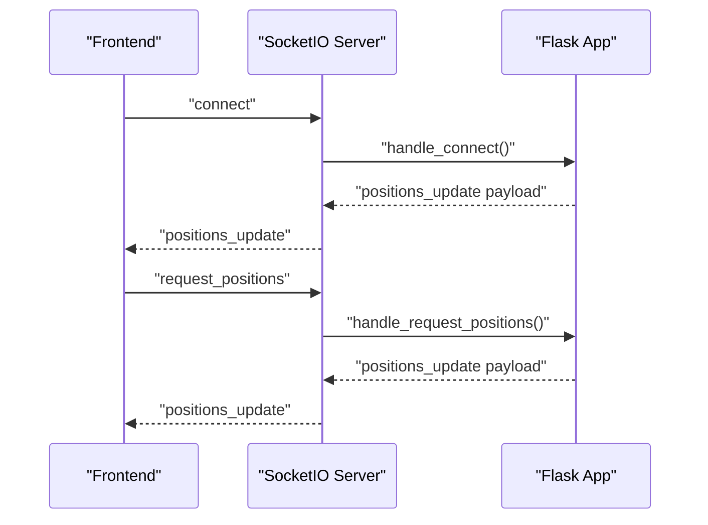
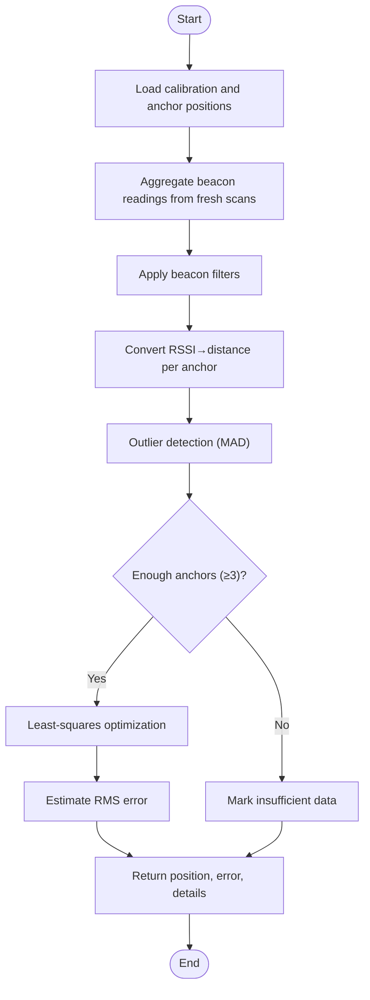
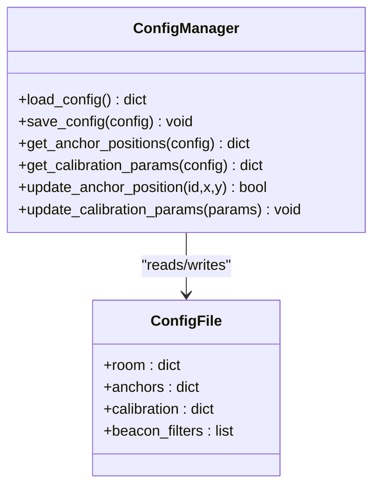
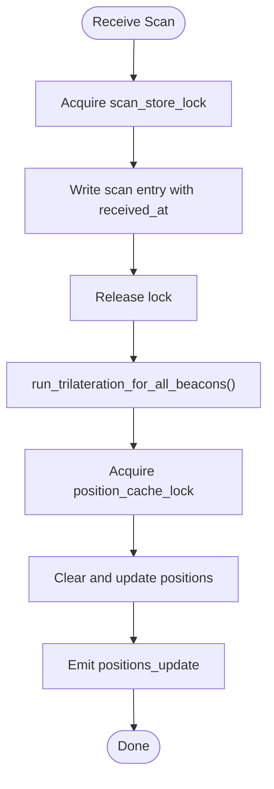
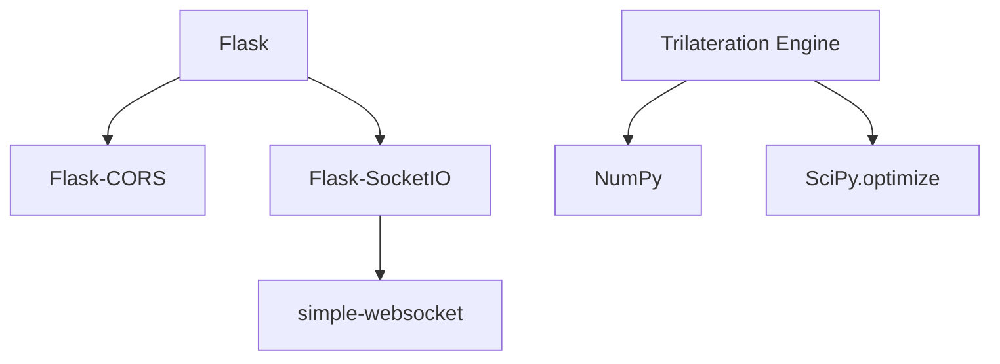

# Backend Services Architecture

<cite>
**Referenced Files in This Document**
- [app.py](file://backend/app.py)
- [trilateration.py](file://backend/trilateration.py)
- [config.py](file://backend/config.py)
- [config.json](file://backend/config.json)
- [requirements.txt](file://backend/requirements.txt)
- [api.ts](file://frontend/src/services/api.ts)
- [RoomMap.tsx](file://frontend/src/components/RoomMap.tsx)
- [App.tsx](file://frontend/src/App.tsx)
- [scanner1.ino](file://scanner1/scanner1.ino)
- [scanner2.ino](file://scanner2/scanner2.ino)
- [scanner3.ino](file://scanner3/scanner3.ino)
</cite>

## Table of Contents
1. [Introduction](#introduction)
2. [Project Structure](#project-structure)
3. [Core Components](#core-components)
4. [Architecture Overview](#architecture-overview)
5. [Detailed Component Analysis](#detailed-component-analysis)
6. [Dependency Analysis](#dependency-analysis)
7. [Performance Considerations](#performance-considerations)
8. [Troubleshooting Guide](#troubleshooting-guide)
9. [Security Considerations](#security-considerations)
10. [Conclusion](#conclusion)
11. [Appendices](#appendices)

## Introduction
This document describes the backend services architecture for a BLE Room Positioning System built with Flask and SocketIO. The backend exposes REST APIs for ingest of BLE scan data from ESP32 anchors, retrieval of positions, anchor management, and system configuration. It integrates SocketIO for real-time WebSocket communication to broadcast live positions and system status. The trilateration engine converts RSSI measurements into 2D positions using RSSI-to-distance conversion, outlier detection, and least-squares optimization. Configuration is stored in JSON and supports runtime updates. The system employs a threading model for concurrent anchor data streams, maintains in-memory stores for scan data and positions, and includes health monitoring and basic error handling.

## Project Structure
The repository is organized into three primary areas:
- backend: Python Flask application with SocketIO, trilateration engine, and configuration management
- frontend: React-based web dashboard integrating REST and WebSocket for visualization
- scanner*: ESP32 Arduino projects that act as BLE anchors sending scan data to the backend

**Diagram sources**
- [app.py:112-397](file://backend/app.py#L112-L397)
- [trilateration.py:155-218](file://backend/trilateration.py#L155-L218)
- [config.py:44-95](file://backend/config.py#L44-L95)
- [api.ts:1-66](file://frontend/src/services/api.ts#L1-L66)
- [App.tsx:124-165](file://frontend/src/App.tsx#L124-L165)
- [scanner1.ino:120-141](file://scanner1/scanner1.ino#L120-L141)
- [scanner2.ino:120-141](file://scanner2/scanner2.ino#L120-L141)
- [scanner3.ino:120-141](file://scanner3/scanner3.ino#L120-L141)

**Section sources**
- [app.py:23-397](file://backend/app.py#L23-L397)
- [config.py:9-51](file://backend/config.py#L9-L51)
- [requirements.txt:1-7](file://backend/requirements.txt#L1-L7)

## Core Components
- Flask Application: Initializes CORS and SocketIO, defines REST endpoints, manages in-memory stores, and emits real-time updates
- Trilateration Engine: Converts RSSI to distance, filters outliers, and computes positions via least-squares optimization
- Configuration Manager: Loads/saves JSON configuration, exposes anchor positions and calibration parameters, and supports runtime updates
- Frontend Dashboard: Uses REST for periodic polling and SocketIO for live updates; renders room map and beacon positions
- ESP32 Anchors: Send BLE scan data to the backend via HTTP POST with anchor metadata and beacon observations

Key responsibilities:
- REST endpoints: health checks, scan ingestion, position retrieval, anchor management, calibration, and configuration
- SocketIO: real-time broadcasting of positions and event-driven updates
- Trilateration: RSSI-to-distance conversion, outlier filtering, and least-squares optimization
- Concurrency: thread-safe access to shared stores guarded by locks
- Runtime updates: configuration persistence and recalculations triggered by calibration changes

**Section sources**
- [app.py:112-397](file://backend/app.py#L112-L397)
- [trilateration.py:11-218](file://backend/trilateration.py#L11-L218)
- [config.py:44-95](file://backend/config.py#L44-L95)
- [api.ts:1-66](file://frontend/src/services/api.ts#L1-L66)
- [RoomMap.tsx:1-229](file://frontend/src/components/RoomMap.tsx#L1-L229)
- [scanner1.ino:160-199](file://scanner1/scanner1.ino#L160-L199)

## Architecture Overview
The backend follows a layered architecture:
- Transport Layer: Flask + SocketIO for HTTP and WebSocket
- Domain Layer: Trilateration engine encapsulating signal processing and localization logic
- Persistence Layer: JSON-based configuration file with in-memory caches for scan data and positions
- Presentation Layer: REST API and SocketIO events consumed by the React frontend

**Diagram sources**
- [app.py:123-171](file://backend/app.py#L123-L171)
- [app.py:48-105](file://backend/app.py#L48-L105)
- [trilateration.py:155-218](file://backend/trilateration.py#L155-L218)
- [config.py:44-57](file://backend/config.py#L44-L57)
- [api.ts:13-16](file://frontend/src/services/api.ts#L13-L16)
- [App.tsx:138-165](file://frontend/src/App.tsx#L138-L165)

## Detailed Component Analysis

### Flask Application and REST API Endpoints
The Flask application initializes CORS and SocketIO, sets up in-memory stores, and exposes the following endpoints:
- GET /api/health: returns system health metrics
- POST /api/scan: ingests BLE scan data from anchors
- GET /api/positions: retrieves current positions
- GET /api/anchors: lists anchors with online status and beacon counts
- PUT /api/anchors: updates anchor positions
- GET /api/scan-data: returns recent raw scan data
- POST /api/calibrate: updates calibration parameters
- GET /api/calibrate: retrieves current calibration and room/beacon filters
- GET /api/config: returns full configuration
- PUT /api/config: updates full configuration

Processing logic:
- On scan ingestion, the application stores anchor data with timestamps and triggers trilateration in a background-friendly manner
- Trilateration aggregates fresh scans, applies beacon filters, converts RSSI to distances, filters outliers, and runs least-squares optimization
- Results are cached and broadcast via SocketIO

**Diagram sources**
- [app.py:123-171](file://backend/app.py#L123-L171)
- [app.py:48-105](file://backend/app.py#L48-L105)
- [trilateration.py:155-218](file://backend/trilateration.py#L155-L218)

**Section sources**
- [app.py:112-348](file://backend/app.py#L112-L348)

### SocketIO Integration and Real-Time Communication
SocketIO enables real-time updates:
- Event: connect: sends current positions to newly connected clients
- Event: request_positions: recomputes and emits positions on demand
- Broadcast: positions_update: continuously pushes position updates to clients

Frontend integration:
- SocketIO client connects to the backend
- Receives positions_update events and updates the room map visualization
- Falls back to REST polling if WebSocket is unavailable

**Diagram sources**
- [app.py:354-377](file://backend/app.py#L354-L377)
- [App.tsx:138-165](file://frontend/src/App.tsx#L138-L165)

**Section sources**
- [app.py:354-377](file://backend/app.py#L354-L377)
- [App.tsx:124-165](file://frontend/src/App.tsx#L124-L165)

### Trilateration Processing Engine
The trilateration pipeline:
- RSSI-to-distance conversion using log-distance path loss model with configurable TX power and path loss exponent
- Outlier detection using median absolute deviation (MAD) with a configurable threshold factor
- Least-squares optimization using scipy.optimize.least_squares with Levenberg–Marquardt method
- Robustness: minimum anchors requirement, distance clamping, and error estimation

**Diagram sources**
- [app.py:48-105](file://backend/app.py#L48-L105)
- [trilateration.py:11-218](file://backend/trilateration.py#L11-L218)

**Section sources**
- [trilateration.py:11-218](file://backend/trilateration.py#L11-L218)

### Configuration Management System
Configuration is stored in JSON and managed by helper functions:
- Default configuration includes room dimensions, anchor positions, calibration parameters, and optional beacon filters
- Functions to load/save configuration, extract anchor positions, fetch calibration parameters, update anchor positions, and update calibration parameters
- Runtime updates persist immediately and trigger re-triangulation when applicable

**Diagram sources**
- [config.py:44-95](file://backend/config.py#L44-L95)
- [config.json:1-30](file://backend/config.json#L1-L30)

**Section sources**
- [config.py:44-95](file://backend/config.py#L44-L95)
- [config.json:1-30](file://backend/config.json#L1-L30)

### Threading Model and Memory Management
Concurrency and memory:
- Two in-memory stores: scan_store (anchor-scoped) and position_cache (beacon-scoped)
- Thread locks: scan_store_lock and position_cache_lock protect concurrent access
- Freshness policy: TTL-based eviction using server timestamps
- Background-friendly trilateration: invoked after scan ingestion; exceptions are caught and logged

**Diagram sources**
- [app.py:148-163](file://backend/app.py#L148-L163)
- [app.py:48-105](file://backend/app.py#L48-L105)

**Section sources**
- [app.py:28-37](file://backend/app.py#L28-L37)
- [app.py:39-46](file://backend/app.py#L39-L46)
- [app.py:48-105](file://backend/app.py#L48-L105)

### API Gateway Pattern and Internal Service Communication
- The backend acts as an API gateway for external anchors (ESP32 scanners) and internal frontend clients
- Anchors communicate via HTTP POST to /api/scan; frontend consumes REST endpoints and SocketIO events
- No inter-service dependencies are present; the backend encapsulates all domain logic

**Section sources**
- [app.py:123-348](file://backend/app.py#L123-L348)
- [api.ts:1-66](file://frontend/src/services/api.ts#L1-L66)
- [App.tsx:138-165](file://frontend/src/App.tsx#L138-L165)

## Dependency Analysis
External dependencies include Flask, Flask-CORS, Flask-SocketIO, NumPy, SciPy, and simple-websocket. These enable HTTP/S, cross-origin support, WebSocket transport, numerical optimization, and lightweight WebSocket server.

**Diagram sources**
- [requirements.txt:1-7](file://backend/requirements.txt#L1-L7)
- [trilateration.py:6-8](file://backend/trilateration.py#L6-L8)

**Section sources**
- [requirements.txt:1-7](file://backend/requirements.txt#L1-L7)

## Performance Considerations
- RSSI-to-distance clamping prevents extreme distance estimates and improves stability
- Outlier filtering retains robustness against noisy measurements
- Least-squares optimization uses Levenberg–Marquardt with bounded iterations
- In-memory caching reduces repeated computation; TTL ensures freshness
- Thread locks minimize contention; avoid heavy work inside critical sections
- Consider rate-limiting and backpressure for high-frequency anchors

[No sources needed since this section provides general guidance]

## Troubleshooting Guide
Common issues and remedies:
- No positions returned: verify anchors are reporting within TTL and beacon filters are configured correctly
- Frequent recalculations: adjust scan_ttl_seconds and ensure anchors maintain connectivity
- WebSocket disconnections: confirm SocketIO server is reachable and browser network allows WebSocket upgrades
- Calibration drift: tune path_loss_exponent and tx_power_dbm based on empirical testing
- Logging: trilateration errors are printed; expand structured logging for production deployments

**Section sources**
- [app.py:112-120](file://backend/app.py#L112-L120)
- [app.py:161-163](file://backend/app.py#L161-L163)
- [config.py:89-95](file://backend/config.py#L89-L95)

## Security Considerations
- CORS: enabled with wildcard origins; restrict origins in production environments
- Authentication: no authentication enforced on endpoints; add JWT or session-based auth as needed
- Data validation: endpoints validate presence of required fields; consider schema validation libraries
- Transport: deploy behind TLS termination; ensure HTTPS for production
- Input sanitization: sanitize anchor identifiers and beacon IDs; enforce length limits

**Section sources**
- [app.py:24-25](file://backend/app.py#L24-L25)
- [app.py:139-145](file://backend/app.py#L139-L145)

## Conclusion
The backend provides a cohesive foundation for BLE-based room positioning with REST APIs, real-time WebSocket updates, and a robust trilateration engine. Its modular design supports runtime configuration updates, efficient concurrency via in-memory stores and locks, and straightforward integration with ESP32 anchors and a React dashboard. Enhancements for production should focus on stricter CORS, authentication, input validation, and structured logging.

[No sources needed since this section summarizes without analyzing specific files]

## Appendices

### Endpoint Reference
- GET /api/health: system health metrics
- POST /api/scan: ingest anchor scan data
- GET /api/positions: current positions
- GET /api/anchors: anchors with status
- PUT /api/anchors: update anchor positions
- GET /api/scan-data: recent raw scan data
- POST /api/calibrate: update calibration parameters
- GET /api/calibrate: current calibration and filters
- GET /api/config: full configuration
- PUT /api/config: update full configuration

**Section sources**
- [app.py:112-348](file://backend/app.py#L112-L348)

### Anchor Data Format (from ESP32)
- anchor_id: unique identifier
- anchor_pos: [x, y] in meters
- timestamp: milliseconds since epoch
- calibration_mode: boolean flag
- beacons: array of beacon observations with beacon_id, rssi, tx_power

**Section sources**
- [scanner1.ino:160-199](file://scanner1/scanner1.ino#L160-L199)
- [scanner2.ino:160-199](file://scanner2/scanner2.ino#L160-L199)
- [scanner3.ino:160-199](file://scanner3/scanner3.ino#L160-L199)