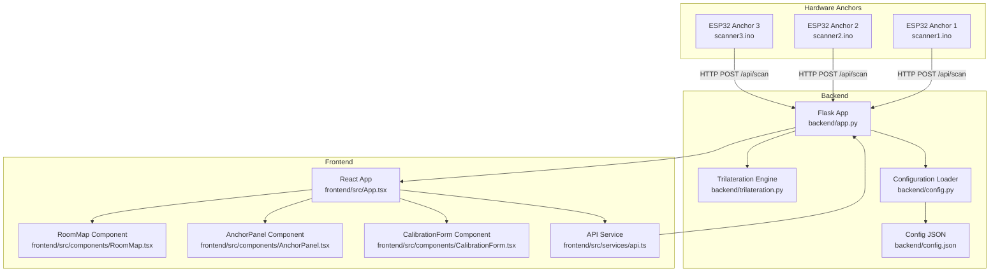
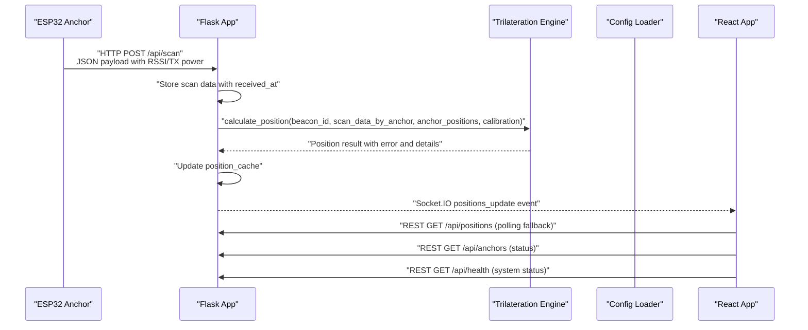
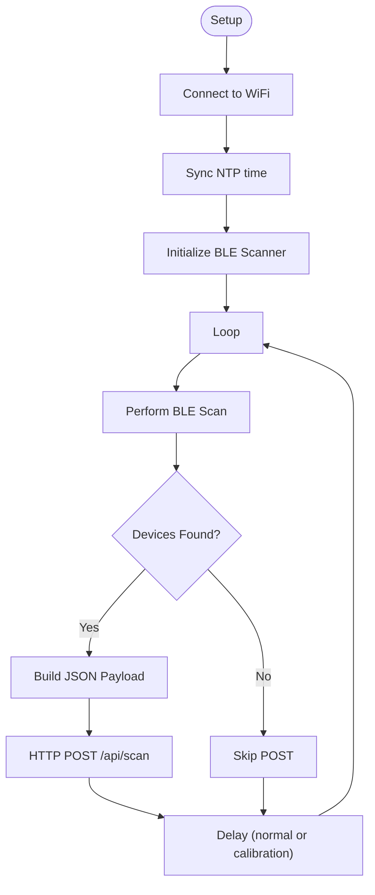
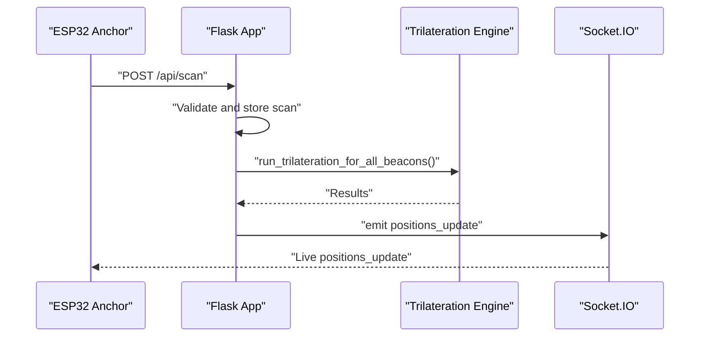
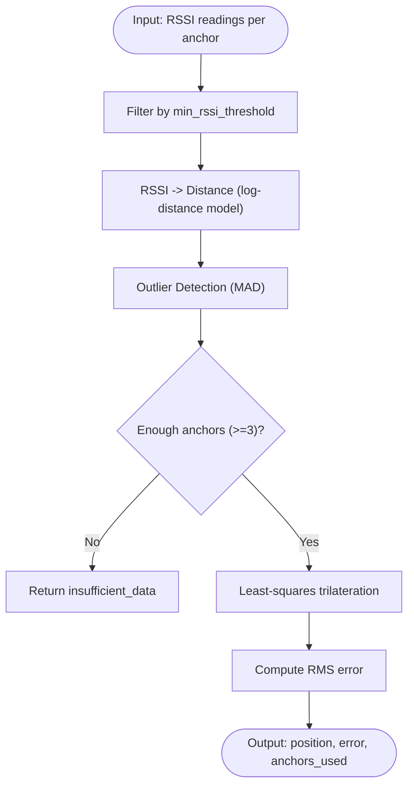
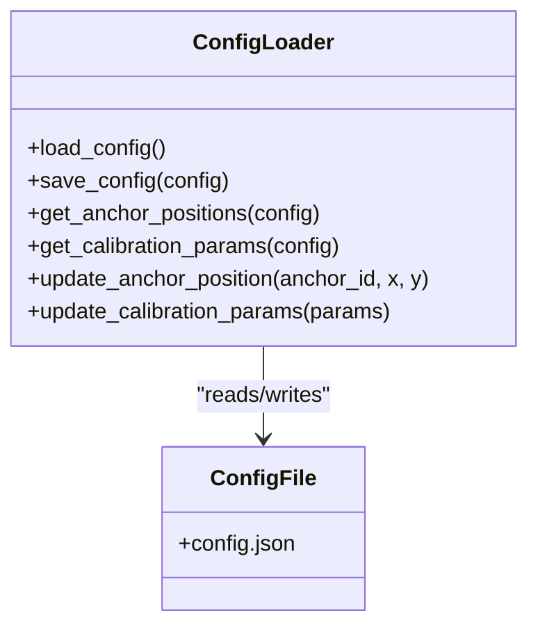
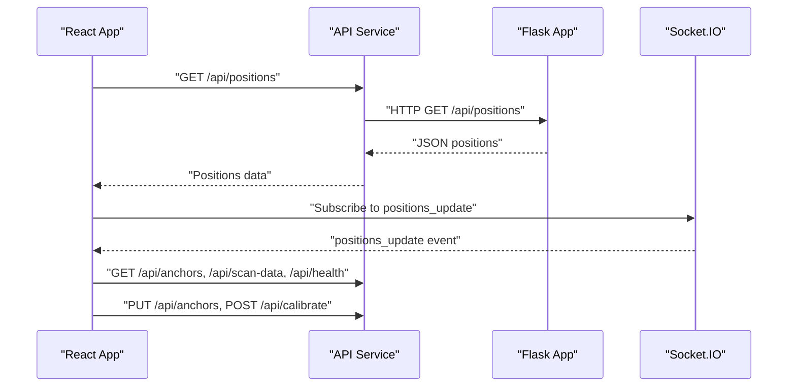
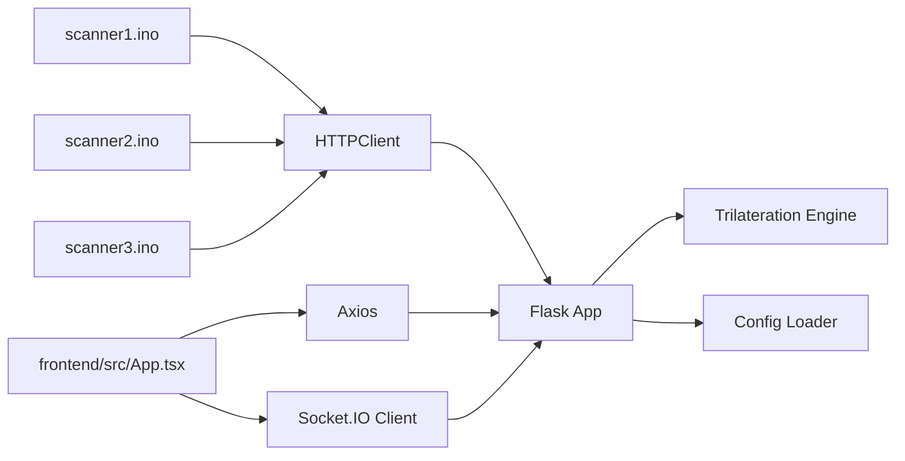

# Data Flow and Processing Patterns

<cite>
**Referenced Files in This Document**
- [backend/app.py](file://backend/app.py)
- [backend/trilateration.py](file://backend/trilateration.py)
- [backend/config.py](file://backend/config.py)
- [backend/config.json](file://backend/config.json)
- [frontend/src/App.tsx](file://frontend/src/App.tsx)
- [frontend/src/services/api.ts](file://frontend/src/services/api.ts)
- [frontend/src/components/RoomMap.tsx](file://frontend/src/components/RoomMap.tsx)
- [frontend/src/components/AnchorPanel.tsx](file://frontend/src/components/AnchorPanel.tsx)
- [frontend/src/components/CalibrationForm.tsx](file://frontend/src/components/CalibrationForm.tsx)
- [scanner1/scanner1.ino](file://scanner1/scanner1.ino)
- [scanner2/scanner2.ino](file://scanner2/scanner2.ino)
- [scanner3/scanner3.ino](file://scanner3/scanner3.ino)
</cite>

## Table of Contents
1. [Introduction](#introduction)
2. [Project Structure](#project-structure)
3. [Core Components](#core-components)
4. [Architecture Overview](#architecture-overview)
5. [Detailed Component Analysis](#detailed-component-analysis)
6. [Dependency Analysis](#dependency-analysis)
7. [Performance Considerations](#performance-considerations)
8. [Troubleshooting Guide](#troubleshooting-guide)
9. [Conclusion](#conclusion)
10. [Appendices](#appendices)

## Introduction
This document explains the end-to-end data flow of the BLE Room Positioning System, covering the complete lifecycle from BLE advertisement discovery through RSSI measurement collection, HTTP data transmission, backend processing, and real-time visualization. It details the multi-stage processing pipeline including raw scan data ingestion, signal filtering and outlier detection, distance estimation using log-distance path loss models, and trilateration-based position calculation. It also documents the WebSocket real-time communication pattern enabling live position updates, anchor status broadcasting, and system health notifications. The document describes the data transformation stages from hardware-level RSSI values through backend mathematical processing to frontend visualization coordinates, along with error propagation patterns, data validation strategies, fallback mechanisms, concurrency handling, memory management, performance optimizations, persistence patterns, caching strategies, and system state synchronization.

## Project Structure
The system comprises three primary layers:
- Hardware Anchors: ESP32-based BLE scanners that discover beacons and transmit scan data to the backend.
- Backend: A Python Flask service with Socket.IO that ingests scan data, runs trilateration, and emits real-time updates.
- Frontend: A React application that polls and subscribes to backend data, renders a room map, and displays anchor and beacon status.

**Diagram sources**
- [backend/app.py:1-422](file://backend/app.py#L1-L422)
- [backend/trilateration.py:1-218](file://backend/trilateration.py#L1-L218)
- [backend/config.py:1-95](file://backend/config.py#L1-L95)
- [backend/config.json:1-30](file://backend/config.json#L1-L30)
- [frontend/src/App.tsx:1-294](file://frontend/src/App.tsx#L1-L294)
- [frontend/src/services/api.ts:1-66](file://frontend/src/services/api.ts#L1-L66)
- [frontend/src/components/RoomMap.tsx:1-229](file://frontend/src/components/RoomMap.tsx#L1-L229)
- [frontend/src/components/AnchorPanel.tsx:1-143](file://frontend/src/components/AnchorPanel.tsx#L1-L143)
- [frontend/src/components/CalibrationForm.tsx:1-290](file://frontend/src/components/CalibrationForm.tsx#L1-L290)
- [scanner1/scanner1.ino:1-255](file://scanner1/scanner1.ino#L1-L255)
- [scanner2/scanner2.ino:1-255](file://scanner2/scanner2.ino#L1-L255)
- [scanner3/scanner3.ino:1-255](file://scanner3/scanner3.ino#L1-L255)

**Section sources**
- [backend/app.py:1-422](file://backend/app.py#L1-L422)
- [backend/trilateration.py:1-218](file://backend/trilateration.py#L1-L218)
- [backend/config.py:1-95](file://backend/config.py#L1-L95)
- [backend/config.json:1-30](file://backend/config.json#L1-L30)
- [frontend/src/App.tsx:1-294](file://frontend/src/App.tsx#L1-L294)
- [frontend/src/services/api.ts:1-66](file://frontend/src/services/api.ts#L1-L66)
- [frontend/src/components/RoomMap.tsx:1-229](file://frontend/src/components/RoomMap.tsx#L1-L229)
- [frontend/src/components/AnchorPanel.tsx:1-143](file://frontend/src/components/AnchorPanel.tsx#L1-L143)
- [frontend/src/components/CalibrationForm.tsx:1-290](file://frontend/src/components/CalibrationForm.tsx#L1-L290)
- [scanner1/scanner1.ino:1-255](file://scanner1/scanner1.ino#L1-L255)
- [scanner2/scanner2.ino:1-255](file://scanner2/scanner2.ino#L1-L255)
- [scanner3/scanner3.ino:1-255](file://scanner3/scanner3.ino#L1-L255)

## Core Components
- Hardware Anchors (ESP32): Perform BLE scans, collect RSSI and TX power, and POST scan payloads to the backend. They manage WiFi connectivity, NTP time synchronization, and configurable scan intervals.
- Backend Flask App: Receives scan data, validates and stores it, runs trilateration across fresh scans, and emits real-time updates via Socket.IO. It exposes REST endpoints for positions, anchors, calibration, and configuration.
- Trilateration Engine: Converts RSSI to distance using a log-distance path loss model, filters outliers, and computes 2D positions via least-squares trilateration.
- Configuration Manager: Loads and persists system configuration (room dimensions, anchor positions, calibration parameters) to JSON.
- Frontend React App: Polls REST endpoints and subscribes to Socket.IO events to render a room map, anchor status cards, and calibration controls.

Key responsibilities and interactions are detailed in subsequent sections.

**Section sources**
- [backend/app.py:147-372](file://backend/app.py#L147-L372)
- [backend/trilateration.py:11-218](file://backend/trilateration.py#L11-L218)
- [backend/config.py:44-95](file://backend/config.py#L44-L95)
- [frontend/src/App.tsx:56-175](file://frontend/src/App.tsx#L56-L175)
- [frontend/src/services/api.ts:1-66](file://frontend/src/services/api.ts#L1-L66)

## Architecture Overview
The system follows a publish-subscribe pattern with explicit HTTP ingestion and real-time WebSocket distribution:
- Anchors publish scan data to the backend via HTTP POST.
- Backend aggregates scan data per anchor, validates freshness, and triggers trilateration.
- Backend emits real-time position updates via Socket.IO to clients.
- Clients poll REST endpoints as a fallback and subscribe to live updates.

**Diagram sources**
- [backend/app.py:147-194](file://backend/app.py#L147-L194)
- [backend/app.py:48-114](file://backend/app.py#L48-L114)
- [backend/trilateration.py:155-218](file://backend/trilateration.py#L155-L218)
- [frontend/src/App.tsx:67-175](file://frontend/src/App.tsx#L67-L175)

## Detailed Component Analysis

### Hardware Anchors (ESP32 Scanners)
- BLE scanning: Uses NimBLE to actively scan for advertisements, collects device addresses, RSSI, and TX power. Optionally includes device names if present.
- Timing: Uses NTP time when available; otherwise falls back to millisecond timestamps. Scan intervals differ between normal and calibration modes.
- Network: Establishes WiFi connection with timeouts, reconnects if lost, and posts JSON payloads to the backend endpoint.
- Memory safety: Clears scan results after each cycle to prevent memory leaks on constrained devices.

**Diagram sources**
- [scanner1/scanner1.ino:208-254](file://scanner1/scanner1.ino#L208-L254)
- [scanner2/scanner2.ino:208-254](file://scanner2/scanner2.ino#L208-L254)
- [scanner3/scanner3.ino:208-254](file://scanner3/scanner3.ino#L208-L254)

**Section sources**
- [scanner1/scanner1.ino:120-203](file://scanner1/scanner1.ino#L120-L203)
- [scanner2/scanner2.ino:120-203](file://scanner2/scanner2.ino#L120-L203)
- [scanner3/scanner3.ino:120-203](file://scanner3/scanner3.ino#L120-L203)

### Backend REST API and Real-Time Events
- Endpoint: POST /api/scan receives anchor scan data, validates presence of required fields, and stores it with server-side timestamps.
- Background processing: On receipt, the backend runs trilateration across all fresh scans and emits a positions_update event containing positions, active anchor count, and system readiness.
- Additional endpoints: GET /api/positions, GET /api/anchors, PUT /api/anchors, GET /api/scan-data, POST/GET /api/calibrate, GET /api/health, GET/PUT /api/config.
- WebSocket: Connect and request_positions handlers emit live updates; errors propagate via error events.

**Diagram sources**
- [backend/app.py:147-194](file://backend/app.py#L147-L194)
- [backend/app.py:48-114](file://backend/app.py#L48-L114)
- [backend/trilateration.py:155-218](file://backend/trilateration.py#L155-L218)

**Section sources**
- [backend/app.py:147-372](file://backend/app.py#L147-L372)

### Trilateration Pipeline
- RSSI to distance: Applies log-distance path loss model with configurable TX power and path loss exponent, clamping to a practical range.
- Outlier filtering: Uses median absolute deviation (MAD) to remove outliers; ensures at least three measurements when possible.
- Trilateration: Least-squares optimization to estimate 2D position, computes RMS error, and records anchors used.

**Diagram sources**
- [backend/trilateration.py:11-218](file://backend/trilateration.py#L11-L218)

**Section sources**
- [backend/trilateration.py:11-218](file://backend/trilateration.py#L11-L218)

### Configuration Management
- Defaults: Room dimensions, anchor positions, and calibration parameters are defined in defaults and persisted to config.json.
- Load/save: Configuration is loaded from JSON and updated atomically; anchor positions and calibration parameters are updated via dedicated functions.
- Runtime usage: The backend reads configuration for anchor positions, calibration parameters, and beacon filters.

**Diagram sources**
- [backend/config.py:44-95](file://backend/config.py#L44-L95)
- [backend/config.json:1-30](file://backend/config.json#L1-L30)

**Section sources**
- [backend/config.py:44-95](file://backend/config.py#L44-L95)
- [backend/config.json:1-30](file://backend/config.json#L1-L30)

### Frontend Data Presentation and Interaction
- Real-time updates: Subscribes to Socket.IO positions_update events and refreshes anchors, scan data, and health metrics.
- Fallback polling: Periodically polls REST endpoints when WebSocket is unavailable.
- Visualization: RoomMap draws anchors and beacons with uncertainty circles and labels; AnchorPanel shows anchor status and detected beacons; CalibrationForm allows updating anchor positions and calibration parameters.

**Diagram sources**
- [frontend/src/App.tsx:67-175](file://frontend/src/App.tsx#L67-L175)
- [frontend/src/services/api.ts:1-66](file://frontend/src/services/api.ts#L1-L66)
- [backend/app.py:197-372](file://backend/app.py#L197-L372)

**Section sources**
- [frontend/src/App.tsx:56-291](file://frontend/src/App.tsx#L56-L291)
- [frontend/src/components/RoomMap.tsx:28-229](file://frontend/src/components/RoomMap.tsx#L28-L229)
- [frontend/src/components/AnchorPanel.tsx:30-143](file://frontend/src/components/AnchorPanel.tsx#L30-L143)
- [frontend/src/components/CalibrationForm.tsx:30-290](file://frontend/src/components/CalibrationForm.tsx#L30-L290)
- [frontend/src/services/api.ts:1-66](file://frontend/src/services/api.ts#L1-L66)

## Dependency Analysis
- Backend depends on:
  - Flask for HTTP routing and Socket.IO for real-time events.
  - NumPy and SciPy for numerical optimization in trilateration.
  - Local configuration loader for runtime settings.
- Frontend depends on:
  - Axios for REST calls and Socket.IO client for real-time updates.
  - React components for rendering and state management.
- Hardware anchors depend on:
  - NimBLE for BLE scanning and ArduinoJson for payload construction.
  - WiFi and HTTPClient for network transport.

**Diagram sources**
- [scanner1/scanner1.ino:120-141](file://scanner1/scanner1.ino#L120-L141)
- [scanner2/scanner2.ino:120-141](file://scanner2/scanner2.ino#L120-L141)
- [scanner3/scanner3.ino:120-141](file://scanner3/scanner3.ino#L120-L141)
- [backend/app.py:1-25](file://backend/app.py#L1-L25)
- [backend/trilateration.py:6-8](file://backend/trilateration.py#L6-L8)
- [backend/config.py:6-7](file://backend/config.py#L6-L7)
- [frontend/src/App.tsx:1-2](file://frontend/src/App.tsx#L1-L2)
- [frontend/src/services/api.ts:1](file://frontend/src/services/api.ts#L1)

**Section sources**
- [backend/app.py:1-25](file://backend/app.py#L1-L25)
- [backend/trilateration.py:6-8](file://backend/trilateration.py#L6-L8)
- [backend/config.py:6-7](file://backend/config.py#L6-L7)
- [frontend/src/App.tsx:1-2](file://frontend/src/App.tsx#L1-L2)
- [frontend/src/services/api.ts:1](file://frontend/src/services/api.ts#L1)
- [scanner1/scanner1.ino:120-141](file://scanner1/scanner1.ino#L120-L141)

## Performance Considerations
- Concurrency and locking:
  - In-memory stores (scan_store and position_cache) are protected by locks to support concurrent anchor streams and background processing.
- Freshness checks:
  - TTL-based freshness prevents stale data from skewing trilateration; anchors exceeding TTL are ignored.
- Filtering and outlier detection:
  - Weak RSSI signals below thresholds are discarded; MAD-based outlier filtering reduces noise impact.
- Numerical stability:
  - Distance clamping and robust least-squares optimization mitigate extreme outliers.
- Memory management:
  - Hardware scanners clear scan results after each iteration to avoid memory leaks on constrained devices.
- Network resilience:
  - Anchors retry WiFi connections and post with timeouts; frontend falls back to polling when WebSocket is unavailable.
- Visualization scaling:
  - Canvas coordinate conversion scales meters to pixels for efficient rendering.

**Section sources**
- [backend/app.py:28-37](file://backend/app.py#L28-L37)
- [backend/app.py:39-46](file://backend/app.py#L39-L46)
- [backend/app.py:48-114](file://backend/app.py#L48-L114)
- [backend/trilateration.py:35-66](file://backend/trilateration.py#L35-L66)
- [backend/trilateration.py:118-152](file://backend/trilateration.py#L118-L152)
- [scanner1/scanner1.ino:201-203](file://scanner1/scanner1.ino#L201-L203)
- [frontend/src/App.tsx:129-140](file://frontend/src/App.tsx#L129-L140)
- [frontend/src/components/RoomMap.tsx:25-40](file://frontend/src/components/RoomMap.tsx#L25-L40)

## Troubleshooting Guide
- Backend offline:
  - Frontend detects unreachability and shows a banner; health endpoint reports anchors reporting and system readiness.
- Anchor offline:
  - Anchors are marked offline if fresh scan data is absent within TTL; anchor panel displays last-seen and beacon counts.
- Trilateration failures:
  - Results may indicate insufficient anchors or optimization failure; check RSSI thresholds and path loss exponent.
- Network failures:
  - Anchors retry WiFi; backend emits error events over WebSocket; frontend logs and continues polling.
- Calibration drift:
  - Adjust path loss exponent and TX power; save and re-run trilateration; verify positions against known reference points.

**Section sources**
- [frontend/src/App.tsx:208-222](file://frontend/src/App.tsx#L208-L222)
- [backend/app.py:121-144](file://backend/app.py#L121-L144)
- [backend/trilateration.py:94-101](file://backend/trilateration.py#L94-L101)
- [frontend/src/App.tsx:168-170](file://frontend/src/App.tsx#L168-L170)
- [frontend/src/components/CalibrationForm.tsx:89-100](file://frontend/src/components/CalibrationForm.tsx#L89-L100)

## Conclusion
The BLE Room Positioning System integrates hardware, backend, and frontend components to deliver a robust, real-time localization solution. The pipeline transforms raw BLE RSSI measurements into reliable 2D positions using validated signal processing and trilateration, while maintaining system health visibility and calibration flexibility. The design emphasizes concurrency, resilience, and efficient visualization, enabling practical deployment in typical indoor environments.

## Appendices

### Data Transformation Stages
- Hardware-level RSSI values are collected by anchors and transmitted as JSON payloads.
- Backend applies RSSI-to-distance conversion, filtering, and outlier detection.
- Trilateration computes positions with error estimates and emits real-time updates.
- Frontend converts world coordinates to canvas pixels for visualization.

**Section sources**
- [scanner1/scanner1.ino:173-198](file://scanner1/scanner1.ino#L173-L198)
- [backend/trilateration.py:11-33](file://backend/trilateration.py#L11-L33)
- [backend/trilateration.py:155-218](file://backend/trilateration.py#L155-L218)
- [frontend/src/components/RoomMap.tsx:34-40](file://frontend/src/components/RoomMap.tsx#L34-L40)

### Persistence and Caching Strategies
- Configuration persistence: JSON file-backed configuration with atomic save/load.
- In-memory caches: Scan store and position cache with thread locks; TTL-based freshness.
- Frontend caching: Minimal; relies on REST polling and WebSocket subscriptions.

**Section sources**
- [backend/config.py:54-57](file://backend/config.py#L54-L57)
- [backend/app.py:28-37](file://backend/app.py#L28-L37)
- [backend/app.py:39-46](file://backend/app.py#L39-L46)
- [frontend/src/App.tsx:129-140](file://frontend/src/App.tsx#L129-L140)