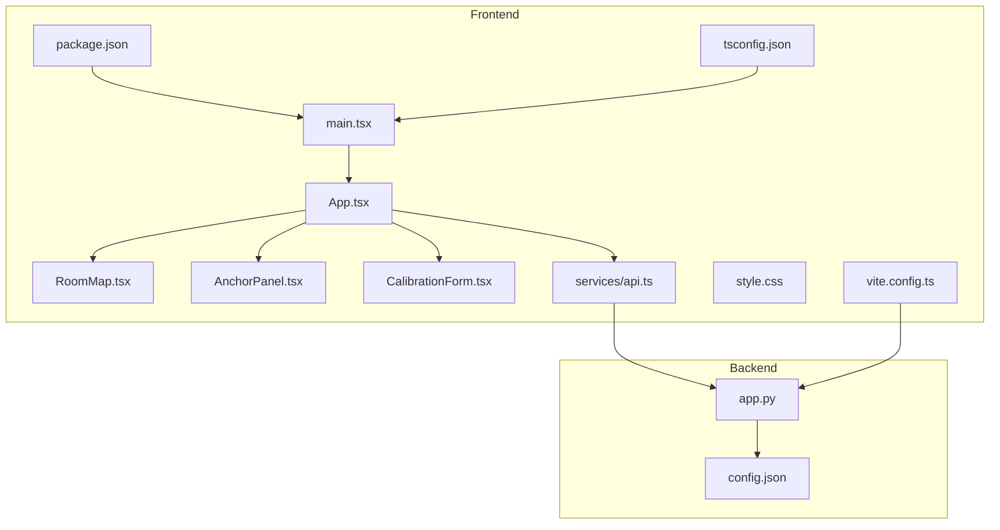
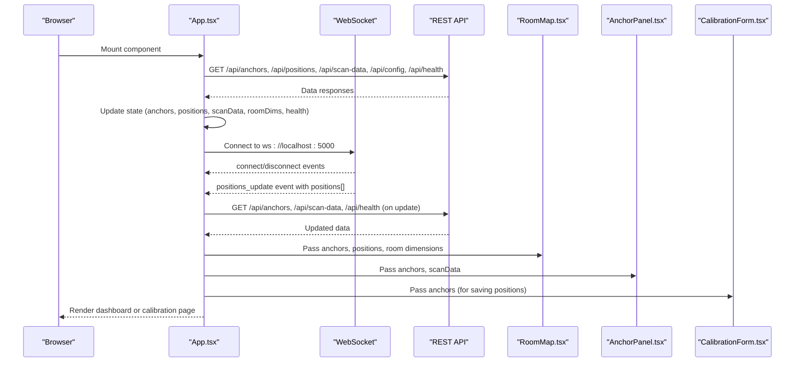
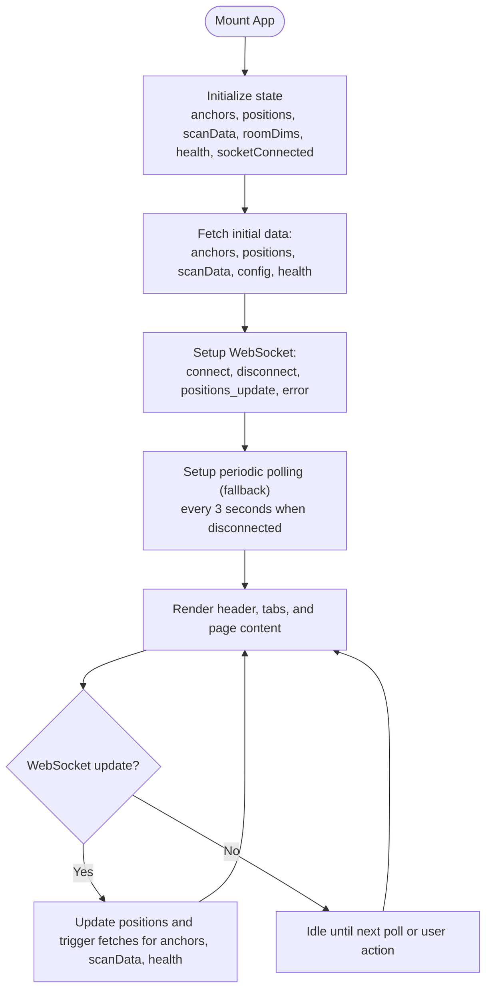
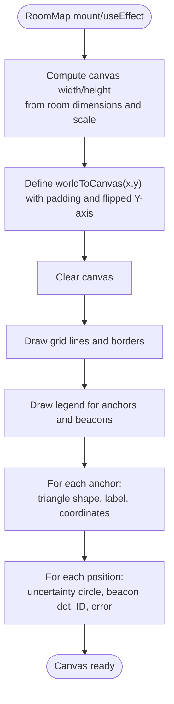
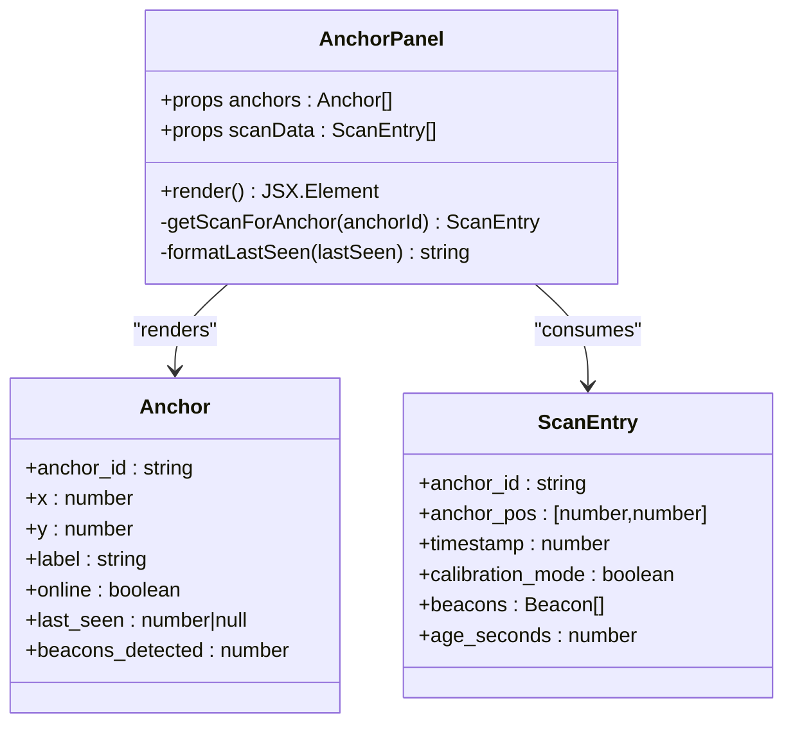
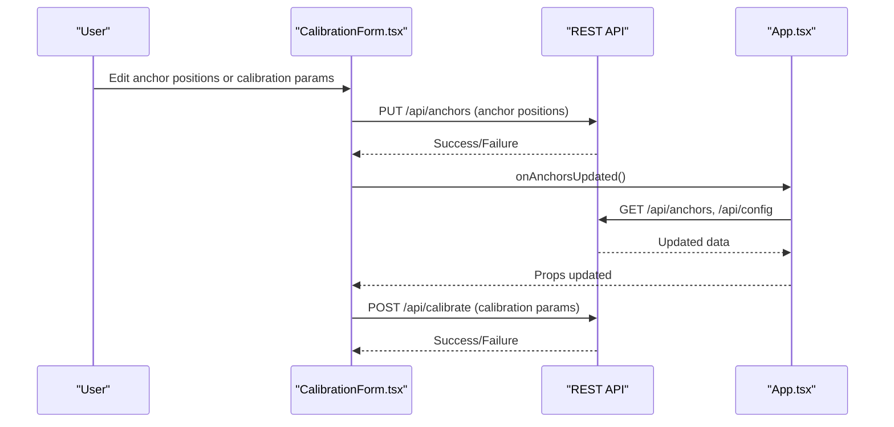
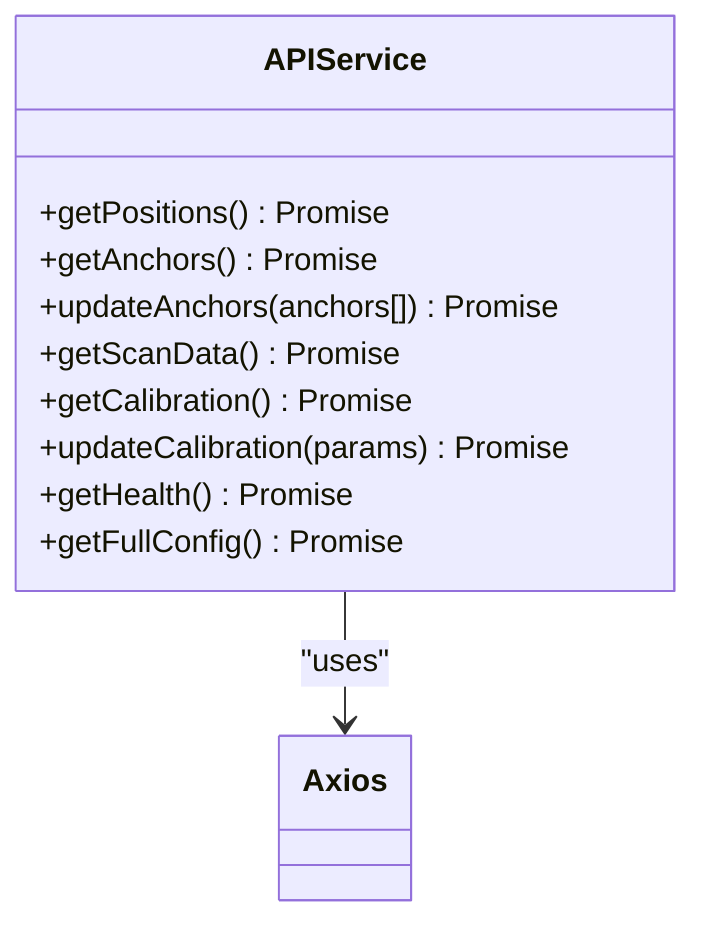
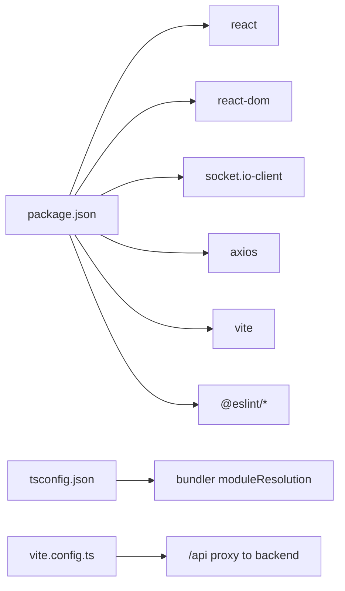
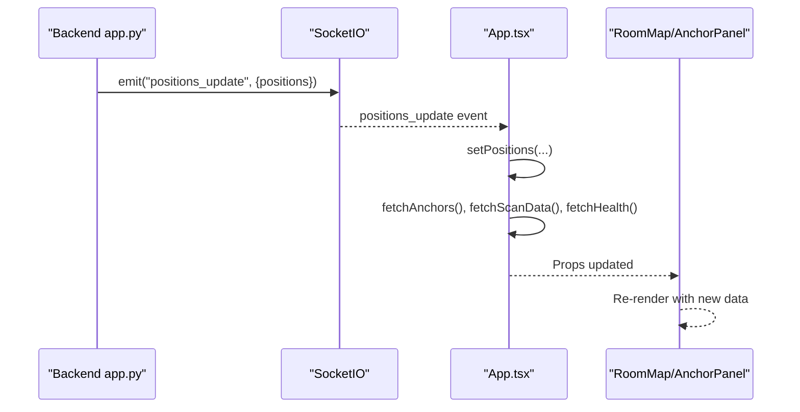

# Frontend Application Architecture

<cite>
**Referenced Files in This Document**
- [App.tsx](file://frontend/src/App.tsx)
- [main.tsx](file://frontend/src/main.tsx)
- [RoomMap.tsx](file://frontend/src/components/RoomMap.tsx)
- [AnchorPanel.tsx](file://frontend/src/components/AnchorPanel.tsx)
- [CalibrationForm.tsx](file://frontend/src/components/CalibrationForm.tsx)
- [api.ts](file://frontend/src/services/api.ts)
- [style.css](file://frontend/src/style.css)
- [vite.config.ts](file://frontend/vite.config.ts)
- [package.json](file://frontend/package.json)
- [tsconfig.json](file://frontend/tsconfig.json)
- [app.py](file://backend/app.py)
- [config.json](file://backend/config.json)
</cite>

## Table of Contents
1. [Introduction](#introduction)
2. [Project Structure](#project-structure)
3. [Core Components](#core-components)
4. [Architecture Overview](#architecture-overview)
5. [Detailed Component Analysis](#detailed-component-analysis)
6. [Dependency Analysis](#dependency-analysis)
7. [Performance Considerations](#performance-considerations)
8. [Troubleshooting Guide](#troubleshooting-guide)
9. [Conclusion](#conclusion)
10. [Appendices](#appendices)

## Introduction
This document describes the frontend application architecture for a BLE Room Positioning System built with React and TypeScript. The application orchestrates three primary views: a real-time RoomMap visualization, an AnchorPanel status monitor, and a CalibrationForm configuration interface. It integrates WebSocket real-time updates with a REST API service layer, manages state using React hooks, and renders interactive visualizations on a canvas. The backend exposes REST endpoints and emits WebSocket events for live updates.

## Project Structure
The frontend is organized around a small set of React components, a centralized API service layer, and a Vite-based build system. The backend provides REST endpoints and WebSocket events consumed by the frontend.

**Diagram sources**
- [main.tsx:1-11](file://frontend/src/main.tsx#L1-L11)
- [App.tsx:1-274](file://frontend/src/App.tsx#L1-L274)
- [RoomMap.tsx:1-229](file://frontend/src/components/RoomMap.tsx#L1-L229)
- [AnchorPanel.tsx:1-143](file://frontend/src/components/AnchorPanel.tsx#L1-L143)
- [CalibrationForm.tsx:1-290](file://frontend/src/components/CalibrationForm.tsx#L1-L290)
- [api.ts:1-66](file://frontend/src/services/api.ts#L1-L66)
- [style.css:1-805](file://frontend/src/style.css#L1-L805)
- [vite.config.ts:1-16](file://frontend/vite.config.ts#L1-L16)
- [package.json:1-31](file://frontend/package.json#L1-L31)
- [tsconfig.json:1-25](file://frontend/tsconfig.json#L1-L25)
- [app.py:1-398](file://backend/app.py#L1-L398)
- [config.json:1-30](file://backend/config.json#L1-L30)

**Section sources**
- [main.tsx:1-11](file://frontend/src/main.tsx#L1-L11)
- [App.tsx:1-274](file://frontend/src/App.tsx#L1-L274)
- [vite.config.ts:1-16](file://frontend/vite.config.ts#L1-L16)
- [package.json:1-31](file://frontend/package.json#L1-L31)
- [tsconfig.json:1-25](file://frontend/tsconfig.json#L1-L25)

## Core Components
- App orchestrator: Manages global state, WebSocket connectivity, periodic polling fallback, and page routing between dashboard and calibration.
- RoomMap: Canvas-based visualization of anchors and beacon positions with coordinate transformation and legends.
- AnchorPanel: Real-time anchor status cards with RSSI indicators and beacon detection summaries.
- CalibrationForm: Configurable parameters for room dimensions, anchor positions, and signal calibration; persists changes via API.
- API service: Axios-based client wrapping REST endpoints for positions, anchors, scan data, calibration, health, and full config.

Key responsibilities:
- Real-time updates: WebSocket events trigger state updates and secondary data refreshes.
- State management: React hooks manage local state and drive component re-renders.
- Rendering: RoomMap performs efficient canvas drawing; AnchorPanel and CalibrationForm render structured UIs.

**Section sources**
- [App.tsx:56-271](file://frontend/src/App.tsx#L56-L271)
- [RoomMap.tsx:28-226](file://frontend/src/components/RoomMap.tsx#L28-L226)
- [AnchorPanel.tsx:30-134](file://frontend/src/components/AnchorPanel.tsx#L30-L134)
- [CalibrationForm.tsx:30-287](file://frontend/src/components/CalibrationForm.tsx#L30-L287)
- [api.ts:13-63](file://frontend/src/services/api.ts#L13-L63)

## Architecture Overview
The frontend follows a unidirectional data flow:
- REST API fetches initial and periodic data.
- WebSocket events push real-time updates to the UI.
- State updates cause React components to re-render.
- The RoomMap component renders a canvas visualization based on current state.

**Diagram sources**
- [App.tsx:117-172](file://frontend/src/App.tsx#L117-L172)
- [api.ts:13-63](file://frontend/src/services/api.ts#L13-L63)
- [RoomMap.tsx:28-226](file://frontend/src/components/RoomMap.tsx#L28-L226)
- [AnchorPanel.tsx:30-134](file://frontend/src/components/AnchorPanel.tsx#L30-L134)
- [CalibrationForm.tsx:30-287](file://frontend/src/components/CalibrationForm.tsx#L30-L287)

## Detailed Component Analysis

### App Component
The App component is the central orchestrator:
- Initializes state for anchors, positions, scan data, room dimensions, health, and WebSocket connection status.
- Provides memoized fetch functions for REST endpoints.
- Sets up periodic polling when WebSocket is disconnected.
- Establishes WebSocket connection with reconnection and error handling.
- Renders either the dashboard or calibration page based on selected tab.
- Passes props to RoomMap, AnchorPanel, and CalibrationForm.

**Diagram sources**
- [App.tsx:56-172](file://frontend/src/App.tsx#L56-L172)

**Section sources**
- [App.tsx:56-172](file://frontend/src/App.tsx#L56-L172)

### RoomMap Component
RoomMap renders a canvas-based visualization:
- Converts world coordinates (meters) to canvas pixel coordinates using a fixed scale factor and padding.
- Draws room boundaries, grid lines, and labeled axes.
- Renders anchors as colored triangles with labels and coordinates.
- Draws beacon positions as circles with uncertainty areas and IDs.
- Includes a legend for anchors and beacons.

**Diagram sources**
- [RoomMap.tsx:28-214](file://frontend/src/components/RoomMap.tsx#L28-L214)

**Section sources**
- [RoomMap.tsx:28-226](file://frontend/src/components/RoomMap.tsx#L28-L226)

### AnchorPanel Component
AnchorPanel displays anchor status cards:
- Computes human-readable “last seen” timestamps.
- Renders anchor cards with online/offline indicators.
- Shows detected beacons with RSSI levels mapped to styles.
- Highlights anchors in calibration mode.

**Diagram sources**
- [AnchorPanel.tsx:30-134](file://frontend/src/components/AnchorPanel.tsx#L30-L134)

**Section sources**
- [AnchorPanel.tsx:30-134](file://frontend/src/components/AnchorPanel.tsx#L30-L134)

### CalibrationForm Component
CalibrationForm manages:
- Room dimensions (read-only from backend config).
- Anchor positions editable by the user.
- Signal calibration parameters (path loss exponent, TX power, RSSI threshold, scan TTL).
- Persisting changes via API and notifying parent to refresh data.

**Diagram sources**
- [CalibrationForm.tsx:30-287](file://frontend/src/components/CalibrationForm.tsx#L30-L287)
- [api.ts:24-51](file://frontend/src/services/api.ts#L24-L51)
- [App.tsx:259-267](file://frontend/src/App.tsx#L259-L267)

**Section sources**
- [CalibrationForm.tsx:30-287](file://frontend/src/components/CalibrationForm.tsx#L30-L287)
- [api.ts:24-51](file://frontend/src/services/api.ts#L24-L51)

### API Service Layer
The API service wraps REST endpoints:
- getPositions, getAnchors, updateAnchors, getScanData, getCalibration, updateCalibration, getHealth, getFullConfig.
- Uses axios with base URL pointing to /api, proxied by Vite dev server to backend.

**Diagram sources**
- [api.ts:13-63](file://frontend/src/services/api.ts#L13-L63)

**Section sources**
- [api.ts:13-63](file://frontend/src/services/api.ts#L13-L63)
- [vite.config.ts:8-13](file://frontend/vite.config.ts#L8-L13)

## Dependency Analysis
- Runtime dependencies: React, React DOM, socket.io-client, axios.
- Build dependencies: Vite, @vitejs/plugin-react, ESLint plugins.
- TypeScript configuration targets modern JS environments with bundler module resolution.
- CSS defines responsive layouts and theme variables for light/dark modes.

**Diagram sources**
- [package.json:12-29](file://frontend/package.json#L12-L29)
- [tsconfig.json:10-15](file://frontend/tsconfig.json#L10-L15)
- [vite.config.ts:8-13](file://frontend/vite.config.ts#L8-L13)

**Section sources**
- [package.json:12-29](file://frontend/package.json#L12-L29)
- [tsconfig.json:10-15](file://frontend/tsconfig.json#L10-L15)
- [vite.config.ts:8-13](file://frontend/vite.config.ts#L8-L13)

## Performance Considerations
- Canvas rendering: RoomMap draws efficiently by clearing and redrawing only when props change; consider debouncing frequent updates if needed.
- State updates: Memoized callbacks prevent unnecessary re-renders; ensure WebSocket updates batch related fetches.
- Polling fallback: 3-second intervals reduce network overhead while maintaining responsiveness.
- CSS scalability: Grid-based layout adapts to smaller screens; consider lazy loading for large datasets.
- Build optimization: Vite’s dev server proxies API requests; production builds minimize bundle size and enable tree-shaking.

[No sources needed since this section provides general guidance]

## Troubleshooting Guide
Common issues and resolutions:
- WebSocket disconnections: The App component sets a disconnected indicator and falls back to periodic polling. Verify backend is reachable at the configured URL.
- CORS errors: Ensure backend CORS allows the frontend origin; Flask-CORS is enabled in the backend.
- API proxy failures: Confirm Vite proxy configuration routes /api to the backend address.
- Canvas rendering anomalies: Validate room dimensions and scale factor; ensure props are numeric and non-zero.
- Authentication: No authentication is implemented in the backend; secure deployments should add authentication middleware.

**Section sources**
- [App.tsx:140-172](file://frontend/src/App.tsx#L140-L172)
- [vite.config.ts:8-13](file://frontend/vite.config.ts#L8-L13)
- [app.py:24-25](file://backend/app.py#L24-L25)

## Conclusion
The frontend architecture cleanly separates concerns: App manages orchestration and state, RoomMap handles visualization, AnchorPanel surfaces operational status, and CalibrationForm enables configuration. The combination of REST APIs and WebSocket events ensures robust real-time updates with a reliable polling fallback. The Vite build system and TypeScript configuration support rapid development and production-ready builds.

[No sources needed since this section summarizes without analyzing specific files]

## Appendices

### Real-Time Update Pipeline
End-to-end flow from backend to frontend:
- Backend receives scan data and recalculates positions.
- Backend emits WebSocket positions_update with the latest positions.
- Frontend updates state and triggers secondary fetches for anchors, scan data, and health.
- RoomMap and AnchorPanel re-render with new data.

**Diagram sources**
- [app.py:99-103](file://backend/app.py#L99-L103)
- [App.tsx:157-163](file://frontend/src/App.tsx#L157-L163)

### Responsive Design and Theming
- CSS grid layout adapts the dashboard to single-column on smaller screens.
- Dark/light mode variables adjust colors and shadows for readability.
- Form inputs and tables scale appropriately across breakpoints.

**Section sources**
- [style.css:500-508](file://frontend/src/style.css#L500-L508)
- [style.css:541-559](file://frontend/src/style.css#L541-L559)

### Backend Configuration Integration
- Room dimensions and anchor positions originate from backend config.json.
- Frontend reads room dimensions via getFullConfig and passes to RoomMap.
- Calibration parameters are fetched and updated via dedicated endpoints.

**Section sources**
- [config.json:1-30](file://backend/config.json#L1-L30)
- [App.tsx:93-105](file://frontend/src/App.tsx#L93-L105)
- [api.ts:59-63](file://frontend/src/services/api.ts#L59-L63)