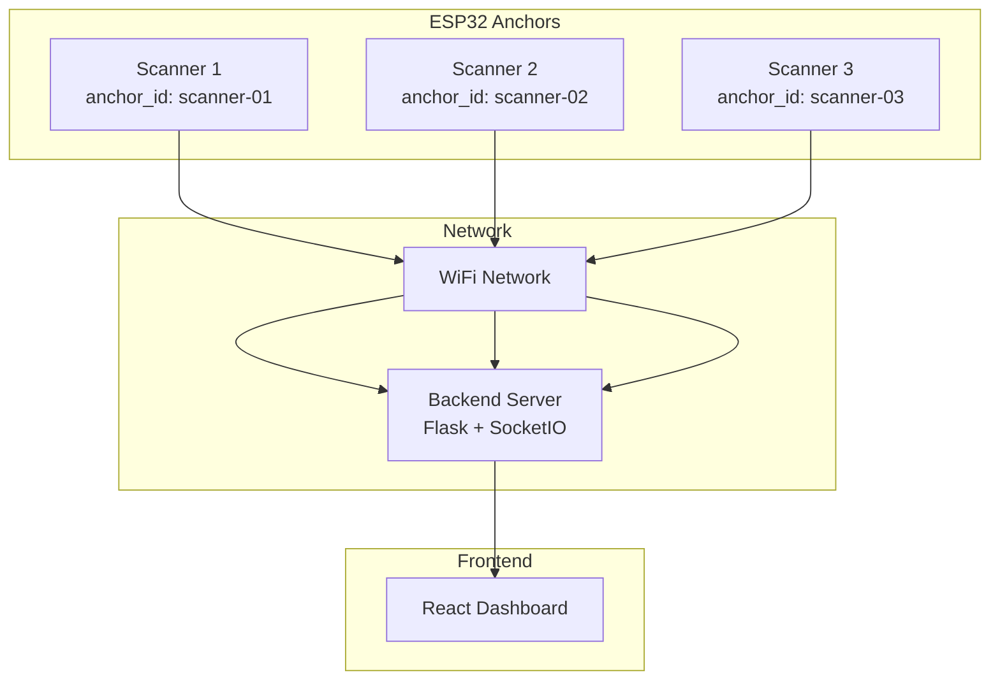
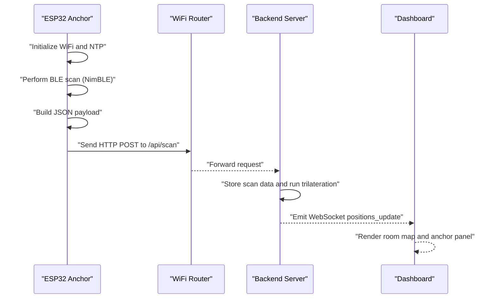
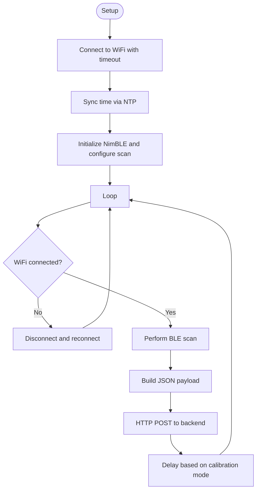
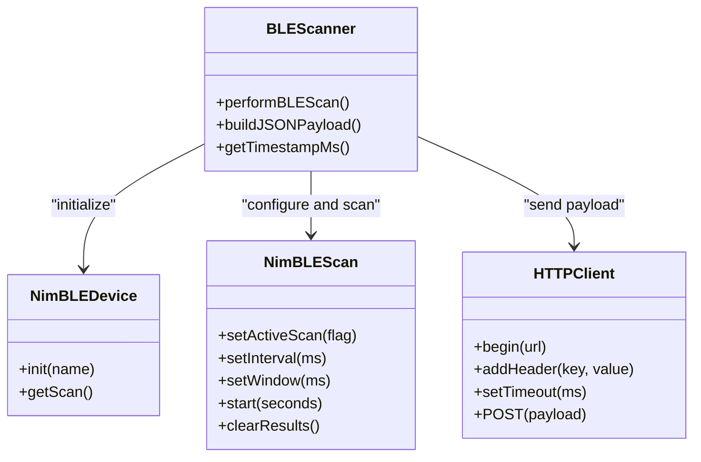
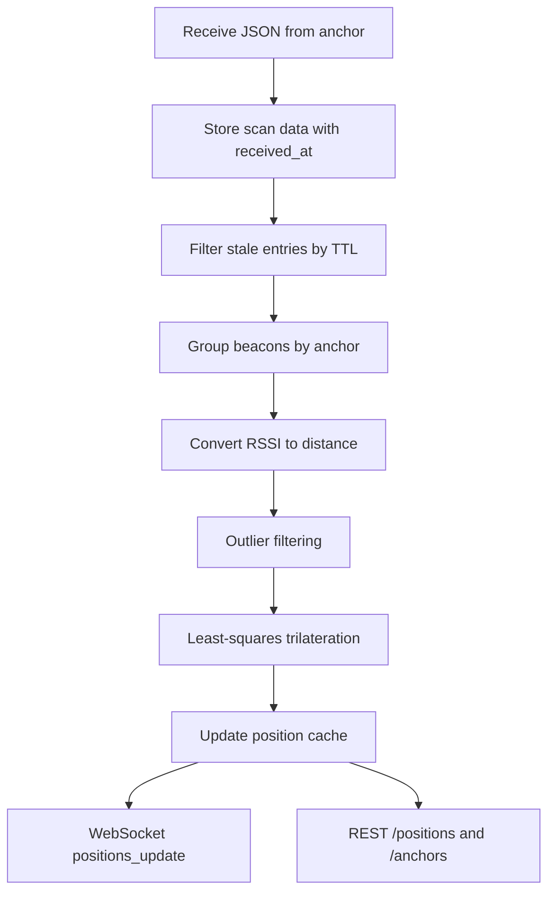
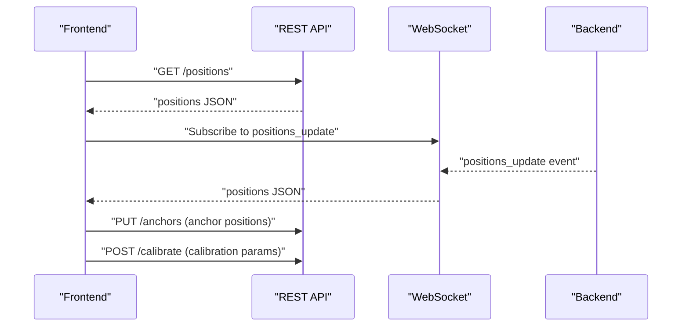
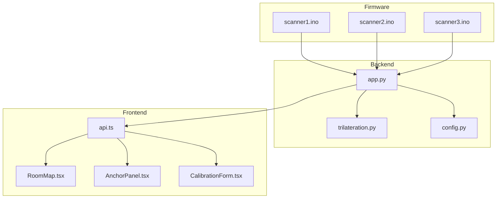

# Hardware Layer Architecture

<cite>
**Referenced Files in This Document**
- [scanner1.ino](file://scanner1/scanner1.ino)
- [scanner2.ino](file://scanner2/scanner2.ino)
- [scanner3.ino](file://scanner3/scanner3.ino)
- [app.py](file://backend/app.py)
- [trilateration.py](file://backend/trilateration.py)
- [config.py](file://backend/config.py)
- [config.json](file://backend/config.json)
- [api.ts](file://frontend/src/services/api.ts)
- [AnchorPanel.tsx](file://frontend/src/components/AnchorPanel.tsx)
- [CalibrationForm.tsx](file://frontend/src/components/CalibrationForm.tsx)
- [RoomMap.tsx](file://frontend/src/components/RoomMap.tsx)
</cite>

## Table of Contents
1. [Introduction](#introduction)
2. [Project Structure](#project-structure)
3. [Core Components](#core-components)
4. [Architecture Overview](#architecture-overview)
5. [Detailed Component Analysis](#detailed-component-analysis)
6. [Dependency Analysis](#dependency-analysis)
7. [Performance Considerations](#performance-considerations)
8. [Troubleshooting Guide](#troubleshooting-guide)
9. [Conclusion](#conclusion)
10. [Appendices](#appendices)

## Introduction
This document describes the hardware layer architecture of the BLE Room Positioning System. It focuses on the ESP32-C3-based anchor nodes (three independent scanners), their firmware implementation, BLE scanning architecture using the NimBLE library, WiFi connectivity, HTTP POST data transmission to the backend, and the overall system’s hardware requirements and operational constraints. It also covers anchor positioning strategies, signal propagation considerations, troubleshooting, and power/network configuration guidance.

## Project Structure
The system comprises:
- Three identical ESP32-C3 anchor nodes (scanner1, scanner2, scanner3) running the same firmware with unique identifiers and distinct physical locations.
- A backend service written in Python (Flask + SocketIO) that receives BLE scan reports, performs trilateration, and exposes REST APIs and WebSocket updates.
- A React-based frontend that visualizes anchors and beacon positions on a room map and allows calibration adjustments.

**Diagram sources**
- [scanner1.ino:21](file://scanner1/scanner1.ino#L21)
- [scanner2.ino:21](file://scanner2/scanner2.ino#L21)
- [scanner3.ino:21](file://scanner3/scanner3.ino#L21)
- [app.py:123](file://backend/app.py#L123)
- [api.ts:1](file://frontend/src/services/api.ts#L1)

**Section sources**
- [scanner1.ino:1-250](file://scanner1/scanner1.ino#L1-L250)
- [scanner2.ino:1-250](file://scanner2/scanner2.ino#L1-L250)
- [scanner3.ino:1-250](file://scanner3/scanner3.ino#L1-L250)
- [app.py:1-398](file://backend/app.py#L1-L398)
- [config.py:1-95](file://backend/config.py#L1-L95)
- [config.json:1-30](file://backend/config.json#L1-L30)
- [api.ts:1-66](file://frontend/src/services/api.ts#L1-L66)
- [AnchorPanel.tsx:1-143](file://frontend/src/components/AnchorPanel.tsx#L1-L143)
- [CalibrationForm.tsx:1-290](file://frontend/src/components/CalibrationForm.tsx#L1-L290)
- [RoomMap.tsx:1-229](file://frontend/src/components/RoomMap.tsx#L1-L229)

## Core Components
- ESP32-C3 Anchor Nodes: Each anchor runs identical firmware with unique anchor IDs and distinct physical coordinates. They perform BLE scanning, collect RSSI measurements, optionally extract TX power, and transmit JSON payloads via HTTP POST to the backend.
- Backend Service: Receives scan reports, stores them temporarily, filters stale data, and runs trilateration to compute 2D positions. It exposes REST endpoints and WebSocket events for real-time updates.
- Trilateration Engine: Converts RSSI to distance using a log-distance path loss model, filters outliers, and solves a least-squares trilateration problem to estimate beacon positions.
- Frontend Dashboard: Displays anchors and beacon positions on a room map, shows anchor status and detected beacons, and provides calibration controls.

**Section sources**
- [scanner1.ino:146-198](file://scanner1/scanner1.ino#L146-L198)
- [app.py:123-171](file://backend/app.py#L123-L171)
- [trilateration.py:11-218](file://backend/trilateration.py#L11-L218)
- [RoomMap.tsx:28-229](file://frontend/src/components/RoomMap.tsx#L28-L229)

## Architecture Overview
The hardware layer architecture centers on three ESP32-C3 anchors positioned at known coordinates. Each anchor:
- Initializes WiFi and connects to the local network.
- Synchronizes time via NTP.
- Scans for BLE advertisements using NimBLE (active scanning).
- Builds a JSON payload containing anchor metadata, timestamp, calibration mode flag, and discovered beacons with RSSI and TX power.
- Sends the payload via HTTP POST to the backend endpoint.
- Periodically repeats scanning with configurable intervals.

The backend:
- Validates and stores incoming scan data.
- Filters stale entries based on a time-to-live setting.
- Runs trilateration across all visible beacons.
- Emits real-time position updates via WebSocket and exposes REST endpoints for configuration and diagnostics.

**Diagram sources**
- [scanner1.ino:203-230](file://scanner1/scanner1/ino#L203-L230)
- [scanner1.ino:146-198](file://scanner1/scanner1.ino#L146-L198)
- [app.py:123-171](file://backend/app.py#L123-L171)
- [app.py:48-105](file://backend/app.py#L48-L105)
- [api.ts:13-16](file://frontend/src/services/api.ts#L13-L16)

## Detailed Component Analysis

### ESP32-C3 Anchor Firmware (scanner1/scanner2/scanner3)
Key responsibilities:
- WiFi initialization and reconnection with timeout.
- NTP time synchronization with fallback to millisecond timestamps.
- NimBLE scan configuration (active scanning, interval/window).
- BLE advertisement parsing to extract device address, RSSI, TX power, and optional name.
- JSON payload construction and HTTP POST to backend.
- Delay scheduling controlled by calibration mode.

**Diagram sources**
- [scanner1.ino:203-230](file://scanner1/scanner1.ino#L203-L230)
- [scanner1.ino:235-249](file://scanner1/scanner1.ino#L235-L249)
- [scanner1.ino:62-79](file://scanner1/scanner1.ino#L62-L79)
- [scanner1.ino:84-103](file://scanner1/scanner1.ino#L84-L103)
- [scanner1.ino:146-198](file://scanner1/scanner1.ino#L146-L198)
- [scanner1.ino:120-141](file://scanner1/scanner1.ino#L120-L141)

**Section sources**
- [scanner1.ino:21-51](file://scanner1/scanner1.ino#L21-L51)
- [scanner1.ino:62-103](file://scanner1/scanner1.ino#L62-L103)
- [scanner1.ino:108-115](file://scanner1/scanner1.ino#L108-L115)
- [scanner1.ino:120-141](file://scanner1/scanner1.ino#L120-L141)
- [scanner1.ino:146-198](file://scanner1/scanner1.ino#L146-L198)
- [scanner1.ino:203-249](file://scanner1/scanner1.ino#L203-L249)

### BLE Scanning and RSSI Collection
- Active scanning is enabled with a scan window close to the interval to maximize detection probability.
- Results are cleared after each scan to prevent memory accumulation on ESP32-C3.
- For each discovered device, the firmware captures:
  - Device address (MAC).
  - RSSI.
  - TX power (device-specific if available, otherwise default).
  - Optional advertised name.
- Timestamps are derived from NTP when available; otherwise, a millisecond counter is used.

**Diagram sources**
- [scanner1.ino:221-229](file://scanner1/scanner1.ino#L221-L229)
- [scanner1.ino:222-226](file://scanner1/scanner1.ino#L222-L226)
- [scanner1.ino:146-198](file://scanner1/scanner1.ino#L146-L198)
- [scanner1.ino:120-141](file://scanner1/scanner1.ino#L120-L141)

**Section sources**
- [scanner1.ino:221-229](file://scanner1/scanner1.ino#L221-L229)
- [scanner1.ino:222-226](file://scanner1/scanner1.ino#L222-L226)
- [scanner1.ino:146-198](file://scanner1/scanner1.ino#L146-L198)
- [scanner1.ino:108-115](file://scanner1/scanner1.ino#L108-L115)

### Backend Data Pipeline and Trilateration
- The backend receives JSON payloads from anchors and stores them in an in-memory store with a receive timestamp.
- Stale entries are filtered using a configurable TTL.
- For each beacon visible to multiple anchors, the system:
  - Applies beacon filters if configured.
  - Converts RSSI to distance using a path-loss model with configurable parameters.
  - Filters outliers using median absolute deviation.
  - Solves a least-squares trilateration to estimate position and error.
- Real-time updates are emitted via WebSocket and served via REST endpoints.

**Diagram sources**
- [app.py:123-171](file://backend/app.py#L123-L171)
- [app.py:48-105](file://backend/app.py#L48-L105)
- [trilateration.py:11-33](file://backend/trilateration.py#L11-L33)
- [trilateration.py:35-67](file://backend/trilateration.py#L35-L67)
- [trilateration.py:69-153](file://backend/trilateration.py#L69-L153)

**Section sources**
- [app.py:39-46](file://backend/app.py#L39-L46)
- [app.py:48-105](file://backend/app.py#L48-L105)
- [trilateration.py:11-33](file://backend/trilateration.py#L11-L33)
- [trilateration.py:35-67](file://backend/trilateration.py#L35-L67)
- [trilateration.py:69-153](file://backend/trilateration.py#L69-L153)

### Frontend Visualization and Controls
- The dashboard retrieves positions and anchor status via REST endpoints and subscribes to WebSocket events for live updates.
- The room map renders anchors as triangles and beacons as circles with uncertainty ellipses.
- The calibration form allows updating anchor positions and tuning path-loss exponent, TX power, RSSI threshold, and TTL.

**Diagram sources**
- [api.ts:13-16](file://frontend/src/services/api.ts#L13-L16)
- [api.ts:25-28](file://frontend/src/services/api.ts#L25-L28)
- [api.ts:43-51](file://frontend/src/services/api.ts#L43-L51)
- [app.py:173-184](file://backend/app.py#L173-L184)
- [app.py:224-254](file://backend/app.py#L224-L254)
- [app.py:282-321](file://backend/app.py#L282-L321)

**Section sources**
- [api.ts:1-66](file://frontend/src/services/api.ts#L1-L66)
- [RoomMap.tsx:28-229](file://frontend/src/components/RoomMap.tsx#L28-L229)
- [AnchorPanel.tsx:30-143](file://frontend/src/components/AnchorPanel.tsx#L30-L143)
- [CalibrationForm.tsx:30-290](file://frontend/src/components/CalibrationForm.tsx#L30-L290)

## Dependency Analysis
- Firmware dependencies:
  - WiFi.h for network connectivity.
  - HTTPClient.h for HTTP POST.
  - NimBLEDevice.h for BLE scanning.
  - ArduinoJson for JSON serialization.
  - time.h for NTP time synchronization.
- Backend dependencies:
  - Flask for REST API and SocketIO for real-time updates.
  - NumPy and SciPy for numerical optimization in trilateration.
  - Config module for persistent configuration storage.

**Diagram sources**
- [scanner1.ino:12-16](file://scanner1/scanner1.ino#L12-L16)
- [app.py:9-21](file://backend/app.py#L9-L21)
- [trilateration.py:6-8](file://backend/trilateration.py#L6-L8)
- [config.py:6-9](file://backend/config.py#L6-L9)
- [api.ts:1](file://frontend/src/services/api.ts#L1)

**Section sources**
- [scanner1.ino:12-16](file://scanner1/scanner1.ino#L12-L16)
- [app.py:9-21](file://backend/app.py#L9-L21)
- [trilateration.py:6-8](file://backend/trilateration.py#L6-L8)
- [config.py:6-9](file://backend/config.py#L6-L9)
- [api.ts:1-66](file://frontend/src/services/api.ts#L1-L66)

## Performance Considerations
- BLE scanning cadence: The anchors scan every few seconds; calibration mode reduces delays for rapid iteration. Adjust scan intervals to balance responsiveness and power consumption.
- Memory management: Results are cleared after each scan to prevent memory leaks on ESP32-C3.
- Network reliability: WiFi reconnection with cooldown prevents thrashing; HTTP timeouts are set to avoid blocking.
- Backend throughput: In-memory stores and locks protect concurrent access; TTL ensures timely cleanup of stale data.
- Trilateration cost: Least-squares optimization is lightweight but can be CPU-intensive under heavy loads; tune parameters to reduce unnecessary computations.

[No sources needed since this section provides general guidance]

## Troubleshooting Guide
Common issues and resolutions:
- WiFi connectivity failures:
  - Verify SSID/password and router reachability.
  - Confirm the backend URL is reachable from the anchor network.
  - Check for timeouts and ensure reconnection logic triggers.
- NTP synchronization errors:
  - Ensure outbound internet access is available.
  - Confirm timezone offsets are correct.
- HTTP POST failures:
  - Validate backend endpoint availability and CORS configuration.
  - Inspect HTTP error codes and logs.
- BLE scanning yields no devices:
  - Confirm beacon advertising and TX power.
  - Check antenna orientation and proximity.
  - Reduce scan duration or increase TX power if needed.
- Position accuracy concerns:
  - Calibrate path-loss exponent and TX power using the frontend calibration form.
  - Verify anchor positions and room dimensions.
  - Use outlier filtering and TTL adjustments to stabilize results.

**Section sources**
- [scanner1.ino:62-79](file://scanner1/scanner1.ino#L62-L79)
- [scanner1.ino:84-103](file://scanner1/scanner1.ino#L84-L103)
- [scanner1.ino:120-141](file://scanner1/scanner1.ino#L120-L141)
- [app.py:123-171](file://backend/app.py#L123-L171)
- [CalibrationForm.tsx:174-290](file://frontend/src/components/CalibrationForm.tsx#L174-L290)

## Conclusion
The BLE Room Positioning System’s hardware layer relies on three ESP32-C3 anchors running identical firmware to collect BLE RSSI measurements and transmit them to a centralized backend. The backend applies trilateration to estimate beacon positions and streams updates to a React dashboard. Proper anchor placement, calibration, and network configuration are essential for reliable operation. The modular architecture enables straightforward maintenance and iterative improvements.

[No sources needed since this section summarizes without analyzing specific files]

## Appendices

### Hardware Requirements and Recommendations
- Microcontroller: ESP32-C3 Dev Module.
- Antenna: PCB or external antenna suitable for BLE frequencies; ensure minimal obstruction and consistent orientation across anchors.
- Power: USB or battery with voltage regulation; consider sleep modes to extend battery life.
- Enclosure: Weatherproof and secure mounting to minimize movement and signal interference.

[No sources needed since this section provides general guidance]

### Anchor Placement Strategies and Environmental Factors
- Placement: Position anchors to form a triangle covering the room; avoid obstructive materials (steel, water).
- Height: Mount at consistent heights to minimize multipath effects.
- Orientation: Orient antennas to reduce line-of-sight blockage.
- Interference: Avoid RF sources (microwave ovens, Bluetooth devices) near anchors.

[No sources needed since this section provides general guidance]

### Signal Strength Optimization Techniques
- Increase beacon TX power if permitted by regulations.
- Reduce scan intervals only if power budget allows.
- Use active scanning windows aligned with intervals.
- Apply beacon filters to focus on known devices.

[No sources needed since this section provides general guidance]

### Anchor Calibration Processes
- Measure and enter precise anchor coordinates in the frontend.
- Place a known reference beacon at multiple points.
- Adjust path-loss exponent and TX power until calculated positions converge.
- Validate accuracy across the room and refine parameters iteratively.

**Section sources**
- [CalibrationForm.tsx:174-290](file://frontend/src/components/CalibrationForm.tsx#L174-L290)
- [config.py:17-41](file://backend/config.py#L17-L41)
- [config.json:6-30](file://backend/config.json#L6-L30)

### Power Consumption and Sleep Modes
- Use deep sleep or light sleep modes to conserve energy when scanning duty cycles permit.
- Disable BLE scanning between measurement windows.
- Optimize WiFi keep-alive and reconnection intervals.

[No sources needed since this section provides general guidance]

### Network Configuration Requirements
- Static IP or DHCP reservation for anchors and backend stability.
- Open firewall ports for HTTP and WebSocket traffic.
- Ensure consistent latency and bandwidth for real-time updates.

[No sources needed since this section provides general guidance]