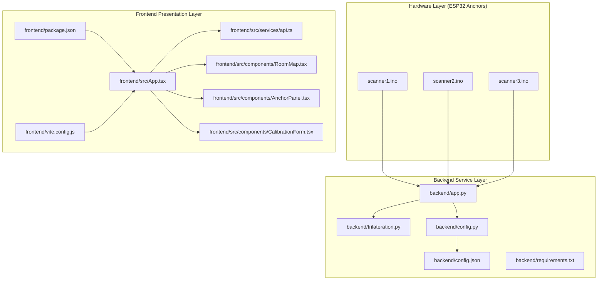
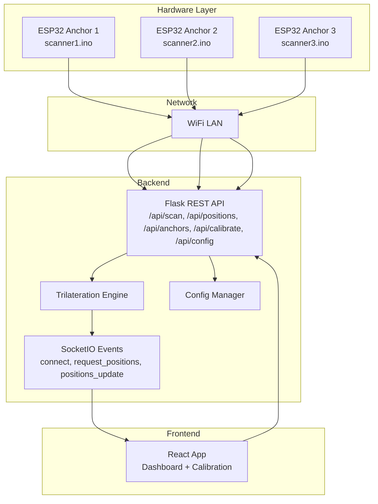
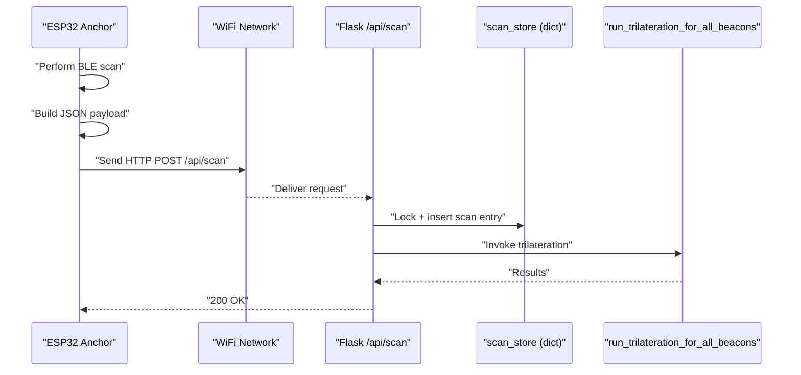
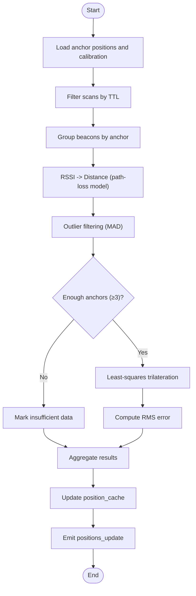
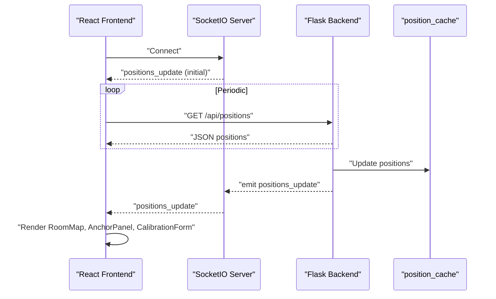
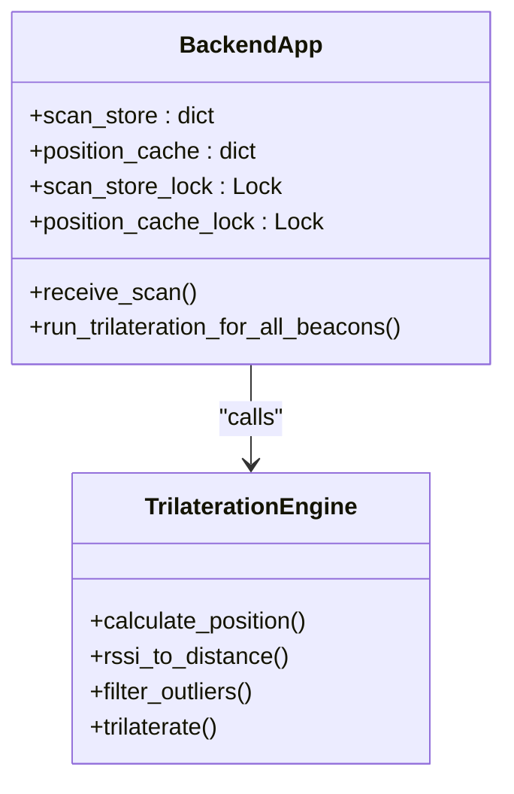
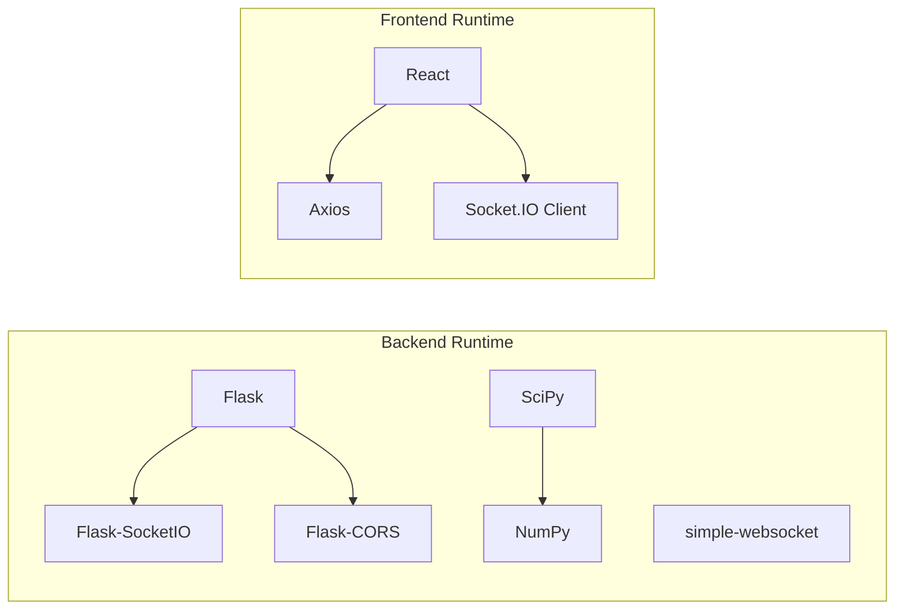

# System Architecture

<cite>
**Referenced Files in This Document**
- [backend/app.py](file://backend/app.py)
- [backend/trilateration.py](file://backend/trilateration.py)
- [backend/config.py](file://backend/config.py)
- [backend/config.json](file://backend/config.json)
- [backend/requirements.txt](file://backend/requirements.txt)
- [frontend/src/App.tsx](file://frontend/src/App.tsx)
- [frontend/src/services/api.ts](file://frontend/src/services/api.ts)
- [frontend/src/components/RoomMap.tsx](file://frontend/src/components/RoomMap.tsx)
- [frontend/src/components/AnchorPanel.tsx](file://frontend/src/components/AnchorPanel.tsx)
- [frontend/src/components/CalibrationForm.tsx](file://frontend/src/components/CalibrationForm.tsx)
- [frontend/package.json](file://frontend/package.json)
- [frontend/vite.config.js](file://frontend/vite.config.js)
- [scanner1/scanner1.ino](file://scanner1/scanner1.ino)
- [scanner2/scanner2.ino](file://scanner2/scanner2.ino)
- [scanner3/scanner3.ino](file://scanner3/scanner3.ino)
</cite>

## Table of Contents
1. [Introduction](#introduction)
2. [Project Structure](#project-structure)
3. [Core Components](#core-components)
4. [Architecture Overview](#architecture-overview)
5. [Detailed Component Analysis](#detailed-component-analysis)
6. [Dependency Analysis](#dependency-analysis)
7. [Performance Considerations](#performance-considerations)
8. [Troubleshooting Guide](#troubleshooting-guide)
9. [Conclusion](#conclusion)
10. [Appendices](#appendices)

## Introduction
This document describes the architecture of the BLE Room Positioning System. The system consists of three layers:
- Hardware layer: ESP32 anchors (ESP32-C3) running NimBLE-based scanners that periodically discover BLE beacons and report scan data to the backend.
- Backend service layer: A Python/Flask application exposing REST APIs and WebSocket endpoints, performing RSSI-to-distance conversion and trilateration, and serving real-time updates.
- Frontend presentation layer: A React application that displays the room layout, anchor statuses, detected beacons, and live positions via WebSocket.

The document explains data flows from BLE discovery to position visualization, the trilateration pipeline, real-time communication choices, concurrency and memory management, system boundaries, integration patterns, scalability, performance, deployment topology, and security considerations.

## Project Structure
The repository is organized into three primary areas:
- backend: Flask application, trilateration engine, configuration management, and dependencies.
- frontend: React SPA with TypeScript, Socket.IO client, and UI components.
- scannerN: Arduino sketches for ESP32 anchors implementing BLE scanning and HTTP reporting.

**Diagram sources**
- [backend/app.py:1-398](file://backend/app.py#L1-L398)
- [backend/trilateration.py:1-218](file://backend/trilateration.py#L1-L218)
- [backend/config.py:1-95](file://backend/config.py#L1-L95)
- [backend/config.json:1-30](file://backend/config.json#L1-L30)
- [backend/requirements.txt:1-7](file://backend/requirements.txt#L1-L7)
- [frontend/src/App.tsx:1-274](file://frontend/src/App.tsx#L1-L274)
- [frontend/src/services/api.ts:1-66](file://frontend/src/services/api.ts#L1-L66)
- [frontend/src/components/RoomMap.tsx:1-229](file://frontend/src/components/RoomMap.tsx#L1-L229)
- [frontend/src/components/AnchorPanel.tsx:1-143](file://frontend/src/components/AnchorPanel.tsx#L1-L143)
- [frontend/src/components/CalibrationForm.tsx:1-290](file://frontend/src/components/CalibrationForm.tsx#L1-L290)
- [frontend/package.json:1-31](file://frontend/package.json#L1-L31)
- [frontend/vite.config.js:1-8](file://frontend/vite.config.js#L1-L8)
- [scanner1/scanner1.ino:1-250](file://scanner1/scanner1.ino#L1-L250)
- [scanner2/scanner2.ino:1-250](file://scanner2/scanner2.ino#L1-L250)
- [scanner3/scanner3.ino:1-250](file://scanner3/scanner3.ino#L1-L250)

**Section sources**
- [backend/app.py:1-398](file://backend/app.py#L1-L398)
- [frontend/src/App.tsx:1-274](file://frontend/src/App.tsx#L1-L274)
- [scanner1/scanner1.ino:1-250](file://scanner1/scanner1.ino#L1-L250)

## Core Components
- ESP32 Anchors (scanner1/scanner2/scanner3): Lightweight NimBLE scanners that perform periodic BLE scans, collect RSSI and TX power, and POST JSON payloads to the backend’s /api/scan endpoint. They maintain minimal state and rely on WiFi/NTP for connectivity/time synchronization.
- Backend Flask Application (app.py): Exposes REST endpoints for health, scan ingestion, positions, anchors, calibration, and configuration. It runs trilateration in a background-friendly manner and emits real-time updates via SocketIO.
- Trilateration Engine (trilateration.py): Converts RSSI to distance, filters outliers, and computes 2D positions using least-squares optimization.
- Configuration Manager (config.py + config.json): Stores room dimensions, anchor positions, and calibration parameters; supports runtime updates.
- Frontend React App (App.tsx + services/api.ts + components/*): Provides dashboard and calibration UI, polls REST endpoints, and subscribes to WebSocket events for live updates.

Key implementation highlights:
- Concurrency: Uses threading locks for in-memory stores (scan_store and position_cache) to guard shared mutable state.
- Real-time: SocketIO enables push-based updates; falls back to periodic polling when WebSocket is unavailable.
- Memory: ESP32 scanners clear scan results after each cycle to avoid heap pressure; backend maintains bounded TTL for freshness.

**Section sources**
- [backend/app.py:28-106](file://backend/app.py#L28-L106)
- [backend/trilateration.py:11-218](file://backend/trilateration.py#L11-L218)
- [backend/config.py:11-95](file://backend/config.py#L11-L95)
- [backend/config.json:1-30](file://backend/config.json#L1-30)
- [frontend/src/App.tsx:54-172](file://frontend/src/App.tsx#L54-L172)
- [frontend/src/services/api.ts:1-66](file://frontend/src/services/api.ts#L1-L66)
- [scanner1/scanner1.ino:146-198](file://scanner1/scanner1.ino#L146-L198)

## Architecture Overview
The system follows a publish-subscribe pattern:
- ESP32 anchors publish BLE scan reports to the backend.
- Backend aggregates scan data, runs trilateration, and publishes positions via WebSocket.
- Frontend consumes REST and WebSocket to render live room visualization and diagnostics.

**Diagram sources**
- [backend/app.py:123-398](file://backend/app.py#L123-L398)
- [backend/trilateration.py:155-218](file://backend/trilateration.py#L155-L218)
- [backend/config.py:44-95](file://backend/config.py#L44-L95)
- [frontend/src/App.tsx:56-172](file://frontend/src/App.tsx#L56-L172)
- [scanner1/scanner1.ino:120-141](file://scanner1/scanner1.ino#L120-L141)

## Detailed Component Analysis

### BLE Scan Data Flow (ESP32 Anchors → Backend)
- ESP32 anchors initialize NimBLE, connect to WiFi, optionally sync time, and enter a loop that performs BLE scans at intervals.
- Each scan builds a JSON payload containing anchor identity, position, timestamp, calibration mode flag, and discovered beacons with RSSI and TX power.
- The payload is sent via HTTP POST to the backend’s /api/scan endpoint.
- On receipt, the backend validates JSON, stores scan data in an in-memory dictionary protected by a lock, and triggers trilateration.

**Diagram sources**
- [scanner1/scanner1.ino:146-198](file://scanner1/scanner1.ino#L146-L198)
- [backend/app.py:123-171](file://backend/app.py#L123-L171)
- [backend/app.py:48-106](file://backend/app.py#L48-L106)

**Section sources**
- [scanner1/scanner1.ino:120-198](file://scanner1/scanner1.ino#L120-L198)
- [backend/app.py:123-171](file://backend/app.py#L123-L171)

### Trilateration Processing Pipeline
The backend’s trilateration pipeline transforms raw RSSI readings into 2D positions:
- RSSI-to-distance conversion using a log-distance path-loss model.
- Optional outlier filtering using median absolute deviation (MAD).
- Least-squares trilateration to estimate position and compute error.
- Aggregation of per-anchor details for diagnostics.

**Diagram sources**
- [backend/app.py:48-106](file://backend/app.py#L48-L106)
- [backend/trilateration.py:11-218](file://backend/trilateration.py#L11-L218)

**Section sources**
- [backend/trilateration.py:11-218](file://backend/trilateration.py#L11-L218)
- [backend/app.py:48-106](file://backend/app.py#L48-L106)

### Real-Time Communication and Frontend Integration
- Backend exposes two channels:
  - REST endpoints for configuration, health, positions, anchors, and calibration.
  - SocketIO events for real-time updates and manual refresh requests.
- Frontend connects via Socket.IO and also polls REST endpoints when WebSocket is unavailable. It renders:
  - RoomMap with anchors, beacons, and uncertainty circles.
  - AnchorPanel with online/offline status and beacon lists.
  - CalibrationForm to update anchor positions and calibration parameters.

**Diagram sources**
- [backend/app.py:354-377](file://backend/app.py#L354-L377)
- [frontend/src/App.tsx:117-172](file://frontend/src/App.tsx#L117-L172)
- [frontend/src/components/RoomMap.tsx:28-214](file://frontend/src/components/RoomMap.tsx#L28-L214)
- [frontend/src/components/AnchorPanel.tsx:30-133](file://frontend/src/components/AnchorPanel.tsx#L30-L133)
- [frontend/src/components/CalibrationForm.tsx:30-100](file://frontend/src/components/CalibrationForm.tsx#L30-L100)

**Section sources**
- [backend/app.py:354-377](file://backend/app.py#L354-L377)
- [frontend/src/App.tsx:117-172](file://frontend/src/App.tsx#L117-L172)

### Multi-Threading and Concurrency Model
- Backend uses threading locks to protect:
  - scan_store: concurrent writes from multiple anchors.
  - position_cache: safe reads/writes during trilateration.
- Trilateration runs synchronously on the request thread but is invoked from HTTP handlers and SocketIO event handlers. While this simplifies deployment, it does not spawn dedicated worker threads. For higher throughput, consider offloading trilateration to a separate thread/process pool guarded by locks.

**Diagram sources**
- [backend/app.py:28-106](file://backend/app.py#L28-L106)
- [backend/trilateration.py:155-218](file://backend/trilateration.py#L155-L218)

**Section sources**
- [backend/app.py:28-106](file://backend/app.py#L28-L106)

### Memory Management and Data Stores
- ESP32 anchors:
  - Clear scan results after each iteration to prevent memory leaks on constrained devices.
  - Use JSON documents sized appropriately for device RAM.
- Backend:
  - scan_store holds recent scans keyed by anchor_id with received timestamps.
  - position_cache holds computed positions and is cleared/updated atomically.
  - TTL-based freshness checks prevent stale data from skewing trilateration.

**Section sources**
- [scanner1/scanner1.ino:196-198](file://scanner1/scanner1.ino#L196-L198)
- [backend/app.py:28-106](file://backend/app.py#L28-L106)

## Dependency Analysis
External libraries and runtime dependencies:
- Backend: Flask, Flask-CORS, Flask-SocketIO, NumPy, SciPy, simple-websocket.
- Frontend: React, Axios, Socket.IO client.

**Diagram sources**
- [backend/requirements.txt:1-7](file://backend/requirements.txt#L1-L7)
- [frontend/package.json:12-29](file://frontend/package.json#L12-L29)

**Section sources**
- [backend/requirements.txt:1-7](file://backend/requirements.txt#L1-L7)
- [frontend/package.json:12-29](file://frontend/package.json#L12-L29)

## Performance Considerations
- Throughput: Each anchor posts scans periodically; backend processes all fresh scans and recalculates positions. Current design is synchronous and suitable for small deployments.
- Latency: WebSocket push minimizes latency compared to polling; polling is used as a fallback.
- Accuracy tuning: Calibration parameters (path-loss exponent, TX power, RSSI threshold, TTL) directly impact accuracy and stability.
- Scalability:
  - Horizontal scaling: Deploy multiple backend instances behind a load balancer; ensure sticky sessions or shared state for SocketIO if needed.
  - Vertical scaling: Increase CPU/RAM for heavier workloads; consider moving trilateration to a worker pool.
  - Data retention: Limit scan_store size and TTL to control memory footprint.
- Network: Keep anchors and backend on the same LAN; minimize NAT traversal for WebSocket reliability.

[No sources needed since this section provides general guidance]

## Troubleshooting Guide
Common operational issues and remedies:
- Anchors cannot reach backend:
  - Verify WiFi credentials and backend URL in each scanner sketch.
  - Confirm firewall/NAT allows outbound HTTP POST to /api/scan.
- No positions displayed:
  - Check WebSocket connection status in the UI header.
  - Poll /api/positions and /api/health to confirm backend responsiveness.
- Incorrect positions:
  - Adjust calibration parameters (path-loss exponent, TX power).
  - Recalibrate anchor positions in the Calibration tab.
- Stale data:
  - Reduce scan_ttl_seconds if anchors are intermittent.
  - Ensure anchors are online (green dots) and detecting beacons.

**Section sources**
- [frontend/src/App.tsx:192-201](file://frontend/src/App.tsx#L192-L201)
- [backend/app.py:112-120](file://backend/app.py#L112-L120)
- [frontend/src/components/CalibrationForm.tsx:89-100](file://frontend/src/components/CalibrationForm.tsx#L89-L100)

## Conclusion
The BLE Room Positioning System integrates lightweight ESP32 anchors, a Python/Flask backend with SocketIO, and a React frontend to deliver a real-time, calibrated localization solution. Its layered architecture, explicit trilateration pipeline, and robust configuration enable practical indoor positioning. For production deployments, consider horizontal scaling, optional worker offloading, and centralized configuration management to improve resilience and throughput.

[No sources needed since this section summarizes without analyzing specific files]

## Appendices

### API Surface (Backend)
- GET /api/health: System health and counts.
- POST /api/scan: Ingest scan data from anchors.
- GET /api/positions: Latest trilateration results.
- GET /api/anchors: Anchor status and metadata.
- PUT /api/anchors: Update anchor positions.
- GET /api/scan-data: Latest raw scan data.
- POST /api/calibrate: Update calibration parameters.
- GET /api/calibrate: Retrieve calibration parameters.
- GET /api/config: Full system configuration.
- PUT /api/config: Update full configuration.

**Section sources**
- [backend/app.py:112-347](file://backend/app.py#L112-L347)

### Frontend Services
- axios-based API client wrapping /api endpoints for positions, anchors, scan data, calibration, health, and config.

**Section sources**
- [frontend/src/services/api.ts:1-66](file://frontend/src/services/api.ts#L1-L66)

### Configuration Schema
- Room: width_m, height_m
- Anchors: anchor_id -> {x, y, label}
- Calibration: path_loss_exponent, tx_power_dbm, min_rssi_threshold, scan_ttl_seconds
- Beacon filters: optional list of MAC addresses to track

**Section sources**
- [backend/config.py:11-41](file://backend/config.py#L11-L41)
- [backend/config.json:1-30](file://backend/config.json#L1-30)

### Deployment Topology Options
- Single-host deployment: Run backend and frontend on the same machine for development.
- Distributed deployment: Place backend behind a reverse proxy/load balancer; run multiple backend replicas; serve frontend via static hosting or embedded in backend.
- Containerization: Package backend and frontend in containers; orchestrate with Kubernetes or Docker Compose.

[No sources needed since this section provides general guidance]

### Security Considerations
- Transport: Use HTTPS/TLS for backend exposure; enforce CORS policies.
- Authentication: Add API tokens or JWT for protected endpoints.
- Network: Segment IoT devices on a separate VLAN; restrict backend ingress.
- Integrity: Validate and sanitize JSON payloads; limit payload sizes; apply rate limiting.

[No sources needed since this section provides general guidance]