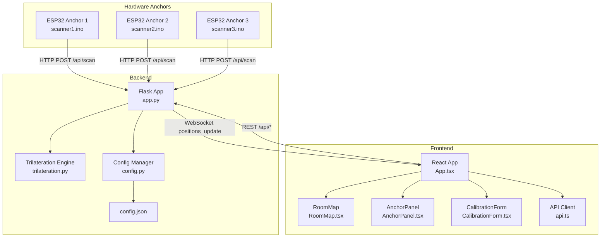
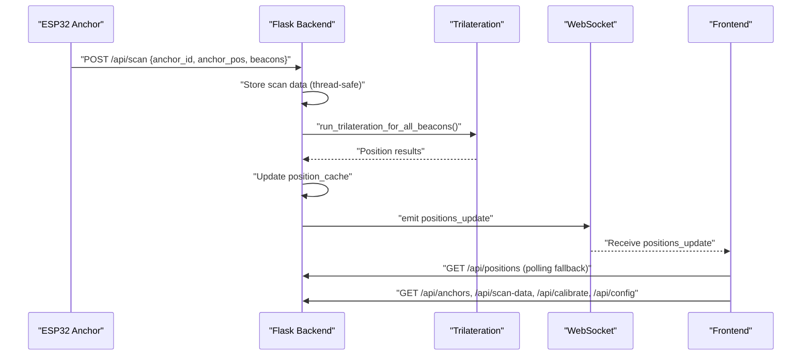
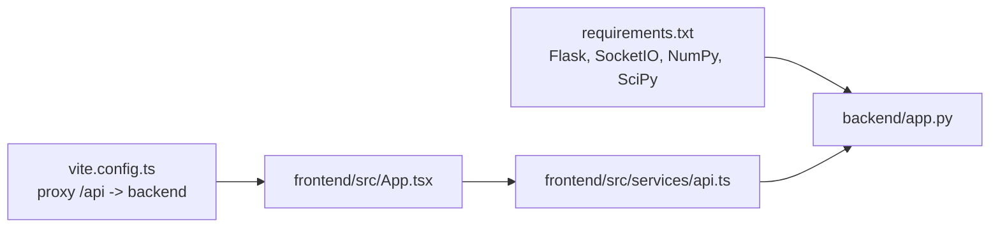

# Troubleshooting and Maintenance

<cite>
**Referenced Files in This Document**
- [app.py](file://backend/app.py)
- [trilateration.py](file://backend/trilateration.py)
- [config.py](file://backend/config.py)
- [config.json](file://backend/config.json)
- [api.ts](file://frontend/src/services/api.ts)
- [App.tsx](file://frontend/src/App.tsx)
- [RoomMap.tsx](file://frontend/src/components/RoomMap.tsx)
- [AnchorPanel.tsx](file://frontend/src/components/AnchorPanel.tsx)
- [CalibrationForm.tsx](file://frontend/src/components/CalibrationForm.tsx)
- [scanner1.ino](file://scanner1/scanner1.ino)
- [scanner2.ino](file://scanner2/scanner2.ino)
- [scanner3.ino](file://scanner3/scanner3.ino)
- [requirements.txt](file://backend/requirements.txt)
- [vite.config.ts](file://frontend/vite.config.ts)
</cite>

## Table of Contents
1. [Introduction](#introduction)
2. [Project Structure](#project-structure)
3. [Core Components](#core-components)
4. [Architecture Overview](#architecture-overview)
5. [Detailed Component Analysis](#detailed-component-analysis)
6. [Dependency Analysis](#dependency-analysis)
7. [Performance Considerations](#performance-considerations)
8. [Troubleshooting Guide](#troubleshooting-guide)
9. [Maintenance Procedures](#maintenance-procedures)
10. [Conclusion](#conclusion)
11. [Appendices](#appendices)

## Introduction
This document provides comprehensive troubleshooting and maintenance procedures for the BLE Room Positioning System. It covers hardware connectivity issues, network configuration errors, signal processing failures, and frontend rendering problems. It also details systematic workflows across hardware anchors, backend processing, and frontend visualization, including diagnostics via health checks, scan data inspection, and real-time monitoring. Maintenance topics include firmware updates, configuration backups, system restarts, and performance optimization. Guidance is included for error interpretation, log analysis, escalation, preventive maintenance, recovery, rollbacks, and emergency response.

## Project Structure
The system comprises three layers:
- Hardware Anchors: ESP32-C3 devices running NimBLE-based scanners that broadcast BLE advertisements and periodically POST scan data to the backend.
- Backend: A Python/Flask service exposing REST endpoints and WebSocket channels for health checks, scan ingestion, position retrieval, anchor status, calibration, and live updates.
- Frontend: A React application that polls endpoints, subscribes to WebSocket updates, renders a room map and anchor panel, and provides calibration controls.

**Diagram sources**
- [app.py:112-397](file://backend/app.py#L112-L397)
- [trilateration.py:155-218](file://backend/trilateration.py#L155-L218)
- [config.py:44-95](file://backend/config.py#L44-L95)
- [config.json](file://backend/config.json)
- [App.tsx:56-274](file://frontend/src/App.tsx#L56-L274)
- [RoomMap.tsx:28-229](file://frontend/src/components/RoomMap.tsx#L28-L229)
- [AnchorPanel.tsx:30-143](file://frontend/src/components/AnchorPanel.tsx#L30-L143)
- [CalibrationForm.tsx:30-290](file://frontend/src/components/CalibrationForm.tsx#L30-L290)
- [api.ts:1-66](file://frontend/src/services/api.ts#L1-L66)
- [scanner1.ino:120-194](file://scanner1/scanner1.ino#L120-L194)
- [scanner2.ino:120-194](file://scanner2/scanner2.ino#L120-L194)
- [scanner3.ino:120-194](file://scanner3/scanner3.ino#L120-L194)

**Section sources**
- [app.py:112-397](file://backend/app.py#L112-L397)
- [trilateration.py:155-218](file://backend/trilateration.py#L155-L218)
- [config.py:44-95](file://backend/config.py#L44-L95)
- [App.tsx:56-274](file://frontend/src/App.tsx#L56-L274)
- [api.ts:1-66](file://frontend/src/services/api.ts#L1-L66)
- [scanner1.ino:120-194](file://scanner1/scanner1.ino#L120-L194)
- [scanner2.ino:120-194](file://scanner2/scanner2.ino#L120-L194)
- [scanner3.ino:120-194](file://scanner3/scanner3.ino#L120-L194)

## Core Components
- Backend REST endpoints:
  - Health: GET /api/health
  - Scan ingestion: POST /api/scan
  - Positions: GET /api/positions
  - Anchors: GET /api/anchors, PUT /api/anchors
  - Scan data: GET /api/scan-data
  - Calibration: GET/POST /api/calibrate
  - Config: GET/PUT /api/config
- WebSocket events:
  - Client connects: emits current positions
  - Client requests: triggers recalculation and emits positions_update
- Trilateration engine:
  - RSSI-to-distance conversion
  - Outlier filtering
  - Least-squares trilateration
- Frontend services and components:
  - API client for backend endpoints
  - Real-time dashboard with room map, anchor panel, and calibration form
  - WebSocket subscription for live updates

**Section sources**
- [app.py:112-397](file://backend/app.py#L112-L397)
- [trilateration.py:11-218](file://backend/trilateration.py#L11-L218)
- [api.ts:1-66](file://frontend/src/services/api.ts#L1-L66)
- [App.tsx:56-274](file://frontend/src/App.tsx#L56-L274)

## Architecture Overview
The system operates as follows:
- ESP32 anchors periodically scan BLE advertisements, collect RSSI and TX power, and POST JSON payloads to the backend’s scan endpoint.
- The backend validates incoming data, stores it temporarily, runs trilateration across fresh scans, updates an in-memory position cache, and emits real-time updates via WebSocket.
- The frontend polls endpoints and subscribes to WebSocket events to render the room map, anchor statuses, and beacon positions.

**Diagram sources**
- [app.py:123-171](file://backend/app.py#L123-L171)
- [app.py:48-106](file://backend/app.py#L48-L106)
- [trilateration.py:155-218](file://backend/trilateration.py#L155-L218)
- [App.tsx:140-172](file://frontend/src/App.tsx#L140-L172)
- [api.ts:13-63](file://frontend/src/services/api.ts#L13-L63)

## Detailed Component Analysis

### Backend: REST and WebSocket Layer
Key responsibilities:
- Accept and validate scan payloads
- Maintain in-memory stores for scans and positions
- Perform trilateration and publish results
- Expose health, configuration, and calibration endpoints
- Manage WebSocket connections for real-time updates

Common failure modes:
- Invalid JSON or missing fields in scan payload
- Stale scan data beyond TTL
- Trilateration exceptions or insufficient anchors
- WebSocket emission failures

Operational checks:
- Verify health endpoint for uptime and counts
- Inspect scan data freshness and beacon counts
- Confirm anchor online/offline status derived from TTL

**Section sources**
- [app.py:112-397](file://backend/app.py#L112-L397)
- [config.py:44-95](file://backend/config.py#L44-L95)

### Trilateration Engine
Processing logic:
- RSSI-to-distance conversion using path-loss model
- Outlier filtering using median absolute deviation
- Least-squares trilateration with robust error estimation
- Aggregation of anchor details per beacon

Failure indicators:
- Insufficient anchors (< 3)
- Non-positive or infinite distances
- Optimization failures during least-squares minimization

**Section sources**
- [trilateration.py:11-218](file://backend/trilateration.py#L11-L218)

### Frontend: Dashboard and Controls
Visualization and interaction:
- Canvas-based room map with anchors, beacons, and uncertainty circles
- Anchor panel showing online status, last seen, and detected beacons
- Calibration form for anchor positions and signal parameters
- WebSocket-driven real-time updates with polling fallback

Rendering and UX issues:
- Canvas scaling and coordinate transforms
- Missing or stale data causing blank displays
- Network latency affecting real-time updates

**Section sources**
- [RoomMap.tsx:28-229](file://frontend/src/components/RoomMap.tsx#L28-L229)
- [AnchorPanel.tsx:30-143](file://frontend/src/components/AnchorPanel.tsx#L30-L143)
- [CalibrationForm.tsx:30-290](file://frontend/src/components/CalibrationForm.tsx#L30-L290)
- [App.tsx:56-274](file://frontend/src/App.tsx#L56-L274)

### Hardware Anchors: ESP32 Scanners
Behavior:
- WiFi connection with timeout and reconnection
- NTP time synchronization (with fallback)
- BLE scanning with active scan windows
- JSON payload construction and HTTP POST
- Calibration mode with faster intervals

Failure modes:
- WiFi disconnects and timeouts
- NTP sync failures
- BLE scan window issues
- HTTP POST failures or backend unreachable

**Section sources**
- [scanner1.ino:62-79](file://scanner1/scanner1.ino#L62-L79)
- [scanner1.ino:84-103](file://scanner1/scanner1.ino#L84-L103)
- [scanner1.ino:146-198](file://scanner1/scanner1.ino#L146-L198)
- [scanner1.ino:203-250](file://scanner1/scanner1.ino#L203-L250)
- [scanner2.ino:62-79](file://scanner2/scanner2.ino#L62-L79)
- [scanner2.ino:84-103](file://scanner2/scanner2.ino#L84-L103)
- [scanner2.ino:146-198](file://scanner2/scanner2.ino#L146-L198)
- [scanner2.ino:203-250](file://scanner2/scanner2.ino#L203-L250)
- [scanner3.ino:62-79](file://scanner3/scanner3.ino#L62-L79)
- [scanner3.ino:84-103](file://scanner3/scanner3.ino#L84-L103)
- [scanner3.ino:146-198](file://scanner3/scanner3.ino#L146-L198)
- [scanner3.ino:203-250](file://scanner3/scanner3.ino#L203-L250)

## Dependency Analysis
Runtime dependencies:
- Backend requires Flask, CORS, SocketIO, NumPy, SciPy, and simple-websocket.
- Frontend depends on React, React DOM, Axios, and Socket.IO client.

Network and proxy:
- Vite dev server proxies /api to backend host/port.
- Frontend defaults to localhost for WebSocket connection.

**Diagram sources**
- [requirements.txt:1-7](file://backend/requirements.txt#L1-L7)
- [vite.config.ts:1-16](file://frontend/vite.config.ts#L1-L16)
- [App.tsx:56-274](file://frontend/src/App.tsx#L56-L274)
- [api.ts:1-66](file://frontend/src/services/api.ts#L1-L66)

**Section sources**
- [requirements.txt:1-7](file://backend/requirements.txt#L1-L7)
- [vite.config.ts:1-16](file://frontend/vite.config.ts#L1-L16)
- [App.tsx:56-274](file://frontend/src/App.tsx#L56-L274)
- [api.ts:1-66](file://frontend/src/services/api.ts#L1-L66)

## Performance Considerations
- Scan TTL and freshness: Adjust scan_ttl_seconds to balance responsiveness vs. noise.
- Anchor density: Prefer 3+ anchors for reliable trilateration; monitor anchors_reporting via health.
- RSSI thresholds: Tune min_rssi_threshold to filter weak signals.
- Path loss exponent: Calibrate n for the environment (free space vs. indoor).
- WebSocket vs. polling: Prefer WebSocket for low-latency updates; polling acts as fallback.
- Frontend rendering: Canvas scaling and coordinate transforms should be efficient; avoid unnecessary re-renders.

[No sources needed since this section provides general guidance]

## Troubleshooting Guide

### Systematic Workflow by Layer

#### Hardware Anchors (ESP32)
- Symptoms: No scan data reaching backend, frequent disconnections, incorrect timestamps.
- Steps:
  - Verify WiFi credentials and connectivity; confirm IP assignment.
  - Check NTP sync logs; ensure time synced before using timestamps.
  - Confirm BLE scanning parameters and active scan windows.
  - Validate backend URL and HTTP POST responses; inspect error codes.
  - Monitor reconnection loops and retry intervals.
- Tools:
  - Serial monitor logs for connection attempts, NTP sync, and HTTP responses.
  - Network analyzer to confirm packets to backend.

**Section sources**
- [scanner1.ino:62-79](file://scanner1/scanner1.ino#L62-L79)
- [scanner1.ino:84-103](file://scanner1/scanner1.ino#L84-L103)
- [scanner1.ino:120-141](file://scanner1/scanner1.ino#L120-L141)
- [scanner1.ino:235-249](file://scanner1/scanner1.ino#L235-L249)
- [scanner2.ino:62-79](file://scanner2/scanner2.ino#L62-L79)
- [scanner2.ino:84-103](file://scanner2/scanner2.ino#L84-L103)
- [scanner2.ino:120-141](file://scanner2/scanner2.ino#L120-L141)
- [scanner2.ino:235-249](file://scanner2/scanner2.ino#L235-L249)
- [scanner3.ino:62-79](file://scanner3/scanner3.ino#L62-L79)
- [scanner3.ino:84-103](file://scanner3/scanner3.ino#L84-L103)
- [scanner3.ino:120-141](file://scanner3/scanner3.ino#L120-L141)
- [scanner3.ino:235-249](file://scanner3/scanner3.ino#L235-L249)

#### Backend Processing (Python/Flask)
- Symptoms: Empty positions, stale data, WebSocket errors, health anomalies.
- Steps:
  - Call /api/health to verify system status and counts.
  - Retrieve /api/scan-data to inspect raw scan freshness and beacon counts.
  - Check /api/anchors for online status derived from TTL.
  - Review /api/positions for current results.
  - Inspect calibration parameters via /api/calibrate.
  - Validate configuration via /api/config.
- Tools:
  - Endpoint responses for error messages and counts.
  - Logs for trilateration exceptions and background processing errors.

**Section sources**
- [app.py:112-397](file://backend/app.py#L112-L397)
- [config.py:44-95](file://backend/config.py#L44-L95)

#### Frontend Visualization (React)
- Symptoms: Blank map, stale data, no real-time updates, calibration form not saving.
- Steps:
  - Confirm WebSocket connection status indicator.
  - Poll endpoints manually to detect network/proxy issues.
  - Inspect RoomMap rendering and coordinate transforms.
  - Verify AnchorPanel displays online/offline and beacon counts.
  - Test CalibrationForm save actions and feedback messages.
- Tools:
  - Browser console for WebSocket and HTTP errors.
  - Network tab to verify /api proxy and backend reachability.

**Section sources**
- [App.tsx:56-274](file://frontend/src/App.tsx#L56-L274)
- [RoomMap.tsx:28-229](file://frontend/src/components/RoomMap.tsx#L28-L229)
- [AnchorPanel.tsx:30-143](file://frontend/src/components/AnchorPanel.tsx#L30-L143)
- [CalibrationForm.tsx:30-290](file://frontend/src/components/CalibrationForm.tsx#L30-L290)
- [api.ts:1-66](file://frontend/src/services/api.ts#L1-L66)
- [vite.config.ts:1-16](file://frontend/vite.config.ts#L1-L16)

### Diagnostic Procedures
- Health check:
  - GET /api/health for system status, uptime, anchors reporting, and beacons tracked.
- Scan data inspection:
  - GET /api/scan-data to review raw RSSI, TX power, and freshness.
- Real-time monitoring:
  - Subscribe to WebSocket positions_update for live updates.
  - Use periodic polling as fallback when WebSocket is unavailable.

**Section sources**
- [app.py:112-120](file://backend/app.py#L112-L120)
- [app.py:256-279](file://backend/app.py#L256-L279)
- [App.tsx:140-172](file://frontend/src/App.tsx#L140-L172)

### Error Interpretation and Log Analysis
- Backend errors:
  - Validation failures: Missing anchor_id or malformed JSON yield 400 responses.
  - Trilateration failures: Returned results may indicate insufficient anchors or optimization errors.
  - WebSocket errors: Emitted via error event; inspect messages.
- Frontend errors:
  - Network failures: Axios errors or WebSocket disconnect events.
  - Rendering issues: Canvas coordinate mismatches or missing data structures.
- Logs:
  - Backend prints trilateration errors to stdout.
  - Hardware logs show connection attempts, NTP sync, and HTTP responses.

**Section sources**
- [app.py:140-146](file://backend/app.py#L140-L146)
- [app.py:161-163](file://backend/app.py#L161-L163)
- [App.tsx:165-167](file://frontend/src/App.tsx#L165-L167)
- [scanner1.ino:133-137](file://scanner1/scanner1.ino#L133-L137)

### Escalation Procedures
- Immediate:
  - Verify backend availability and WebSocket connectivity.
  - Confirm hardware anchors are reachable and posting data.
- Medium:
  - Recalibrate path loss exponent and TX power.
  - Increase scan TTL or reduce noise by adjusting min_rssi_threshold.
- Long-term:
  - Review anchor placement and room layout.
  - Consider adding more anchors for redundancy.

[No sources needed since this section provides general guidance]

## Maintenance Procedures

### Firmware Updates (ESP32 Anchors)
- Steps:
  - Flash updated firmware to each anchor device.
  - Reconnect to WiFi and verify NTP sync.
  - Confirm successful HTTP POST to backend.
- Precautions:
  - Maintain identical SSID/password across anchors.
  - Preserve backend URL configuration.

**Section sources**
- [scanner1.ino:213-217](file://scanner1/scanner1.ino#L213-L217)
- [scanner2.ino:213-217](file://scanner2/scanner2.ino#L213-L217)
- [scanner3.ino:213-217](file://scanner3/scanner3.ino#L213-L217)

### Configuration Backups and Rollbacks
- Backup:
  - Copy backend/config.json to a safe location.
- Rollback:
  - Restore previous config.json if changes cause positioning issues.
  - Use /api/config endpoints to revert to known-good values.

**Section sources**
- [config.py:44-58](file://backend/config.py#L44-L58)
- [app.py:334-347](file://backend/app.py#L334-L347)

### System Restarts
- Backend:
  - Restart the Flask application to reload configuration and clear caches.
- Frontend:
  - Refresh browser or rebuild for development; ensure proxy remains configured.
- Hardware:
  - Power cycle anchors to reinitialize WiFi and BLE stacks.

**Section sources**
- [app.py:383-397](file://backend/app.py#L383-L397)
- [vite.config.ts:1-16](file://frontend/vite.config.ts#L1-L16)
- [scanner1.ino:213-217](file://scanner1/scanner1.ino#L213-L217)

### Performance Optimization
- Backend:
  - Tune scan_ttl_seconds and min_rssi_threshold.
  - Adjust path_loss_exponent per environment.
- Frontend:
  - Optimize canvas rendering and coordinate transforms.
  - Prefer WebSocket updates to reduce polling overhead.

**Section sources**
- [app.py:54](file://backend/app.py#L54)
- [trilateration.py:169-172](file://backend/trilateration.py#L169-L172)
- [App.tsx:125-137](file://frontend/src/App.tsx#L125-L137)

### Preventive Maintenance and Proactive Detection
- Monitoring:
  - Regularly check /api/health and /api/anchors for anomalies.
  - Watch for stale scan data via /api/scan-data.
- Calibration:
  - Periodically validate accuracy at known reference points.
- Hardware:
  - Inspect WiFi coverage and antenna placement.
  - Replace or relocate anchors with poor RSSI or frequent disconnections.

**Section sources**
- [app.py:112-221](file://backend/app.py#L112-L221)
- [app.py:256-279](file://backend/app.py#L256-L279)
- [CalibrationForm.tsx:269-284](file://frontend/src/components/CalibrationForm.tsx#L269-L284)

### Recovery, Rollback, and Emergency Response
- Recovery:
  - Restart backend and frontend services.
  - Reinitialize WebSocket subscriptions.
- Rollback:
  - Revert to previous config.json or endpoint-specified values.
- Emergency:
  - Temporarily disable beacon filters to capture all signals.
  - Increase scan TTL to stabilize results during investigations.

**Section sources**
- [config.py:44-58](file://backend/config.py#L44-L58)
- [app.py:334-347](file://backend/app.py#L334-L347)
- [app.py:54](file://backend/app.py#L54)

## Conclusion
This guide outlines a structured approach to diagnosing and maintaining the BLE Room Positioning System across hardware, backend, and frontend layers. By leveraging health checks, scan data inspection, and real-time monitoring, teams can quickly identify and resolve connectivity, configuration, signal processing, and rendering issues. Adhering to maintenance best practices ensures reliable operation and predictable recovery from incidents.

[No sources needed since this section summarizes without analyzing specific files]

## Appendices

### Endpoint Reference
- GET /api/health: System health and counts
- POST /api/scan: Submit BLE scan data
- GET /api/positions: Current beacon positions
- GET /api/anchors: Anchor configurations and status
- PUT /api/anchors: Update anchor positions
- GET /api/scan-data: Latest raw scan data
- GET/POST /api/calibrate: Get/update calibration parameters
- GET/PUT /api/config: Get/update full configuration

**Section sources**
- [app.py:112-347](file://backend/app.py#L112-L347)

### Frontend API Calls
- getPositions, getAnchors, updateAnchors, getScanData, getCalibration, updateCalibration, getHealth, getFullConfig

**Section sources**
- [api.ts:1-66](file://frontend/src/services/api.ts#L1-L66)